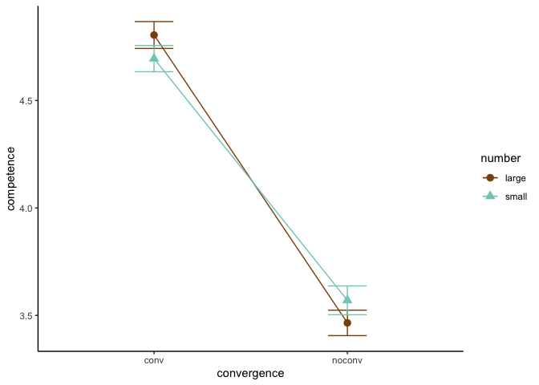
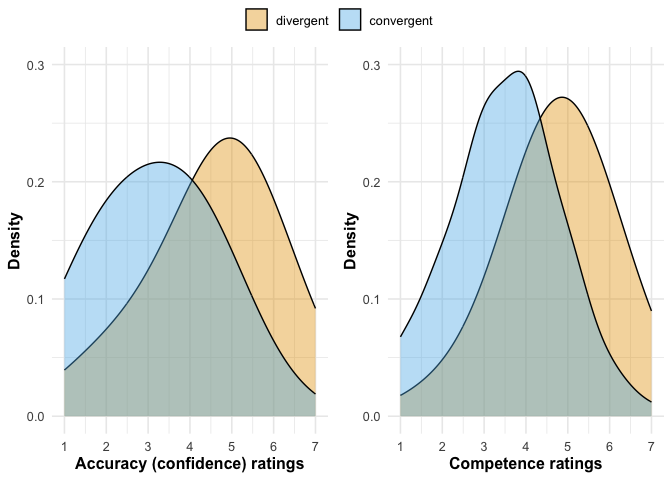
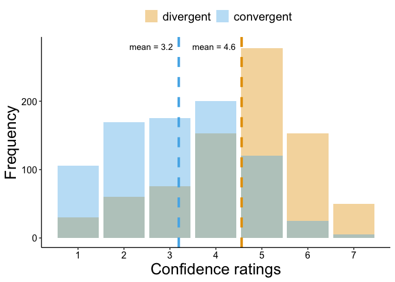
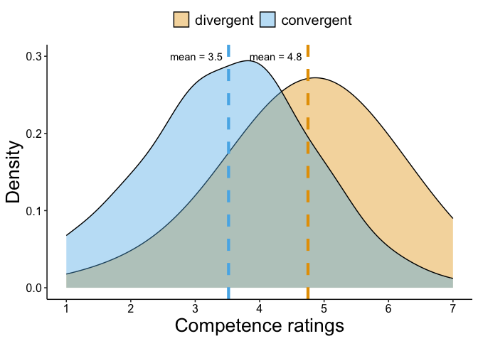

```r
library(tidyverse)     # create plots with ggplot, manipulate data, etc.
library(broom.mixed)   # convert regression models into nice tables
library(modelsummary)  # combine multiple regression models into a single table
library(lme4)          # model specification / estimation 
library(lmerTest)      # provides p-values in the output
library(ggpubr)        # stile feature of ggplot
library(gghalves)      # do special plots in ggplot
library(kableExtra)    # for tables
```


```r
d <- read_csv("./data/cleaned.csv")
```

### Some themes and functions


### Hypothesis 1

To assess the effect of convergence on participants' confidence about their guesses, we run a paired t-test.


```r
# summary stats
d %>%
  group_by(convergence) %>%
  get_summary_stats(confidence, type = "mean_sd")
```

```
## # A tibble: 2 × 5
##   convergence variable       n  mean    sd
##   <chr>       <fct>      <dbl> <dbl> <dbl>
## 1 conv        confidence   800  4.56  1.45
## 2 noconv      confidence   800  3.19  1.39
```


```r
# T-test
t <- t.test(confidence ~ convergence, data = d, paired = TRUE)
t
```

```
## 
## 	Paired t-test
## 
## data:  confidence by convergence
## t = 26.136, df = 799, p-value < 2.2e-16
## alternative hypothesis: true mean difference is not equal to 0
## 95 percent confidence interval:
##  1.264793 1.470207
## sample estimates:
## mean difference 
##          1.3675
```

The paired t-test shows a significant difference in confidence ratings between *no convergence* and *convergence*. In convergent conditions, participants were on average more confident by 1.3675 points (on a scale from 1 to 7).

For a robustness check, we run a mixed model regression analysis of convergence on confidence ratings. The first model (`m1`) includes random intercepts for participants. The second model (`m2`) additionally controls for a fixed effect of our second experimental factor, the number of estimates. Including the factor number as a control will also address RQ1. The third model (`m3`) additionally includes random slopes for participants.

For reference, we also include fixed-only effects regression models.


<table style="NAborder-bottom: 0; width: auto !important; margin-left: auto; margin-right: auto;" class="table">
<caption>Models estimating effect of convergence on accuracy and competence</caption>
 <thead>
<tr>
<th style="empty-cells: hide;border-bottom:hidden;" colspan="1"></th>
<th style="border-bottom:hidden;padding-bottom:0; padding-left:3px;padding-right:3px;text-align: center; " colspan="2"><div style="border-bottom: 1px solid #ddd; padding-bottom: 5px; ">Fixed</div></th>
<th style="border-bottom:hidden;padding-bottom:0; padding-left:3px;padding-right:3px;text-align: center; " colspan="3"><div style="border-bottom: 1px solid #ddd; padding-bottom: 5px; ">Mixed</div></th>
</tr>
  <tr>
   <th style="text-align:left;">   </th>
   <th style="text-align:center;"> Baseline </th>
   <th style="text-align:center;"> Baseline + control </th>
   <th style="text-align:center;"> Random intercept </th>
   <th style="text-align:center;"> Random intercept + control </th>
   <th style="text-align:center;"> Random intercept &amp; slope + control </th>
  </tr>
 </thead>
<tbody>
  <tr grouplength="15"><td colspan="6" style="border-bottom: 1px solid;"><em>Outcome: Accuracy</em></td></tr>
<tr>
   <td style="text-align:left;padding-left: 2em;" indentlevel="1"> (Intercept) </td>
   <td style="text-align:center;"> 4.560*** </td>
   <td style="text-align:center;"> 4.647*** </td>
   <td style="text-align:center;"> 4.560*** </td>
   <td style="text-align:center;"> 4.647*** </td>
   <td style="text-align:center;"> 4.648*** </td>
  </tr>
  <tr>
   <td style="text-align:left;padding-left: 2em;" indentlevel="1">  </td>
   <td style="text-align:center;"> (
   </td>
<td style="text-align:center;"> (
   </td>
<td style="text-align:center;"> (
   </td>
<td style="text-align:center;"> (
   </td>
<td style="text-align:center;"> (
  </td>
</tr>
  <tr>
   <td style="text-align:left;padding-left: 2em;" indentlevel="1"> convergencenoconv </td>
   <td style="text-align:center;"> -1.367*** </td>
   <td style="text-align:center;"> -1.367*** </td>
   <td style="text-align:center;"> -1.368*** </td>
   <td style="text-align:center;"> -1.368*** </td>
   <td style="text-align:center;"> -1.368*** </td>
  </tr>
  <tr>
   <td style="text-align:left;padding-left: 2em;" indentlevel="1">  </td>
   <td style="text-align:center;"> (
   </td>
<td style="text-align:center;"> (
   </td>
<td style="text-align:center;"> (
   </td>
<td style="text-align:center;"> (
   </td>
<td style="text-align:center;"> (
  </td>
</tr>
  <tr>
   <td style="text-align:left;padding-left: 2em;" indentlevel="1"> numbersmall </td>
   <td style="text-align:center;">  </td>
   <td style="text-align:center;"> -0.175* </td>
   <td style="text-align:center;">  </td>
   <td style="text-align:center;"> -0.175** </td>
   <td style="text-align:center;"> -0.175*** </td>
  </tr>
  <tr>
   <td style="text-align:left;padding-left: 2em;" indentlevel="1">  </td>
   <td style="text-align:center;">  </td>
   <td style="text-align:center;"> (0.014) </td>
   <td style="text-align:center;">  </td>
   <td style="text-align:center;"> (0.001) </td>
   <td style="text-align:center;"> (
  </td>
</tr>
  <tr>
   <td style="text-align:left;padding-left: 2em;" indentlevel="1"> SD (Intercept ID) </td>
   <td style="text-align:center;">  </td>
   <td style="text-align:center;">  </td>
   <td style="text-align:center;"> 0.921 </td>
   <td style="text-align:center;"> 0.922 </td>
   <td style="text-align:center;"> 1.089 </td>
  </tr>
  <tr>
   <td style="text-align:left;padding-left: 2em;" indentlevel="1"> SD (convergencenoconv ID) </td>
   <td style="text-align:center;">  </td>
   <td style="text-align:center;">  </td>
   <td style="text-align:center;">  </td>
   <td style="text-align:center;">  </td>
   <td style="text-align:center;"> 0.732 </td>
  </tr>
  <tr>
   <td style="text-align:left;padding-left: 2em;" indentlevel="1"> Cor (Intercept~convergencenoconv ID) </td>
   <td style="text-align:center;">  </td>
   <td style="text-align:center;">  </td>
   <td style="text-align:center;">  </td>
   <td style="text-align:center;">  </td>
   <td style="text-align:center;"> -0.566 </td>
  </tr>
  <tr>
   <td style="text-align:left;padding-left: 2em;" indentlevel="1"> SD (Observations) </td>
   <td style="text-align:center;">  </td>
   <td style="text-align:center;">  </td>
   <td style="text-align:center;"> 1.082 </td>
   <td style="text-align:center;"> 1.079 </td>
   <td style="text-align:center;"> 1.006 </td>
  </tr>
  <tr>
   <td style="text-align:left;padding-left: 2em;" indentlevel="1"> R2 </td>
   <td style="text-align:center;"> 0.188 </td>
   <td style="text-align:center;"> 0.191 </td>
   <td style="text-align:center;">  </td>
   <td style="text-align:center;">  </td>
   <td style="text-align:center;">  </td>
  </tr>
  <tr>
   <td style="text-align:left;padding-left: 2em;" indentlevel="1"> R2 Marg. </td>
   <td style="text-align:center;">  </td>
   <td style="text-align:center;">  </td>
   <td style="text-align:center;"> 0.188 </td>
   <td style="text-align:center;"> 0.191 </td>
   <td style="text-align:center;"> 0.191 </td>
  </tr>
  <tr>
   <td style="text-align:left;padding-left: 2em;" indentlevel="1"> R2 Cond. </td>
   <td style="text-align:center;">  </td>
   <td style="text-align:center;">  </td>
   <td style="text-align:center;"> 0.529 </td>
   <td style="text-align:center;"> 0.532 </td>
   <td style="text-align:center;"> 0.594 </td>
  </tr>
  <tr>
   <td style="text-align:left;padding-left: 2em;" indentlevel="1"> F </td>
   <td style="text-align:center;"> 370.823 </td>
   <td style="text-align:center;"> 189.049 </td>
   <td style="text-align:center;">  </td>
   <td style="text-align:center;">  </td>
   <td style="text-align:center;">  </td>
  </tr>
  <tr>
   <td style="text-align:left;padding-left: 2em;" indentlevel="1"> RMSE </td>
   <td style="text-align:center;"> 1.42 </td>
   <td style="text-align:center;"> 1.42 </td>
   <td style="text-align:center;"> 1.02 </td>
   <td style="text-align:center;"> 1.02 </td>
   <td style="text-align:center;"> 0.91 </td>
  </tr>
  <tr grouplength="15"><td colspan="6" style="border-bottom: 1px solid;"><em>Outcome: Competence</em></td></tr>
<tr>
   <td style="text-align:left;padding-left: 2em;" indentlevel="1"> (Intercept) </td>
   <td style="text-align:center;"> 4.750*** </td>
   <td style="text-align:center;"> 4.751*** </td>
   <td style="text-align:center;"> 4.750*** </td>
   <td style="text-align:center;"> 4.751*** </td>
   <td style="text-align:center;"> 4.648*** </td>
  </tr>
  <tr>
   <td style="text-align:left;padding-left: 2em;" indentlevel="1">  </td>
   <td style="text-align:center;"> (
   </td>
<td style="text-align:center;"> (
   </td>
<td style="text-align:center;"> (
   </td>
<td style="text-align:center;"> (
   </td>
<td style="text-align:center;"> (
  </td>
</tr>
  <tr>
   <td style="text-align:left;padding-left: 2em;" indentlevel="1"> convergencenoconv </td>
   <td style="text-align:center;"> -1.232*** </td>
   <td style="text-align:center;"> -1.232*** </td>
   <td style="text-align:center;"> -1.233*** </td>
   <td style="text-align:center;"> -1.232*** </td>
   <td style="text-align:center;"> -1.368*** </td>
  </tr>
  <tr>
   <td style="text-align:left;padding-left: 2em;" indentlevel="1">  </td>
   <td style="text-align:center;"> (
   </td>
<td style="text-align:center;"> (
   </td>
<td style="text-align:center;"> (
   </td>
<td style="text-align:center;"> (
   </td>
<td style="text-align:center;"> (
  </td>
</tr>
  <tr>
   <td style="text-align:left;padding-left: 2em;" indentlevel="1"> numbersmall </td>
   <td style="text-align:center;">  </td>
   <td style="text-align:center;"> -0.002 </td>
   <td style="text-align:center;">  </td>
   <td style="text-align:center;"> -0.002 </td>
   <td style="text-align:center;"> -0.175*** </td>
  </tr>
  <tr>
   <td style="text-align:left;padding-left: 2em;" indentlevel="1">  </td>
   <td style="text-align:center;">  </td>
   <td style="text-align:center;"> (0.968) </td>
   <td style="text-align:center;">  </td>
   <td style="text-align:center;"> (0.963) </td>
   <td style="text-align:center;"> (
  </td>
</tr>
  <tr>
   <td style="text-align:left;padding-left: 2em;" indentlevel="1"> SD (Intercept ID) </td>
   <td style="text-align:center;">  </td>
   <td style="text-align:center;">  </td>
   <td style="text-align:center;"> 0.612 </td>
   <td style="text-align:center;"> 0.612 </td>
   <td style="text-align:center;"> 1.089 </td>
  </tr>
  <tr>
   <td style="text-align:left;padding-left: 2em;" indentlevel="1"> SD (convergencenoconv ID) </td>
   <td style="text-align:center;">  </td>
   <td style="text-align:center;">  </td>
   <td style="text-align:center;">  </td>
   <td style="text-align:center;">  </td>
   <td style="text-align:center;"> 0.732 </td>
  </tr>
  <tr>
   <td style="text-align:left;padding-left: 2em;" indentlevel="1"> Cor (Intercept~convergencenoconv ID) </td>
   <td style="text-align:center;">  </td>
   <td style="text-align:center;">  </td>
   <td style="text-align:center;">  </td>
   <td style="text-align:center;">  </td>
   <td style="text-align:center;"> -0.566 </td>
  </tr>
  <tr>
   <td style="text-align:left;padding-left: 2em;" indentlevel="1"> SD (Observations) </td>
   <td style="text-align:center;">  </td>
   <td style="text-align:center;">  </td>
   <td style="text-align:center;"> 1.092 </td>
   <td style="text-align:center;"> 1.092 </td>
   <td style="text-align:center;"> 1.006 </td>
  </tr>
  <tr>
   <td style="text-align:left;padding-left: 2em;" indentlevel="1"> R2 </td>
   <td style="text-align:center;"> 0.195 </td>
   <td style="text-align:center;"> 0.195 </td>
   <td style="text-align:center;">  </td>
   <td style="text-align:center;">  </td>
   <td style="text-align:center;">  </td>
  </tr>
  <tr>
   <td style="text-align:left;padding-left: 2em;" indentlevel="1"> R2 Marg. </td>
   <td style="text-align:center;">  </td>
   <td style="text-align:center;">  </td>
   <td style="text-align:center;"> 0.195 </td>
   <td style="text-align:center;"> 0.195 </td>
   <td style="text-align:center;"> 0.191 </td>
  </tr>
  <tr>
   <td style="text-align:left;padding-left: 2em;" indentlevel="1"> R2 Cond. </td>
   <td style="text-align:center;">  </td>
   <td style="text-align:center;">  </td>
   <td style="text-align:center;"> 0.387 </td>
   <td style="text-align:center;"> 0.387 </td>
   <td style="text-align:center;"> 0.594 </td>
  </tr>
  <tr>
   <td style="text-align:left;padding-left: 2em;" indentlevel="1"> F </td>
   <td style="text-align:center;"> 388.120 </td>
   <td style="text-align:center;"> 193.939 </td>
   <td style="text-align:center;">  </td>
   <td style="text-align:center;">  </td>
   <td style="text-align:center;">  </td>
  </tr>
  <tr>
   <td style="text-align:left;padding-left: 2em;box-shadow: 0px 1px" indentlevel="1"> RMSE </td>
   <td style="text-align:center;box-shadow: 0px 1px"> 1.25 </td>
   <td style="text-align:center;box-shadow: 0px 1px"> 1.25 </td>
   <td style="text-align:center;box-shadow: 0px 1px"> 1.04 </td>
   <td style="text-align:center;box-shadow: 0px 1px"> 1.04 </td>
   <td style="text-align:center;box-shadow: 0px 1px"> 0.91 </td>
  </tr>
  <tr>
   <td style="text-align:left;padding-left: 2em;" indentlevel="1"> Num.Obs. </td>
   <td style="text-align:center;"> 1600 </td>
   <td style="text-align:center;"> 1600 </td>
   <td style="text-align:center;"> 1600 </td>
   <td style="text-align:center;"> 1600 </td>
   <td style="text-align:center;"> 1600 </td>
  </tr>
</tbody>
<tfoot><tr><td style="padding: 0; " colspan="100%">
<sup></sup> + p </td></tr></tfoot>
</table>

The first linear regression model (`Baseline`) yields the same estimate for the effect of `convergence` as the paired t-test. The second model (`Baseline+Control`) controls for `number`. The effect of convergence remains the same, but there is an additional effect of `number`, statistically significant at the 5%-level: Conditions with a number of estimates increased participants' confidence ratings by 0.18 (on a scale from 1 to 7) on average, holding `convergence` constant.

Next, we calculate the mixed effects models. There will be the "fixed", average effects of `convergence` and `number` that we just found in the standard regression models (also called population-level effects, averages across *all* participants). In addition, there will also be random effects by participants.

We have two extra random parameters:

1.  The estimated standard deviation of the by-participant random intercept, represented by the `SD (Intercept ID)`.
2.  The residual variation (i.e. unexplained variation in `competence` once we account for all effects specified in the model), represented by the `SD (Observations)` term in the Residual group.

The first parameter tells how much `competence` ratings bounce around as we move from participant to participant. We can predict `competence` based on `convergence`, but each participant has their own unique offset (i.e. difference from the fixed intercept). We can think about the participant random effects in terms of percentage of the total residual variance in the model (i.e. the variance that's left given the fixed effects in our model). We can calculate that percentage as $\text{intercept_ID}/ (SD_{\text{intercept_ID}} + SD_{observations})$

The fixed effect of `convergence` remains the same. It, again, remains unchanged when adding `number` as a control variable to the mixed model. The fixed effect of `number` is also the same as in the standard regression model.

In the third mixed model we let both the intercept and the effect of `convergence` vary by participant. This is similar to an *interaction*, where the effect one variable (`convergence`) is allowed to vary by the levels/values of another (`ID`).

We have a new term for participant-specific variation in the `convergence`, which is `SD (convergencenoconv ID)` effect.

The term `Cor (Intercept~convergencenoconv ID)` indicates the correlation between the random terms. A negative correlation means that if the random intercept for a specific participant is higher, the slope tends to be lower and vice versa.

In the third model, too, the fixed effect of `convergence` remains unchanged.

### Hypothesis 2

We will proceed just as with hypothesis 1, but for `competence`.


```r
# summary stats
d %>%
  group_by(convergence) %>%
  get_summary_stats(competence, type = "mean_sd")
```

```
## # A tibble: 2 × 5
##   convergence variable       n  mean    sd
##   <chr>       <fct>      <dbl> <dbl> <dbl>
## 1 conv        competence   800  4.75  1.24
## 2 noconv      competence   800  3.52  1.27
```


```r
# T-test
t <- t.test(competence ~ convergence, data = d, paired = TRUE)
t
```

```
## 
## 	Paired t-test
## 
## data:  competence by convergence
## t = 21.823, df = 799, p-value < 2.2e-16
## alternative hypothesis: true mean difference is not equal to 0
## 95 percent confidence interval:
##  1.121641 1.343359
## sample estimates:
## mean difference 
##          1.2325
```

The paired t-test shows a significant difference in competence ratings between *no convergence* and *convergence*. In convergent conditions, participants were on average more confident by 1.2325 points (on a scale from 1 to 7).

For a robustness check, we ran the same mixed models as described for confidence.

## RQ2 - Effect of number on accuracy (i.e. 'confidence')


```r
# get summary stats by number
d %>% 
  group_by(number) %>% 
  summarise(across(c(confidence, competence),  
                   list(mean = mean, sd = sd)))
```

```
## # A tibble: 2 × 5
##   number confidence_mean confidence_sd competence_mean competence_sd
##   <chr>            <dbl>         <dbl>           <dbl>         <dbl>
## 1 large             3.96          1.54            4.14          1.39
## 2 small             3.79          1.61            4.13          1.40
```


```
## 
## 	Paired t-test
## 
## data:  confidence by number
## t = 3.5636, df = 799, p-value = 0.0003876
## alternative hypothesis: true mean difference is not equal to 0
## 95 percent confidence interval:
##  0.07860382 0.27139618
## sample estimates:
## mean difference 
##           0.175
```

```
## 
## 	Paired t-test
## 
## data:  competence by number
## t = 0.054602, df = 799, p-value = 0.9565
## alternative hypothesis: true mean difference is not equal to 0
## 95 percent confidence interval:
##  -0.08737516  0.09237516
## sample estimates:
## mean difference 
##          0.0025
```

There is a significant effect of `number` on `accuracy`. However, this effect is small compared to the effect of `convergence`. There is no effect on `competence`.

We find the same results using a mixed model. 

<table style="NAborder-bottom: 0; width: auto !important; margin-left: auto; margin-right: auto;" class="table">
<caption>Models estimating effect of number</caption>
 <thead>
  <tr>
   <th style="text-align:left;">   </th>
   <th style="text-align:center;"> Accuracy </th>
   <th style="text-align:center;"> Competence </th>
  </tr>
 </thead>
<tbody>
  <tr>
   <td style="text-align:left;"> (Intercept) </td>
   <td style="text-align:center;"> 3.964*** </td>
   <td style="text-align:center;"> 4.135*** </td>
  </tr>
  <tr>
   <td style="text-align:left;">  </td>
   <td style="text-align:center;"> (
   </td>
<td style="text-align:center;"> (
  </td>
</tr>
  <tr>
   <td style="text-align:left;"> numbersmall </td>
   <td style="text-align:center;"> −0.175** </td>
   <td style="text-align:center;"> −0.002 </td>
  </tr>
  <tr>
   <td style="text-align:left;">  </td>
   <td style="text-align:center;"> (0.007) </td>
   <td style="text-align:center;"> (0.969) </td>
  </tr>
  <tr>
   <td style="text-align:left;"> SD (Intercept ID) </td>
   <td style="text-align:center;"> 0.885 </td>
   <td style="text-align:center;"> 0.566 </td>
  </tr>
  <tr>
   <td style="text-align:left;box-shadow: 0px 1px"> SD (Observations) </td>
   <td style="text-align:center;box-shadow: 0px 1px"> 1.303 </td>
   <td style="text-align:center;box-shadow: 0px 1px"> 1.275 </td>
  </tr>
  <tr>
   <td style="text-align:left;"> Num.Obs. </td>
   <td style="text-align:center;"> 1600 </td>
   <td style="text-align:center;"> 1600 </td>
  </tr>
  <tr>
   <td style="text-align:left;"> R2 Marg. </td>
   <td style="text-align:center;"> 0.003 </td>
   <td style="text-align:center;"> 0.000 </td>
  </tr>
  <tr>
   <td style="text-align:left;"> R2 Cond. </td>
   <td style="text-align:center;"> 0.318 </td>
   <td style="text-align:center;"> 0.164 </td>
  </tr>
  <tr>
   <td style="text-align:left;"> AIC </td>
   <td style="text-align:center;"> 5709.5 </td>
   <td style="text-align:center;"> 5522.1 </td>
  </tr>
  <tr>
   <td style="text-align:left;"> BIC </td>
   <td style="text-align:center;"> 5731.1 </td>
   <td style="text-align:center;"> 5543.7 </td>
  </tr>
  <tr>
   <td style="text-align:left;"> ICC </td>
   <td style="text-align:center;"> 0.3 </td>
   <td style="text-align:center;"> 0.2 </td>
  </tr>
  <tr>
   <td style="text-align:left;"> RMSE </td>
   <td style="text-align:center;"> 1.24 </td>
   <td style="text-align:center;"> 1.23 </td>
  </tr>
</tbody>
<tfoot><tr><td style="padding: 0; " colspan="100%">
<sup></sup> + p &lt; 0.1, * p &lt; 0.05, ** p &lt; 0.01, *** p &lt; 0.001</td></tr></tfoot>
</table>


## RQ3 - Interaction between number and convergence on competence

In our test for an interaction, we use effect-coded versions of our variables.


```r
# effect-coded ('_eff') interaction with random intercepts
d <- d %>% 
  mutate(convergence_eff = recode(convergence, "noconv" = -0.5, "conv" = +0.5),
         number_eff = recode(number, "small" = -0.5, "large" = +0.5))
```


```r
model_interaction = lmer(competence ~ convergence_eff + number_eff + convergence_eff*number_eff +
            (1  | ID), data = d)
tidy(model_interaction)
```

```
## # A tibble: 6 × 8
##   effect   group    term           estimate std.error statistic    df    p.value
##   <chr>    <chr>    <chr>             <dbl>     <dbl>     <dbl> <dbl>      <dbl>
## 1 fixed    <NA>     (Intercept)      4.13      0.0512   80.8     199.  4.19e-154
## 2 fixed    <NA>     convergence_e…   1.23      0.0546   22.6    1397.  1.50e- 96
## 3 fixed    <NA>     number_eff       0.0025    0.0546    0.0458 1397.  9.63e-  1
## 4 fixed    <NA>     convergence_e…   0.215     0.109     1.97   1397.  4.90e-  2
## 5 ran_pars ID       sd__(Intercep…   0.612    NA        NA        NA  NA        
## 6 ran_pars Residual sd__Observati…   1.09     NA        NA        NA  NA
```

There seems to be only just a significant interaction in a mixed model where we let the intercept vary across participants. It suggests that the positive effect convergence is enhanced when the number of estimates is `large` (compared to `small`).


```r
# quick visualization
ggplot(d, aes(x = convergence, y = competence, 
                     shape = number,
                     group = number,
                     color = number)) +
  stat_summary(fun = "mean", geom = "point", size = 3) +
  stat_summary(fun = "mean", geom = "line") +
  stat_summary(fun.data = "mean_se", geom = "errorbar", width = .2) +
  scale_color_manual(values = c("#8c510a", "#80cdc1")) +
  theme_classic()
```

<!-- -->

## Visualization

### Main plot


```r
confidence_plot <- ggplot(data=d, aes(x=confidence, fill=convergence)) + 
  geom_density(adjust=3, alpha=.4)+
  scale_x_continuous(name = "Accuracy (confidence) ratings", breaks = seq(1, 7), 
                     limits=c(1, 7)) +
  scale_y_continuous(name = "Density", limits=c(0, 0.3)) +
    scale_fill_manual(
    name = "Convergence: ",
    labels = c("divergent", "convergent"),
    values = c("#E69F00", "#56B4E9")) +
  guides(fill = guide_legend(title = NULL)) +
  plot_theme 

competence_plot <- ggplot(data=d, aes(x=competence, fill=convergence)) + 
  geom_density(adjust=3, alpha=.4)+
  scale_x_continuous(name = "Competence ratings", breaks = seq(1, 7), 
                     limits=c(1, 7)) +
  scale_y_continuous(name = "Density", limits=c(0, 0.3)) +
    scale_fill_manual(
    name = "Convergence: ",
    labels = c("divergent", "convergent"),
    values = c("#E69F00", "#56B4E9")) +
    guides(fill = guide_legend(title = NULL)) +
  plot_theme 

figure <- ggarrange(confidence_plot, competence_plot, common.legend = T) +
  theme(legend.position="top") 
figure
```

<!-- -->

### Other plots

#### Confidence/Accuracy


```
## Warning: Using `size` aesthetic for lines was deprecated in ggplot2 3.4.0.
## ℹ Please use `linewidth` instead.
## This warning is displayed once every 8 hours.
## Call `lifecycle::last_lifecycle_warnings()` to see where this warning was
## generated.
```

<!-- -->

<!-- -->

#### Competence

We start by visualizing the difference in `competence`ratings between *convergence* and *no convergence* conditions.


<!-- -->
