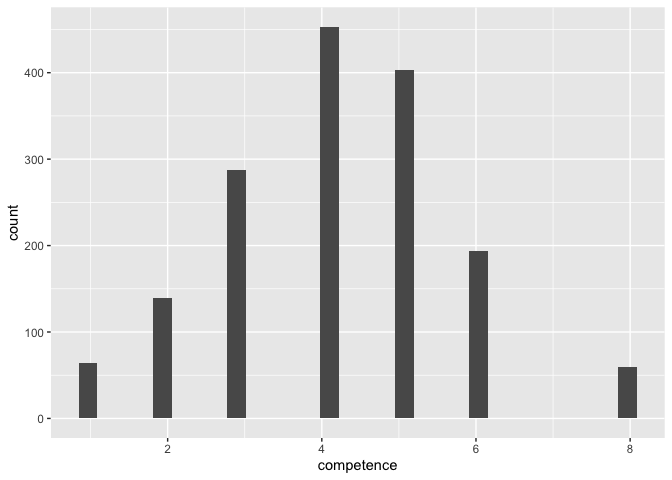
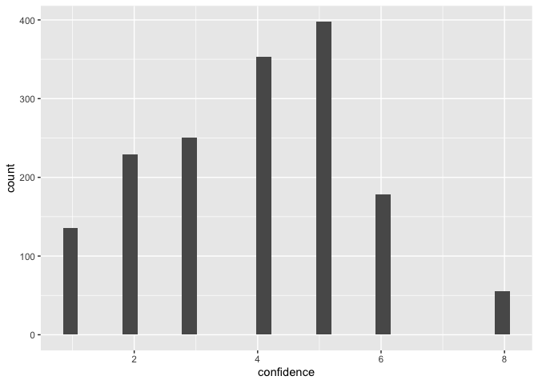
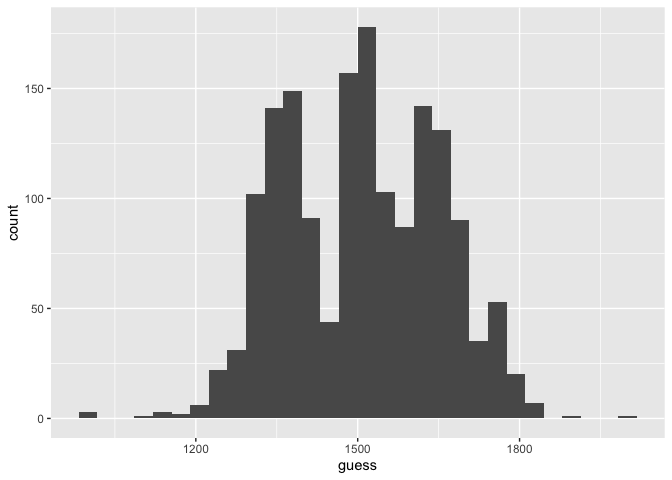
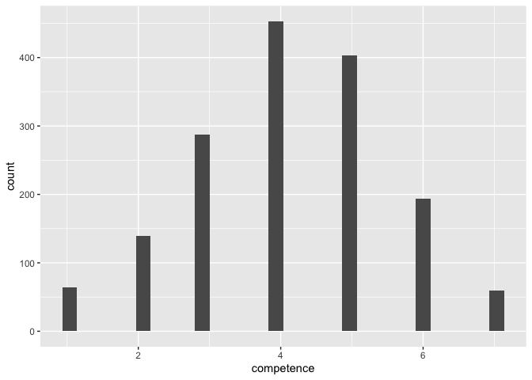
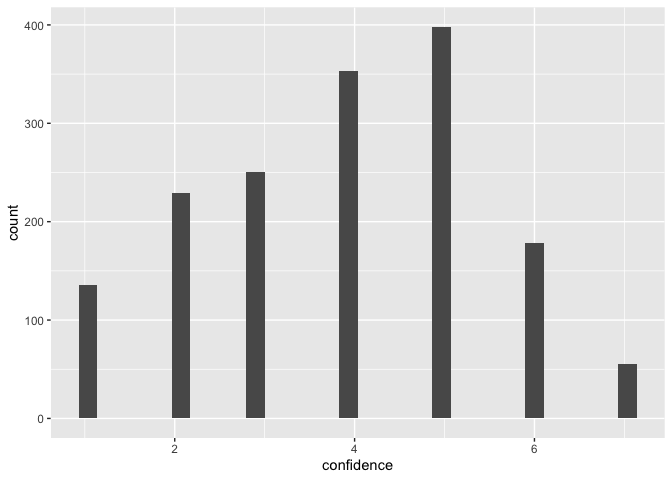

```r
library(tidyverse)     # create plots with ggplot, manipulate data, etc.
library(broom.mixed)   # convert regression models into nice tables
library(modelsummary)  # combine multiple regression models into a single table
library(lme4)          # model specification / estimation 
library(lmerTest)      # provides p-values in the output
library(ggpubr)        # stile feature of ggplot
library(gghalves)      # do special plots in ggplot
library(kableExtra)    # for tables
```


## Import data.

```r
# import data
d <- read_csv("./data/qualtrics.csv")

# delete first two rows
d <- d[3:202,]
```

## Attention checks. 

```r
# attention check
# to see different answers given (i.e.levels), transform into factor
d$attention <- as.factor(d$attention)
# check levels to see different answer types
levels(d$attention) 
```

```
## [1] "\"i pay attention\"" "I pat attention"     "i pay attention"    
## [4] "I pay attention"     "I PAY ATTENTION"     "I pay attention."
```
All levels are some variation of "I pay attention", so we do not exclude any participants. 

## Re-shaping data

For now, the data is in a wide format where each combination of stimulus item and dependent variable has its own column. We need to bring that data into long format. 


```r
d <- d %>% 
  # build an easy-to-read ID variable for subjects
  mutate(ID = as.factor(1:nrow(.))) %>% 
  # order data by subjects
  arrange(ID) %>% 
  # from wide to long format
  gather(item, score, conv_large_guess_a_4:noconv_small_comp_b...91,
               factor_key=TRUE) %>% 
  # seperate variables 
  separate(item, into = c("convergence", "number", "dependent_variable",
                          "variant"), convert = T, sep = "\\_")  %>% 
  # remove NA's
  filter(!is.na(score)) %>% 
  # make sure data is still ordered by participants
  arrange(ID) %>% 
  # The variable "variant" that distinguishes between the two items of the same
  # condition did not come as intended. Without changing it, we won't be able
  # to "spread" our dependent variables (DV)
  mutate(variant = rep(c("a", "b"), each = 3, length.out = nrow(.))) %>% 
  # now for each subject, each condition and each variant the three DVs
  # can be assigned
  pivot_wider(names_from = dependent_variable, values_from = score) %>% 
  # so far, all variables are coded characters (see e.g. str(d))
  # we want our dependent variables to be numeric
  mutate(competence = as.numeric(comp),
         guess = as.numeric(guess), 
         confidence = as.numeric(conf))
```

## Recoding some values

To see if there are any weird values, we inspect the distributions of the dependent variables.
<!-- --><!-- --><!-- -->

For the two Likert scale measures (`confidence` and `competence`) The maximum of the scale has been coded as `8` instead of `7`. 


```r
# change values `8` to `7`
d <- d %>% 
  mutate(competence = ifelse(competence == 8, 7, competence), 
         confidence = ifelse(confidence ==8, 7, confidence))

# check again
ggplot(d, aes(x = competence)) +
  geom_histogram()# looks good
```

```
## `stat_bin()` using `bins = 30`. Pick better value with `binwidth`.
```

<!-- -->

```r
ggplot(d, aes(x = confidence)) +
  geom_histogram()# looks good
```

```
## `stat_bin()` using `bins = 30`. Pick better value with `binwidth`.
```

<!-- -->

## Recoding factors

Lastly, we recode the `convergence` variable. For now, the baseline category is _convergence_, which will yield a negative estimate for the effect of _no convergence_. We want to have the positive effect of _convergence_ instead. Likewise, we reconde the `number` variable so that we get the effect of _large_ (i.e. put _small_ as baseline category). 


```r
# recode convergence
d <- d %>%
  mutate(
    convergence = ifelse(convergence == "conv", "convergent", "divergent"),
    convergence = as.factor(convergence),
    convergence = fct_relevel(convergence, "divergent", "convergent"),
    number = as.factor(number),
    number = fct_relevel(number, "small", "large"))
```

## Export data


```r
write_csv(d, "data/cleaned.csv")
```


