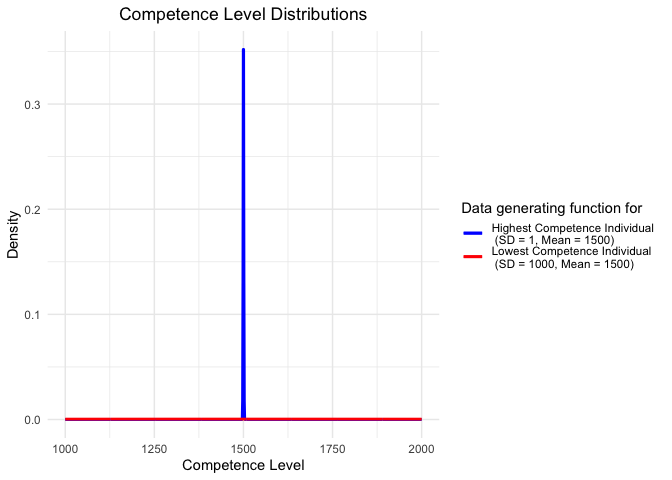
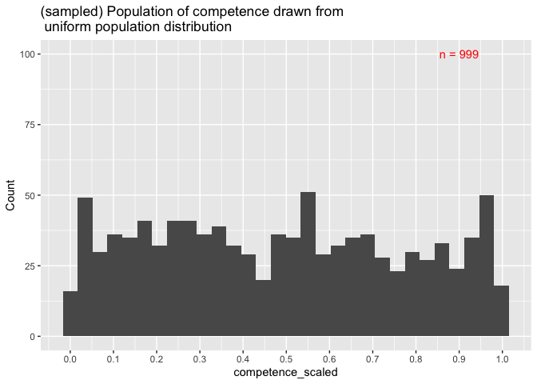
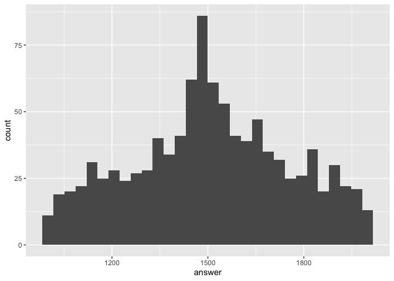
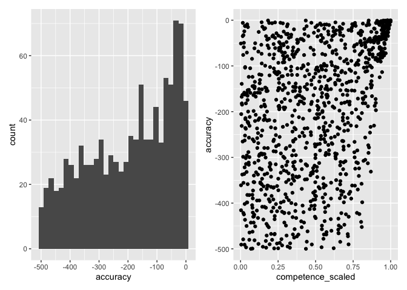
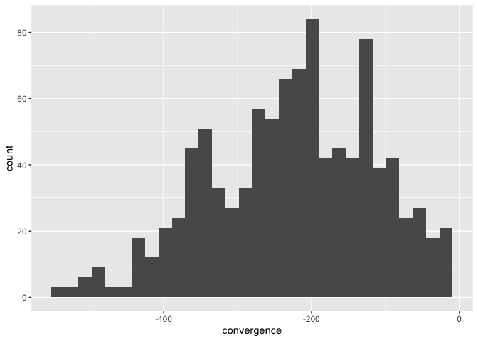
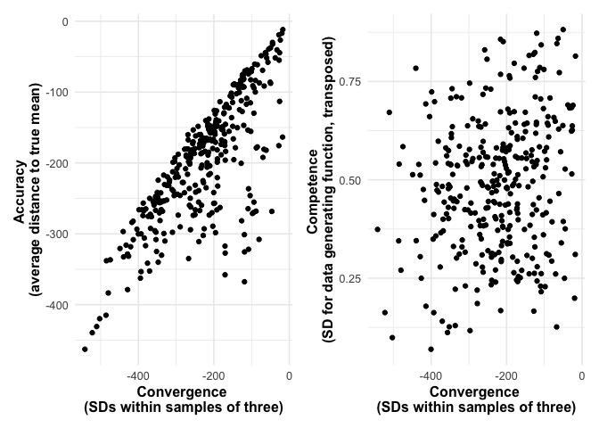

```r
# ensure this script returns the same results on each run
set.seed(8726)
```

## Explaining the model


```r
# Imagine a situation in which answers range from 1000 to 2000
range <- 1000
# and a population of n = 999
population <- 999
# and we observe samples of 3
sample <- 3
# alpha and beta values for beta distributions modelling competence
alpha <- 1
beta <- 1
# ramge of values for estimates
min_range = 1000
max_range = 2000

# set arbitrary limit for competence distribution
# (factor determining distance between lowest and highest possible competence, 
# i.e. standard deviation)
competence_ratio = 1000 
```


### Define competence and its distribution 

We define competence as the value of the standard deviation from which one's answer is drawn. We suppose that answers for all individuals are drawn from normal distributions. Each individual has their own normal distribution. All normal distributions are centered around the true answer, but they differ in their standard deviations. The higher the competence, the lower the standard deviation, i.e. the more certain a guess drawn from the normal distribution will be close to the true answer. 

We (arbitrarily) set the *lowest* competence to the range of possible values, in our case 2000 - 1000 = 1000. We set the *highest* competence to 1/1000 of the range of possible values, in our case 1. 


```r
# Define the x-axis values
x <- seq(1000, 2000, length.out = 1000)

# Define the PDFs for the two distributions
high_competence_pdf <- dnorm(x, mean = 1500, sd = 1)
low_competence_pdf <- dnorm(x, mean = 1500, sd = 1000)

# Create the plot
ggplot() +
  geom_line(aes(x, high_competence_pdf, color = "Highest Competence Individual \n (SD = 1, Mean = 1500)"), size = 1) +
  geom_line(aes(x, low_competence_pdf, color = "Lowest Competence Individual \n (SD = 1000, Mean = 1500)"), size = 1) +
  labs(x = "Competence Level", y = "Density", color = "Data generating function for") +
  ggtitle("Competence Level Distributions") +
  scale_color_manual(values = c("Highest Competence Individual \n (SD = 1, Mean = 1500)" = "blue", 
                                "Lowest Competence Individual \n (SD = 1000, Mean = 1500)" = "red")) +
  theme_minimal() +
  theme(plot.title = element_text(hjust = 0.5))
```

```
## Warning: Using `size` aesthetic for lines was deprecated in ggplot2 3.4.0.
## ℹ Please use `linewidth` instead.
## This warning is displayed once every 8 hours.
## Call `lifecycle::last_lifecycle_warnings()` to see where this warning was
## generated.
```

<!-- -->

We assume that individuals (i) vary in competence and (ii) that the distribution of competence in the population varies, as can be modeled by a beta distribution. In the case below, we assume a uniform competence distribution (equal to a beta distribution of alpha = 1 and beta = 1). 

In order to be able to compare competence measures across different ranges, we want to scale it to reach from 0 (minimal competence) to 1 (maximal competence). 


```r
# 1: Distribution of competence

# Theoretical population distribution of competence
ggplot() +
  geom_function(fun = ~dbeta(.x, shape1 = 1, shape2 = 1))
```

<!-- -->

```r
# randomly draw competence levels
data <- tibble(id = 1:population,
               competence = rbeta(population, shape1 = alpha, 
                                          shape2 = beta)) %>% 
    # For now competence tending towards one is more competent.
    # For the data generating, we need the reverse and scale this competence measure.  
    mutate(
      # Since competence = standard deviation of estimate generating normal distribution, 
      # reverse the scale such that 0 corresponds to maximal competence (instead of 1).
      competence_reversed = 1 - competence, 
      # Put values on a scale: 
      # We (arbitrarily) set the lowest competence to the range of possible values, 
      # in case of our experiments 2000 - 1000 = 1000. 
      # We set the highest competence to 1/1000 of the range of possible values, 
      # in our case 1.
      competence_reversed_scaled = (competence_reversed * range) + range/competence_ratio)


# generated population
ggplot(data, aes(x = competence)) +
  geom_histogram() + 
  scale_x_continuous(breaks = seq(from = 0, to = 1, by = 0.1)) + 
  annotate("text", x = 0.9, y = 100, label = paste0("n = ", population), color = "red") +
  labs(title = "(sampled) Population of competence drawn from \n uniform population distribution", 
       y = "Count")
```

```
## `stat_bin()` using `bins = 30`. Pick better value with `binwidth`.
```

<!-- -->
### Generate a choice for each individual based on their competence. 

The numbers that we generate from the normal distributions are truncated such that they all lie within the pre-defined range (1000 to 2000)


```r
# 2: Draw individual answers based on competence levels 
mean <- 1500

# use the reversed competence variable to generate the estimates
data$answer <- data$competence_reversed_scaled %>% 
  purrr::map_dbl(function(x){ 
    
    sd <- x
    
    answer = truncnorm::rtruncnorm(1, mean = mean, sd = sd, a = min_range, b = max_range)
  }
  )

ggplot(data, aes(x = answer)) +
  geom_histogram()
```

```
## `stat_bin()` using `bins = 30`. Pick better value with `binwidth`.
```

<!-- -->

### Measure accuracy

We measure accuracy as the (squared) distance between the chosen answer and the true answer for each individual.

We let this distance be negative, such that higher values represent higher accuracy. 


```r
# 3: measure accuracy
data <- data %>% 
  mutate(accuracy = -1 * (mean - answer)^2)

ggplot(data, aes(x = accuracy)) +
  geom_histogram() +

ggplot(data, aes(x = competence, y = accuracy)) +
  geom_point()
```

```
## `stat_bin()` using `bins = 30`. Pick better value with `binwidth`.
```

<!-- -->

### Draw samples, calculate convergence & compare average outcomes

### Randomly draw samples from the population


```r
# 4: randomly assign samples in population
data <- data %>% mutate(sample_id = rep(1:(population/sample), sample))
```

### Calculate convergence 

We define convergence as the standard deviation of the answers within a sample (multiplied by -1 so that higher values correspond to greater convergence)


```r
# 5: calculate convergence 
data <- data %>% 
  # identify how often a one type of answer occurs in one group
  group_by(sample_id) %>% 
  mutate(convergence = -1 * sd(answer)) %>% 
  ungroup()

ggplot(data, aes(x = convergence)) +
  geom_histogram()
```

```
## `stat_bin()` using `bins = 30`. Pick better value with `binwidth`.
```

<!-- -->

### Compute average accuracy/competence per sample.


```r
# 6: calculate accuracy and competence per sample

# compute the summary statistics for each sample
results <- data %>% 
  group_by(sample_id, convergence) %>% 
  summarize(competence_mean = mean(competence),
            accuracy_mean = mean(accuracy)) %>% 
  # store simulation information
  mutate(population = population, 
         sample = sample)
```

```
## `summarise()` has grouped output by 'sample_id'. You can override using the
## `.groups` argument.
```


```r
accuracy_plot <- ggplot(results, aes(x = convergence, y = accuracy_mean)) +
  geom_point() +
  # Add nice labels
    labs(x = "Convergence \n(SDs within samples of three)", 
         y = "Accuracy \n(squared distance to true mean)") +
  plot_theme 

competence_plot <- ggplot(results, aes(x = convergence, y = competence_mean)) +
  geom_point() +
  # Add nice labels
    labs(x = "Convergence \n(SDs within samples of three)", 
         y = "Competence \n(SD of data generating function)") +
  plot_theme 

accuracy_plot + competence_plot
```

<!-- -->

## Functions

### Data generating functions

#### Single population


#### Various populations


#### Vary sample size

This function allows us to investigate how accuracy and competence change with varying the sample size. 

The simulations that this function executes will take quite some time. Therefore, we do not want to run it every time we render this document. Instead we want to store the output of the power simulation in a `.csv` file, and have an integrated "stop" mechanism to prevent execution when that file already exists. To achieve this, we make `file_name` a mandatory argument. If a file with that name already exists, the function will not be executed.


#### Vary competence

We now want to do the above (simulate a single population, repeat this process, do so for various sample sizes and choice options) for different competence distributions. We vary these distributions with the `alpha` and `beta` parameters for the beta distributions.


### Plot functions

#### a) Plot various populations

First, we want a function that plots results obtained by the `simulate_various_populations` function. 


#### b) Plot varying sample & options

Second, we want a function that plots results obtained by the `vary_sample()` function. 


#### c) Plot competence distributions

We want to plot the underlying competence distributions.


```r
# Plot competence distributions
plot_competence_distributions <- function(data) {
  # Your data frame
  d <- data %>% 
    group_by(competence) %>% 
    reframe(alpha = unique(alpha), beta = unique(beta))
  
  # Function to plot the different competence distributions 
  plot_competence_distributions <- function(alpha, beta) {
    ggplot() +
      geom_function(
        fun = ~dbeta(.x, shape1 = alpha, shape2 = beta)
      ) +
      labs(title = paste0("alpha = ", alpha, ", beta = ", beta), 
           y = "Density", x = "Competence") +
      plot_theme
  }
  
  # Specify the values of alpha and beta from the data
  alpha_values <- d$alpha
  beta_values <- d$beta 
  
  # Create a list of ggplot objects
  plot_list <- map2(alpha_values, beta_values, plot_competence_distributions)
  
  # Arrange and display the plots
  competence_plot <- ggarrange(plotlist = plot_list) %>%
    ggpubr::annotate_figure(top = ggpubr::text_grob("Competence distributions", 
                                                    face = "bold",
                                                    color = "darkgrey",
                                                    size = 14))
  
  
  return(competence_plot) 
}
```

#### d) Plot varying competence distributions by sample 

Fourth, we want another function that plots results by various competence levels by sample sizes. 


```r
plot_competence <- function(data, outcome = "accuracy") {
  
  d <- data
  
  # extract simulation info
  caption = paste0("Sample size of informants: ", d$sample[1],
                     "; Iterations per sample size: ", d$total_iterations[1], 
                     "; Population size per iteration: ", d$population[1])
  
  
  plot_accuracy <- ggplot(d, aes(x = convergence, y = accuracy_mean)) +
    geom_hex(alpha = 0.9) +
    #geom_smooth(method = "lm", se = FALSE) +
    stat_smooth(geom='line', method = "lm", alpha=0.7, se=FALSE, color = "darkgrey") +
    # Add nice labels
    labs(x = "Convergence \n(SDs of samples)", 
         y = "Accuracy \n(squared distance to true mean)",
         caption = caption) +
  scale_fill_viridis_c(option = "plasma", begin = 0.1) +
    facet_wrap(~competence) +
    plot_theme + 
    theme(legend.position = "top")
  
  plot_competence <- ggplot(d, aes(x = convergence, y = competence_mean)) +
    geom_hex(alpha = 0.9) +
    #geom_smooth(method = "lm", se = FALSE) +
    stat_smooth(geom='line', method = "lm", alpha=0.7, se=FALSE, color = "darkgrey") +
    # Add nice labels
    labs(x = "Convergence \n(SDs of samples)", 
         y = "Competence \n(SD for data generating function)",
         caption = caption) +
  scale_fill_viridis_c(option = "plasma", begin = 0.1) +
    facet_wrap(~competence) +
    plot_theme + 
    theme(legend.position = "top")
  
  if (outcome == "accuracy") {
    
    return(plot_accuracy)
  }
  
  if (outcome == "competence") {
    
    return(plot_competence)
  }
}

plot_competence_vary <- function(data, ...) {
  
  # get different samples as vector
  samples <- data %>% 
    reframe(unique(as.character(sample))) %>% pull()
  
  
  # empty list
  plot_list <- list()
  
  # make plots fro each moderator
  for (i in samples) {
    
    plot_data <- data %>%
      filter(sample == i)
    
    sample_plot <- plot_competence(data = plot_data, ...)
    
    plot_list[[i]] <- sample_plot
  }
  
  return(plot_list)
}

plot_competence_vary_relative_majority <- function(data, variable = options, outcome = "Accuracy") {
  
  d <- data
  
  # Extract variable name as a string
  variable_name <- deparse(substitute(variable))
  
  # retrieve info from choice of variable
  if (variable_name == "options") {
    caption = paste0("Sample size of informants: ", d$sample[1],
                     "; Iterations per sample size: ", d$total_iterations[1], 
                     "; Population size per iteration: ", d$population[1])
  }
  if (variable_name == "sample") {
    caption = paste0("Number of choice options: ", d$options[1],
                     "; Iterations per sample size: ", d$total_iterations[1], 
                     "; Population size per iteration: ", d$population[1])
  }
  
  d <- d %>% 
    group_by(relative_majority, {{variable}}, competence) %>%
    summarise(competence_mean = mean(average_relative_competence),
              accuracy_mean = mean(average_accuracy),
              accuracy_sd = sd(average_accuracy),
              competence_sd = sd(average_relative_competence)
    )
  
  # Assign outcome variable
  if(outcome == "Accuracy") {
    d$outcome <- d$accuracy_mean
    d$outcome_sd <- d$accuracy_sd
  }
  
  if(outcome == "Competence") {
    d$outcome <- d$competence_mean
    d$outcome_sd <- d$competence_sd
  }
  
  plot_outcome <- ggplot(d, 
                         aes(x = relative_majority, y = outcome,
                             color = as.factor({{variable}}))) +
    geom_point() +
    geom_line() +
    # Add nice labels
    labs(x = "Relative majority \n (share of informants agreeing on an option)", 
         y = outcome, caption = caption, 
         color = variable_name) +
    scale_color_viridis_d(option = "plasma", begin = 0.1, 
                          #limits = rev(levels(d$constellation)),
                          direction = -1
    ) +
    facet_wrap(~competence) +
    plot_theme + 
    theme(legend.position = "top")
  
   return(plot_outcome) 

} 
```

## Simulation

### Generate data


```r
n <- c(3, 10, 20, 50)

# run simulation and store results in .csv files
vary_sample(population = 999,
            min_range = 1000, max_range = 2000,
            competence_ratio = 1000,
            iterations = 100,
            file_name = "sim.csv",
            n = n, 
            alpha = 1, 
            beta = 1, 
            format = ".csv")

# read simulated data from .csv files
data <- read_csv("data/sim.csv")
```

### Plot


```r
# plot results
plot_results_vary(data)
```

```
## $`3`
```

<!-- -->

```
## 
## $`5`
```

<!-- -->

```
## 
## $`10`
```

<!-- -->

```
## 
## $`20`
```

<!-- -->

```
## 
## $`50`
```

<!-- -->

```
## 
## $`100`
```

<!-- -->

### Analyze & Compare to participant data

It's not clear to me yet what we would want to compare. 

In the experiment, we generated guesses from two different distribution widths: one with SD = 20 and another with SD = 150. In the model, this corresponds to the competence. However, we did not measure the observed SD of the guesses (which is the measure of convergence I rely on in the models). 

Below, what I did was predict accuracy and competence for convergence levels of 20 and 150 based on a regression run on the model data. We could compare that to the participant data - but it's not quite the same thing...


```
## 
## Call:
## lm(formula = competence_mean ~ convergence + sample + convergence * 
##     sample, data = regression_data)
## 
## Residuals:
##     Min      1Q  Median      3Q     Max 
## -4.7605 -1.0605  0.1878  1.2560  4.0804 
## 
## Coefficients:
##                       Estimate Std. Error t value Pr(>|t|)    
## (Intercept)          5.532e+00  6.343e-03   872.2   <2e-16 ***
## convergence          7.693e-03  2.715e-05   283.4   <2e-16 ***
## sample10             1.941e+00  1.892e-02   102.6   <2e-16 ***
## convergence:sample10 8.134e-03  8.101e-05   100.4   <2e-16 ***
## ---
## Signif. codes:  0 '***' 0.001 '**' 0.01 '*' 0.05 '.' 0.1 ' ' 1
## 
## Residual standard error: 1.484 on 259196 degrees of freedom
## Multiple R-squared:  0.3224,	Adjusted R-squared:  0.3224 
## F-statistic: 4.11e+04 on 3 and 259196 DF,  p-value: < 2.2e-16
```

```
## Warning: 'tidy.numeric' is deprecated.
## See help("Deprecated")

## Warning: 'tidy.numeric' is deprecated.
## See help("Deprecated")
```

```
##   convergence sample predicted_accuracy predicted_competence
## 1         -20      3           6.883360             5.378630
## 2        -150      3           5.973778             4.378476
## 3         -20     10           7.441097             7.156978
## 4        -150     10           6.260952             5.099455
```

## Vary competence


```r
n <- c(3, 5, 10, 20, 50, 100)
alpha = c(0.1, 2, 1, 1, 6, 0.9)
beta = c(1, 6, 1, 0.1, 2, 0.9)
names = c("very incompetent", "incompetent", "uniform", 
          "very competent", "competent", "bimodal")

# run simulation and store results in .csv files
vary_competence(population = 999,
            min_range = 1000, max_range = 2000,
            competence_ratio = 1000,
            iterations = 100,
            file_name = "sim.csv",
            n = n, 
            alpha = alpha, 
            beta = beta, 
            names = names)

# read simulated data from .csv files
test <- read_csv("data/sim.csv")
```


```r
plot_competence_distributions(test)
```

<!-- -->

```r
# for accuracy
plot_competence_vary(data = test, outcome = "accuracy")
```

```
## $`3`
```

```
## `geom_smooth()` using formula = 'y ~ x'
```

<!-- -->

```
## 
## $`5`
```

```
## `geom_smooth()` using formula = 'y ~ x'
```

<!-- -->

```
## 
## $`10`
```

```
## `geom_smooth()` using formula = 'y ~ x'
```

<!-- -->

```
## 
## $`20`
```

```
## `geom_smooth()` using formula = 'y ~ x'
```

<!-- -->

```
## 
## $`50`
```

```
## `geom_smooth()` using formula = 'y ~ x'
```

<!-- -->

```
## 
## $`100`
```

```
## `geom_smooth()` using formula = 'y ~ x'
```

<!-- -->

```r
# for competence
plot_competence_vary(data = test, outcome = "competence")
```

```
## $`3`
```

```
## `geom_smooth()` using formula = 'y ~ x'
```

<!-- -->

```
## 
## $`5`
```

```
## `geom_smooth()` using formula = 'y ~ x'
```

<!-- -->

```
## 
## $`10`
```

```
## `geom_smooth()` using formula = 'y ~ x'
```

<!-- -->

```
## 
## $`20`
```

```
## `geom_smooth()` using formula = 'y ~ x'
```

<!-- -->

```
## 
## $`50`
```

```
## `geom_smooth()` using formula = 'y ~ x'
```

<!-- -->

```
## 
## $`100`
```

```
## `geom_smooth()` using formula = 'y ~ x'
```

<!-- -->

