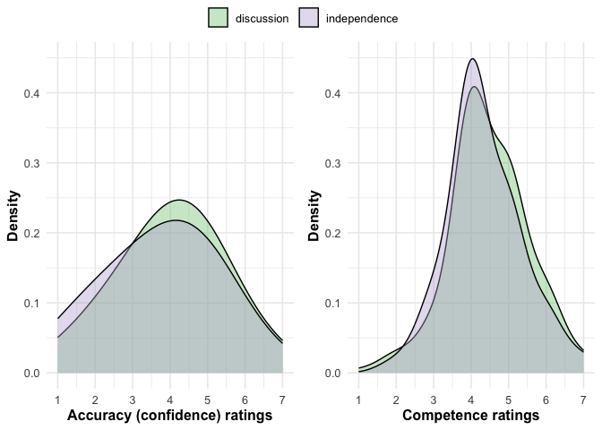
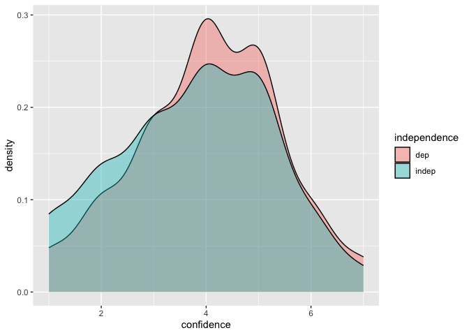
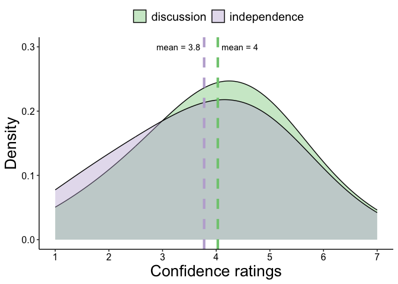
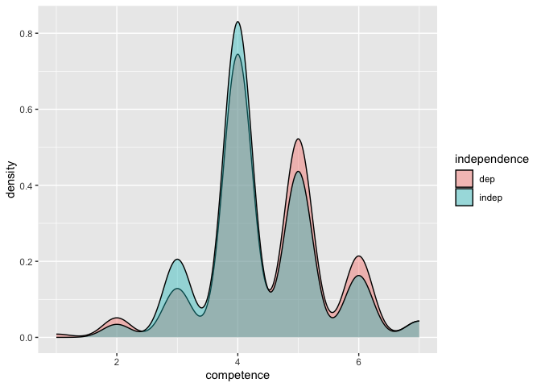
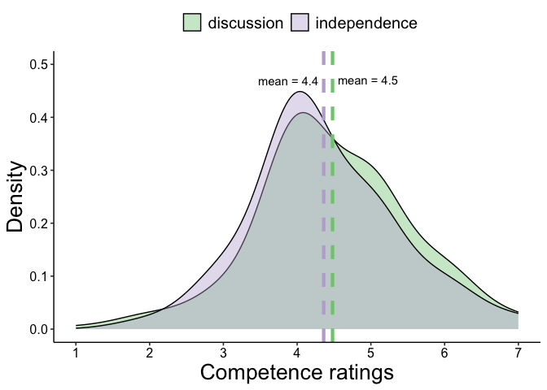

```r
library(tidyverse)     # create plots with ggplot, manipulate data, etc.
library(broom.mixed)   # convert regression models into nice tables
library(modelsummary)  # combine multiple regression models into a single table
library(lme4)          # model specification / estimation 
library(lmerTest)      # provides p-values in the output
library(ggpubr)        # stile feature of ggplot
library(gghalves)      # do special plots in ggplot
library(kableExtra)    # for tables
library(ggrepel)       # annotations in plots
```


```r
d <- read_csv("./data/cleaned.csv")
```

### Some themes and functions


## Data analysis

### Hypothesis 1

To assess the effect of independence on participants’ confidence about their guesses, we run a paired t-test.


```r
# get summary stats by number
d %>% 
  group_by(independence) %>% 
  summarise(across(c(confidence, competence),  
                   list(mean = mean, sd = sd)))
```

```
## # A tibble: 2 × 5
##   independence confidence_mean confidence_sd competence_mean competence_sd
##   <chr>                  <dbl>         <dbl>           <dbl>         <dbl>
## 1 dep                     4.03          1.39            4.48         1.02 
## 2 indep                   3.78          1.50            4.36         0.967
```


```r
# T-test
t <- t.test(confidence ~ independence, data = d, paired = TRUE)
t
```

```
## 
## 	Paired t-test
## 
## data:  confidence by independence
## t = 2.4308, df = 199, p-value = 0.01595
## alternative hypothesis: true mean difference is not equal to 0
## 95 percent confidence interval:
##  0.0481334 0.4618666
## sample estimates:
## mean difference 
##           0.255
```
The paired t-test shows a significant difference in confidence ratings between _independence_ and _dependence_. In the independence condition, participants were on average more confident by 0.255 points (on a scale from 1 to 7).

For a robustness check, we run a mixed model regression analysis of `independence` on `confidence` ratings. The first model (`m1`) includes random intercepts for participants. 

For reference, we start with standard, fixed-only effects regression models. 

```r
# for confidence 
# fixed linear regression models for reference
fixed_confidence <- lm(confidence ~ independence, data= d)
# model with random intercept per participant
mixed_confidence = lmer(confidence ~ independence + (1 |ID), data = d)


# for competence 
# fixed linear regression models for reference
fixed_competence <- lm(competence ~ independence, data= d)
# model with random intercept per participant
mixed_competence= lmer(competence ~ independence + (1 |ID), data = d)
# store in list
models = list("fixed" = fixed_confidence,
              "mixed" = mixed_confidence, 
              "fixed" = fixed_competence, 
              "mixed" = mixed_competence)
```


```r
modelsummary(models,
             stars = TRUE,
             title = 'Models estimating effect of convergence on accuracy and competence') %>%
    add_header_above(c(" " = 1, "Accuracy" = 2, "Competence" = 2))
```

<table style="NAborder-bottom: 0; width: auto !important; margin-left: auto; margin-right: auto;" class="table">
<caption>Models estimating effect of convergence on accuracy and competence</caption>
 <thead>
<tr>
<th style="empty-cells: hide;border-bottom:hidden;" colspan="1"></th>
<th style="border-bottom:hidden;padding-bottom:0; padding-left:3px;padding-right:3px;text-align: center; " colspan="2"><div style="border-bottom: 1px solid #ddd; padding-bottom: 5px; ">Accuracy</div></th>
<th style="border-bottom:hidden;padding-bottom:0; padding-left:3px;padding-right:3px;text-align: center; " colspan="2"><div style="border-bottom: 1px solid #ddd; padding-bottom: 5px; ">Competence</div></th>
</tr>
  <tr>
   <th style="text-align:left;">   </th>
   <th style="text-align:center;"> fixed </th>
   <th style="text-align:center;"> mixed </th>
   <th style="text-align:center;"> fixed  </th>
   <th style="text-align:center;"> mixed  </th>
  </tr>
 </thead>
<tbody>
  <tr>
   <td style="text-align:left;"> (Intercept) </td>
   <td style="text-align:center;"> 4.030*** </td>
   <td style="text-align:center;"> 4.030*** </td>
   <td style="text-align:center;"> 4.480*** </td>
   <td style="text-align:center;"> 4.480*** </td>
  </tr>
  <tr>
   <td style="text-align:left;">  </td>
   <td style="text-align:center;"> (0.102) </td>
   <td style="text-align:center;"> (0.102) </td>
   <td style="text-align:center;"> (0.070) </td>
   <td style="text-align:center;"> (0.070) </td>
  </tr>
  <tr>
   <td style="text-align:left;"> independenceindep </td>
   <td style="text-align:center;"> −0.255+ </td>
   <td style="text-align:center;"> −0.255* </td>
   <td style="text-align:center;"> −0.120 </td>
   <td style="text-align:center;"> −0.120 </td>
  </tr>
  <tr>
   <td style="text-align:left;">  </td>
   <td style="text-align:center;"> (0.145) </td>
   <td style="text-align:center;"> (0.105) </td>
   <td style="text-align:center;"> (0.099) </td>
   <td style="text-align:center;"> (0.077) </td>
  </tr>
  <tr>
   <td style="text-align:left;"> SD (Intercept ID) </td>
   <td style="text-align:center;">  </td>
   <td style="text-align:center;"> 0.996 </td>
   <td style="text-align:center;">  </td>
   <td style="text-align:center;"> 0.632 </td>
  </tr>
  <tr>
   <td style="text-align:left;box-shadow: 0px 1px"> SD (Observations) </td>
   <td style="text-align:center;box-shadow: 0px 1px">  </td>
   <td style="text-align:center;box-shadow: 0px 1px"> 1.049 </td>
   <td style="text-align:center;box-shadow: 0px 1px">  </td>
   <td style="text-align:center;box-shadow: 0px 1px"> 0.769 </td>
  </tr>
  <tr>
   <td style="text-align:left;"> Num.Obs. </td>
   <td style="text-align:center;"> 400 </td>
   <td style="text-align:center;"> 400 </td>
   <td style="text-align:center;"> 400 </td>
   <td style="text-align:center;"> 400 </td>
  </tr>
  <tr>
   <td style="text-align:left;"> R2 </td>
   <td style="text-align:center;"> 0.008 </td>
   <td style="text-align:center;">  </td>
   <td style="text-align:center;"> 0.004 </td>
   <td style="text-align:center;">  </td>
  </tr>
  <tr>
   <td style="text-align:left;"> R2 Adj. </td>
   <td style="text-align:center;"> 0.005 </td>
   <td style="text-align:center;">  </td>
   <td style="text-align:center;"> 0.001 </td>
   <td style="text-align:center;">  </td>
  </tr>
  <tr>
   <td style="text-align:left;"> R2 Marg. </td>
   <td style="text-align:center;">  </td>
   <td style="text-align:center;"> 0.008 </td>
   <td style="text-align:center;">  </td>
   <td style="text-align:center;"> 0.004 </td>
  </tr>
  <tr>
   <td style="text-align:left;"> R2 Cond. </td>
   <td style="text-align:center;">  </td>
   <td style="text-align:center;"> 0.478 </td>
   <td style="text-align:center;">  </td>
   <td style="text-align:center;"> 0.405 </td>
  </tr>
  <tr>
   <td style="text-align:left;"> AIC </td>
   <td style="text-align:center;"> 1434.4 </td>
   <td style="text-align:center;"> 1391.2 </td>
   <td style="text-align:center;"> 1135.1 </td>
   <td style="text-align:center;"> 1108.7 </td>
  </tr>
  <tr>
   <td style="text-align:left;"> BIC </td>
   <td style="text-align:center;"> 1446.4 </td>
   <td style="text-align:center;"> 1407.2 </td>
   <td style="text-align:center;"> 1147.1 </td>
   <td style="text-align:center;"> 1124.7 </td>
  </tr>
  <tr>
   <td style="text-align:left;"> ICC </td>
   <td style="text-align:center;">  </td>
   <td style="text-align:center;"> 0.5 </td>
   <td style="text-align:center;">  </td>
   <td style="text-align:center;"> 0.4 </td>
  </tr>
  <tr>
   <td style="text-align:left;"> Log.Lik. </td>
   <td style="text-align:center;"> −714.216 </td>
   <td style="text-align:center;">  </td>
   <td style="text-align:center;"> −564.553 </td>
   <td style="text-align:center;">  </td>
  </tr>
  <tr>
   <td style="text-align:left;"> F </td>
   <td style="text-align:center;"> 3.108 </td>
   <td style="text-align:center;">  </td>
   <td style="text-align:center;"> 1.455 </td>
   <td style="text-align:center;">  </td>
  </tr>
  <tr>
   <td style="text-align:left;"> RMSE </td>
   <td style="text-align:center;"> 1.44 </td>
   <td style="text-align:center;"> 0.86 </td>
   <td style="text-align:center;"> 0.99 </td>
   <td style="text-align:center;"> 0.65 </td>
  </tr>
</tbody>
<tfoot><tr><td style="padding: 0; " colspan="100%">
<sup></sup> + p &lt; 0.1, * p &lt; 0.05, ** p &lt; 0.01, *** p &lt; 0.001</td></tr></tfoot>
</table>


The fixed-effect-only linear regression model yields the same estimate for the effect of `independence` as the paired t-test, with the difference that this is not statistically significant at the 5%-level anymore. In the mixed model, the main effect of `independence` remains the same, but is significant again, like in the paired t-test. 

### Hypothesis 2

We will proceed just as with hypothesis 1, but for `competence`. 


```r
# T-test
t <- t.test(competence ~ independence, data = d, paired = TRUE)
t
```

```
## 
## 	Paired t-test
## 
## data:  competence by independence
## t = 1.5613, df = 199, p-value = 0.12
## alternative hypothesis: true mean difference is not equal to 0
## 95 percent confidence interval:
##  -0.03156558  0.27156558
## sample estimates:
## mean difference 
##            0.12
```
The paired t-test does not show a significant difference in confidence ratings between _no convergence_ and _convergence_.

## Visualization

### Main plot


```r
# make plots
confidence_plot <- ggplot(data=d, aes(x=confidence, fill=independence)) + 
  geom_density(adjust=2, alpha=.4)+
  scale_x_continuous(name = "Accuracy (confidence) ratings", breaks = seq(1, 7), 
                     limits=c(1, 7)) +
  scale_y_continuous(name = "Density", limits=c(0, 0.45)) +
  scale_fill_brewer(palette = "Accent",
                    direction = 1, 
                    name = "Independence: ",
                    limits = c("dep", "indep"), 
                    labels = c("discussion", "independence")) + 
  guides(fill = guide_legend(title = NULL)) +
  plot_theme

competence_plot <- ggplot(data=d, aes(x=competence, fill=independence)) + 
  geom_density(adjust=2, alpha=.4)+
  scale_x_continuous(name = "Competence ratings", breaks = seq(1, 7), 
                     limits=c(1, 7)) +
  scale_y_continuous(name = "Density", limits=c(0, 0.45)) +
  scale_fill_brewer(palette = "Accent",
                    direction = 1, 
                    name = "Independence: ",
                    limits = c("dep", "indep"), 
                    labels = c("discussion", "independence")) + 
  guides(fill = guide_legend(title = NULL)) +
  plot_theme

figure <- ggarrange(confidence_plot, competence_plot, common.legend = T) +
  theme(legend.position="top") 
figure
```

<!-- -->


### Other plots

Here's a visualization of the difference in `confidence` ratings between the _independence_ and _dependence_ conditions. 

```r
# create objects for means to include in graphics
d_means <- d %>%
  group_by(independence) %>%
  summarize(mean_confidence=mean(confidence))

# Vizualization
density_plot <- ggplot(data=d, aes(x=confidence, fill=independence)) +
geom_density(alpha=.4) 
density_plot
```

<!-- -->

```r
density_plot_smoothed <- ggplot(data=d, aes(x=confidence, fill=independence)) + 
  geom_density(adjust=2, alpha=.4)+
  scale_x_continuous(name = "Confidence ratings", breaks = seq(1, 7), 
                     limits=c(1, 7)) +
  scale_fill_brewer(palette = "Dark2") +
  theme_pubr()
density_plot_smoothed
```

<!-- -->

```r
# prettier
density_plot_smoothed <- ggplot(data=d, aes(x=confidence, fill=independence)) + 
  geom_density(adjust=2, alpha=.4)+
  scale_x_continuous(name = "Confidence ratings", breaks = seq(1, 7), 
                     limits=c(1, 7)) +
  scale_y_continuous(name = "Density", limits=c(0, 0.3)) +
  geom_vline(data=d_means, aes(xintercept=mean_confidence, 
                                       color=independence),
             show.legend = FALSE,
             linetype="dashed", size=1.5) +
  geom_text_repel(data = d_means, 
            aes(x = mean_confidence, y = 0.3, 
                label =  paste("mean", round(mean_confidence, digits = 1),
                               sep = " = "))) +
  scale_fill_brewer(
    name = "Independence: ",
    labels = c("discussion", "independence"),
    palette = "Accent") + 
  scale_color_brewer(palette = "Accent") +
  guides(fill = guide_legend(title = NULL)) +
  theme_pubr() + 
  # larger axis titles
  theme(axis.title = element_text(size = 20)) +
  theme(legend.text = element_text(size = 15))
```

```
## Warning: Using `size` aesthetic for lines was deprecated in ggplot2 3.4.0.
## ℹ Please use `linewidth` instead.
## This warning is displayed once every 8 hours.
## Call `lifecycle::last_lifecycle_warnings()` to see where this warning was
## generated.
```

```r
density_plot_smoothed
```

<!-- -->


Here's a visualization of the difference in `competence` ratings between the _independence_ and _dependence_ conditions. 

```r
# create objects for means to include in graphics
d_means <- d %>%
  group_by(independence) %>%
  summarize(mean_competence=mean(competence))

# Vizualization
density_plot <- ggplot(data=d, aes(x=competence, fill=independence)) +
geom_density(alpha=.4) 
density_plot
```

<!-- -->

```r
# prettier
density_plot_smoothed <- ggplot(data=d, aes(x=competence, fill=independence)) + 
  geom_density(adjust=2, alpha=.4)+
  scale_x_continuous(name = "Competence ratings", breaks = seq(1, 7), 
                     limits=c(1, 7)) +
  scale_y_continuous(name = "Density", limits=c(0, 0.5)) +
  geom_vline(data=d_means, aes(xintercept=mean_competence, 
                                       color=independence),
             show.legend = FALSE,
             linetype="dashed", size=1.5) +
  geom_text_repel(data = d_means, 
            aes(x = mean_competence, y = 0.47, 
                label =  paste("mean", round(mean_competence, digits = 1),
                               sep = " = "))) +
  scale_fill_brewer(
    name = "Independence: ",
    labels = c("discussion", "independence"),
    palette = "Accent") + 
  scale_color_brewer(palette = "Accent") +
  guides(fill = guide_legend(title = NULL)) +
  theme_pubr() + 
  # larger axis titles
  theme(axis.title = element_text(size = 20)) +
  theme(legend.text = element_text(size = 15))
density_plot_smoothed
```

<!-- -->


