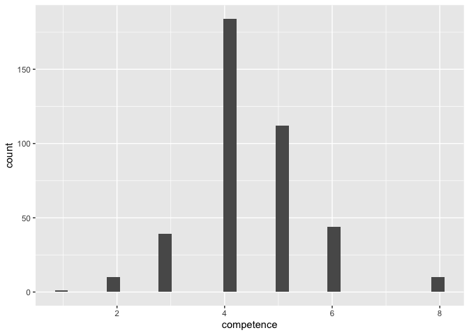
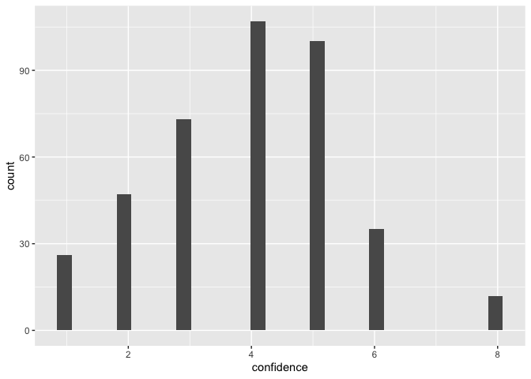
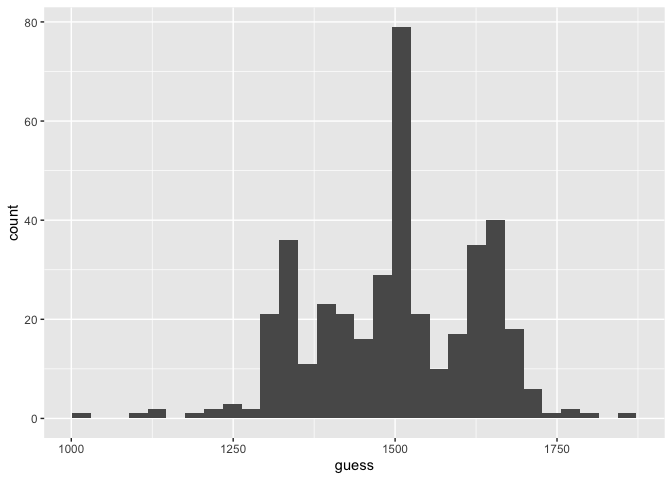
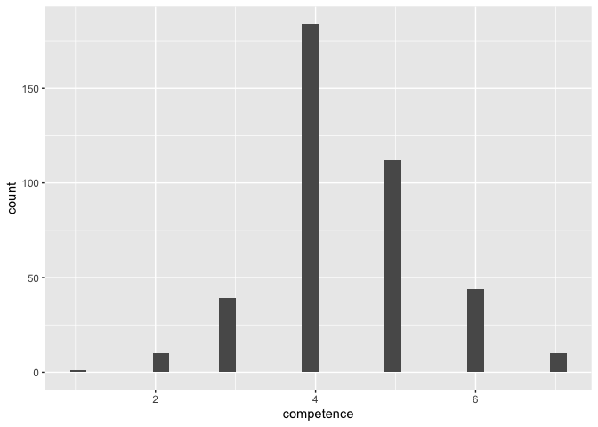
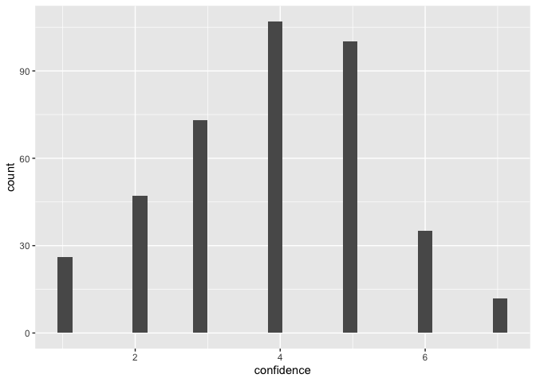

```r
library(tidyverse)     # create plots with ggplot, manipulate data, etc.
library(broom.mixed)   # convert regression models into nice tables
library(modelsummary)  # combine multiple regression models into a single table
library(lme4)          # model specification / estimation 
library(lmerTest)      # provides p-values in the output
library(ggpubr)        # stile feature of ggplot
library(gghalves)      # do special plots in ggplot
library(kableExtra)    # for tables
```

## Import data


```r
d <- read_csv("./data/qualtrics.csv")
```

```
## Rows: 202 Columns: 61
## ── Column specification ────────────────────────────────────────────────────────
## Delimiter: ","
## chr (61): StartDate, EndDate, Status, IPAddress, Progress, Duration (in seco...
## 
## ℹ Use `spec()` to retrieve the full column specification for this data.
## ℹ Specify the column types or set `show_col_types = FALSE` to quiet this message.
```

```r
head(d)
```

```
## # A tibble: 6 × 61
##   StartDate    EndDate Status IPAddress Progress Duration (in seconds…¹ Finished
##   <chr>        <chr>   <chr>  <chr>     <chr>    <chr>                  <chr>   
## 1 "Start Date" "End D… "Resp… "IP Addr… "Progre… "Duration (in seconds… "Finish…
## 2 "{\"ImportI… "{\"Im… "{\"I… "{\"Impo… "{\"Imp… "{\"ImportId\":\"dura… "{\"Imp…
## 3 "2022-05-02… "2022-… "0"    "176.255… "100"    "109"                  "1"     
## 4 "2022-05-02… "2022-… "0"    "51.9.86… "100"    "174"                  "1"     
## 5 "2022-05-02… "2022-… "0"    "88.110.… "100"    "119"                  "1"     
## 6 "2022-05-02… "2022-… "0"    "31.50.2… "100"    "203"                  "1"     
## # ℹ abbreviated name: ¹​`Duration (in seconds)`
## # ℹ 54 more variables: RecordedDate <chr>, ResponseId <chr>,
## #   RecipientLastName <chr>, RecipientFirstName <chr>, RecipientEmail <chr>,
## #   ExternalReference <chr>, LocationLatitude <chr>, LocationLongitude <chr>,
## #   DistributionChannel <chr>, UserLanguage <chr>, consent <chr>,
## #   attention <chr>, dep_guess_b_I_4 <chr>, dep_conf_b_I <chr>,
## #   dep_comp_b_I <chr>, indep_guess_a_I_4 <chr>, indep_conf_a_I <chr>, …
```

```r
# delete first two rows
d <- d[3:202,]
```


## Attention checks


```r
# attention check
# to see different answers given (i.e.levels), transform into factor
d$attention <- as.factor(d$attention)
# check levels to see different answer types
levels(d$attention) 
```

```
## [1] "I pat attention"  "I pay  attention" "i pay attention"  "I pay attention" 
## [5] "I PAY ATTENTION"
```
All levels are some variation of "I pay attention", so we do not exclude any participants. 

## Variable name correction

There was a coding problem in the data - a variable that start with "dep_conf_b_III" appears twice. Looking at the qualtrics, one of them should in fact identify "dep_guess_b_III", i.e. the numeric guess instead of a confidence rating. We identify this column looking at the values. Large values in the thousands indicate it's a guess and not a confidence rating. 


```r
d %>% 
  select(starts_with("dep_conf_b_III"))
```

```
## # A tibble: 200 × 2
##    dep_conf_b_III_4 dep_conf_b_III
##    <chr>            <chr>         
##  1 <NA>             <NA>          
##  2 <NA>             <NA>          
##  3 <NA>             <NA>          
##  4 <NA>             <NA>          
##  5 <NA>             <NA>          
##  6 <NA>             <NA>          
##  7 <NA>             <NA>          
##  8 1751             4             
##  9 <NA>             <NA>          
## 10 <NA>             <NA>          
## # ℹ 190 more rows
```

The output indicates that "dep_conf_b_III_4" captures the guess and should be named "dep_guess_b_III". 


```r
d <- d %>% 
  rename(dep_guess_b_III = dep_conf_b_III_4)
```

## Re-shaping data

For now, the data is in a wide format where each combination of stimulus item and dependent variable has its own column. We need to "tidy" the data. 


```r
d <- d %>% 
  # build an easy-to-read ID variable for subjects
  mutate(ID = as.factor(1:nrow(.))) %>% 
  # order data by subjects
  arrange(ID) %>% 
  # from wide to long format
  gather(item, score, dep_guess_b_I_4:dep_comp_a_III,
               factor_key=TRUE) %>% 
  # seperate variables 
  separate(item, into = c("independence", "dependent_variable", 
                          "stimulus_variant", "sample"), 
           convert = T, sep = "\\_")  %>% 
  # remove NA's
  filter(!is.na(score)) %>% 
  # make sure data is still ordered by participants
  arrange(ID) %>%
  # now for each subject, each condition and each variant the three DVs
  # can be assigned
  pivot_wider(names_from = dependent_variable, values_from = score) %>% 
  # so far, all variables are coded characters (see e.g. str(d))
  # we want our dependent variables to be numeric
  mutate(competence = as.numeric(comp),
         guess = as.numeric(guess), 
         confidence = as.numeric(conf))
```

```
## Warning: Expected 4 pieces. Additional pieces discarded in 2200 rows [1, 2, 3, 4, 5, 6,
## 7, 8, 9, 10, 11, 12, 13, 14, 15, 16, 17, 18, 19, 20, ...].
```

## Recoding some values

To see if there are any weird values, we inspect the distributions of the dependent variables.

```r
# competence
ggplot(d, aes(x = competence)) +
  geom_histogram()# seems like 7s have been coded as 8s
```

```
## `stat_bin()` using `bins = 30`. Pick better value with `binwidth`.
```

<!-- -->

```r
# confidence
ggplot(d, aes(x = confidence)) +
  geom_histogram()# same, 7s have been coded as 8s
```

```
## `stat_bin()` using `bins = 30`. Pick better value with `binwidth`.
```

<!-- -->

```r
# guess
ggplot(d, aes(x = guess)) +
  geom_histogram() # all guesses are coded withing range, looks good
```

```
## `stat_bin()` using `bins = 30`. Pick better value with `binwidth`.
```

<!-- -->

For the two Likert scale measures (`confidence` and `competence`) the maximum of the scale has been coded as `8` instead of `7`. 


```r
d <- d %>% 
  mutate(competence = ifelse(competence == 8, 7, competence), 
         confidence = ifelse(confidence ==8, 7, confidence))

# check again
ggplot(d, aes(x = competence)) +
  geom_histogram()# looks good
```

```
## `stat_bin()` using `bins = 30`. Pick better value with `binwidth`.
```

<!-- -->

```r
ggplot(d, aes(x = confidence)) +
  geom_histogram()# looks good
```

```
## `stat_bin()` using `bins = 30`. Pick better value with `binwidth`.
```

<!-- -->

## Recoding factors

Lastly, we recode the `independence` variable. 


```r
# recode independence
d <- d %>%
  mutate(
    independence = ifelse(independence == "indep", "independent", "dependent"),
    independence = as.factor(independence),
    independence = fct_relevel(independence, "dependent", "independent")
    )
```

## Export data


```r
write_csv(d, "data/cleaned.csv")
```


