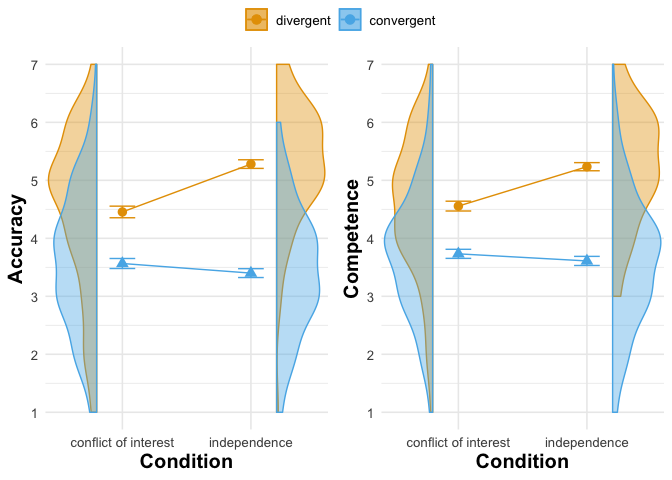
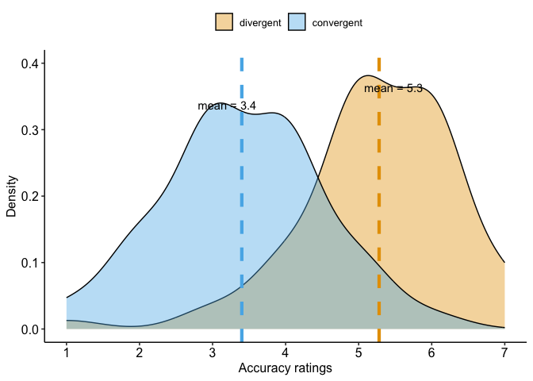
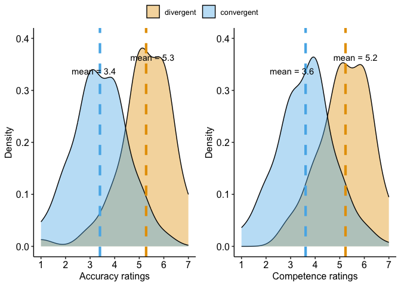
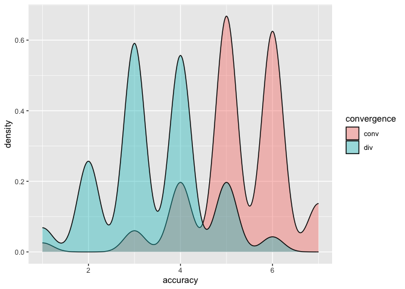
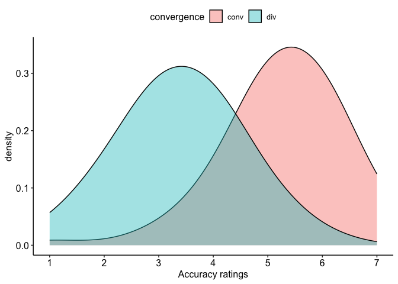
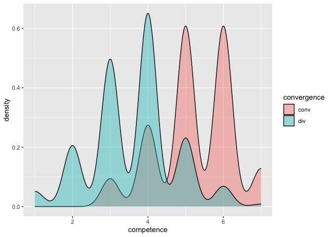
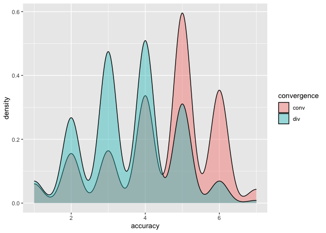
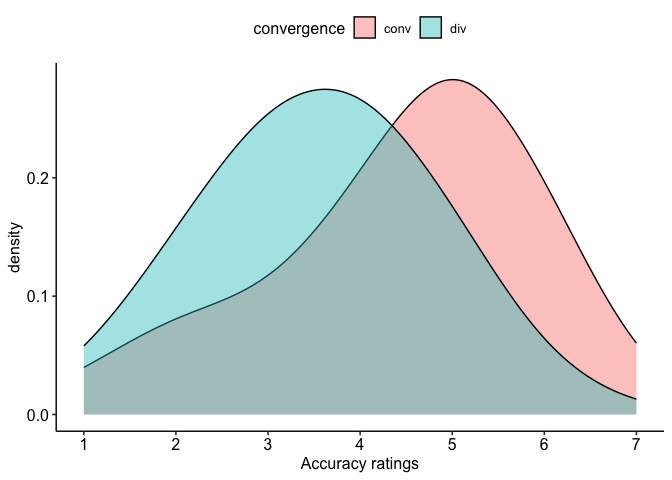
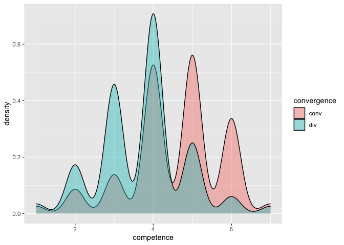
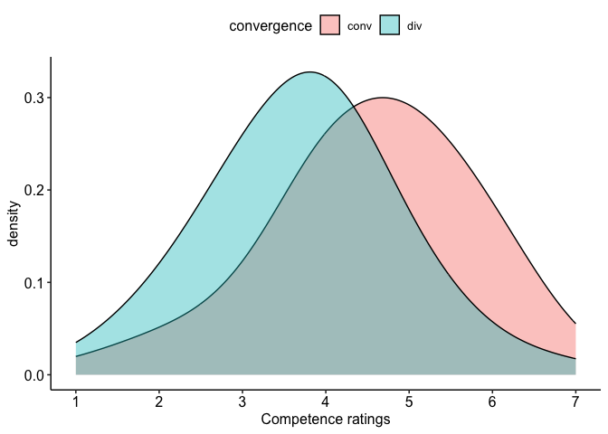

```r
library(tidyverse)     # create plots with ggplot, manipulate data, etc.
library(broom.mixed)   # convert regression models into nice tables
library(modelsummary)  # combine multiple regression models into a single table
library(lme4)          # model specification / estimation 
library(lmerTest)      # provides p-values in the output
library(ggpubr)        # stile feature of ggplot
library(sjPlot)        # plot the interaction model
library(gghalves)      # Special half geoms
library(ggbeeswarm)    # Special distribution-shaped point jittering
library(ggrepel)       # for non-overlapping labels in graphs
library(kableExtra)   # for tables
```


```r
d <- read_csv("./data/cleaned.csv")
```

### Some themes and functions


## Data analysis

### Hypothesis 1a

We will perform a paired t-test to assess the effect of convergence on participants’ accuracy ratings for the experts' predictions. This test accounts for the dependency between the two conditions of _convergence_ issued by the fact that in our design, this was a within-participant factor.

We will limit the sample to those participants that were assigned to the indepdendence condition of our second, between-participants factor _independence_. 


```r
# filter data
independence_sample <- d %>% filter(independence == "indep")
```


```r
# combined summary stats
independence_sample %>%
  group_by(convergence) %>%
  summarize(across(c(accuracy, competence), 
                   list(mean = mean, sd = sd)))
```

```
## # A tibble: 2 × 5
##   convergence accuracy_mean accuracy_sd competence_mean competence_sd
##   <chr>               <dbl>       <dbl>           <dbl>         <dbl>
## 1 conv                 5.28        1.05            5.24         0.992
## 2 div                  3.4         1.08            3.61         1.11
```


```r
# T-test
t <- t.test(accuracy ~ convergence, data = independence_sample, paired = TRUE)
t
```

```
## 
## 	Paired t-test
## 
## data:  accuracy by convergence
## t = 20.801, df = 199, p-value < 2.2e-16
## alternative hypothesis: true mean difference is not equal to 0
## 95 percent confidence interval:
##  1.701771 2.058229
## sample estimates:
## mean difference 
##            1.88
```
The paired t-test shows that *given independence*, there is a significant difference in accuracy ratings between _convergence_ and _divergence_. In the convergence condition, participants rated experts' accuracy higher by 1.88 points (on a scale from 1 to 7) on average.

For a robustness check, we run a mixed model, including random intercepts and slopes by participants. For reference, we also report a fixed-only effects regression. 

```r
# accuracy
# fixed linear regression models for reference
fixed_accuracy = lm(accuracy ~ convergence, data= independence_sample)
# mixed model
mixed_accuracy = lmer(accuracy ~ convergence + (1 + convergence |ID), data = independence_sample)

# competence
# fixed linear regression models for reference
fixed_competence = lm(competence ~ convergence, data= independence_sample)
# mixed model
mixed_competence = lmer(competence ~ convergence + (1 + convergence |ID), data = independence_sample)

# store in list
models = list("fixed" = fixed_accuracy,
              "mixed" = mixed_accuracy, 
              "fixed" = fixed_competence, 
              "mixed" = mixed_competence)
```


```r
modelsummary(models,
             stars = TRUE,
             title = 'Models estimating effect of convergence on accuracy and competence') %>%
    add_header_above(c(" " = 1, "Accuracy" = 2, "Competence" = 2))
```

<table style="NAborder-bottom: 0; width: auto !important; margin-left: auto; margin-right: auto;" class="table">
<caption>Models estimating effect of convergence on accuracy and competence</caption>
 <thead>
<tr>
<th style="empty-cells: hide;border-bottom:hidden;" colspan="1"></th>
<th style="border-bottom:hidden;padding-bottom:0; padding-left:3px;padding-right:3px;text-align: center; " colspan="2"><div style="border-bottom: 1px solid #ddd; padding-bottom: 5px; ">Accuracy</div></th>
<th style="border-bottom:hidden;padding-bottom:0; padding-left:3px;padding-right:3px;text-align: center; " colspan="2"><div style="border-bottom: 1px solid #ddd; padding-bottom: 5px; ">Competence</div></th>
</tr>
  <tr>
   <th style="text-align:left;">   </th>
   <th style="text-align:center;"> fixed </th>
   <th style="text-align:center;"> mixed </th>
   <th style="text-align:center;"> fixed  </th>
   <th style="text-align:center;"> mixed  </th>
  </tr>
 </thead>
<tbody>
  <tr>
   <td style="text-align:left;"> (Intercept) </td>
   <td style="text-align:center;"> 5.280*** </td>
   <td style="text-align:center;"> 5.280*** </td>
   <td style="text-align:center;"> 5.235*** </td>
   <td style="text-align:center;"> 5.235*** </td>
  </tr>
  <tr>
   <td style="text-align:left;">  </td>
   <td style="text-align:center;"> (0.075) </td>
   <td style="text-align:center;"> (0.100) </td>
   <td style="text-align:center;"> (0.074) </td>
   <td style="text-align:center;"> (0.094) </td>
  </tr>
  <tr>
   <td style="text-align:left;"> convergencediv </td>
   <td style="text-align:center;"> −1.880*** </td>
   <td style="text-align:center;"> −1.880*** </td>
   <td style="text-align:center;"> −1.625*** </td>
   <td style="text-align:center;"> −1.625*** </td>
  </tr>
  <tr>
   <td style="text-align:left;">  </td>
   <td style="text-align:center;"> (0.107) </td>
   <td style="text-align:center;"> (0.112) </td>
   <td style="text-align:center;"> (0.105) </td>
   <td style="text-align:center;"> (0.108) </td>
  </tr>
  <tr>
   <td style="text-align:left;"> SD (Intercept ID) </td>
   <td style="text-align:center;">  </td>
   <td style="text-align:center;"> 0.897 </td>
   <td style="text-align:center;">  </td>
   <td style="text-align:center;"> 0.834 </td>
  </tr>
  <tr>
   <td style="text-align:left;"> SD (convergencediv ID) </td>
   <td style="text-align:center;">  </td>
   <td style="text-align:center;"> 0.926 </td>
   <td style="text-align:center;">  </td>
   <td style="text-align:center;"> 0.892 </td>
  </tr>
  <tr>
   <td style="text-align:left;"> Cor (Intercept~convergencediv ID) </td>
   <td style="text-align:center;">  </td>
   <td style="text-align:center;"> −0.587 </td>
   <td style="text-align:center;">  </td>
   <td style="text-align:center;"> −0.474 </td>
  </tr>
  <tr>
   <td style="text-align:left;box-shadow: 0px 1px"> SD (Observations) </td>
   <td style="text-align:center;box-shadow: 0px 1px">  </td>
   <td style="text-align:center;box-shadow: 0px 1px"> 0.628 </td>
   <td style="text-align:center;box-shadow: 0px 1px">  </td>
   <td style="text-align:center;box-shadow: 0px 1px"> 0.610 </td>
  </tr>
  <tr>
   <td style="text-align:left;"> Num.Obs. </td>
   <td style="text-align:center;"> 400 </td>
   <td style="text-align:center;"> 400 </td>
   <td style="text-align:center;"> 400 </td>
   <td style="text-align:center;"> 400 </td>
  </tr>
  <tr>
   <td style="text-align:left;"> R2 </td>
   <td style="text-align:center;"> 0.439 </td>
   <td style="text-align:center;">  </td>
   <td style="text-align:center;"> 0.374 </td>
   <td style="text-align:center;">  </td>
  </tr>
  <tr>
   <td style="text-align:left;"> R2 Adj. </td>
   <td style="text-align:center;"> 0.437 </td>
   <td style="text-align:center;">  </td>
   <td style="text-align:center;"> 0.373 </td>
   <td style="text-align:center;">  </td>
  </tr>
  <tr>
   <td style="text-align:left;"> R2 Marg. </td>
   <td style="text-align:center;">  </td>
   <td style="text-align:center;"> 0.437 </td>
   <td style="text-align:center;">  </td>
   <td style="text-align:center;"> 0.373 </td>
  </tr>
  <tr>
   <td style="text-align:left;"> R2 Cond. </td>
   <td style="text-align:center;">  </td>
   <td style="text-align:center;"> 0.805 </td>
   <td style="text-align:center;">  </td>
   <td style="text-align:center;"> 0.790 </td>
  </tr>
  <tr>
   <td style="text-align:left;"> AIC </td>
   <td style="text-align:center;"> 1190.3 </td>
   <td style="text-align:center;"> 1079.6 </td>
   <td style="text-align:center;"> 1180.7 </td>
   <td style="text-align:center;"> 1061.9 </td>
  </tr>
  <tr>
   <td style="text-align:left;"> BIC </td>
   <td style="text-align:center;"> 1202.3 </td>
   <td style="text-align:center;"> 1103.6 </td>
   <td style="text-align:center;"> 1192.6 </td>
   <td style="text-align:center;"> 1085.9 </td>
  </tr>
  <tr>
   <td style="text-align:left;"> ICC </td>
   <td style="text-align:center;">  </td>
   <td style="text-align:center;"> 0.7 </td>
   <td style="text-align:center;">  </td>
   <td style="text-align:center;"> 0.7 </td>
  </tr>
  <tr>
   <td style="text-align:left;"> Log.Lik. </td>
   <td style="text-align:center;"> −592.160 </td>
   <td style="text-align:center;">  </td>
   <td style="text-align:center;"> −587.334 </td>
   <td style="text-align:center;">  </td>
  </tr>
  <tr>
   <td style="text-align:left;"> F </td>
   <td style="text-align:center;"> 310.995 </td>
   <td style="text-align:center;">  </td>
   <td style="text-align:center;"> 238.026 </td>
   <td style="text-align:center;">  </td>
  </tr>
  <tr>
   <td style="text-align:left;"> RMSE </td>
   <td style="text-align:center;"> 1.06 </td>
   <td style="text-align:center;"> 0.49 </td>
   <td style="text-align:center;"> 1.05 </td>
   <td style="text-align:center;"> 0.48 </td>
  </tr>
</tbody>
<tfoot><tr><td style="padding: 0; " colspan="100%">
<sup></sup> + p &lt; 0.1, * p &lt; 0.05, ** p &lt; 0.01, *** p &lt; 0.001</td></tr></tfoot>
</table>

### Hypothesis 1b
We proceed just as with hypothesis 1a, but for `competence` ratings, given _independence_.


```r
# T-test
t <- t.test(competence ~ convergence, data = independence_sample, paired = TRUE)
t
```

```
## 
## 	Paired t-test
## 
## data:  competence by convergence
## t = 18.387, df = 199, p-value < 2.2e-16
## alternative hypothesis: true mean difference is not equal to 0
## 95 percent confidence interval:
##  1.45072 1.79928
## sample estimates:
## mean difference 
##           1.625
```
The paired t-test shows that *given independence*, there is a significant difference in accuracy ratings between _convergence_ and _divergence_. In the convergence condition, participants rated experts' accuracy higher by 1.625 points (on a scale from 1 to 7) on average.

For a robustness check, we run a mixed model (see above). 

### Hypothesis 2a

We want to know how the between factor `independence` alters the effect of the within factor `convergence` . We run an OLS regression with both convergence and independence and their interaction as independent variables, and `accuracy` ratings as dependent variables. We have

accuracy = a + b1 convergence + b2 independence + b3 independence*convergence

where b1 is the effect of convergence, conditional on dependence, b2 is the effect of independence, conditional on divergence, and b3 the interaction term, indicating the difference of the effect of convergence between the independence and dependence condition. Based on these coefficients, we can calculate the expected means of the accuracy ratings in the four conditions: 

    E(competence | convergence = 1 , independence = 0) = a + b1
    E(competence | convergence = 0 , independence = 0) = a 
    E(competence | convergence = 1 , independence = 1) = a + b1 + b2 + b3
    E(competence | convergence = 0 , independence = 1) = a + b2

If the interaction term b3 is significant, then there is a difference in the effect of convergence between independent and dependent contexts. If the term is positive, the effect is more positive in the independent context. 


```r
# effect-code convergence and independence
d <- d %>% 
  mutate(convergence_effect = recode(convergence, "div" = -0.5, "conv" = +0.5),
         independence_effect = recode(independence, "confl" = -0.5,
                                     "indep" = +0.5))
# accuracy
fixed_interaction_accuracy = lm(accuracy ~ convergence*independence, data = d)
mixed_interaction_accuracy = lmer(accuracy ~ convergence_effect + 
                            independence_effect + 
                            convergence_effect*independence_effect + 
                            (1 + convergence_effect | ID), data = d)

# competence
fixed_interaction_competence = lm(competence ~ convergence*independence, data = d)
mixed_interaction_competence = lmer(competence ~ convergence_effect + 
                            independence_effect + 
                            convergence_effect*independence_effect + 
                            (1 + convergence_effect | ID), data = d)
# store in list
models = list("fixed" = fixed_interaction_accuracy,
              "mixed" = mixed_interaction_accuracy, 
              "fixed" = fixed_interaction_competence, 
              "mixed" = mixed_interaction_competence)
```


```r
modelsummary(models,
             stars = TRUE,
             title = 'Models estimating interaction of convergence and independence on accuracy and competence') %>%
    add_header_above(c(" " = 1, "Accuracy" = 2, "Competence" = 2))
```

<table style="NAborder-bottom: 0; width: auto !important; margin-left: auto; margin-right: auto;" class="table">
<caption>Models estimating interaction of convergence and independence on accuracy and competence</caption>
 <thead>
<tr>
<th style="empty-cells: hide;border-bottom:hidden;" colspan="1"></th>
<th style="border-bottom:hidden;padding-bottom:0; padding-left:3px;padding-right:3px;text-align: center; " colspan="2"><div style="border-bottom: 1px solid #ddd; padding-bottom: 5px; ">Accuracy</div></th>
<th style="border-bottom:hidden;padding-bottom:0; padding-left:3px;padding-right:3px;text-align: center; " colspan="2"><div style="border-bottom: 1px solid #ddd; padding-bottom: 5px; ">Competence</div></th>
</tr>
  <tr>
   <th style="text-align:left;">   </th>
   <th style="text-align:center;"> fixed </th>
   <th style="text-align:center;"> mixed </th>
   <th style="text-align:center;"> fixed  </th>
   <th style="text-align:center;"> mixed  </th>
  </tr>
 </thead>
<tbody>
  <tr>
   <td style="text-align:left;"> (Intercept) </td>
   <td style="text-align:center;"> 4.455*** </td>
   <td style="text-align:center;"> 4.175*** </td>
   <td style="text-align:center;"> 4.556*** </td>
   <td style="text-align:center;"> 4.283*** </td>
  </tr>
  <tr>
   <td style="text-align:left;">  </td>
   <td style="text-align:center;"> (0.085) </td>
   <td style="text-align:center;"> (0.062) </td>
   <td style="text-align:center;"> (0.078) </td>
   <td style="text-align:center;"> (0.056) </td>
  </tr>
  <tr>
   <td style="text-align:left;"> convergencediv </td>
   <td style="text-align:center;"> −0.889*** </td>
   <td style="text-align:center;">  </td>
   <td style="text-align:center;"> −0.823*** </td>
   <td style="text-align:center;">  </td>
  </tr>
  <tr>
   <td style="text-align:left;">  </td>
   <td style="text-align:center;"> (0.120) </td>
   <td style="text-align:center;">  </td>
   <td style="text-align:center;"> (0.111) </td>
   <td style="text-align:center;">  </td>
  </tr>
  <tr>
   <td style="text-align:left;"> independenceindep </td>
   <td style="text-align:center;"> 0.825*** </td>
   <td style="text-align:center;">  </td>
   <td style="text-align:center;"> 0.679*** </td>
   <td style="text-align:center;">  </td>
  </tr>
  <tr>
   <td style="text-align:left;">  </td>
   <td style="text-align:center;"> (0.120) </td>
   <td style="text-align:center;">  </td>
   <td style="text-align:center;"> (0.110) </td>
   <td style="text-align:center;">  </td>
  </tr>
  <tr>
   <td style="text-align:left;"> convergencediv × independenceindep </td>
   <td style="text-align:center;"> −0.991*** </td>
   <td style="text-align:center;">  </td>
   <td style="text-align:center;"> −0.802*** </td>
   <td style="text-align:center;">  </td>
  </tr>
  <tr>
   <td style="text-align:left;">  </td>
   <td style="text-align:center;"> (0.170) </td>
   <td style="text-align:center;">  </td>
   <td style="text-align:center;"> (0.156) </td>
   <td style="text-align:center;">  </td>
  </tr>
  <tr>
   <td style="text-align:left;"> convergence_effect </td>
   <td style="text-align:center;">  </td>
   <td style="text-align:center;"> 1.384*** </td>
   <td style="text-align:center;">  </td>
   <td style="text-align:center;"> 1.224*** </td>
  </tr>
  <tr>
   <td style="text-align:left;">  </td>
   <td style="text-align:center;">  </td>
   <td style="text-align:center;"> (0.091) </td>
   <td style="text-align:center;">  </td>
   <td style="text-align:center;"> (0.083) </td>
  </tr>
  <tr>
   <td style="text-align:left;"> independence_effect </td>
   <td style="text-align:center;">  </td>
   <td style="text-align:center;"> 0.330** </td>
   <td style="text-align:center;">  </td>
   <td style="text-align:center;"> 0.279* </td>
  </tr>
  <tr>
   <td style="text-align:left;">  </td>
   <td style="text-align:center;">  </td>
   <td style="text-align:center;"> (0.124) </td>
   <td style="text-align:center;">  </td>
   <td style="text-align:center;"> (0.113) </td>
  </tr>
  <tr>
   <td style="text-align:left;"> convergence_effect × independence_effect </td>
   <td style="text-align:center;">  </td>
   <td style="text-align:center;"> 0.991*** </td>
   <td style="text-align:center;">  </td>
   <td style="text-align:center;"> 0.802*** </td>
  </tr>
  <tr>
   <td style="text-align:left;">  </td>
   <td style="text-align:center;">  </td>
   <td style="text-align:center;"> (0.181) </td>
   <td style="text-align:center;">  </td>
   <td style="text-align:center;"> (0.166) </td>
  </tr>
  <tr>
   <td style="text-align:left;"> SD (Intercept ID) </td>
   <td style="text-align:center;">  </td>
   <td style="text-align:center;"> 0.799 </td>
   <td style="text-align:center;">  </td>
   <td style="text-align:center;"> 0.715 </td>
  </tr>
  <tr>
   <td style="text-align:left;"> SD (convergence_effect ID) </td>
   <td style="text-align:center;">  </td>
   <td style="text-align:center;"> 1.054 </td>
   <td style="text-align:center;">  </td>
   <td style="text-align:center;"> 0.946 </td>
  </tr>
  <tr>
   <td style="text-align:left;"> Cor (Intercept~convergence_effect ID) </td>
   <td style="text-align:center;">  </td>
   <td style="text-align:center;"> 0.205 </td>
   <td style="text-align:center;">  </td>
   <td style="text-align:center;"> 0.068 </td>
  </tr>
  <tr>
   <td style="text-align:left;box-shadow: 0px 1px"> SD (Observations) </td>
   <td style="text-align:center;box-shadow: 0px 1px">  </td>
   <td style="text-align:center;box-shadow: 0px 1px"> 0.721 </td>
   <td style="text-align:center;box-shadow: 0px 1px">  </td>
   <td style="text-align:center;box-shadow: 0px 1px"> 0.693 </td>
  </tr>
  <tr>
   <td style="text-align:left;"> Num.Obs. </td>
   <td style="text-align:center;"> 796 </td>
   <td style="text-align:center;"> 796 </td>
   <td style="text-align:center;"> 796 </td>
   <td style="text-align:center;"> 796 </td>
  </tr>
  <tr>
   <td style="text-align:left;"> R2 </td>
   <td style="text-align:center;"> 0.286 </td>
   <td style="text-align:center;">  </td>
   <td style="text-align:center;"> 0.265 </td>
   <td style="text-align:center;">  </td>
  </tr>
  <tr>
   <td style="text-align:left;"> R2 Adj. </td>
   <td style="text-align:center;"> 0.283 </td>
   <td style="text-align:center;">  </td>
   <td style="text-align:center;"> 0.263 </td>
   <td style="text-align:center;">  </td>
  </tr>
  <tr>
   <td style="text-align:left;"> R2 Marg. </td>
   <td style="text-align:center;">  </td>
   <td style="text-align:center;"> 0.284 </td>
   <td style="text-align:center;">  </td>
   <td style="text-align:center;"> 0.264 </td>
  </tr>
  <tr>
   <td style="text-align:left;"> R2 Cond. </td>
   <td style="text-align:center;">  </td>
   <td style="text-align:center;"> 0.741 </td>
   <td style="text-align:center;">  </td>
   <td style="text-align:center;"> 0.709 </td>
  </tr>
  <tr>
   <td style="text-align:left;"> AIC </td>
   <td style="text-align:center;"> 2550.7 </td>
   <td style="text-align:center;"> 2337.5 </td>
   <td style="text-align:center;"> 2417.4 </td>
   <td style="text-align:center;"> 2237.3 </td>
  </tr>
  <tr>
   <td style="text-align:left;"> BIC </td>
   <td style="text-align:center;"> 2574.1 </td>
   <td style="text-align:center;"> 2375.0 </td>
   <td style="text-align:center;"> 2440.8 </td>
   <td style="text-align:center;"> 2274.7 </td>
  </tr>
  <tr>
   <td style="text-align:left;"> ICC </td>
   <td style="text-align:center;">  </td>
   <td style="text-align:center;"> 0.6 </td>
   <td style="text-align:center;">  </td>
   <td style="text-align:center;"> 0.6 </td>
  </tr>
  <tr>
   <td style="text-align:left;"> Log.Lik. </td>
   <td style="text-align:center;"> −1270.350 </td>
   <td style="text-align:center;">  </td>
   <td style="text-align:center;"> −1203.718 </td>
   <td style="text-align:center;">  </td>
  </tr>
  <tr>
   <td style="text-align:left;"> F </td>
   <td style="text-align:center;"> 105.529 </td>
   <td style="text-align:center;">  </td>
   <td style="text-align:center;"> 95.390 </td>
   <td style="text-align:center;">  </td>
  </tr>
  <tr>
   <td style="text-align:left;"> RMSE </td>
   <td style="text-align:center;"> 1.19 </td>
   <td style="text-align:center;"> 0.57 </td>
   <td style="text-align:center;"> 1.10 </td>
   <td style="text-align:center;"> 0.55 </td>
  </tr>
</tbody>
<tfoot><tr><td style="padding: 0; " colspan="100%">
<sup></sup> + p &lt; 0.1, * p &lt; 0.05, ** p &lt; 0.01, *** p &lt; 0.001</td></tr></tfoot>
</table>

As predicted, we find a significant and positive interaction term (0.99), suggesting that the effect of `convergence` is more positive in the _independence_ condition. Meanwhile, there is also a significant positive effect, in the _conflict of interest_ condition (0.89). The positive effect of `convergence` on `accuracy` is thus more than twice as big in the _independence_ condition, but generally positive. 

As a robustness check, we run a mixed model OLS regression that will additionally include random intercepts and random slopes for participants. This is to control for the dependency of our observations, because each participant gives several _convergence_, but also several _divergence_ ratings. Since we have one between (`independence`) and one within (`convergence`) factor, random slopes will only be included for the within factor, i.e. `convergence`. In this model, in order to assign meaningful random effects, we will change the dummy coding (0,1) for our factors to effect coding (-0.5, 0.5). 

With the effect coding, the interpretation of the regression coefficients changes, except for the interaction term:

    a = grand mean, i.e. the mean of competence ratings across all conditions
    b1 = main effect of convergence, i.e. average difference for within conditions convergence - divergence across levels of the factor independence
    b2 = main effect of independence, i.e. average difference for between conditions independence - conflict of interest across levels of the factor convergence
    b3 = interaction term, i.e. difference in effect of convergence between the two levels of independence (independence and conflict of interest)

In the mixed effect model, we find the same positive and significant interaction term as in the simple linear model before (0.99). 

What is new is that we additionally find a significant main effect of `independence` (0.33). In other words, across _convergent_ and _divergent_ conditions, people rated _independent_ experts as more competent by 0.33 points. This effect is small compared to the main effect of `convergence` (1.38). 

### Hypothesis 2b

We proceed just as with H2a, but this time with `competence` as dependent variable (see above). 

As predicted, we find a significant and positive interaction term (0.80), suggesting that the effect of `convergence` is more positive in the _independence_ condition. Meanwhile, there is also a significant positive effect, in the _conflict of interest_ condition (0.82). The positive effect of `convergence` on `competence` is thus twice as big in the _independence_ condition, but generally positive. 

In the mixed effect model, we find the same positive and significant interaction term as in the simple linear model before (0.80). 

What is new is that we additionally find a significant main effect of `independence` (0.28). In other words, across _convergent_ and _divergent_ conditions, people rated experts as more competent by 0.28 points. This effect is small compared to the main effect of `convergence` (1.22). 

### Research question 1

We will perform a paired t-test to assess the effect of convergence on participants’ accuracy ratings for the experts' predictions. 

We will limit the sample to those participants that were assigned to the _conflict of interest_ condition of our second, between-participants factor `independence`. 


```r
# reduce data to independence conditions
conflict_sample <- d %>% 
  filter(independence == "confl")
```


```r
# descriptive stats
conflict_sample %>% 
  group_by(convergence) %>% 
  summarise(across(c(accuracy,competence), 
                   list(mean = mean, sd = sd)
                   )
            )
```

```
## # A tibble: 2 × 5
##   convergence accuracy_mean accuracy_sd competence_mean competence_sd
##   <chr>               <dbl>       <dbl>           <dbl>         <dbl>
## 1 conv                 4.45        1.41            4.56          1.19
## 2 div                  3.57        1.21            3.73          1.10
```


```r
# T-test
t <- t.test(accuracy ~ convergence, data = conflict_sample, paired = TRUE)
t
```

```
## 
## 	Paired t-test
## 
## data:  accuracy by convergence
## t = 7.4215, df = 197, p-value = 3.393e-12
## alternative hypothesis: true mean difference is not equal to 0
## 95 percent confidence interval:
##  0.6526887 1.1250891
## sample estimates:
## mean difference 
##       0.8888889
```

The paired t-test shows that *given conflict of interest*, there is a significant difference in `accuracy` ratings between _convergence_ and _divergence_. However, this difference goes into the same direction as given _independence_ (see H1a) and is not inverse as we had speculated: In the convergence condition, participants rated experts' accuracy higher by 0.8888889 points (on a scale from 1 to 7) on average.

### Research question 2

We proceed just as with RQ1. We perform a paired t-test to assess the effect of `convergence`, but this time on participants’ `competence` ratings, given _conflict of interest_.


```r
# T-test
t <- t.test(competence ~ convergence, data = conflict_sample, paired = TRUE)
t
```

```
## 
## 	Paired t-test
## 
## data:  competence by convergence
## t = 7.6576, df = 197, p-value = 8.33e-13
## alternative hypothesis: true mean difference is not equal to 0
## 95 percent confidence interval:
##  0.6112221 1.0352426
## sample estimates:
## mean difference 
##       0.8232323
```

The paired t-test shows that *given conflict of interest*, there is a significant difference in `competence` ratings between _convergence_ and _divergence_. However, again, this difference goes into the same direction as given _independence_ (see H1b) and is not inversed as we had speculated: In the convergence condition, participants rated experts' competence higher by 0.8232323 points (on a scale from 1 to 7) on average.

## Visualization

### Main plot


```r
interaction_accuracy <- ggplot(d, aes(x=independence, y=accuracy, fill = convergence, 
                     shape = convergence,
                     group = convergence,
                     color = convergence)) +
  scale_x_discrete(limits = c("confl", "indep"), 
                    labels = c("conflict of interest", "independence")) +
  geom_half_violin(data = d %>% filter(independence=="confl"), 
                   position = position_nudge(x = -.2), adjust=2, alpha = .4,
                   side = "l") +
  geom_half_violin(data = d %>% filter(independence=="indep"), 
                   position = position_nudge(x = .2), adjust=2, alpha = .4,
                   side = "r") + 
  xlab("Condition") +
  ylab("Accuracy") +
  scale_y_continuous(breaks=c(1,2,3,4,5,6,7)) +
  #ggtitle('Effect of convergence by independence/conflict of interest') +
  stat_summary(fun = "mean", geom = "point", size = 3) +
  stat_summary(fun = "mean", geom = "line") +
  stat_summary(fun.data = "mean_se", geom = "errorbar", width = .2) +
  scale_fill_manual(name = NULL,
    labels = c("divergent", "convergent"),
    values = c("#E69F00", "#56B4E9")) +
  scale_color_manual(name = NULL,
    labels = c("divergent", "convergent"),
    values = c("#E69F00", "#56B4E9")) +
  guides(shape = "none",
         fill = guide_legend(title = NULL)) +
  plot_theme +
  # change font sizes
  theme(axis.text = element_text(size = 10)) +
  theme(axis.title = element_text(size = 15)) +
  theme(legend.text = element_text(size = 10))

interaction_competence <- ggplot(d, aes(x=independence, y=competence, 
                                        fill = convergence, 
                                        shape = convergence, 
                                        group = convergence, 
                                        color = convergence)) +
  scale_x_discrete(limits = c("confl", "indep"), 
                   labels = c("conflict of interest", "independence")) +
  geom_half_violin(data = d %>% filter(independence=="confl"), 
                   position = position_nudge(x = -.2), adjust=2, alpha = .4,
                   side = "l") +
  geom_half_violin(data = d %>% filter(independence=="indep"), 
                   position = position_nudge(x = .2), adjust=2, alpha = .4,
                   side = "r") + 
  xlab("Condition") +
  ylab("Competence")+
  scale_y_continuous(breaks=c(1,2,3,4,5,6,7))+
  #ggtitle('Effect of convergence by independence/conflict of interest') +
  stat_summary(fun = "mean", geom = "point", size = 3) +
  stat_summary(fun = "mean", geom = "line") +
  stat_summary(fun.data = "mean_se", geom = "errorbar", width = .2) +
  scale_fill_manual(name = NULL,
    labels = c("divergent", "convergent"),
    values = c("#E69F00", "#56B4E9")) +
  scale_color_manual(name = NULL,
    labels = c("divergent", "convergent"),
    values = c("#E69F00", "#56B4E9")) +
  guides(shape = "none") +
  plot_theme +
  # change font sizes
  theme(axis.text = element_text(size = 10)) +
  theme(axis.title = element_text(size = 15)) +
  theme(legend.text = element_text(size = 10)) 


figure <- ggarrange(interaction_accuracy, interaction_competence, 
                    common.legend = T) +
  theme(legend.position="top") 
figure
```

<!-- -->

### Other plots


```r
# create objects for means to include in graphics
d_means <- independence_sample %>%
  group_by(convergence) %>%
  summarize(mean_accuracy = mean(accuracy), 
            mean_competence = mean(competence))


accuracy_plot <- ggplot(data=independence_sample, 
                        aes(x=accuracy, fill=convergence)) + 
  geom_density(adjust=2, alpha=.4)+
  scale_x_continuous(name = "Accuracy ratings", breaks = seq(1, 7), 
                     limits=c(1, 7)) +
  scale_y_continuous(name = "Density", limits=c(0, 0.4)) +
  geom_vline(data=d_means, aes(xintercept=mean_accuracy, 
                                       color=convergence),
             show.legend = FALSE,
             linetype="dashed", size=1.5) +
  geom_text_repel(data = d_means, 
            aes(x = mean_accuracy, y = 0.35, 
                label =  paste("mean", round(mean_accuracy, digits = 1),
                               sep = " = "))) +
  scale_fill_manual(
    name = "Convergence: ",
    labels = c("divergent", "convergent"),
    values = c("#E69F00", "#56B4E9")) + 
  scale_color_manual(values = c("#E69F00", "#56B4E9")) +
  guides(fill = guide_legend(title = NULL)) +
  theme_pubr()
```

```
## Warning: Using `size` aesthetic for lines was deprecated in ggplot2 3.4.0.
## ℹ Please use `linewidth` instead.
## This warning is displayed once every 8 hours.
## Call `lifecycle::last_lifecycle_warnings()` to see where this warning was
## generated.
```

```r
accuracy_plot
```

<!-- -->

```r
competence_plot <- ggplot(data=independence_sample, 
                          aes(x=competence, fill=convergence)) + 
  geom_density(adjust=2, alpha=.4)+
  scale_x_continuous(name = "Competence ratings", breaks = seq(1, 7), 
                     limits=c(1, 7)) +
  scale_y_continuous(name = "Density", limits=c(0, 0.4)) +
  geom_vline(data=d_means, aes(xintercept=mean_competence, 
                               color=convergence),
             show.legend = FALSE,
             linetype="dashed", size=1.5) +
  geom_text_repel(data = d_means, 
            aes(x = mean_competence, y = 0.35, 
                label =  paste("mean", round(mean_competence, digits = 1),
                               sep = " = "))) +
  scale_fill_manual(
    name = "Convergence: ",
    labels = c("divergent", "convergent"),
    values = c("#E69F00", "#56B4E9")) + 
  scale_color_manual(values = c("#E69F00", "#56B4E9")) +
  guides(fill = guide_legend(title = NULL)) +
  theme_pubr()

figure <- ggarrange(accuracy_plot, competence_plot, common.legend = T) +
  theme(legend.position="top") 
figure
```

<!-- -->

Here's a visualization of the difference in `accuracy` ratings between _convergence_ and _divergence_ conditions. 

```r
# reduce data to independence conditions
independence_sample <- d %>% 
  filter(independence == "indep")

# Vizualization
density_plot <- ggplot(data=independence_sample, aes(x=accuracy, fill=convergence)) +
geom_density(alpha=.4) 
density_plot
```

<!-- -->

```r
density_plot_smoothed <- ggplot(data=independence_sample, aes(x=accuracy, fill=convergence)) + 
  geom_density(adjust=3, alpha=.4)+
  scale_x_continuous(name = "Accuracy ratings", breaks = seq(1, 7), 
                     limits=c(1, 7)) +
  theme_pubr()
density_plot_smoothed
```

<!-- -->

Here's a visualization of the difference in `competence` ratings between _convergence_ and _divergence_ conditions. 

```r
# Vizualization
density_plot <- ggplot(data=independence_sample, aes(x=competence, fill=convergence)) +
geom_density(alpha=.4) 
density_plot
```

<!-- -->

```r
density_plot_smoothed <- ggplot(data=independence_sample, aes(x=competence, fill=convergence)) + 
  geom_density(adjust=3, alpha=.4)+
  scale_x_continuous(name = "Competence ratings", breaks = seq(1, 7), 
                     limits=c(1, 7)) +
  theme_pubr()
density_plot_smoothed
```

<!-- -->

Here's a visualization of the difference in `accuracy` ratings between _convergence_ and _divergence_ conditions. 

```r
# Vizualization
density_plot <- ggplot(data=conflict_sample, aes(x=accuracy, fill=convergence)) +
geom_density(alpha=.4) 
density_plot
```

<!-- -->

```r
density_plot_smoothed <- ggplot(data=conflict_sample, aes(x=accuracy, fill=convergence)) + 
  geom_density(adjust=3, alpha=.4)+
  scale_x_continuous(name = "Accuracy ratings", breaks = seq(1, 7), 
                     limits=c(1, 7)) +
  theme_pubr()
density_plot_smoothed
```

<!-- -->

Here's a visualization of the difference in `competence` ratings between _convergence_ and _divergence_ conditions. 

```r
# Vizualization
density_plot <- ggplot(data=conflict_sample, aes(x=competence, fill=convergence)) +
geom_density(alpha=.4) 
density_plot
```

<!-- -->

```r
density_plot_smoothed <- ggplot(data=conflict_sample, aes(x=competence, fill=convergence)) + 
  geom_density(adjust=3, alpha=.4)+
  scale_x_continuous(name = "Competence ratings", breaks = seq(1, 7), 
                     limits=c(1, 7)) +
  theme_pubr()
density_plot_smoothed
```

<!-- -->

