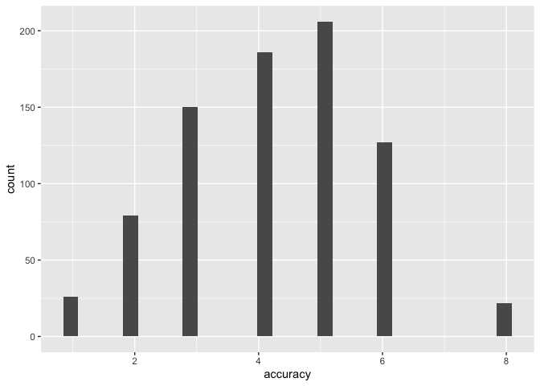
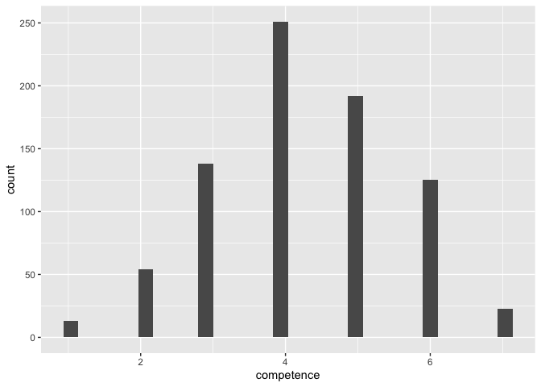
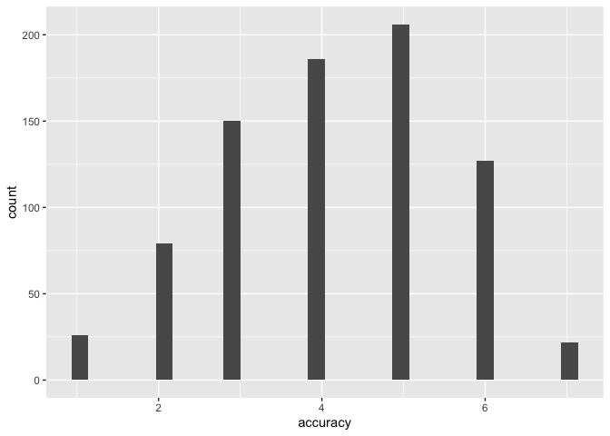

```r
library(tidyverse)     # create plots with ggplot, manipulate data, etc.
library(broom.mixed)   # convert regression models into nice tables
library(modelsummary)  # combine multiple regression models into a single table
library(lme4)          # model specification / estimation 
library(lmerTest)      # provides p-values in the output
library(ggpubr)        # stile feature of ggplot
library(gghalves)      # do special plots in ggplot
library(kableExtra)    # for tables
```

## Import data

```r
d <- read_csv("./data/qualtrics.csv")
```

```
## Rows: 201 Columns: 57
## ── Column specification ────────────────────────────────────────────────────────
## Delimiter: ","
## chr (57): StartDate, EndDate, Status, IPAddress, Progress, Duration (in seco...
## 
## ℹ Use `spec()` to retrieve the full column specification for this data.
## ℹ Specify the column types or set `show_col_types = FALSE` to quiet this message.
```

```r
head(d)
```

```
## # A tibble: 6 × 57
##   StartDate    EndDate Status IPAddress Progress Duration (in seconds…¹ Finished
##   <chr>        <chr>   <chr>  <chr>     <chr>    <chr>                  <chr>   
## 1 "Start Date" "End D… "Resp… "IP Addr… "Progre… "Duration (in seconds… "Finish…
## 2 "{\"ImportI… "{\"Im… "{\"I… "{\"Impo… "{\"Imp… "{\"ImportId\":\"dura… "{\"Imp…
## 3 "2022-05-19… "2022-… "0"    "146.199… "100"    "167"                  "1"     
## 4 "2022-05-19… "2022-… "0"    "92.236.… "100"    "168"                  "1"     
## 5 "2022-05-19… "2022-… "0"    "188.28.… "100"    "180"                  "1"     
## 6 "2022-05-19… "2022-… "0"    "94.13.6… "100"    "174"                  "1"     
## # ℹ abbreviated name: ¹​`Duration (in seconds)`
## # ℹ 50 more variables: RecordedDate <chr>, ResponseId <chr>,
## #   RecipientLastName <chr>, RecipientFirstName <chr>, RecipientEmail <chr>,
## #   ExternalReference <chr>, LocationLatitude <chr>, LocationLongitude <chr>,
## #   DistributionChannel <chr>, UserLanguage <chr>, consent <chr>,
## #   attention <chr>, indep_conv_acc_a_I <chr>, indep_conv_comp_a_I <chr>,
## #   indep_conv_acc_b_I <chr>, indep_conv_comp_b_I <chr>, …
```

```r
# delete first two rows
d <- d[3:201,]
```

## Attention check

```r
# attention check
# to see different answers given (i.e.levels), transform into factor
d$attention <- as.factor(d$attention)
# check levels to see different answer types
levels(d$attention) 
```

```
## [1] "I pat attention"  "I pay atention"   "i pay attention"  "I pay attention" 
## [5] "I Pay attention"  "I pay attention."
```

All levels are some variation of "I pay attention", so we do not exclude any participants. 

## Re-shape data

```r
d <- d %>% 
  # build an easy-to-read ID variable for subjects
  mutate(ID = as.factor(1:nrow(.))) %>% 
  # order data by subjects
  arrange(ID) %>% 
  # from wide to long format
  gather(item, score, indep_conv_acc_a_I:confl_div_comp_b_II,
               factor_key=TRUE) %>% 
  # seperate variables 
  separate(item, into = c("independence", "convergence", "dependent_variable", 
                          "stimulus_variant", "sample"), 
           convert = T, sep = "\\_")  %>% 
  # remove NA's
  filter(!is.na(score)) %>% 
  # make sure data is still ordered by participants
  arrange(ID) %>%
  # now for each subject, each condition and each variant the three DVs
  # can be assigned
  pivot_wider(names_from = dependent_variable, values_from = score) %>% 
  # so far, all variables are coded characters (see e.g. str(d))
  # we want our dependent variables to be numeric
  mutate(competence = as.numeric(comp), 
         accuracy = as.numeric(acc))
```

## Re-code some values


```r
# competence
ggplot(d, aes(x = competence)) +
  geom_histogram()# seems like 7s have been coded as 8s
```

```
## `stat_bin()` using `bins = 30`. Pick better value with `binwidth`.
```

<!-- -->

```r
# accuracy
ggplot(d, aes(x = accuracy)) +
  geom_histogram()# same, 7s have been coded as 8s
```

```
## `stat_bin()` using `bins = 30`. Pick better value with `binwidth`.
```

<!-- -->
For the two Likert scale measures (`confidence` and `accuracy`) the maximum of the scale has been coded as `8` instead of `7`. 


```r
d <- d %>% 
  mutate(competence = ifelse(competence == 8, 7, competence), 
         accuracy = ifelse(accuracy ==8, 7, accuracy))

# check again
ggplot(d, aes(x = competence)) +
  geom_histogram()# looks good
```

```
## `stat_bin()` using `bins = 30`. Pick better value with `binwidth`.
```

<!-- -->

```r
ggplot(d, aes(x = accuracy)) +
  geom_histogram()# looks good
```

```
## `stat_bin()` using `bins = 30`. Pick better value with `binwidth`.
```

<!-- -->

## Recode factors

Lastly, we recode the `convergence` variable. For now, the baseline category is _convergence_, which will yield a negative estimate for the effect of _no convergence_. We want to have the positive effect of _convergence_ instead. Likewise, we recode the levels of the `independence` variable to make sure the effect goes into the right direction (i.e. the effec of _independence_ compared to _conflict of interest_).


```r
d <- d %>%
  mutate(convergence = as.factor(convergence),
         convergence = fct_relevel(convergence, "div", "conv"),
         independence = as.factor(independence),
         independence = fct_relevel(independence, "confl", "indep")
         )
```

## Export data


```r
write_csv(d, "data/cleaned.csv")
```
