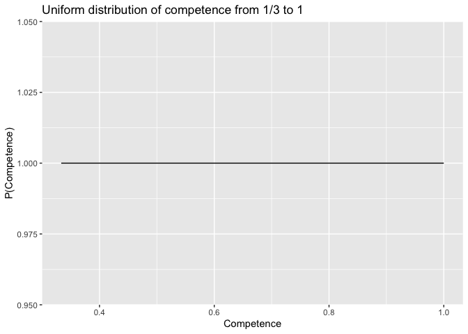
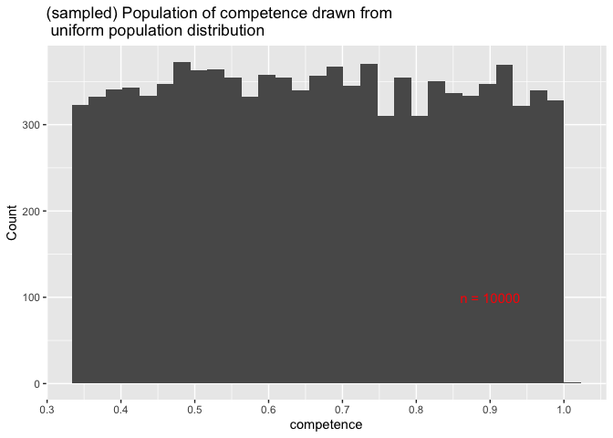
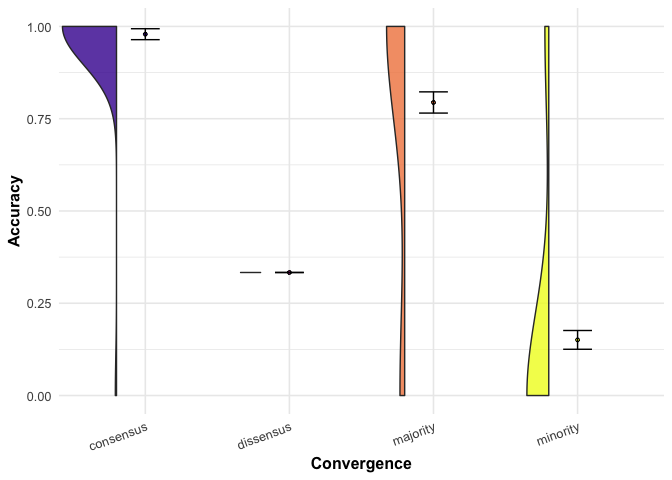
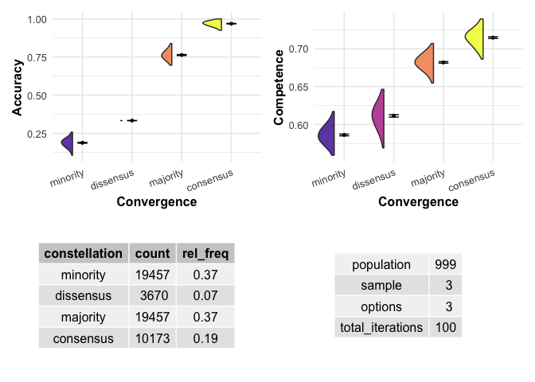
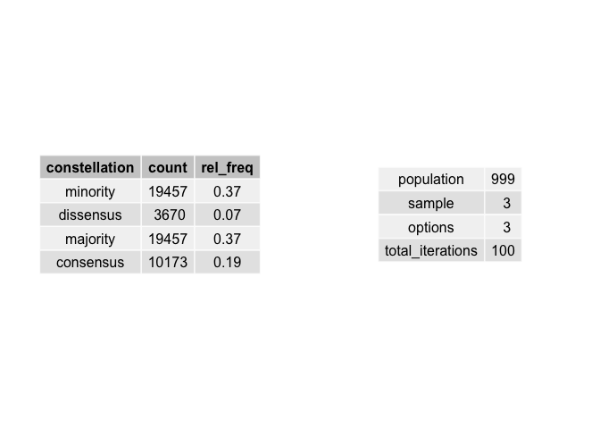
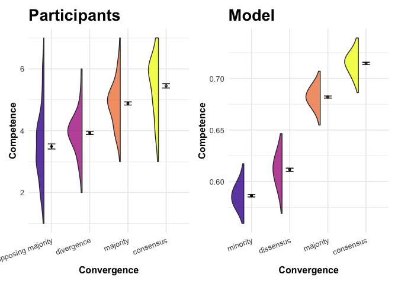
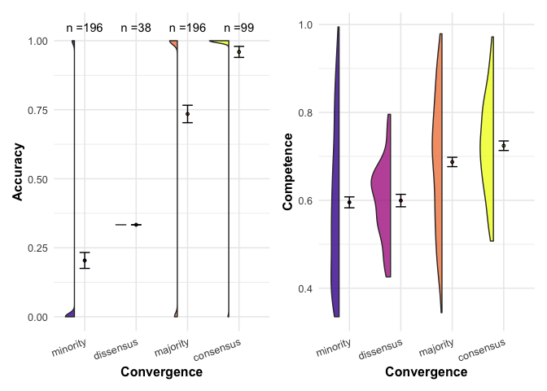

## Load packages

```r
library(tidyverse)
```

```
## ── Attaching core tidyverse packages ──────────────────────── tidyverse 2.0.0 ──
## ✔ dplyr     1.1.1     ✔ readr     2.1.4
## ✔ forcats   1.0.0     ✔ stringr   1.5.0
## ✔ ggplot2   3.4.2     ✔ tibble    3.2.1
## ✔ lubridate 1.9.2     ✔ tidyr     1.3.0
## ✔ purrr     1.0.1     
## ── Conflicts ────────────────────────────────────────── tidyverse_conflicts() ──
## ✖ dplyr::filter() masks stats::filter()
## ✖ dplyr::lag()    masks stats::lag()
## ℹ Use the conflicted package (<http://conflicted.r-lib.org/>) to force all conflicts to become errors
```

```r
library(gghalves) # for plots
library(patchwork)
```

## Set plot theme

```r
#set general theme for plots
plot_theme <- theme_minimal(base_size = 12) +
  theme(# Bold, bigger title
        plot.title = element_text(face = "bold", size = rel(1.7)),
        # Plain, slightly bigger subtitle that is grey
        plot.subtitle = element_text(face = "plain", size = rel(1.3), color = "grey70"),
        # Bold legend titles
        legend.title = element_text(face = "bold"),
        # Bold axis titles
        axis.title = element_text(face = "bold"))
```

## Explaining the model

### Define competence and its distribution 

We define competence simply as the probability of making an accurate choice (among various options). We assume that individuals (i) vary in competence,(ii) that competence is continuous and ranges from pure chance (`1/options`) to certainly making the correct choice (`1`), and that it is distributed uniformly in the population. 


```r
# Imagine a situation with 3 choice options
options <- 3
# generate a uniform competence distribution for a population of n = 10'000
population <- 10000
competence = runif(population, min = 1/options, max = 1)

# data generating function
ggplot() +
  stat_function(fun = dunif, args = list(min = 0, max = 1)) +
  labs(title = "Uniform distribution of competence from 1/3 to 1", x = "Competence", y = "P(Competence)") + 
  xlim(1/3, 1)
```

<!-- -->

```r
# generated population
ggplot() +
  geom_histogram(aes(x = competence)) + 
  scale_x_continuous(breaks = seq(from = 0, to = 1, by = 0.1)) + 
  annotate("text", x = 0.9, y = 100, label = paste0("n = ", population), color = "red") +
  labs(title = "(sampled) Population of competence drawn from \n uniform population distribution", 
       y = "Count")
```

```
## `stat_bin()` using `bins = 30`. Pick better value with `binwidth`.
```

<!-- -->
### Generate choices from competence

### Sample choice

### Iterate this process

## Function for single population


```r
simulate_single_population <- function(population, sample, options) {
  
  # randomly draw competence levels
  data <- tibble(id = 1:population,
                 competence = runif(population, min = 1/options, max = 1))
  
  # randomly draw individual answers based on competence levels 
  data$answer <- data$competence %>% 
    purrr::map_chr(function(x){ 
      
      answer_options <- c("correct", paste0("false", 1:(options-1)))
      probabilities <- c(x, rep((1-x)/(options-1), options-1))
      
      answer = sample(answer_options, 
                      size = 1, 
                      prob = probabilities
      )
      return(answer)
      
    }) 
  
  # randomly assign samples in population
  data <- data %>% mutate(sample_id = rep(1:(population/sample), sample))
  
  # identify constellations 
  data <- data %>% 
    # identify how often a one type of answer occurs in one group
    group_by(sample_id, answer) %>% 
  mutate(n_answer_in_sample = n()) %>% 
    # assign constellations
  group_by(sample_id) %>% 
    mutate(unique_answers = n_distinct(answer),
           # Build a first version of constellation variable
           constellation = case_when(unique_answers == sample ~ "dissensus", 
                                     unique_answers == 1 ~ "consensus",
                                     unique_answers <  sample ~ "majority"
           ),
           # identify minority answers in majority constellations
           minority = ifelse(constellation == "majority", 
                             # report whether occurences of answer within a group
                             # are the minority within that group
                             n_answer_in_sample == min(n_answer_in_sample),
                             # for all other constellations, simply code NA,
                             NA
           ), 
           # identify majority answers in majority constellations
           majority = ifelse(constellation == "majority", 
                             # report whether occurrences of answer within a group
                             # are the minority within that group
                             n_answer_in_sample == max(n_answer_in_sample),
                             # for all other constellations, simply code NA,
                             NA
           ), 
           # modify the constellation variable to distinguish between minority, 
           # intermediate majority, majority and dissensus that is composed of 
           # multiple answers (e.g. 3 options, sample of 6, two per option)
           constellation = case_when(
             is.na(minority) | is.na(majority) ~ constellation, 
             minority == TRUE & majority == TRUE ~ "dissensus",
             minority == TRUE ~ "minority", 
             majority == TRUE ~ "majority", 
             .default = "intermediate majority")
           ) %>% ungroup()
  
  # identify accurate responses
  data <- data %>%
    mutate(accurate = ifelse(answer == "correct", TRUE, FALSE))
  
  # compute the summary statistics by constellation
  results <- data %>% 
    group_by(constellation) %>% 
    summarize(average_competence = mean(competence), 
              average_accuracy = mean(accurate),
              count = n_distinct(sample_id)) %>% 
    # store simulation information
    mutate(population = population, 
           sample = sample, 
           options = options)
  
  return(results)
}
```


```r
# # test output (set return to data above)
# test <- simulate_single_population(population = 600, sample = 6, options = 3) %>% arrange(sample_id)
# levels(as.factor(test$constellation))
# 
# test %>% filter(constellation == "intermediate majority")
```

## Function for various populations

```r
simulate_various_populations <- function(iterations,...) {
  
  # create data frame with model results for generated samples
  various_populations <- 1:iterations %>% 
    purrr::map_df(function(x){
      # this is essentially a for loop - do the following for each 
      # element in 1:iterations
      
      results <- simulate_single_population(...)
      
      # identify iteration
      results$iteration <- x
      
      # To keep track of progress
      if (x %% 50 == 0) {print(paste("iteration number ", x))}
      
      return(results)
      
    }) %>% 
    # store simulation information
    mutate(total_iterations = iterations)
  
  return(various_populations)
}
```

## Plot function

```r
plot_results <- function(data, outcome = "everything") {
  
  d <- data
  
  # make constellation a factor with the right levels
  d$constellation <- fct_relevel(d$constellation, "minority", "dissensus", "intermediate majority", "majority", "consensus")
  
  # extract simulation info
  simulation_info <- d %>% summarize(across(c(population, sample, options, total_iterations), mean)) %>% 
    pivot_longer(everything(), names_to = "parameter", values_to = "value") %>% 
    gridExtra::tableGrob(cols = NULL, rows = NULL)
  
  # make descriptive data
  descriptive <- d %>% 
    group_by(constellation) %>% 
    summarise(count = sum(count)) %>% 
    mutate(rel_freq = round(count / sum(count), digits = 2)) %>% 
    gridExtra::tableGrob(rows = NULL)

  
  # plot for accuracy
  plot_accuracy <- ggplot(d,
                          aes(x = constellation, y = average_accuracy, fill = constellation)) +
    geom_half_violin(position = position_nudge(x = -.2),
                     adjust=2, alpha = .8,
                     side = "l") +
    stat_summary(fun = "mean", geom = "point", size = 1, shape = 21) +
    stat_summary(fun = "mean", geom = "line", size = 1, linetype = "dashed") +
    stat_summary(fun.data = "mean_se", geom = "errorbar", width = .2) +
    # Add nice labels
    labs(x = "Convergence", y = "Accuracy") +
    scale_fill_viridis_d(option = "plasma", begin = 0.1) +
    guides(fill = FALSE) +
    plot_theme + 
    theme(axis.text.x = element_text(angle = 20, hjust = 1)) 
  
  # plot for competence
  plot_competence <- ggplot(d,
                            aes(x = constellation, y = average_competence, fill = constellation)) +
    geom_half_violin(position = position_nudge(x = -.2),
                     adjust=2, alpha = .8,
                     side = "l") +
    stat_summary(fun = "mean", geom = "point", size = 1, shape = 21) +
    stat_summary(fun = "mean", geom = "line", size = 1, linetype = "dashed") +
    stat_summary(fun.data = "mean_se", geom = "errorbar", width = .2) +
    # Add nice labels
    labs(x = "Convergence", y = "Competence") +
    scale_fill_viridis_d(option = "plasma", begin = 0.1) +
    guides(fill = FALSE) +
    plot_theme + 
    theme(axis.text.x = element_text(angle = 20, hjust = 1))
  
  # unite tables
  tables <- gridExtra::grid.arrange(descriptive, simulation_info, ncol = 2)
  
  if (outcome == "everything") {
    
    return((plot_accuracy | plot_competence) / tables)
  }
  
  if (outcome == "accuracy") {
    
    return(plot_accuracy)
  }
  
  if (outcome == "competence") {
    
    return(plot_competence)
  }
  
}
```

## Simulate

Note that in the current state, we cannot vary `sample`. The function needs modification first. The problem is that it gets complicated with more than three informants, in the case of a majority constellation. There might be equal majorities (e.g. 5 informants, three options: 2 agree on 'A', 2 on 'B', one picks 'A'), equal minorities (e.g. 3 agree on 'A', one picks 'B', another picks 'C'), and unequal majorities (e.g. 3 agree on 'A', 2 agree on 'B').

I have to think about it again.


```r
data_3 <- simulate_various_populations(iterations = 100, population = 999, sample = 3, options = 3)
```

```
## [1] "iteration number  50"
## [1] "iteration number  100"
```


```r
plot_results(data_3)
```

```
## Warning: 1 unknown level in `f`: intermediate majority
```

```
## Warning: Using `size` aesthetic for lines was deprecated in ggplot2 3.4.0.
## ℹ Please use `linewidth` instead.
## This warning is displayed once every 8 hours.
## Call `lifecycle::last_lifecycle_warnings()` to see where this warning was
## generated.
```

```
## Warning: The `<scale>` argument of `guides()` cannot be `FALSE`. Use "none" instead as
## of ggplot2 3.3.4.
## This warning is displayed once every 8 hours.
## Call `lifecycle::last_lifecycle_warnings()` to see where this warning was
## generated.
```

<!-- -->

```
## `geom_line()`: Each group consists of only one observation.
## ℹ Do you need to adjust the group aesthetic?
## `geom_line()`: Each group consists of only one observation.
## ℹ Do you need to adjust the group aesthetic?
```

<!-- -->

```r
model_accuracy <- plot_results(data_3, outcome = "accuracy")
```

```
## Warning: 1 unknown level in `f`: intermediate majority
```

<!-- -->

```r
model_competence <- plot_results(data_3, outcome = "competence")
```

```
## Warning: 1 unknown level in `f`: intermediate majority
```

<!-- -->


```r
# # example to check essential parts of the function
# my_strings <- c("apple", "banana", "apple", "banana", "apple")
# 
# bla <- tibble(id = rep(1:5, each = 5), 
#        string = sample(c("apple", "banana"), 25, replace = TRUE, 
#                        prob = c(0.8, 0.2)))
# 
# bla %>% group_by(id, string) %>% 
#   mutate(n_answer_in_group = n()) %>% 
#   group_by(id) %>% 
#   mutate(
#     unique_answers = n_distinct(string),
#     minority = ifelse(id == 4, 
#                       n_answer_in_group == min(n_answer_in_group), 
#                       NA
#                       )
#     ) %>% arrange(id) 
```

## Combine with plots from paper

### Make plots from data

```r
# read data
d <- read_csv("./data/cleaned.csv")

# make a categorical variable from `convergence`
d <- d %>% 
  mutate(convergence_categorical = recode_factor(convergence, 
                                                 `0` = "opposing majority", 
                                                 `1` = "divergence", 
                                                 `2` = "majority", 
                                                 `3` = "consensus",
                                                 .default = NA_character_)
         )
```


```r
# plot for accuracy
plot_accuracy <- ggplot(d,
       aes(x = convergence_categorical, y = accuracy, fill = convergence_categorical)) +
  geom_half_violin(position = position_nudge(x = -.2),
                   adjust=2, alpha = .8,
                   side = "l") +
  stat_summary(fun = "mean", geom = "point", size = 1, shape = 21) +
  stat_summary(fun = "mean", geom = "line", size = 1, linetype = "dashed") +
  stat_summary(fun.data = "mean_se", geom = "errorbar", width = .2) +
  # Add nice labels
  labs(x = "Convergence", y = "Accuracy") +
  scale_fill_viridis_d(option = "plasma", begin = 0.1) +
  guides(fill = FALSE) +
  plot_theme + 
  theme(axis.text.x = element_text(angle = 20, hjust = 1))
```


```r
# plot for competence
plot_competence <- ggplot(d,
       aes(x = convergence_categorical, y = competence, fill = convergence_categorical)) +
  geom_half_violin(position = position_nudge(x = -.2),
                   adjust=2, alpha = .8,
                   side = "l") +
  stat_summary(fun = "mean", geom = "point", size = 1, shape = 21) +
  stat_summary(fun = "mean", geom = "line", size = 1, linetype = "dashed") +
  stat_summary(fun.data = "mean_se", geom = "errorbar", width = .2) +
  # Add nice labels
  labs(x = "Convergence", y = "Competence") +
  scale_fill_viridis_d(option = "plasma", begin = 0.1) +
  guides(fill = FALSE) +
  plot_theme + 
  theme(axis.text.x = element_text(angle = 20, hjust = 1))
```

### combine plots from data and from model


```r
# accuracy
plot_accuracy <- plot_accuracy + ggtitle("Participants")
model_accuracy<- model_accuracy + ggtitle("Model")

plot_accuracy + model_accuracy
```

```
## `geom_line()`: Each group consists of only one observation.
## ℹ Do you need to adjust the group aesthetic?
## `geom_line()`: Each group consists of only one observation.
## ℹ Do you need to adjust the group aesthetic?
```

<!-- -->


```r
# competence
plot_competence <- plot_competence + ggtitle("Participants")
model_competence<- model_competence + ggtitle("Model")

plot_competence + model_competence
```

```
## `geom_line()`: Each group consists of only one observation.
## ℹ Do you need to adjust the group aesthetic?
## `geom_line()`: Each group consists of only one observation.
## ℹ Do you need to adjust the group aesthetic?
```

<!-- -->

## Have only one population. 


```r
simulate_single_population <- function(population, sample, options) {
  
  # randomly draw competence levels
  data <- tibble(id = 1:population,
                 competence = runif(population, min = 1/options, max = 1))
  
  # randomly draw individual answers based on competence levels 
  data$answer <- data$competence %>% 
    purrr::map_chr(function(x){ 
      
      answer_options <- c("correct", paste0("false", 1:(options-1)))
      probabilities <- c(x, rep((1-x)/(options-1), options-1))
      
      answer = sample(answer_options, 
                      size = 1, 
                      prob = probabilities
      )
      return(answer)
      
    }) 
  
  # randomly assign samples in population
  data <- data %>% mutate(sample_id = rep(1:(population/sample), sample))
  
  # identify constellations 
  data <- data %>% 
    # identify how often a one type of answer occurs in one group
    group_by(sample_id, answer) %>% 
  mutate(n_answer_in_sample = n()) %>% 
    # assign constellations
  group_by(sample_id) %>% 
    mutate(unique_answers = n_distinct(answer),
           # Build a first version of constellation variable
           constellation = case_when(unique_answers == sample ~ "dissensus", 
                                     unique_answers == 1 ~ "consensus",
                                     unique_answers <  sample ~ "majority"
           ),
           # identify minority answers in majority constellations
           minority = ifelse(constellation == "majority", 
                             # report whether occurences of answer within a group
                             # are the minority within that group
                             n_answer_in_sample == min(n_answer_in_sample),
                             # for all other constellations, simply code NA,
                             NA
           ), 
           # identify majority answers in majority constellations
           majority = ifelse(constellation == "majority", 
                             # report whether occurrences of answer within a group
                             # are the minority within that group
                             n_answer_in_sample == max(n_answer_in_sample),
                             # for all other constellations, simply code NA,
                             NA
           ), 
           # modify the constellation variable to distinguish between minority, 
           # intermediate majority, majority and dissensus that is composed of 
           # multiple answers (e.g. 3 options, sample of 6, two per option)
           constellation = case_when(
             is.na(minority) | is.na(majority) ~ constellation, 
             minority == TRUE & majority == TRUE ~ "dissensus",
             minority == TRUE ~ "minority", 
             majority == TRUE ~ "majority", 
             .default = "intermediate majority")
           ) %>% ungroup()
  
  # identify accurate responses
  data <- data %>%
    mutate(accurate = ifelse(answer == "correct", TRUE, FALSE))
  
  # compute the summary statistics by constellation
  results <- data %>% 
    group_by(sample_id, constellation) %>% 
    summarize(average_competence = mean(competence), 
              average_accuracy = mean(accurate)) %>% 
    # store simulation information
    mutate(population = population, 
           sample = sample, 
           options = options) %>% 
  
  return(results)
}
```


```r
plot_results <- function(data) {
  
  d <- data
  # make constellation a factor with the right levels
  d$constellation <- fct_relevel(d$constellation, "minority", "dissensus", "intermediate majority", "majority", "consensus")
  
  # make count data
  counts <- d %>% group_by(constellation) %>% count()

  
  # plot for accuracy
  plot_accuracy <- ggplot(d,
                          aes(x = constellation, y = average_accuracy, fill = constellation)) +
    geom_half_violin(position = position_nudge(x = -.2),
                     adjust=0.1, alpha = .8,
                     side = "l") +
    stat_summary(fun = "mean", geom = "point", size = 1, shape = 21) +
    stat_summary(fun = "mean", geom = "line", size = 1, linetype = "dashed") +
    stat_summary(fun.data = "mean_se", geom = "errorbar", width = .2) +
    # Add nice labels
    labs(x = "Convergence", y = "Accuracy") +
    scale_fill_viridis_d(option = "plasma", begin = 0.1) +
    scale_color_viridis_d(option = "plasma", begin = 0.7) +
    guides(fill = FALSE, color = FALSE) +
    plot_theme + 
    theme(axis.text.x = element_text(angle = 20, hjust = 1)) +
    geom_text(data = counts, aes(x = constellation, y = 1.05, 
                                 label =  paste0("n =", n)
                                 )
              )  
  
  # plot for competence
  plot_competence <- ggplot(d,
                            aes(x = constellation, y = average_competence, fill = constellation)) +
    geom_half_violin(position = position_nudge(x = -.2),
                     adjust=1, alpha = .8,
                     side = "l") +
    stat_summary(fun = "mean", geom = "point", size = 1, shape = 21) +
    stat_summary(fun = "mean", geom = "line", size = 1, linetype = "dashed") +
    stat_summary(fun.data = "mean_se", geom = "errorbar", width = .2) +
    # Add nice labels
    labs(x = "Convergence", y = "Competence") +
    scale_fill_viridis_d(option = "plasma", begin = 0.1) +
    scale_color_viridis_d(option = "plasma", begin = 0.7) +
    guides(fill = FALSE) +
    plot_theme + 
    theme(axis.text.x = element_text(angle = 20, hjust = 1))
  
  
  (plot_accuracy | plot_competence)
}
```


```r
test <- simulate_single_population(population = 999, sample = 3, options = 3)
```

```
## `summarise()` has grouped output by 'sample_id'. You can override using the
## `.groups` argument.
```

```r
plot_results(test)
```

```
## Warning: 1 unknown level in `f`: intermediate majority
```

```
## `geom_line()`: Each group consists of only one observation.
## ℹ Do you need to adjust the group aesthetic?
## `geom_line()`: Each group consists of only one observation.
## ℹ Do you need to adjust the group aesthetic?
```

<!-- -->

