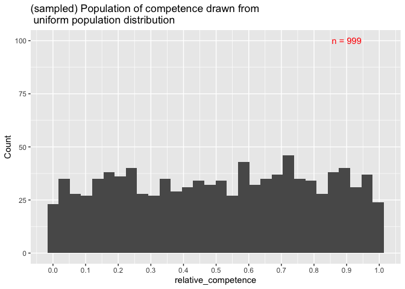
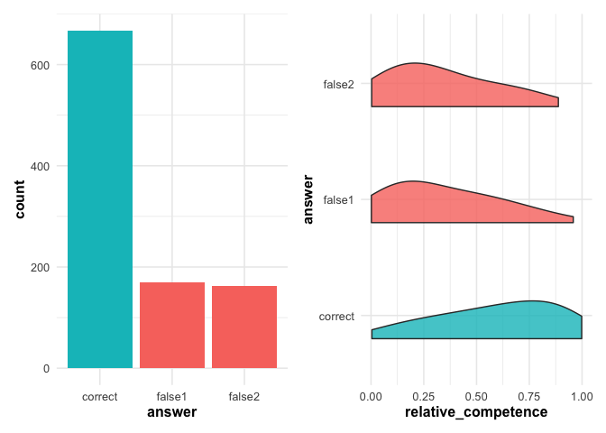
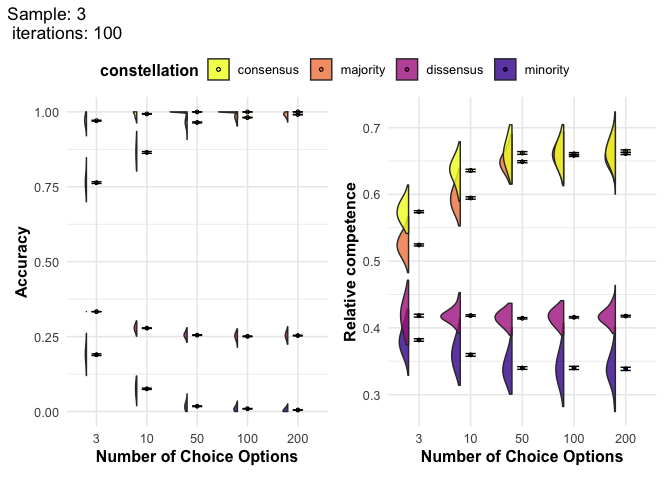
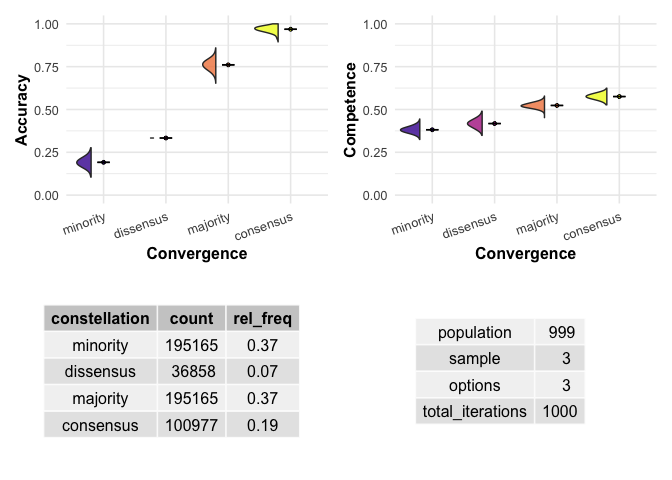
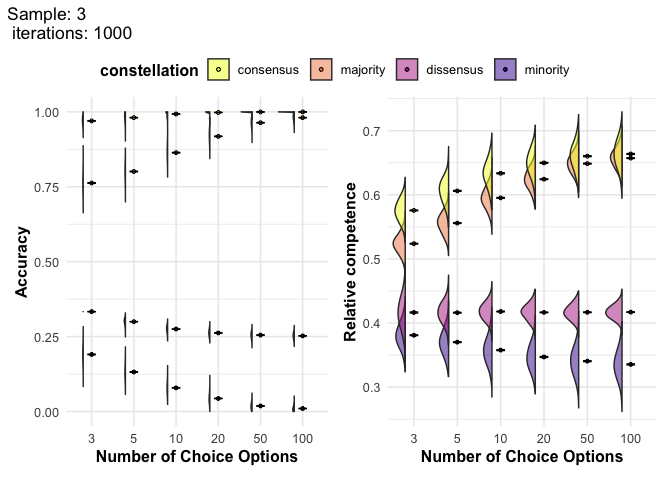
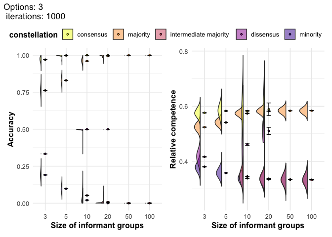
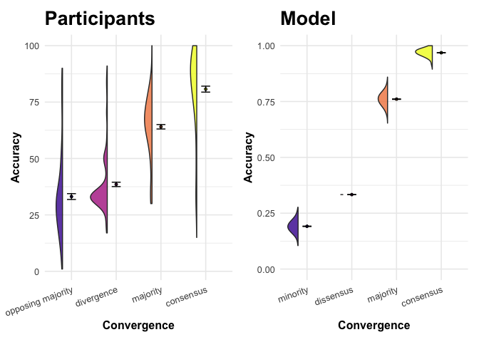
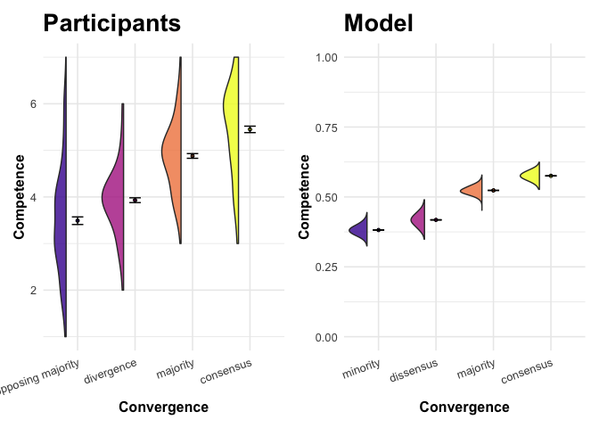

```r
# ensure this script returns the same results on each run
set.seed(7643)
```

## Explaining the model


```r
# Imagine a situation with 3 choice options
options <- 3
# and a population of n = 999
population <- 999
# and we observe samples of 3
sample <- 3
```


### Define competence and its distribution 

We define competence as the probability of making an accurate choice (among various options). Competence is continuous and ranges from `0` to `1`, where `0` corresponds to pure chance (`1/options`) and `1` corresponds to certainly making the correct choice. 

In our code this measure is called `relative_competence`, while `competence` designates the actual probability of making an accurate choice, ranging from `1/options` to `1`). For example, in a 3-choice-options scenario, an individual with a probability of 1/3 (`competence == 0.333`) to pick the right answer has `relative_competence == 0`. 

We assume that individuals (i) vary in competence and (ii) that competence that it is distributed uniformly in the population. 


```r
# 1: Distribution of competence
data <- data.frame(competence = runif(population, min = 1/options, max = 1))

# Create a relative measure of competence that allows to compare across
# different numbers of choice options. 
# This measure varies from 0 = random chance to 1 = definitely right. 
# We use min-max scaling, with min = 1/options and max = 1.
data <- data %>% 
  mutate(relative_competence = (competence - 1/options) / (1 - 1/options) )

# data generating function
ggplot() +
  stat_function(fun = dunif, args = list(min = 0, max = 1)) +
  labs(title = "Uniform distribution of competence from 0 to 1", x = "Competence", y = "P(Competence)") + 
  xlim(0, 1)
```

<!-- -->

```r
# generated population
ggplot(data, aes(x = relative_competence)) +
  geom_histogram() + 
  scale_x_continuous(breaks = seq(from = 0, to = 1, by = 0.1)) + 
  annotate("text", x = 0.9, y = 100, label = paste0("n = ", population), color = "red") +
  labs(title = "(sampled) Population of competence drawn from \n uniform population distribution", 
       y = "Count")
```

```
## `stat_bin()` using `bins = 30`. Pick better value with `binwidth`.
```

<!-- -->

### Generate a choice for each individual based on their competence. 


```r
# 2: Draw individual answers based on competence levels 
data$answer <- data$competence %>% 
  purrr::map_chr(function(x){ 
    
    answer_options <- c("correct", paste0("false", 1:(options-1)))
    probabilities <- c(x, rep((1-x)/(options-1), options-1))
    
    answer = sample(answer_options, 
                    size = 1, 
                    prob = probabilities
                    )
  }
  )

data <- data %>% 
  mutate(correct = ifelse(str_detect(answer, "correct"), 
                                        TRUE, FALSE))

answers <- ggplot(data, aes(x = answer, fill = correct)) +
  geom_bar() +
  guides(fill = "none") +
  plot_theme

competence_by_answers <- ggplot(data, 
       aes(x = answer, y = relative_competence, fill = correct)) +
geom_half_violin(position = position_nudge(x = -.2),
                     adjust=2, alpha = .8,
                     side = "r") +
  coord_flip() +
  guides(fill = "none") +
  plot_theme

answers + competence_by_answers
```

<!-- -->

### Draw samples, assign categories & compare average outcomes

### Randomly draw samples from the population


```r
# 3: randomly assign samples in population
data <- data %>% mutate(sample_id = rep(1:(population/sample), sample))
```

### Categorize constellations. 


```r
# 4: identify constellations 
data <- data %>% 
  # identify how often a one type of answer occurs in one group
  group_by(sample_id, answer) %>% 
  mutate(n_answer_in_sample = n()) %>% 
  # assign constellations
  group_by(sample_id) %>% 
  mutate(unique_answers = n_distinct(answer),
         # Build a first version of constellation variable
         constellation = case_when(unique_answers == sample ~ "dissensus", 
                                   unique_answers == 1 ~ "consensus",
                                   unique_answers <  sample ~ "majority"
         ),
         # identify minority answers in majority constellations
         minority = ifelse(constellation == "majority", 
                           # report whether occurences of answer within a group
                           # are the minority within that group
                           n_answer_in_sample == min(n_answer_in_sample),
                           # for all other constellations, simply code NA,
                           NA
         ), 
         # identify majority answers in majority constellations
         majority = ifelse(constellation == "majority", 
                           # report whether occurrences of answer within a group
                           # are the majority within that group
                           n_answer_in_sample == max(n_answer_in_sample),
                           # for all other constellations, simply code NA,
                           NA
         ), 
         # modify the constellation variable to distinguish between minority, 
         # intermediate majority, majority and dissensus that is composed of 
         # multiple answers (e.g. 3 options, sample of 6, two per option)
         constellation = case_when(
           is.na(minority) | is.na(majority) ~ constellation, 
           minority == TRUE & majority == TRUE ~ "dissensus",
           minority == TRUE ~ "minority", 
           majority == TRUE ~ "majority", 
           .default = "intermediate majority")
  ) %>% ungroup()
```

### Compute average accuracy/competence by constellation.


```r
# 5: calculate accuracy and competence levels per constellation

# identify accurate responses
data <- data %>%
  mutate(accurate = ifelse(answer == "correct", TRUE, FALSE))

# compute the summary statistics by constellation
results <- data %>% 
  group_by(constellation) %>% 
  summarize(average_competence = mean(competence), 
            average_relative_competence = mean(relative_competence),
            average_accuracy = mean(accurate)) %>% 
  # store simulation information
  mutate(population = population, 
         sample = sample, 
         options = options)
```


```r
ggplot(results,
       aes(x = constellation, y = average_accuracy, fill = constellation)) +
  geom_half_violin(position = position_nudge(x = -.2),
                   adjust=2, alpha = .8,
                   side = "l") +
  stat_summary(fun = "mean", geom = "point", size = 1, shape = 21) +
  stat_summary(fun = "mean", geom = "line", size = 1, linetype = "dashed") +
  stat_summary(fun.data = "mean_se", geom = "errorbar", width = .2) +
  # Add nice labels
  labs(x = "Convergence", y = "Accuracy") +
  scale_fill_viridis_d(option = "plasma", begin = 0.1) +
  guides(fill = "none") +
  plot_theme + 
  theme(axis.text.x = element_text(angle = 20, hjust = 1)) +
  ylim(c(0, 1))
```

```
## Warning: Using `size` aesthetic for lines was deprecated in ggplot2 3.4.0.
## ℹ Please use `linewidth` instead.
## This warning is displayed once every 8 hours.
## Call `lifecycle::last_lifecycle_warnings()` to see where this warning was
## generated.
```

```
## Warning: Groups with fewer than two data points have been dropped.
## Groups with fewer than two data points have been dropped.
## Groups with fewer than two data points have been dropped.
## Groups with fewer than two data points have been dropped.
```

```
## Warning in max(data$density): no non-missing arguments to max; returning -Inf
```

```
## Warning: Computation failed in `stat_half_ydensity()`
## Caused by error in `$<-.data.frame`:
## ! replacement has 1 row, data has 0
```

```
## `geom_line()`: Each group consists of only one observation.
## ℹ Do you need to adjust the group aesthetic?
```

<!-- -->

## Functions

### Data generating functions

#### Single population


#### Various populations


#### Vary choice options and sample size

This function allows us to investigate how accuracy and competence change with varying the number of choice options and the sample size. 

The simulations that this function executes will take quite some time. Therefore, we do not want to run it every time we render this document. Instead we want to store the output of the power simulation in a `.csv` file, and have an integrated "stop" mechanism to prevent execution when that file already exists. To achieve this, we make `file_name` a mandatory argument. If a file with that name already exists, the function will not be executed.


### Plot functions

#### a) Plot various populations

First, we want a function that plots results obtained by the `simulate_various_populations` function. 


#### b) Plot varying sample & options

Second, we want a function that plots results obtained by the `vary_sample_options` function. 


## Simulation

### Fixed sample and choice options

#### Generate data


```r
file_name <- "model_3_sample_3_options.csv" # change for new analyses / or delete file to re-use same name

if (!file.exists(paste0("data/", file_name))) { 
  
  # generate data
  data <- simulate_various_populations(iterations = 1000, population = 999, sample = 3, options = 3)
  
  write_csv(data, paste0("data/", file_name))
}

# read simulated data from .csv files
data_3 <- read_csv(paste0("data/", file_name))
```

```
## Rows: 4000 Columns: 10
## ── Column specification ────────────────────────────────────────────────────────
## Delimiter: ","
## chr (1): constellation
## dbl (9): average_competence, average_relative_competence, average_accuracy, ...
## 
## ℹ Use `spec()` to retrieve the full column specification for this data.
## ℹ Specify the column types or set `show_col_types = FALSE` to quiet this message.
```

```r
# descriptive
data_3 %>% group_by(constellation) %>% summarise(across(c(average_accuracy, average_competence), mean))
```

```
## # A tibble: 4 × 3
##   constellation average_accuracy average_competence
##   <chr>                    <dbl>              <dbl>
## 1 consensus                0.968              0.717
## 2 dissensus                0.333              0.612
## 3 majority                 0.761              0.682
## 4 minority                 0.191              0.588
```

#### Plot


```r
plot_results(data_3)
```

```
## Warning: 1 unknown level in `f`: intermediate majority
```

```
## Warning: The `<scale>` argument of `guides()` cannot be `FALSE`. Use "none" instead as
## of ggplot2 3.3.4.
## This warning is displayed once every 8 hours.
## Call `lifecycle::last_lifecycle_warnings()` to see where this warning was
## generated.
```

<!-- -->

```
## `geom_line()`: Each group consists of only one observation.
## ℹ Do you need to adjust the group aesthetic?
## `geom_line()`: Each group consists of only one observation.
## ℹ Do you need to adjust the group aesthetic?
```

<!-- -->

```r
plot_accuracy_model <- plot_results(data_3, outcome = "accuracy")
```

```
## Warning: 1 unknown level in `f`: intermediate majority
```

<!-- -->

```r
plot_competence_model <- plot_results(data_3, outcome = "competence")
```

```
## Warning: 1 unknown level in `f`: intermediate majority
```

<!-- -->

#### Analyze


### Varying sample and choice options

### Generate data


```r
n <- c(3, 5, 10, 20, 50, 100)

# run simulation and store results in .csv files
vary_sample_options(n = n, vary = "options", iterations = 1000, population = 999, sample = 3, file_name = "model_vary_options_3_sample.csv")
vary_sample_options(n = n, vary = "sample", iterations = 1000, population = 999, options = 3, file_name = "model_vary_sample_3_options.csv")

# read simulated data from .csv files
data_3_options <- read_csv("data/model_vary_options_3_sample.csv")
data_3_sample <- read_csv("data/model_vary_sample_3_options.csv")
```

### Plot


```
## Warning: 1 unknown level in `f`: intermediate majority
```

```
## `geom_line()`: Each group consists of only one observation.
## ℹ Do you need to adjust the group aesthetic?
## `geom_line()`: Each group consists of only one observation.
## ℹ Do you need to adjust the group aesthetic?
## `geom_line()`: Each group consists of only one observation.
## ℹ Do you need to adjust the group aesthetic?
```

<!-- -->

```
## `geom_line()`: Each group consists of only one observation.
## ℹ Do you need to adjust the group aesthetic?
## `geom_line()`: Each group consists of only one observation.
## ℹ Do you need to adjust the group aesthetic?
## `geom_line()`: Each group consists of only one observation.
## ℹ Do you need to adjust the group aesthetic?
```

<!-- -->

### Analyze


```
## `summarise()` has grouped output by 'iteration', 'constellation'. You can
## override using the `.groups` argument.
```

```
## 
## Call:
## lm(formula = average_relative_competence ~ convergence + options, 
##     data = regression_data)
## 
## Residuals:
##      Min       1Q   Median       3Q      Max 
## -0.60185 -0.16443 -0.01383  0.14799  0.68893 
## 
## Coefficients:
##             Estimate Std. Error t value Pr(>|t|)    
## (Intercept) 3.082050   0.004507  683.82   <2e-16 ***
## convergence 0.508880   0.002068  246.07   <2e-16 ***
## options10   0.161447   0.004624   34.91   <2e-16 ***
## ---
## Signif. codes:  0 '***' 0.001 '**' 0.01 '*' 0.05 '.' 0.1 ' ' 1
## 
## Residual standard error: 0.2068 on 7997 degrees of freedom
## Multiple R-squared:  0.8854,	Adjusted R-squared:  0.8853 
## F-statistic: 3.089e+04 on 2 and 7997 DF,  p-value: < 2.2e-16
```

## Compare model vs. participants


```r
# read data from experiments
d <- read_csv("./data/cleaned.csv")

# make a categorical variable from `convergence`
d <- d %>% 
  mutate(convergence_categorical = recode_factor(convergence, 
                                                 `0` = "opposing majority", 
                                                 `1` = "divergence", 
                                                 `2` = "majority", 
                                                 `3` = "consensus",
                                                 .default = NA_character_)
         )
```

### Table


<table style="NAborder-bottom: 0; width: auto !important; margin-left: auto; margin-right: auto;" class="table">
<caption>Participants vs. Model</caption>
 <thead>
<tr>
<th style="empty-cells: hide;border-bottom:hidden;" colspan="1"></th>
<th style="border-bottom:hidden;padding-bottom:0; padding-left:3px;padding-right:3px;text-align: center; " colspan="2"><div style="border-bottom: 1px solid #ddd; padding-bottom: 5px; ">Participants</div></th>
<th style="border-bottom:hidden;padding-bottom:0; padding-left:3px;padding-right:3px;text-align: center; " colspan="2"><div style="border-bottom: 1px solid #ddd; padding-bottom: 5px; ">Model</div></th>
</tr>
  <tr>
   <th style="text-align:left;">   </th>
   <th style="text-align:center;"> Accuracy </th>
   <th style="text-align:center;"> Competence </th>
   <th style="text-align:center;"> Accuracy  </th>
   <th style="text-align:center;"> Competence  </th>
  </tr>
 </thead>
<tbody>
  <tr>
   <td style="text-align:left;"> (Intercept) </td>
   <td style="text-align:center;"> 28.859*** </td>
   <td style="text-align:center;"> 3.413*** </td>
   <td style="text-align:center;"> 14.968*** </td>
   <td style="text-align:center;"> 3.229*** </td>
  </tr>
  <tr>
   <td style="text-align:left;">  </td>
   <td style="text-align:center;"> (1.702) </td>
   <td style="text-align:center;"> (0.098) </td>
   <td style="text-align:center;"> (0.167) </td>
   <td style="text-align:center;"> (0.004) </td>
  </tr>
  <tr>
   <td style="text-align:left;"> convergence </td>
   <td style="text-align:center;"> 16.838*** </td>
   <td style="text-align:center;"> 0.683*** </td>
   <td style="text-align:center;"> 27.584*** </td>
   <td style="text-align:center;"> 0.412*** </td>
  </tr>
  <tr>
   <td style="text-align:left;">  </td>
   <td style="text-align:center;"> (0.922) </td>
   <td style="text-align:center;"> (0.053) </td>
   <td style="text-align:center;"> (0.089) </td>
   <td style="text-align:center;"> (0.002) </td>
  </tr>
  <tr>
   <td style="text-align:left;"> SD (Intercept id) </td>
   <td style="text-align:center;"> 15.926 </td>
   <td style="text-align:center;"> 0.929 </td>
   <td style="text-align:center;">  </td>
   <td style="text-align:center;">  </td>
  </tr>
  <tr>
   <td style="text-align:left;"> SD (convergence id) </td>
   <td style="text-align:center;"> 8.640 </td>
   <td style="text-align:center;"> 0.497 </td>
   <td style="text-align:center;">  </td>
   <td style="text-align:center;">  </td>
  </tr>
  <tr>
   <td style="text-align:left;"> Cor (Intercept~convergence id) </td>
   <td style="text-align:center;"> −0.808 </td>
   <td style="text-align:center;"> −0.857 </td>
   <td style="text-align:center;">  </td>
   <td style="text-align:center;">  </td>
  </tr>
  <tr>
   <td style="text-align:left;box-shadow: 0px 1px"> SD (Observations) </td>
   <td style="text-align:center;box-shadow: 0px 1px"> 10.159 </td>
   <td style="text-align:center;box-shadow: 0px 1px"> 0.553 </td>
   <td style="text-align:center;box-shadow: 0px 1px">  </td>
   <td style="text-align:center;box-shadow: 0px 1px">  </td>
  </tr>
  <tr>
   <td style="text-align:left;"> Num.Obs. </td>
   <td style="text-align:center;"> 800 </td>
   <td style="text-align:center;"> 800 </td>
   <td style="text-align:center;"> 4000 </td>
   <td style="text-align:center;"> 4000 </td>
  </tr>
  <tr>
   <td style="text-align:left;"> R2 </td>
   <td style="text-align:center;">  </td>
   <td style="text-align:center;">  </td>
   <td style="text-align:center;"> 0.960 </td>
   <td style="text-align:center;"> 0.913 </td>
  </tr>
  <tr>
   <td style="text-align:left;"> R2 Adj. </td>
   <td style="text-align:center;">  </td>
   <td style="text-align:center;">  </td>
   <td style="text-align:center;"> 0.960 </td>
   <td style="text-align:center;"> 0.913 </td>
  </tr>
  <tr>
   <td style="text-align:left;"> R2 Marg. </td>
   <td style="text-align:center;"> 0.555 </td>
   <td style="text-align:center;"> 0.408 </td>
   <td style="text-align:center;">  </td>
   <td style="text-align:center;">  </td>
  </tr>
  <tr>
   <td style="text-align:left;"> R2 Cond. </td>
   <td style="text-align:center;"> 0.839 </td>
   <td style="text-align:center;"> 0.786 </td>
   <td style="text-align:center;">  </td>
   <td style="text-align:center;">  </td>
  </tr>
  <tr>
   <td style="text-align:left;"> AIC </td>
   <td style="text-align:center;"> 6402.6 </td>
   <td style="text-align:center;"> 1756.0 </td>
   <td style="text-align:center;"> 26077.8 </td>
   <td style="text-align:center;"> −4244.9 </td>
  </tr>
  <tr>
   <td style="text-align:left;"> BIC </td>
   <td style="text-align:center;"> 6430.7 </td>
   <td style="text-align:center;"> 1784.1 </td>
   <td style="text-align:center;"> 26096.7 </td>
   <td style="text-align:center;"> −4226.0 </td>
  </tr>
  <tr>
   <td style="text-align:left;"> ICC </td>
   <td style="text-align:center;"> 0.6 </td>
   <td style="text-align:center;"> 0.6 </td>
   <td style="text-align:center;">  </td>
   <td style="text-align:center;">  </td>
  </tr>
  <tr>
   <td style="text-align:left;"> Log.Lik. </td>
   <td style="text-align:center;">  </td>
   <td style="text-align:center;">  </td>
   <td style="text-align:center;"> −13035.914 </td>
   <td style="text-align:center;"> 2125.444 </td>
  </tr>
  <tr>
   <td style="text-align:left;"> F </td>
   <td style="text-align:center;">  </td>
   <td style="text-align:center;">  </td>
   <td style="text-align:center;"> 95903.683 </td>
   <td style="text-align:center;"> 41997.274 </td>
  </tr>
  <tr>
   <td style="text-align:left;"> RMSE </td>
   <td style="text-align:center;"> 8.98 </td>
   <td style="text-align:center;"> 0.49 </td>
   <td style="text-align:center;"> 6.30 </td>
   <td style="text-align:center;"> 0.14 </td>
  </tr>
</tbody>
<tfoot><tr><td style="padding: 0; " colspan="100%">
<sup></sup> + p &lt; 0.1, * p &lt; 0.05, ** p &lt; 0.01, *** p &lt; 0.001</td></tr></tfoot>
</table>

### Plots

#### Participant data


#### Combine participant and model


```
## `geom_line()`: Each group consists of only one observation.
## ℹ Do you need to adjust the group aesthetic?
## `geom_line()`: Each group consists of only one observation.
## ℹ Do you need to adjust the group aesthetic?
```

<!-- -->


```
## `geom_line()`: Each group consists of only one observation.
## ℹ Do you need to adjust the group aesthetic?
## `geom_line()`: Each group consists of only one observation.
## ℹ Do you need to adjust the group aesthetic?
```

<!-- -->


