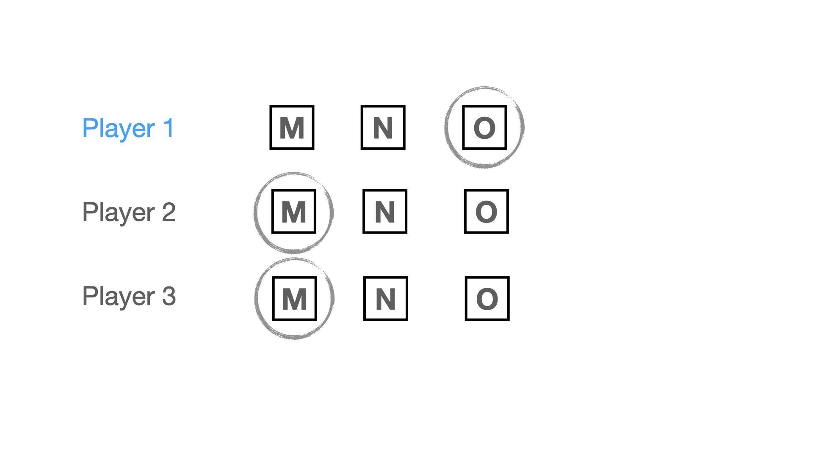
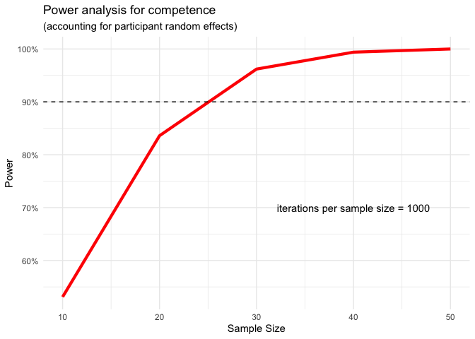

```{r setup, include=FALSE}
knitr::opts_chunk$set(warning = FALSE, message = FALSE, error = TRUE) 
```

```{r, include=FALSE}
# generate some random data with respective variables to ensure 
# using code snippets that work 
library(tidyverse)

# simulate data
data <- tibble(
  convergence = sample(0:3, replace = TRUE, size=100),
  accuracy = sample(0:100, replace = TRUE, size=100),
  competence = sample(1:7, replace = TRUE, size=100),
  id = rep(1:5, length.out = 100)
  ) 
```

# I. Introduction

In the three previous experiments, we have shown that people infer trustworthiness from convergence - the extent to which different informants agree. Greater convergence makes (i) an information to be perceived as more accurate and (ii) the informants as more competent - that is, given certain context.

Some aspects of that context we held constant; others we varied to evaluate how they alter the effect of convergence. We held constant that participants did not have any priors whatsoever - not on the information they received (they knew nothing about the games that were played) nor about the informants (the players who played the games). We manipulated informants' independence. We tested two cases of independence, by varying the baseline of what dependent meant: In experiment two, dependent informants had discussed "at great length" before making their estimates. In experiment three, dependent informants shared the same conflict of interest of making a certain estimate.

Our previous experiments tested inferences from convergence in a numerical choice setting: Participants saw (fictive) players' estimates that would lie with 1000 and 2000. In the numeric scenario, degree of convergence varied by the distance between estimates. In this fourth experiment, we test whether our results hold in a categorical choice setting. In the categorical scenario, convergence varies by the ratio of people agreeing on an option.

# II. Data collection

No data has been collected yet.

# III. Design

The experimental paradigm is very similar to the previous experiments, except for that, this time, instead of making a numeric estimate, the (fictive) players pick one out of several response options. There are always three players and three response options.

> **Introduction for participants:** *"To be able to understand the task, please read the following instructions carefully: Some people are playing games in which they have to select the correct answer among three answers. You will see the results of several of these games. Each game is different, with different solutions and involving different players. All players answer independently of each other. At first, you have no idea how competent each individual player is: they might be completely at chance, or be very good at the task. It's also possible that some players are really good while others are really bad. Some games might be difficult while others are easy. Your task will be to evaluate the performance of one of the players based on what everyone's answers are."*

Participants see the results of all players at once. They are then asked to judge one player's accuracy and competence. We will manipulate the factor convergence, i.e. the extent to which the other two players agree with player one.

```{r example-stimulus, echo=FALSE, fig.cap="An example of a stimulus for the majority condition"}
knitr::include_graphics("figures/example_stimulus.png")
```

**Convergence**. Convergence varies by the ratio of players choosing the same response as the focal player (i.e. the one that participants evaluate). The levels of convergence are: (i) consensus, where all three players pick the same option [`coded value = 3`]; (ii) majority, where either the third or second player picks the same option as the first player [`coded value = 2`]; (iii) dissensus, where all three players pick different options [`coded value = 1`]; (iv) majority against the focal player's estimate, where the second and third player pick the same option, but one that is different from the first player's choice [`coded value = 0`]. In our analysis, we treat convergence as a continuous variable, assigning the values in squared parenthesis. 

```{r, echo=FALSE}
# Create a matrix of image file paths as Markdown-formatted strings
image_paths <- data.frame(condition = c("opposing majority (0)", 
                                        "dissensus (1)", "majority (2)", 
                                        "consensus (3)"),
                          imgage_a = c("{ width=60% }", 
                        "{ width=60% }",
                        "{ width=60% }", 
                        "{ width=60% }"),
                        imgage_b = c("{ width=60% }", 
                        "{ width=60% }",
                        "{ width=60% }", 
                        "{ width=60% }"))

# Use kable() to create the table and print it as Markdown
kableExtra::kable(image_paths, format = "markdown",
                  col.names = c("Level", "Version a)", "Version b)"), 
                  align = "c",
                  caption = "All stimuli by levels of convergence")

```

We manipulate convergence within participants. All participants see all four conditions, with two stimuli (i.e. game results) per condition. Each participant therefore sees eight stimuli in total (4 convergence levels x 2 stimuli).

As outcome variables, we will measure people's perceived accuracy and competence of player one.

**Accuracy**. We ask participants "What do you think is the probability of player 1 being correct?". Participants answer with a slider from 0 to 100.

**Competence**. We ask participants "How competent do you think player 1 is in games like these?" Participants answer on a 7-point Likert scale (from "not competent at all" to "extremely competent").

# IV. Hypotheses

In line with our findings in numerical choice settings, we predict that:

### H1a: Participants perceive an estimate of an independent informant as more accurate the more it converges with the estimates of other informants.

We use a linear mixed effect model with random intercept and random slope per participant. Should this model yield convergence issues, we will use a model with random intercept only. 

In all our models we treat `convergence` as a continuous variable. We will, however, include robustness checks where we treat convergence as a categorical variable, allowing to inspect difference between different levels. 

```{r}
# models for accuracy
library(lme4)
# random intercept and slope by participants
model_accuracy <- lmer(accuracy ~ convergence + (1 + convergence | id), 
                                 data = data)

# in case of non-convergence: random intercept by participants only
alt_model_accuracy <- lmer(accuracy ~ convergence + (1 | id), data = data)
```


### H1b: Participants perceive an independent informant as more competent the more their estimate converges with the estimates of other informants.

We will proceed in the same way for `competence` as we did for `accuracy` above.

```{r}
# models for competence

# random intercept and slope by participants
model_competence <- lmer(competence ~ convergence + 
                           (1 + convergence | id), data = data)

# in case of non-convergence: random intercept by participants only
alt_model_competence <- lmer(competence ~ convergence + (1 | id), data = data)
```

# Robustness checks

In the models above, we treated convergence as a continuous variable. Based on the different levels, we will build a categorical variable, `convergence_categorical`. 

```{r}
# make a categorical variable from `convergence`
data <- data %>% 
  mutate(convergence_categorical = recode_factor(convergence, 
                                                 `0` = "opposing majority", 
                                                 `1` = "divergence", 
                                                 `2` = "majority", 
                                                 `3` = "consensus",
                                                 .default = NA_character_)
         )

levels(data$convergence_categorical)
  
```


We run the same models outlined in the hypotheses section, but replacing `convergence` with `convergence_categorical`. This also allows us to inspect heterogeniety in differences between levels (with respect to the baseline, i.e. "opposing majority"). 

# Exclusions

We will exclude participants failing (i.e. participants not answering the question or writing anything that does not at least resemble “I pay attention”) the following attention check:

> *Imagine you are playing video games with a friend and at some point your friend says: “I don’t want to play this game anymore! To make sure that you read the instructions, please write the three following words "I pay attention" in the box below. I really dislike this game, it's the most overrated game ever. Do you agree with your friend?”* 

# Power analysis

We ran a power simulation to inform our choice of sample size. All assumptions and details on the procedure can be found in the `power_Exp4.Rmd` document. We ran two different power analyses, one for each outcome variable. We set the power threshold for our experiment to 90%. 

The power simulation for `accuracy` suggested that even for as few as 10 participants (the minimum sample size we simulated data for), we would have a power of close to 100%. The simulation for `competence` suggested that we achieve statistical power of at least 90% with a sample size of `30`.

```{r accuracy-image, echo=FALSE, fig.cap="Results of power simulation for competence"}

```

However, due to uncertainty about our assumptions and because we are anticipating failed attention checks, we will recruit a sample of `100` participants. 

