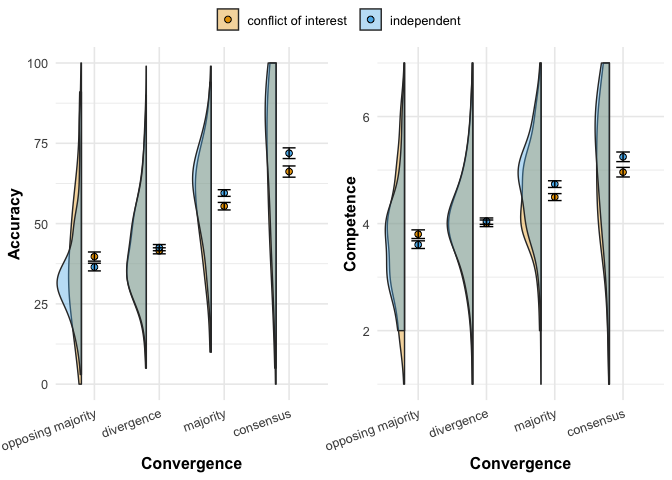

```r
library(tidyverse) # for everything
library(tidyr) # some additional, neat tidy reshaping functions
library(lme4) # for linear mixed models
library(lmerTest) # p-values for mixed models
library(broom) # for tidy outputs of regressions
library(broom.mixed) # for tidy outputs of linear mixed models
library(ggridges) # for plots
library(gghalves) # for plots
library(ggbeeswarm) # Special distribution-shaped point jittering
library(scales)  # for nice axis labels
library(modelsummary) # regression tables
library(patchwork) # combine plots
library(ggrepel) # fit labels in plots 
```

### Some themes and functions


### Read data

```r
# read data
d <- read_csv("./data/cleaned.csv")
```

### H1a: Participants perceive an estimate of an independent informant as more accurate the more it converges with the estimates of other informants.

To test this hypothesis, we only consider participants assigned to the `independent` condition.

We use a linear mixed effect model with random intercept and random slope per participant.

In all our models we treat `convergence` as a continuous variable. We will, however, include robustness checks where we treat convergence as a categorical variable. 


```r
# models for accuracy

# random intercept and slope by participants
model_accuracy_independent <- lmer(accuracy ~ convergence + (1 + convergence | id), 
                       data = d %>% filter(independence == "independent"))
```


### H1b: Participants perceive an independent informant as more competent the more their estimate converges with the estimates of other informants.

We will proceed in the same way for `competence` as we did for `accuracy` above.


```r
# models for competence

# random intercept and slope by participants
model_competence_independent <- lmer(competence ~ convergence + 
                           (1 + convergence | id), 
                         data = d %>% filter(independence == "independent"))
```

### H2a: The effect of convergence on accuracy (H1a) is more positive in a context where informants are independent compared to when they are biased (i.e. share a conflict of interest to pick a given answer). 

To test this hypothesis, we only consider the full data.

The resulting estimate of the interaction term will provide the test for our hypothesis. 


```r
# models for accuracy

# random intercept and slope by participants
model_accuracy <- lmer(accuracy ~ convergence + independence + 
                            independence*convergence + (1 + convergence | id), 
                       data = d)
```


### H2b: The effect of convergence on competence (H1b) is more positive in a context where informants are independent compared to when they are biased (i.e. share a conflict of interest to pick a given answer).

To test this hypothesis, we only consider the full data.

The resulting estimate of the interaction term will provide the test for our hypothesis. 


```r
# models for competence

# random intercept and slope by participants
model_competence <- lmer(competence ~ convergence + independence + 
                            independence*convergence + (1 + convergence | id), 
                       data = d)
```

Show all results
<table style="NAborder-bottom: 0; width: auto !important; margin-left: auto; margin-right: auto;" class="table">
 <thead>
  <tr>
   <th style="text-align:left;">   </th>
   <th style="text-align:center;"> Accuracy (independent only) </th>
   <th style="text-align:center;"> Competence (independent only) </th>
   <th style="text-align:center;"> Accuracy </th>
   <th style="text-align:center;"> Competence </th>
  </tr>
 </thead>
<tbody>
  <tr>
   <td style="text-align:left;"> (Intercept) </td>
   <td style="text-align:center;"> 34.094*** </td>
   <td style="text-align:center;"> 3.567*** </td>
   <td style="text-align:center;"> 36.723*** </td>
   <td style="text-align:center;"> 3.721*** </td>
  </tr>
  <tr>
   <td style="text-align:left;">  </td>
   <td style="text-align:center;"> (1.436) </td>
   <td style="text-align:center;"> (0.081) </td>
   <td style="text-align:center;"> (1.591) </td>
   <td style="text-align:center;"> (0.089) </td>
  </tr>
  <tr>
   <td style="text-align:left;"> convergence </td>
   <td style="text-align:center;"> 12.337*** </td>
   <td style="text-align:center;"> 0.562*** </td>
   <td style="text-align:center;"> 9.329*** </td>
   <td style="text-align:center;"> 0.397*** </td>
  </tr>
  <tr>
   <td style="text-align:left;">  </td>
   <td style="text-align:center;"> (0.995) </td>
   <td style="text-align:center;"> (0.052) </td>
   <td style="text-align:center;"> (1.063) </td>
   <td style="text-align:center;"> (0.054) </td>
  </tr>
  <tr>
   <td style="text-align:left;"> independenceindependent </td>
   <td style="text-align:center;">  </td>
   <td style="text-align:center;">  </td>
   <td style="text-align:center;"> −2.628 </td>
   <td style="text-align:center;"> −0.154 </td>
  </tr>
  <tr>
   <td style="text-align:left;">  </td>
   <td style="text-align:center;">  </td>
   <td style="text-align:center;">  </td>
   <td style="text-align:center;"> (2.262) </td>
   <td style="text-align:center;"> (0.127) </td>
  </tr>
  <tr>
   <td style="text-align:left;"> convergence × independenceindependent </td>
   <td style="text-align:center;">  </td>
   <td style="text-align:center;">  </td>
   <td style="text-align:center;"> 3.008* </td>
   <td style="text-align:center;"> 0.165* </td>
  </tr>
  <tr>
   <td style="text-align:left;">  </td>
   <td style="text-align:center;">  </td>
   <td style="text-align:center;">  </td>
   <td style="text-align:center;"> (1.512) </td>
   <td style="text-align:center;"> (0.076) </td>
  </tr>
  <tr>
   <td style="text-align:left;"> SD (Intercept id) </td>
   <td style="text-align:center;"> 12.590 </td>
   <td style="text-align:center;"> 0.712 </td>
   <td style="text-align:center;"> 14.468 </td>
   <td style="text-align:center;"> 0.809 </td>
  </tr>
  <tr>
   <td style="text-align:left;"> SD (convergence id) </td>
   <td style="text-align:center;"> 9.218 </td>
   <td style="text-align:center;"> 0.474 </td>
   <td style="text-align:center;"> 10.048 </td>
   <td style="text-align:center;"> 0.500 </td>
  </tr>
  <tr>
   <td style="text-align:left;"> Cor (Intercept~convergence id) </td>
   <td style="text-align:center;"> −0.783 </td>
   <td style="text-align:center;"> −0.682 </td>
   <td style="text-align:center;"> −0.799 </td>
   <td style="text-align:center;"> −0.712 </td>
  </tr>
  <tr>
   <td style="text-align:left;box-shadow: 0px 1px"> SD (Observations) </td>
   <td style="text-align:center;box-shadow: 0px 1px"> 11.423 </td>
   <td style="text-align:center;box-shadow: 0px 1px"> 0.651 </td>
   <td style="text-align:center;box-shadow: 0px 1px"> 11.511 </td>
   <td style="text-align:center;box-shadow: 0px 1px"> 0.650 </td>
  </tr>
  <tr>
   <td style="text-align:left;"> Num.Obs. </td>
   <td style="text-align:center;"> 792 </td>
   <td style="text-align:center;"> 792 </td>
   <td style="text-align:center;"> 1600 </td>
   <td style="text-align:center;"> 1600 </td>
  </tr>
  <tr>
   <td style="text-align:left;"> R2 Marg. </td>
   <td style="text-align:center;"> 0.378 </td>
   <td style="text-align:center;"> 0.278 </td>
   <td style="text-align:center;"> 0.302 </td>
   <td style="text-align:center;"> 0.214 </td>
  </tr>
  <tr>
   <td style="text-align:left;"> R2 Cond. </td>
   <td style="text-align:center;"> 0.741 </td>
   <td style="text-align:center;"> 0.701 </td>
   <td style="text-align:center;"> 0.733 </td>
   <td style="text-align:center;"> 0.695 </td>
  </tr>
  <tr>
   <td style="text-align:left;"> AIC </td>
   <td style="text-align:center;"> 6468.8 </td>
   <td style="text-align:center;"> 1950.4 </td>
   <td style="text-align:center;"> 13141.0 </td>
   <td style="text-align:center;"> 3971.2 </td>
  </tr>
  <tr>
   <td style="text-align:left;"> BIC </td>
   <td style="text-align:center;"> 6496.8 </td>
   <td style="text-align:center;"> 1978.4 </td>
   <td style="text-align:center;"> 13184.0 </td>
   <td style="text-align:center;"> 4014.2 </td>
  </tr>
  <tr>
   <td style="text-align:left;"> ICC </td>
   <td style="text-align:center;"> 0.6 </td>
   <td style="text-align:center;"> 0.6 </td>
   <td style="text-align:center;"> 0.6 </td>
   <td style="text-align:center;"> 0.6 </td>
  </tr>
  <tr>
   <td style="text-align:left;"> RMSE </td>
   <td style="text-align:center;"> 10.18 </td>
   <td style="text-align:center;"> 0.58 </td>
   <td style="text-align:center;"> 10.22 </td>
   <td style="text-align:center;"> 0.58 </td>
  </tr>
</tbody>
<tfoot><tr><td style="padding: 0; " colspan="100%">
<sup></sup> + p &lt; 0.1, * p &lt; 0.05, ** p &lt; 0.01, *** p &lt; 0.001</td></tr></tfoot>
</table>


# Robustness checks

In the models above, we treated convergence as a continuous variable. Based on the different levels, we will build a categorical variable, `convergence_categorical`. 


```
## [1] "opposing majority" "divergence"        "majority"         
## [4] "consensus"
```


We run the same models outlined in the hypotheses section, but replacing `convergence` with `convergence_categorical`. This also allows us to inspect heterogeniety in differences between levels (with respect to the baseline, i.e. "opposing majority"). 


### Plots

#### Independence Condition only


<!-- -->

#### Interaction


<!-- -->
