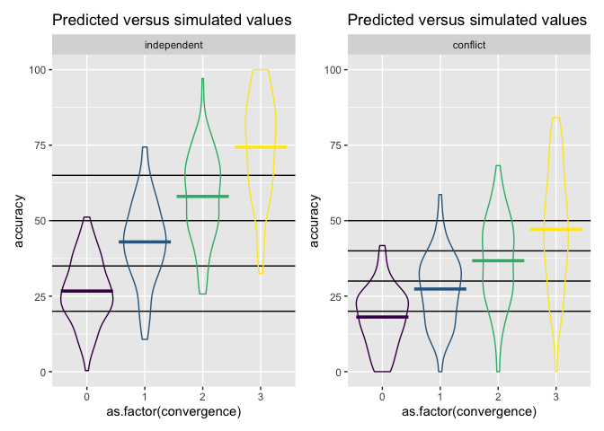
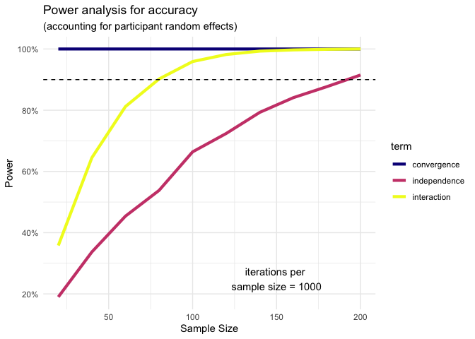

```r
# load required packages
library("lme4")        # model specification / estimation
library("lmerTest")    # get p-values for mixed models
library("broom.mixed") # extracting data from model fits 
library("tidyverse")   # data wrangling and visualisation
library("patchwork")    # combine plots

# ensure this script returns the same results on each run
set.seed(912783)
```

### Credit

The power simulation presented in this document draws heavily on @debruine2021. It is also inspired by @huntington-klein.

# Introduction

Statistical power is the probability by which we are able to detect an effect, assuming that it actually exists. The higher you set the benchmark for statistical power, the less likely you are to miss an effect in your sample.

The aim of a power analysis is find out how big a sample you need to achieve the statistical power you want. If there is an effect, more participants will make it more likely to detect it.

To give an overview of this power analysis, we will

1.  Make assumptions about the data generating process (i.e. a model and its parameters).
2.  "Draw" (i.e. simulate) a sample with a given sample size.
3.  Run the statistical analysis we plan to perform on that sample and store the estimates of the model.
4.  Calculate the power: Repeat steps two and three many times. See for how many samples the model recovers a statistically significant estimate for the parameter we set. Statistical power is just the ratio of significant samples among all samples we look at.
5.  Calculate power for different sample sizes: Repeat step four for various sample sizes. See at which sample size we achieve sufficiently high power.

# I. Building a power simulation function

## 1. Data generating process

### Variables

-   **Convergence**. We treat `convergence` as a continuous variable (0 = opposing majority; 1 = dissensus; 2 = majority; 3 = consensus).

- **Independence**. Binary variable indicating whether informants were `independent` or sharing a `conflict of interest`. 

-   **Accuracy**. We ask participants "What do you think is the probability of player [X] being correct?". Participants answer with a slider from 0 to 100.

-   **Competence**. We ask participants "How competent do you think player [X] is in games like these?" Participants answer on a 7-point Likert scale (from "not competent at all" to "extremely competent").

### Model

In our experiment, we manipulate two factors: 

- `convergence`, i.e. the extent to which several informants agree. We do so within subjects, meaning that each subject rates stimuli for all levels of convergence. Data points of the same subject are thus not independent. To account for that, in our simulation, we model subject differences with random effects.

- `independence`, i.e. whether informants were `independent` or sharing a `conflict of interest`. We do so between subjects, meaning that a participant saw scenarios of only of one of the two levels. 

The model we use to generate accuracy (and competence) is:

$$
\text{Accuracy} = (\beta_0 + b_{0, Subject}) + (\beta_c + b_{c, Subject}) \text{Convergence} + \beta_i \text{Independence} + \beta_{ci} \text{Independence*Convergence} + \epsilon
$$

with:

-   $b_{0, Subject} \sim N(0, \tau_0)$ (add footnot that this is not quite it yet, see below)
-   $b_{c, Subject} \sim N(0, \tau_c)$
-   $\epsilon \sim N(0, \sigma)$

where:

-   $\beta_0$ is the average intercept, i.e. average accuracy rating given that there is an opposing majority (`convergence = 0`)

-   $b_{0, Subject}$ is the subject-specific deviation from the average intercept

-   $\beta_c$ is the average effect of `convergence`, i.e. the average increase in `accuracy` caused by a one unit increase in `convergence`.

-   $b_{c, Subject}$ is the subject-specific deviation from the average convergence effect

-   $\beta_i$ is the average effect of `independence`, i.e. the average difference in `accuracy` between the level `independent` and the level `conflict of interest`.

-   $\beta_ci$ is the interaction effect between `independence` and `convergence`, i.e. the difference in the effect of `convergence` on `accuracy` between the level `independent` and the level `conflict of interest`.

-   $\epsilon$ is the error term that represents noise not accounted for by the random effects

-   $\sigma$ is the standard deviation of the normal distribution that of the error term.

-   $\tau_0)$ and $\tau_1)$ are the respective standard deviations of the normal distributions that model by-subject deviation from the average effects $\beta_0$ and $\beta_c$, respectively. We assume that the deviations of subjects are normally distributed around the average effects (hence a mean of `0`). Some subjects will have a positive deviation (i.e. larger values than the average); some will have a negative offset (i.e. smaller values than the average).

The modelling of $b_{0, Subject}$ and $b_{c, Subject}$ as described above was simplified. It assumed that both were gnerated from independent normal distributions. But in fact, we do not expect those distributions to be independent of each other. We expect a subject's intercept and effect convergence to be correlated. For example, a subject with a relatively *small intercept* (i.e. assigning very low accuracy when `convergence = 0`) might assign all the more accuracy with increasing convergence (i.e has a relatively *larger effect of convergence*). a larger effect of accuracy - case in which the distributions of both random effects are *negatively* correlated.

Instead of drawing to independent univariate distributions, we model two correlated distributions. We achieve this by modeling a bivariate normal distribution.

$$
\begin{bmatrix} b_{0, \text{Subject}} \\ b_{c, \text{Subject}} \end{bmatrix} \sim \text{N}\Bigg(\begin{bmatrix} 0 \\ 0 \end{bmatrix}, \begin{bmatrix} \tau_0^2 & \rho \tau_0 \tau_c \\ \rho \tau_0 \tau_c & \tau_c^2 \end{bmatrix}\Bigg)
$$ 

where

-   $\begin{bmatrix} \tau_0^2 & \rho \tau_0 \tau_c \\ \rho \tau_0 \tau_c & \tau_c^2 \end{bmatrix}$ is the variance-covariance matrix of the two distributions

-   $\rho$ is the correlation coefficient

### Parameters

We use the following prefixes to designate model parameters and sampled values:

-   `beta_*`: fixed effect parameters
-   `subj_*`: by-subject random effect parameters
-   `SU_*`: sampled values for by-subject random effects
-   `B_*`: sums of added beta's
-   `e_*`: residual sd

We use the following suffices:

-   `*_0`: intercept
-   `*_c`: convergence
-   `*_i`: independence
-   `*_ci`: convergence*independence

Other terms:

-   `*_rho`: correlation for subject's random effects
-   `n_*`: sample size
-   `sigma`: residual (error) sd

The parameters we set differ with regard to our outcome variables. Later when we do the actual simulation, we will set two different sets of parameters, one for `accuracy` and one for `competence`, respectively. The steps before we introduce functions serve demonstration purposes only, so we'll just focus on `accuracy`.

We set the parameters for convergence and the by-participant random effects based on experiment 4. 


```r
# parameters for modelling accuracy 
beta_0   <- 20 # intercept
beta_c   <- 10 # effect of convergence when conflict of interest
beta_i   <- 5 # effect of independence (compared to conflict of interest)
beta_ci  <- 5 # difference in effect of convergence when independence (compared to conflict of interest)
subj_0   <- 10 # by-subject random intercept sd
subj_c   <- 5 # by-subject random slope sd
subj_rho <- .2 # correlation between intercept and slope 
sigma    <- 5 # residual (error) sd (i.e. all varition that the model cannot account for)
```

We store a complete list of parameters in a list so that we can call them for functions later.


```r
# complete list of parameters (including some that will be introduced later)
parameters <- list(
  # outcome variable
  outcome = "accuracy", # takes names as input, e.g. "accuracy"
  # parameters for size of data frame
  n_subj = 10,              # n participants
  levels_convergence = 0:3,  # levels of convergence
  n_stimuli_per_level = 2, # n stimuli per participant
  # parameters for modelling outcome variable
  beta_0 = 40,   # intercept
  beta_c = 10,   # effect of convergence, 
  beta_i = 5,    # # effect of independence (compared to conflict of interest)
  beta_ci = 5, # difference in effect of convergence when independence (compared to conflict of interest)
  subj_0 = 10,   # by-subject random intercept sd
  subj_c = 5,   # by-subject random slope sd
  subj_rho = 0.5, # correlation between intercept and slope 
  sigma = 10     # residual (error) sd (i.e. all varition that the model cannot account for)
)
```

## 2. Simulate a single sample

### Stimuli

Each participant sees two stimuli per convergence level, i.e. `8` items in total.


```r
# set stimuli
levels_convergence <- c(0:3) 
n_stimuli_per_level  <-  2 
```

Simulate all stimuli a single participant sees.


```r
# create stimuli per participant data
stimuli <- data.frame(
  convergence = rep(levels_convergence, each = n_stimuli_per_level)
  )
```

### Subjects


```r
# set number of subjects and items
n_subj <- 100 # number of subjects we arbitrarily set for this example
```

When generating the subject data, we need to draw a pair of random effects (intercept + slope of convergence) for each participant. Earlier, we had defined the parameters for the bivariate normal distribution we draw from. We use the function `MASS::mvrnorm` to generate these draws. To be able to use this function, we define the variance-covariance matrix between the two by-subject random effects beforehand.


```r
# calculate random intercept / random slope covariance
covar <- subj_rho * subj_0 * subj_c

# put values into variance-covariance matrix
cov_mx  <- matrix(
  c(subj_0^2, covar,
    covar,   subj_c^2),
  nrow = 2, byrow = TRUE)

# generate the by-subject random effects
subject_rfx <- MASS::mvrnorm(n = n_subj,
                             mu = c(SU_0 = 0, SU_c = 0),
                             Sigma = cov_mx)

# make data 
subjects <- data.frame(
  # add a subject id
  id = seq_len(n_subj),
  # add by participant pair of random effects
  subject_rfx, 
  # add `independence` condition
  independence = rep(c("conflict", "independent"), length.out = n_subj)
  ) %>% 
  # make a numeric variable to be able to generate competence
  mutate(independence_num = ifelse(independence == "conflict", 0, 1))
```

Check how simulated values compare to the parameters we set earlier.


```r
data.frame(
  parameter = c("subj_0", "subj_c", "subj_rho"),
  value = c(subj_0, subj_c, subj_rho),
  simulated = c(sd(subjects$SU_0), sd(subjects$SU_c), 
                cor(subjects$SU_0, subjects$SU_c)
                )
)
```

```
##   parameter value  simulated
## 1    subj_0  10.0 9.64741679
## 2    subj_c   5.0 5.08069123
## 3  subj_rho   0.2 0.04294549
```

### Trials (Subjects x Stimuli)

We combine the two data frames `subjects` and `stimuli` we generated. We also draw a residual error for each trial/observation (`e_ss` for error term for each combination of subject and stimulus).


```r
# cross subject and item IDs
trials <- expand_grid(subjects, stimuli)  %>%
  # add an error term
  # nrow(.) is the number of trials/observations, i.e. rows in the data frame
  mutate(e_ss = rnorm(nrow(.), mean = 0, sd = sigma))
```

#### Calculate accuracy values

Our data frame now contains all the information to calculate the accuracy values. Note that our`beta_` parameters are not part of the data frame, but they exist in the environment since we defined them earlier. Once we have added `accuracy` and we removed the helper variables we don't need anymore, we have the data frame that we can run our statistical analysis on.

We truncate the simulated `accuracy` values so that they remain on the scale from 0 to 100. This is to mimic our actual responses. It is conservative for the power calculation, since more extreme values are increasing effect size (thereby increasing power).


```r
dat_sim <- trials %>%
  mutate(accuracy = beta_0 + SU_0 + (beta_c + SU_c)*convergence + beta_i*independence_num + beta_ci*convergence*independence_num + e_ss,
         # truncate accuracy values so that they lie between 0 and 100 only
         accuracy = case_when(accuracy < 0 ~ 0, 
                              accuracy > 100 ~ 100,
                              TRUE ~ accuracy)) %>% 
  # retain only variables of interest
  select(id, convergence, independence, accuracy)
```

Plot the data to check values.


```r
# independent condition
independent_plot <- ggplot(dat_sim %>% filter(independence == "independent"), 
       aes(x = as.factor(convergence), y = accuracy, 
           color = as.factor(convergence)
       )
) +
  # predicted means
  geom_hline(yintercept = beta_0) +
  geom_hline(yintercept = (beta_0 + beta_c + beta_ci)) +
  geom_hline(yintercept = (beta_0 + 2*(beta_c + beta_ci))) +
  geom_hline(yintercept = (beta_0 + 3*(beta_c + beta_ci))) +
  # actual data
  geom_violin(alpha = 0, show.legend = FALSE) +
  stat_summary(fun = mean, geom="crossbar", show.legend = FALSE) +
  scale_color_viridis_d() +
  ggtitle("Predicted versus simulated values") + 
  facet_wrap(~independence) +
  ylim(0, 100)

# conflict condition
conflict_plot <-ggplot(dat_sim %>% filter(independence == "conflict"), 
       aes(x = as.factor(convergence), y = accuracy, 
           color = as.factor(convergence)
           )
       ) +
  # predicted means
  geom_hline(yintercept = beta_0) +
  geom_hline(yintercept = (beta_0 + beta_c)) +
  geom_hline(yintercept = (beta_0 + 2*beta_c)) +
  geom_hline(yintercept = (beta_0 + 3*beta_c)) +
  # actual data
  geom_violin(alpha = 0, show.legend = FALSE) +
  stat_summary(fun = mean, geom="crossbar", show.legend = FALSE) +
  scale_color_viridis_d() +
  ggtitle("Predicted versus simulated values")  + 
  facet_wrap(~independence) +
  ylim(0, 100)

independent_plot + conflict_plot
```

<!-- -->

### Data generating function

We put all the steps to generate a single sample into a function we call `draw_single_sample`. We add an argument `outcome` to the function that allows to specify the outcome variable we want to simulate data for.


```r
# set up data generating function
draw_single_sample <- function(
  # outcome variable
  outcome, # takes names as input, e.g. "accuracy"
  # parameters for size of data frame
  n_subj,              # n participants
  levels_convergence,  # levels of convergence
  n_stimuli_per_level, # n stimuli per participant
  # parameters for modelling outcome variable
  beta_0,   # intercept
  beta_c,   # effect of convergence 
  beta_i = 5,    # # effect of independence (compared to conflict of interest)
  beta_ci = 5, # difference in effect of convergence when independence (compared to conflict of interest)
  subj_0,   # by-subject random intercept sd
  subj_c,   # by-subject random slope sd
  subj_rho, # correlation between intercept and slope 
  sigma     # residual (error) sd (i.e. all variation that the model cannot account for)
) {
  
  # 1. create stimuli per subject data
  stimuli <- data.frame(
    convergence = rep(levels_convergence, each = n_stimuli_per_level)
  )
  
  # 2. create subject data
  
  # calculate random intercept / random slope covariance
  covar <- subj_rho * subj_0 * subj_c
  
  # put values into variance-covariance matrix
  cov_mx  <- matrix(
    c(subj_0^2, covar,
      covar,   subj_c^2),
    nrow = 2, byrow = TRUE)
  
  # generate the by-subject random effects
  subject_rfx <- MASS::mvrnorm(n = n_subj,
                               mu = c(SU_0 = 0, SU_c = 0),
                               Sigma = cov_mx)
  
  # make data 
  subjects <- data.frame(
    # add a subject id
    id = seq_len(n_subj),
    # add by participant pair of random effects
    subject_rfx,
    # add `independence` condition
    independence = rep(c("conflict", "independent"), length.out = n_subj)
    ) %>% 
    # make a numeric variable to be able to generate competence
    mutate(independence_num = ifelse(independence == "conflict", 0, 1))
  
  
  # 3. create trials data (subjects x stimuli) & simulate outcome variables
  
  ## cross subject and item IDs
  sample <- expand_grid(subjects, stimuli)  %>%
    # add an error term
    # nrow(.) is the number of trials/observations, i.e. rows in the data frame
    mutate(e_ss = rnorm(nrow(.), mean = 0, sd = sigma)) %>%
    # simulate outcome variable
    mutate(outcome = beta_0 + SU_0 + (beta_c + SU_c)*convergence + 
             beta_i*independence_num + beta_ci*convergence*independence_num + e_ss, 
           outcome_variable = {{outcome}}) %>% 
    # retain only variables of interest
    select(id, convergence, independence, outcome, outcome_variable)
  
  # Truncate results so that we only get values on the correct scale
  if (outcome == "accuracy") {

    sample <- sample %>% mutate(
      # truncate accuracy values so that they lie between 0 and 100 only
      outcome = case_when(outcome < 0 ~ 0,
                           outcome > 100 ~ 100,
                           TRUE ~ outcome)
      )
  }

  if (outcome == "competence") {

    sample <- sample %>% mutate(
      # truncate accuracy values so that they lie between 0 and 100 only
      outcome = case_when(outcome < 1 ~ 1,
                           outcome > 7 ~ 7,
                           TRUE ~ outcome)
      )
  }
  
  return(sample)
}

# # You can test the function using the commented code below 
# # (un-comment by highlighting, then command+shit+c)
# test <- do.call(draw_single_sample, parameters)
```

## 3. Analyze the simulated data

We run a linear mixed model using the `lme4` package on our simulated sample.


```r
mod_sim <- lmer(accuracy ~ convergence + independence + 
                  independence*convergence + (1 + convergence | id), 
                dat_sim)
summary(mod_sim)
```

```
## Linear mixed model fit by REML. t-tests use Satterthwaite's method [
## lmerModLmerTest]
## Formula: accuracy ~ convergence + independence + independence * convergence +  
##     (1 + convergence | id)
##    Data: dat_sim
## 
## REML criterion at convergence: 5432.4
## 
## Scaled residuals: 
##      Min       1Q   Median       3Q      Max 
## -2.88012 -0.56970  0.00608  0.55439  2.96882 
## 
## Random effects:
##  Groups   Name        Variance Std.Dev. Corr 
##  id       (Intercept) 94.76    9.734         
##           convergence 25.41    5.041    -0.04
##  Residual             25.34    5.034         
## Number of obs: 800, groups:  id, 100
## 
## Fixed effects:
##                                     Estimate Std. Error      df t value
## (Intercept)                          17.8563     1.4397 98.0000  12.403
## convergence                           9.6486     0.7476 98.0001  12.906
## independenceindependent               8.9393     2.0360 98.0000   4.391
## convergence:independenceindependent   6.1585     1.0573 98.0001   5.825
##                                     Pr(>|t|)    
## (Intercept)                          < 2e-16 ***
## convergence                          < 2e-16 ***
## independenceindependent             2.86e-05 ***
## convergence:independenceindependent 7.27e-08 ***
## ---
## Signif. codes:  0 '***' 0.001 '**' 0.01 '*' 0.05 '.' 0.1 ' ' 1
## 
## Correlation of Fixed Effects:
##             (Intr) cnvrgn indpnd
## convergence -0.106              
## indpndncndp -0.707  0.075       
## cnvrgnc:ndp  0.075 -0.707 -0.106
```

We use the `broom.mixed` package to get a tidy table of the results. Below, we added column "parameter" and "value" to compare the estimate from the model to the parameters used to simulate the data.


```r
# get a tidy table of results
model_estimates <- broom.mixed::tidy(mod_sim) %>% 
  mutate_if(is.numeric, round, 3) %>%
  mutate(
    parameter = c("beta_0", "beta_c", "beta_i", "beta_ci", "subj_0", "subj_rho", "subj_c", "sigma"),
    value = c(beta_0, beta_c, beta_i, beta_ci, subj_0, subj_rho, subj_c, sigma),
  ) %>%
  select(effect:term, parameter, value, estimate:p.value)

model_estimates %>% knitr::kable()
```


|effect   |group    |term                                |parameter | value| estimate| std.error| statistic| df| p.value|
|:--------|:--------|:-----------------------------------|:---------|-----:|--------:|---------:|---------:|--:|-------:|
|fixed    |NA       |(Intercept)                         |beta_0    |  20.0|   17.856|     1.440|    12.403| 98|       0|
|fixed    |NA       |convergence                         |beta_c    |  10.0|    9.649|     0.748|    12.906| 98|       0|
|fixed    |NA       |independenceindependent             |beta_i    |   5.0|    8.939|     2.036|     4.391| 98|       0|
|fixed    |NA       |convergence:independenceindependent |beta_ci   |   5.0|    6.159|     1.057|     5.825| 98|       0|
|ran_pars |id       |sd__(Intercept)                     |subj_0    |  10.0|    9.734|        NA|        NA| NA|      NA|
|ran_pars |id       |cor__(Intercept).convergence        |subj_rho  |   0.2|   -0.039|        NA|        NA| NA|      NA|
|ran_pars |id       |sd__convergence                     |subj_c    |   5.0|    5.041|        NA|        NA| NA|      NA|
|ran_pars |Residual |sd__Observation                     |sigma     |   5.0|    5.034|        NA|        NA| NA|      NA|

This table provides us with several estimates. What we are ultimately interested in is whether the the `p.value` of the `convergence` effect is smaller than the significance threshold `alpha` we set.

The `p.value` is the probability of obtaining a test statistic at least as extreme (i.e. far away from `0`) as the one observed, given the null hypothesis is true. Even in a world where there is no true effect in the population altogether, there is still a chance that looking at a random sample of that population can (misleadingly) yield an effect, i.e. an estimate other than `0`. That chance is described by the p-value. Everything else equal, the larger the estimate of the effect of convergence, the smaller the p-value.

Our `alpha` is the threshold we set, at which we consider the p-value sufficiently small to "safely" reject the null hypothesis. The smaller we set alpha, the less risk we run in mistakenly detecting an effect. The alpha is commonly set at `0.05`.

We are interested in the p.value of three effects: `convergence`, `independent` and `convergence*independent`


```r
# set alpha
alpha <- 0.05

# estimates to extract
estimates = c("convergence", "independenceindependent", 
              "convergence:independenceindependent")

# check significance and store result
significance <- model_estimates %>% 
  filter(term %in% estimates) %>% 
  select(term, p.value) %>% 
  mutate(significant = ifelse(p.value < alpha, TRUE, FALSE))

significance
```

```
## # A tibble: 3 × 3
##   term                                p.value significant
##   <chr>                                 <dbl> <lgl>      
## 1 convergence                               0 TRUE       
## 2 independenceindependent                   0 TRUE       
## 3 convergence:independenceindependent       0 TRUE
```

### Model estimation function

We put the model estimation into a function.


```r
# set up model estimation function
estimate_model <- function(alpha = 0.05, ...) {
  
  # Alpha is the probability we accept of rejecting the null hypothesis
  # when in fact it is true. The smaller alpha, the less likely the
  # results are to have occurred by "accident" (i.e. sampling variation).
  
  # ... is a shortcut that forwards any additional arguments to draw_single_sample()
  
  # draw a sample
  sample <- draw_single_sample(...)
  
  # estimate model for the drawn sample
  model_estimates <- lmer(outcome ~ convergence + independence + 
                            independence*convergence + (1 + convergence | id),
                          sample) %>% 
    # put into tidy output
    broom.mixed::tidy()
  
  # estimates to extract
  estimates = c("convergence", "independenceindependent", 
                "convergence:independenceindependent")
  
  # check significance and store the result
  significance <- model_estimates %>% 
  filter(term %in% estimates)  %>% 
  mutate(significant = ifelse(p.value < alpha, TRUE, FALSE))

  # return the p_value (as tibble)
  return(significance)
}

# # You can test the function using the commented code below 
# # (un-comment by highlighting, then command+shit+c)
# test <- do.call(estimate_model, parameters)
```

## 4. Calculate Power

The idea of a power simulation is to draw many samples, run our statistical model on each, and check how often we get a significant estimate for `convergence`. The share of samples for which we get a significant result among all samples we generate is our estimate of the statistical power - our ability to detect an effect in a sample, *given that there is one in the population*.

To calculate the statistical power, we set the number of samples we want to draw (`iterations`) and then use the functions we created earlier.


```r
# define how many samples to generate
iterations <- 5

# we run the estimate_model() function as often as specified by `iterations` and store the data
power_data <- purrr::map_df(1:iterations, 
                              # We use do.call here since we stored the
                              # parameters in an external list. We could
                              # also define them directly in 
                              # estimate_model().
                              ~do.call(estimate_model, parameters))
```

```
## boundary (singular) fit: see help('isSingular')
```

```r
# we group by estimate (or `term`) 
# the calculate the share of significant estimates
power <- power_data %>% 
  group_by(term) %>% 
  summarize(power = mean(significant))
```

### Power calculation function

We put the power calculation above into a function. We slightly modify this function compared to above - for example, since that function will take some time to run, we add a print message.


```r
calculate_power <- function(iterations, ...) {
  
  # create data frame with model results for generated samples
  power_data <- 1:iterations %>% 
    purrr::map_df(function(x){
      # this is essentially a for loop - do the following for each 
      # element in 1:iterations
      
      results <- estimate_model(...)
      
      # To keep track of progress
      if (x %% 50 == 0) {print(paste("iteration number ", x))}
      
      return(results)
      
    })
  
  # we group by estimate (or `term`) 
  # the calculate the share of significant estimates
  power <- power_data %>% 
    group_by(term) %>% 
    summarize(power = mean(significant))
  
  return(power)
}
# # You can test the function using the commented code below 
# # (un-comment by highlighting, then command+shit+c)
# test <- do.call(calculate_power, c(parameters, list(iterations = 500)))
```

## 5. Calculate Power for different sample sizes

The aim of a power analysis is to inform the number of participants to recruit, *given a desiered level of statistical power*.

We set this level at 90%.


```r
power_threshold <- 0.9
```

We are looking for a sample size that let's us detect a statistically significant effect in (at least) 90% of samples.

To do so, we repeat the previous power calculation for various sample sizes. Here, we pick only two and a low number of iterations since it is only for illustration. 


```r
# calcluate power for different sample sizes

# make a data frame with sample sizes
power_by_sample_size <- tibble(n_subj = seq(from = 10, to = 20, by = 10))

# Remove "n_subj" parameter from our initial parameter list since we want to replace it 
# with the respective sample sizes every time.
parameters[["n_subj"]] <- NULL

# do the `calculate_power()` function for each sample size and store the results
# in a new variable called `power`
power_by_sample_size <- map_df(power_by_sample_size$n_subj, 
                                      ~do.call(calculate_power, 
                                               c(parameters,
                                                 # sets the n_subj value according
                                                 # to the respective value in
                                                 # `power_by_sample_size`
                                                 list(n_subj = .x, 
                                                      iterations = 100))))
```

```
## [1] "iteration number  50"
## [1] "iteration number  100"
## [1] "iteration number  50"
## [1] "iteration number  100"
```

We can check the resulting data to find the first sample size where power is at least 90%.


```r
power_by_sample_size
```

```
## # A tibble: 6 × 2
##   term                                power
##   <chr>                               <dbl>
## 1 convergence                          0.93
## 2 convergence:independenceindependent  0.14
## 3 independenceindependent              0.1 
## 4 convergence                          1   
## 5 convergence:independenceindependent  0.32
## 6 independenceindependent              0.18
```


### Power by sample size function

We can put the above power calculation for different sample sizes into a function - which, finally is the function we were looking for.

The simulations that this function executes will take quite some time. Therefore, we do not want to run it every time we render this document. Instead we want to store the output of the power simulation in a `.csv` file, and have an integrated "stop" mechanism to prevent execution when that file already exists. To achieve this, we make `file_name` a mandatory argument. If a file with that name already exists, the function will not be executed.


```r
# file_name <- "power_simulation.csv" # change for new analyses / or delete file to re-use same name

power_by_sample_size <- function(file_name, sample_sizes, iterations, outcome, ...) {
  
  # only run analysis if a file with that name does not yet exists
  if (!file.exists(paste0("data/", file_name))) {
    
    # do the `calculate_power()` function for each sample size and store the results
    # in a new variable called `power`
    power <- purrr::map_df(sample_sizes, 
                           function(n){
                             # this is essentially a for loop - 
                             # do the following for each 
                             # element data$n_subj
                             
                             # To keep track of progress
                             print(paste("tested sample size = ", n))
                             
                             # run power calculation
                             result <- calculate_power(n_subj = n, 
                                                       iterations = iterations, 
                                                       outcome = outcome, ...)
                             # identify respective sample size
                             result$n <- n
                             
                             return(result)
                             
                           })
    
    # add some variables with information about simulation
    data <- power %>% 
      mutate(
        # add identifier variable for number of iterations
        iterations = iterations, 
        # add identifier variable for outcome
        outcome = outcome)
    
    write_csv(data, paste0("data/", file_name))
  }
}

# # You can test the function using the commented code below
# # (un-comment by highlighting, then command+shit+c)
# test <- do.call(power_by_sample_size,
#                 c(parameters,
#                   list(file_name = file_name, sample_sizes = c(5, 10),
#                        iterations = 100)
#                   )
#                 )
```

# II. Running the power analyses

We will run two power analyses: one for `accuracy` and one for `competence`. We try to make reasonable parameter assumptions for both. Our choice of sample size will be based on the analysis that requires the larger sample.

### Set parameters

For accuracy.


```r
# list of parameters for accuracy
parameters_accuracy <- list(
  # outcome variable
  outcome = "accuracy", # takes names as input, e.g. "accuracy"
  # parameters for size of data frame
  sample_sizes  =  seq(from = 20, to = 200, by = 20), # different n's to simulate power for 
  levels_convergence = 0:3,  # levels of convergence
  n_stimuli_per_level = 2, # n stimuli per participant
  # parameters for modelling outcome variable
  beta_0 = 40,   # intercept
  beta_c = 5,   # effect of convergence 
  beta_i = 5,    # effect of independence (compared to conflict of interest)
  beta_ci = 5, # difference in effect of convergence when independence (compared to conflict of interest)
  subj_0 = 10,   # by-subject random intercept sd
  subj_c = 5,   # by-subject random slope sd
  subj_rho = -0.5, # correlation between intercept and slope 
  sigma = 10,     # residual (error) sd (i.e. all varition that the model cannot account for)
  # number of iterations (per sample size)
  iterations = 1000
)
```

For competence.


```r
# list of parameters for competence
parameters_competence <- list(
  # outcome variable
  outcome = "competence", # takes names as input, e.g. "accuracy"
  # parameters for size of data frame
  sample_sizes  =  seq(from = 20, to = 300, by = 20), # different n's to simulate power for 
  levels_convergence = 0:3,  # levels of convergence
  n_stimuli_per_level = 2, # n stimuli per participant
  # parameters for modelling outcome variable
  beta_0 = 3.5,   # intercept
  beta_c = 0.25,   # effect of convergence 
  beta_i = 0.25,    # # effect of independence (compared to conflict of interest)
  beta_ci = 0.5, # difference in effect of convergence when independence (compared to conflict of interest)
  subj_0 = 1,   # by-subject random intercept sd
  subj_c = 0.25,   # by-subject random slope sd
  subj_rho = -0.5, # correlation between intercept and slope 
  sigma = 1,     # residual (error) sd (i.e. all varition that the model cannot account for)
  # number of iterations (per sample size)
  iterations = 1000
)
```

### Execute functions

For accuracy


```r
do.call(power_by_sample_size, c(parameters_accuracy, 
                                        list(file_name = "power_accuracy.csv")
                                        )
                )

power_accuracy <- read_csv("data/power_accuracy.csv")
```

For competence


```r
do.call(power_by_sample_size, c(parameters_competence, 
                                        list(file_name = "power_competence.csv")
                                        )
                )

power_competence <- read_csv("data/power_competence.csv")
```

### Plot results

We can plot the results of this power calculation.


```r
# plot results
plot_power <- function(data) {
  
  # make nicer labels for the term variable
  data <- data %>% 
    mutate(term = case_when(
      term == "independenceindependent" ~ "independence", 
      term == "convergence:independenceindependent" ~ "interaction", 
      TRUE ~ term)
    )
  
  ggplot(data, 
       aes(x = n, y = power, color = term)) +
  geom_line(size = 1.5) + 
  # add a horizontal line at 90%, our power_threshold
  geom_hline(aes(yintercept = .9), linetype = 'dashed') + 
  # display iterations
  annotate("text", x = 150, y = 0.25, label = paste("iterations per \nsample size =", max(data$iterations)))+
  # Prettify!
  theme_minimal() + 
    scale_colour_viridis_d(option = "plasma") + 
  scale_y_continuous(labels = scales::percent) + 
  labs(x = 'Sample Size', y = 'Power', 
       title = paste0("Power analysis for ", unique(data$outcome)),
       subtitle = "(accounting for participant random effects)")
}
```


```r
competence_plot <- plot_power(power_competence)
```

```
## Warning: Using `size` aesthetic for lines was deprecated in ggplot2 3.4.0.
## ℹ Please use `linewidth` instead.
## This warning is displayed once every 8 hours.
## Call `lifecycle::last_lifecycle_warnings()` to see where this warning was
## generated.
```

```r
competence_plot
```

<!-- -->


```r
accuracy_plot <- plot_power(power_accuracy)
accuracy_plot
```

<!-- -->

## References
