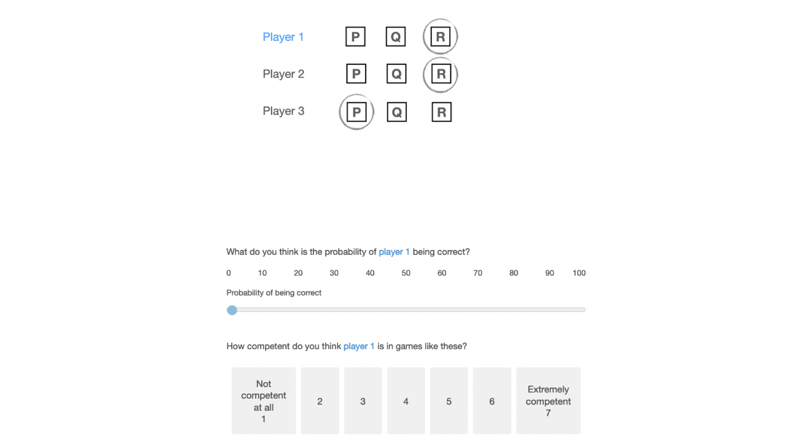
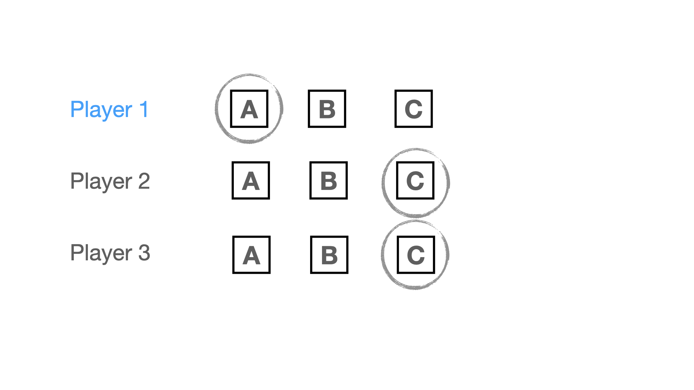
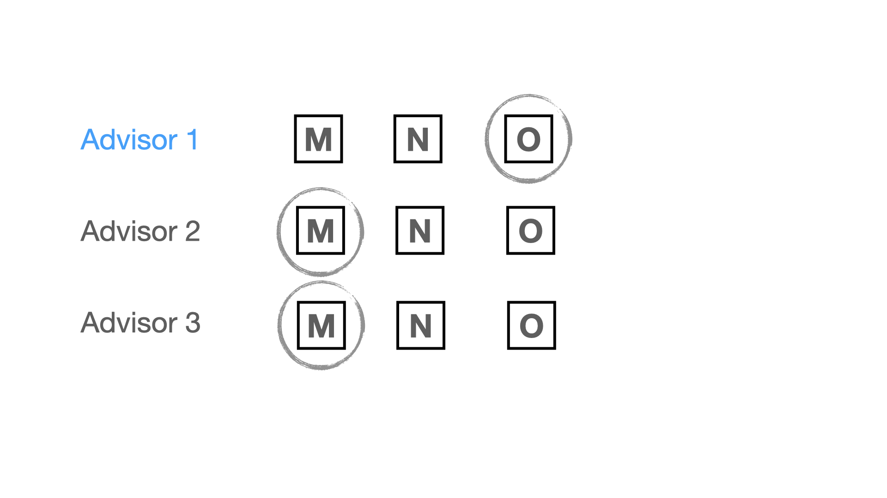
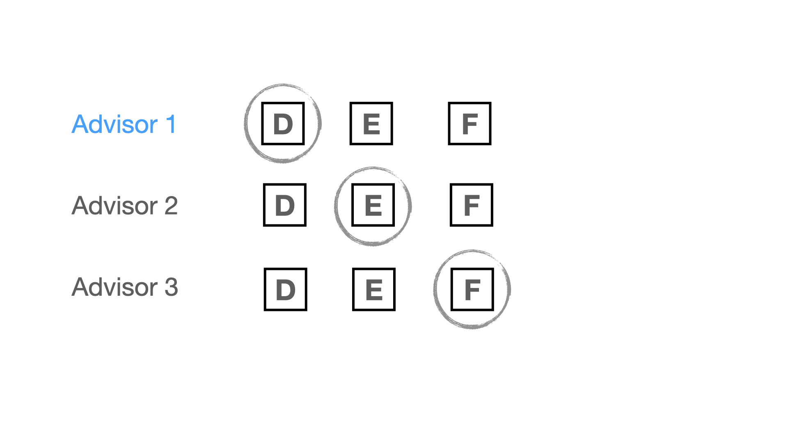
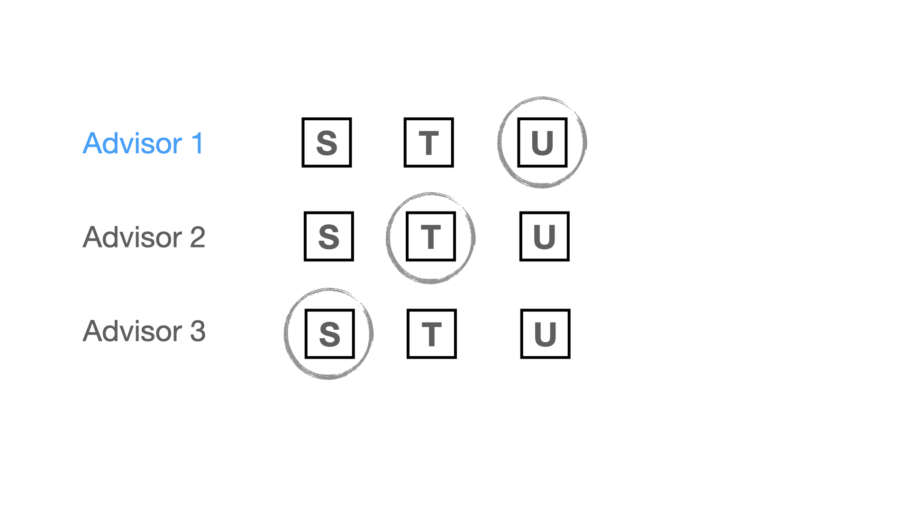
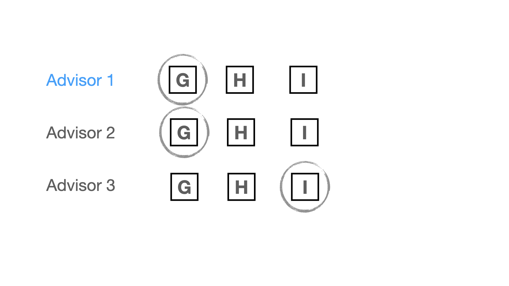
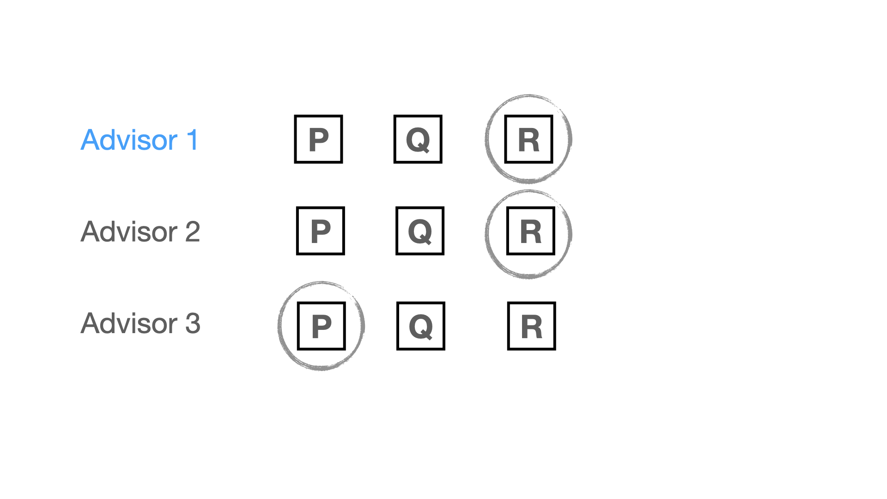
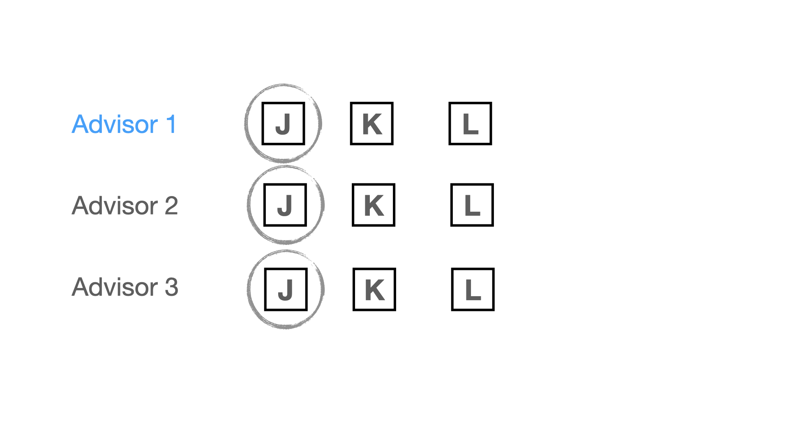
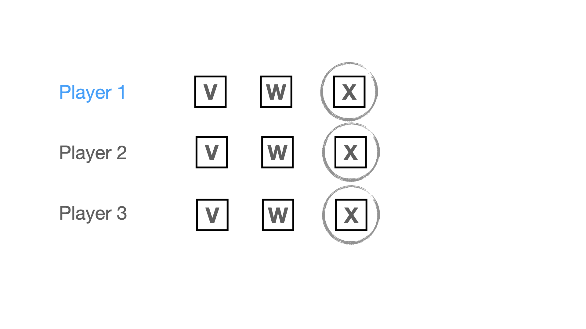

# I. Introduction

In the three previous experiments, we have shown that people infer trustworthiness from convergence - the extent to which different informants agree. Greater convergence makes (i) an information to be perceived as more accurate and (ii) the informants as more competent - that is, given certain context.

In experiment three, we tested how participants would rate independent informants compared to dependent ones. In that experiment, dependence meant that informants were biased - they all shared the same conflict of interest of expressing a certain estimate.

In this fifth experiment, we test whether results of experiment three hold in a categorical choice setting. Experiment three relied on a numerical choice setting: Participants saw (fictive) financial advisors who would make an estimate each between 1000 and 2000. The degree of convergence varied by the distance between the estimates.

We transpose the scenario of experiment three to a numerical setting. In this case the financial advisors recommend one of three possible investment options. In this categorical scenario, convergence varies by the ratio of people agreeing on an option.

The design we use to manipulate convergence is identical to experiment four (also using a categorical setting), but the experimental scenario is different - this time it's not about estimation games but investment options. Thereby, experiment five also provides an opportunity to test whether the results of experiment four hold in a different scenario.

# II. Data collection

No data has been collected yet.

# III. Design

Participants see eight siutations in which three advisors give investment recommendations. They are then asked to judge one advisor's accuracy and competence. We will manipulate two factors: convergence (four levels, within participants) and independence (two levels, between participants).

> **Introduction for participants:** *" We will show you three financial advisors who are giving recommendations on investment decisions. They can choose between three investment options. Their task is to recommend one. You will see several such situations. They are completely unrelated: it is different advisors evaluating different investments every time. At first you have no idea how competent the advisors are: they might be completely at chance, or be very good at the task. It's also possible that some are really good while others are really bad. Some tasks might be difficult while others are easy. Your task will be to evaluate the performance of one of the advisors based on what everyone's answers are."*


 

**Convergence**. Convergence varies by the ratio of players choosing the same response as the focal player (i.e. the one that participants evaluate). The levels of convergence are: (i) consensus, where all three players pick the same option [`coded value = 3`]; (ii) majority, where either the third or second player picks the same option as the first player [`coded value = 2`]; (iii) dissensus, where all three players pick different options [`coded value = 1`]; (iv) majority against the focal player's estimate, where the second and third player pick the same option, but one that is different from the first player's choice [`coded value = 0`]. In our analysis, we treat convergence as a continuous variable, assigning the values in squared parenthesis.

We manipulate convergence within participants. All participants see all four conditions of convergence, with two stimuli (i.e. game results) per condition. Each participant therefore sees eight stimuli in total (4 convergence levels x 2 stimuli) .


Table: All stimuli by levels of convergence

|         Level         |                      Version a)                      |                      Version b)                      |
|:---------------------:|:----------------------------------------------------:|:----------------------------------------------------:|
| opposing majority (0) | { width=60% } | { width=60% } |
|     dissensus (1)     |  { width=60% }  |  { width=60% }  |
|     majority (2)      |   { width=60% }   |   { width=60% }   |
|     consensus (3)     |  { width=60% }   |  { width=60% }   |

**Independence**. Independence has two levels: (i) independent and (ii) biased. In the biased condition, experts were described to gain personally from recommending a certain investment option -- but without specifying what that option is. In the independent condition, there was no such conflict of interest and experts were described as independent.

We manipulate independence between participants, i.e. each participant gets assigned to either the independent or the biased condition. Participants in both conditions will see the same recommendation scenario, but with different descriptions.


Table: Participants read only one of these introductions before seeing the sets of estimates, depending on which condition they had been assigned to

|Independent                                                                                                              |Biased (conflict of interest)                                                                                                                                                          |
|:------------------------------------------------------------------------------------------------------------------------|:--------------------------------------------------------------------------------------------------------------------------------------------------------------------------------------|
|The three advisors are independent of each other, and have no conflict of interest in making investment recommendations. |The three advisors have already invested in one of the three options, the same option for all three. As a result, they have an incentive to push that option in their recommendations. |

As outcome variables, we will measure people's perceived accuracy and competence of player one.

**Accuracy**. We ask participants "What do you think is the probability of player 1 being correct?". Participants answer with a slider from 0 to 100.

**Competence**. We ask participants "How competent do you think player 1 is in games like these?" Participants answer on a 7-point Likert scale (from "not competent at all" to "extremely competent").

# IV. Hypotheses

In line with our findings in numerical choice settings, we predict that:

### H1a: Participants perceive an estimate of an independent informant as more accurate the more it converges with the estimates of other informants.

To test this hypothesis, we only consider participants assigned to the `independent` condition.

We use a linear mixed effect model with random intercept and random slope per participant. Should this model yield convergence issues, we will use a model with random intercept only.

In all our models we treat `convergence` as a continuous variable. We will, however, include robustness checks where we treat convergence as a categorical variable, allowing to inspect difference between different levels.


```r
# models for accuracy

# random intercept and slope by participants
model_accuracy <- lmer(accuracy ~ convergence + (1 + convergence | id), 
                       data = data %>% filter(independence == "independent"))

# in case of non-convergence: random intercept by participants only
alt_model_accuracy <- lmer(accuracy ~ convergence + (1 | id), 
                           data = data %>% filter(independence == "independent"))
```

### H1b: Participants perceive an independent informant as more competent the more their estimate converges with the estimates of other informants.

To test this hypothesis, we only consider participants assigned to the `independent` condition.

We will proceed in the same way for `competence` as we did for `accuracy` above.


```r
# models for competence

# random intercept and slope by participants
model_competence <- lmer(competence ~ convergence + 
                           (1 + convergence | id), 
                         data = data %>% filter(independence == "independent"))

# in case of non-convergence: random intercept by participants only
alt_model_competence <- lmer(competence ~ convergence + (1 | id), 
                             data = data %>% filter(independence == "independent"))
```

How about a context in which informants are not independent but biased, because they share a conflict of interest instead? In line with our findings from experiment three, we predict that effects of convergence are more positive when informants are independent, compared to when they are biased: 

### H2a: The effect of convergence on accuracy (H1a) is more positive in a context where informants are independent compared to when they are biased (i.e. share a conflict of interest to pick a given answer). 

To test this hypothesis, we only consider the full data.

The resulting estimate of the interaction term will provide the test for our hypothesis. 


```r
# models for accuracy

# random intercept and slope by participants
model_accuracy <- lmer(accuracy ~ convergence + independence + 
                            independence*convergence + (1 + convergence | id), 
                       data = data)

# in case of non-convergence: random intercept by participants only
alt_model_accuracy <- lmer(accuracy ~ convergence + independence + 
                            independence*convergence + (1 | id), 
                           data = data)
```


### H2b: The effect of convergence on competence (H1b) is more positive in a context where informants are independent compared to when they are biased (i.e. share a conflict of interest to pick a given answer).

To test this hypothesis, we only consider the full data.

The resulting estimate of the interaction term will provide the test for our hypothesis. 


```r
# models for competence

# random intercept and slope by participants
model_competence <- lmer(competence ~ convergence + independence + 
                            independence*convergence + (1 + convergence | id), 
                       data = data)

# in case of non-convergence: random intercept by participants only
alt_model_competence <- lmer(competence ~ convergence + independence + 
                            independence*convergence + (1 | id), 
                           data = data)
```

# Robustness checks

In the models above, we treated convergence as a continuous variable. Based on the different levels, we will build a categorical variable, `convergence_categorical`.


```r
# make a categorical variable from `convergence`
data <- data %>% 
  mutate(convergence_categorical = recode_factor(convergence, 
                                                 `0` = "opposing majority", 
                                                 `1` = "divergence", 
                                                 `2` = "majority", 
                                                 `3` = "consensus",
                                                 .default = NA_character_)
         )

levels(data$convergence_categorical)
```

```
## [1] "opposing majority" "divergence"        "majority"         
## [4] "consensus"
```

We run the same models outlined in the hypotheses section, but replacing `convergence` with `convergence_categorical`. This also allows us to inspect heterogeneity in differences between levels (with respect to the baseline, i.e. "opposing majority").

# Exclusions

We will exclude participants failing (i.e. participants not answering the question or writing anything that does not at least resemble "I pay attention") the following attention check:

> *Imagine you are playing video games with a friend and at some point your friend says: "I don't want to play this game anymore! To make sure that you read the instructions, please write the three following words"I pay attention" in the box below. I really dislike this game, it's the most overrated game ever. Do you agree with your friend?*

# Power analysis

We ran a power simulation to inform our choice of sample size. All assumptions and details on the procedure can be found in the `power_Exp5.Rmd` document. We ran two different power analyses, one for each outcome variable. We set the power threshold for our experiment to 90%.

The power simulation for `accuracy` suggested that for 80 participants, we would have a power of at least 90% for the interaction effect. The simulation for `competence` suggested that with already 40 participants, we would detect an interaction, but only with 60 participants we also detect an effect of convergence.

However, due to uncertainty about our assumptions and because we are anticipating failed attention checks, *we will recruit a sample of `200` participants*.

 

 
