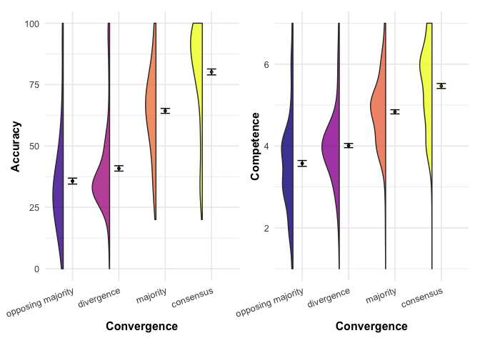
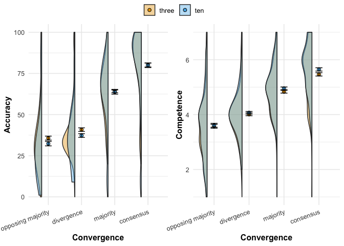

```r
library(tidyverse) # for everything
library(tidyr) # some additional, neat tidy reshaping functions
library(lme4) # for linear mixed models
library(lmerTest) # p-values for mixed models
library(broom) # for tidy outputs of regressions
library(broom.mixed) # for tidy outputs of linear mixed models
library(ggridges) # for plots
library(gghalves) # for plots
library(ggbeeswarm) # Special distribution-shaped point jittering
library(scales)  # for nice axis labels
library(modelsummary) # regression tables
library(patchwork) # combine plots
library(ggrepel) # fit labels in plots 
```

### Some themes and functions


### Read data

```r
# read data
d <- read_csv("./data/cleaned.csv") %>% 
  # make number_options a factor
  mutate(number_options = relevel(as.factor(number_options), ref = "three"))
```

### H1a: In the three options condition, participants perceive an estimate of an independent informant as more accurate the more it converges with the estimates of other informants.

To test this hypothesis, we only consider participants assigned to the `3` options condition.

We use a linear mixed effect model with random intercept and random slope per participant. Should this model yield convergence issues, we will use a model with random intercept only.

In all our models we treat `convergence` as a continuous variable. We will, however, include robustness checks where we treat convergence as a categorical variable, allowing to inspect difference between different levels.


```r
# models for accuracy

# random intercept and slope by participants
model_accuracy_3options <- lmer(accuracy ~ convergence + (1 + convergence | id), 
                       data = d %>% filter(number_options == "three"))
```


### H1b:  In the three options condition, participants perceive an independent informant as more competent the more their estimate converges with the estimates of other informants.

We will proceed in the same way for `competence` as we did for `accuracy` above.


```r
# models for competence

# random intercept and slope by participants
model_competence_3options <- lmer(competence ~ convergence + 
                           (1 + convergence | id), 
                         data = d %>% filter(number_options == "three"))
```

### H2a: The effect of convergence on accuracy (H1a) is more positive in a context when informants can choose among ten response options compared to when they can choose among only three. 

To test this hypothesis, we consider the full data.

The resulting estimate of the interaction term will provide the test for our hypothesis. 


```r
# models for accuracy

# random intercept and slope by participants
model_accuracy <- lmer(accuracy ~ convergence + number_options + 
                            number_options*convergence + (1 + convergence | id), 
                       data = d)
```

  
### H2b: The effect of convergence on competence (H1b) is more positive in a context when informants can choose among ten response options compared to when they can choose among only three. 

To test this hypothesis, we consider the full data.

The resulting estimate of the interaction term will provide the test for our hypothesis. 


```r
# models for competence

# random intercept and slope by participants
model_competence <- lmer(competence ~ convergence + number_options + 
                            number_options*convergence + (1 + convergence | id), 
                       data = d)
```

Show all results
<table style="NAborder-bottom: 0; width: auto !important; margin-left: auto; margin-right: auto;" class="table">
 <thead>
  <tr>
   <th style="text-align:left;">   </th>
   <th style="text-align:center;">  Accuracy (3 options condition) </th>
   <th style="text-align:center;">  Competence (3 options condition) </th>
   <th style="text-align:center;"> Accuracy </th>
   <th style="text-align:center;"> Competence </th>
  </tr>
 </thead>
<tbody>
  <tr>
   <td style="text-align:left;"> (Intercept) </td>
   <td style="text-align:center;"> 31.736*** </td>
   <td style="text-align:center;"> 3.496*** </td>
   <td style="text-align:center;"> 31.736*** </td>
   <td style="text-align:center;"> 3.496*** </td>
  </tr>
  <tr>
   <td style="text-align:left;">  </td>
   <td style="text-align:center;"> (1.653) </td>
   <td style="text-align:center;"> (0.091) </td>
   <td style="text-align:center;"> (1.698) </td>
   <td style="text-align:center;"> (0.090) </td>
  </tr>
  <tr>
   <td style="text-align:left;"> convergence </td>
   <td style="text-align:center;"> 15.679*** </td>
   <td style="text-align:center;"> 0.650*** </td>
   <td style="text-align:center;"> 15.679*** </td>
   <td style="text-align:center;"> 0.650*** </td>
  </tr>
  <tr>
   <td style="text-align:left;">  </td>
   <td style="text-align:center;"> (0.793) </td>
   <td style="text-align:center;"> (0.043) </td>
   <td style="text-align:center;"> (0.851) </td>
   <td style="text-align:center;"> (0.046) </td>
  </tr>
  <tr>
   <td style="text-align:left;"> number_optionsten </td>
   <td style="text-align:center;">  </td>
   <td style="text-align:center;">  </td>
   <td style="text-align:center;"> −3.812 </td>
   <td style="text-align:center;"> 0.024 </td>
  </tr>
  <tr>
   <td style="text-align:left;">  </td>
   <td style="text-align:center;">  </td>
   <td style="text-align:center;">  </td>
   <td style="text-align:center;"> (2.394) </td>
   <td style="text-align:center;"> (0.126) </td>
  </tr>
  <tr>
   <td style="text-align:left;"> convergence × number_optionsten </td>
   <td style="text-align:center;">  </td>
   <td style="text-align:center;">  </td>
   <td style="text-align:center;"> 1.252 </td>
   <td style="text-align:center;"> 0.050 </td>
  </tr>
  <tr>
   <td style="text-align:left;">  </td>
   <td style="text-align:center;">  </td>
   <td style="text-align:center;">  </td>
   <td style="text-align:center;"> (1.200) </td>
   <td style="text-align:center;"> (0.065) </td>
  </tr>
  <tr>
   <td style="text-align:left;"> SD (Intercept id) </td>
   <td style="text-align:center;"> 18.887 </td>
   <td style="text-align:center;"> 1.055 </td>
   <td style="text-align:center;"> 19.383 </td>
   <td style="text-align:center;"> 1.031 </td>
  </tr>
  <tr>
   <td style="text-align:left;"> SD (convergence id) </td>
   <td style="text-align:center;"> 8.913 </td>
   <td style="text-align:center;"> 0.495 </td>
   <td style="text-align:center;"> 9.625 </td>
   <td style="text-align:center;"> 0.527 </td>
  </tr>
  <tr>
   <td style="text-align:left;"> Cor (Intercept~convergence id) </td>
   <td style="text-align:center;"> −0.742 </td>
   <td style="text-align:center;"> −0.805 </td>
   <td style="text-align:center;"> −0.699 </td>
   <td style="text-align:center;"> −0.829 </td>
  </tr>
  <tr>
   <td style="text-align:left;box-shadow: 0px 1px"> SD (Observations) </td>
   <td style="text-align:center;box-shadow: 0px 1px"> 11.657 </td>
   <td style="text-align:center;box-shadow: 0px 1px"> 0.583 </td>
   <td style="text-align:center;box-shadow: 0px 1px"> 12.103 </td>
   <td style="text-align:center;box-shadow: 0px 1px"> 0.598 </td>
  </tr>
  <tr>
   <td style="text-align:left;"> Num.Obs. </td>
   <td style="text-align:center;"> 1184 </td>
   <td style="text-align:center;"> 1184 </td>
   <td style="text-align:center;"> 2384 </td>
   <td style="text-align:center;"> 2384 </td>
  </tr>
  <tr>
   <td style="text-align:left;"> R2 Marg. </td>
   <td style="text-align:center;"> 0.437 </td>
   <td style="text-align:center;"> 0.335 </td>
   <td style="text-align:center;"> 0.423 </td>
   <td style="text-align:center;"> 0.355 </td>
  </tr>
  <tr>
   <td style="text-align:left;"> R2 Cond. </td>
   <td style="text-align:center;"> 0.807 </td>
   <td style="text-align:center;"> 0.784 </td>
   <td style="text-align:center;"> 0.814 </td>
   <td style="text-align:center;"> 0.779 </td>
  </tr>
  <tr>
   <td style="text-align:left;"> AIC </td>
   <td style="text-align:center;"> 9814.0 </td>
   <td style="text-align:center;"> 2757.3 </td>
   <td style="text-align:center;"> 19980.3 </td>
   <td style="text-align:center;"> 5624.5 </td>
  </tr>
  <tr>
   <td style="text-align:left;"> BIC </td>
   <td style="text-align:center;"> 9844.5 </td>
   <td style="text-align:center;"> 2787.7 </td>
   <td style="text-align:center;"> 20026.5 </td>
   <td style="text-align:center;"> 5670.7 </td>
  </tr>
  <tr>
   <td style="text-align:left;"> ICC </td>
   <td style="text-align:center;"> 0.7 </td>
   <td style="text-align:center;"> 0.7 </td>
   <td style="text-align:center;"> 0.7 </td>
   <td style="text-align:center;"> 0.7 </td>
  </tr>
  <tr>
   <td style="text-align:left;"> RMSE </td>
   <td style="text-align:center;"> 10.30 </td>
   <td style="text-align:center;"> 0.51 </td>
   <td style="text-align:center;"> 10.67 </td>
   <td style="text-align:center;"> 0.53 </td>
  </tr>
</tbody>
<tfoot><tr><td style="padding: 0; " colspan="100%">
<sup></sup> + p &lt; 0.1, * p &lt; 0.05, ** p &lt; 0.01, *** p &lt; 0.001</td></tr></tfoot>
</table>

## Research question 

### RQ1: Within the 10 choice options condition, is the effect of convergence more positive for the set of stimuli with greater distance?


```r
# models for accuracy

# random intercept and slope by participants
model_accuracy_10options <- lmer(accuracy ~ convergence + stimuli_10_version + 
                            stimuli_10_version*convergence + (1 + convergence | id), 
                       data = d)


# models for competence

# random intercept and slope by participants
model_competence_10options <- lmer(competence ~ convergence + stimuli_10_version + 
                            stimuli_10_version*convergence + (1 + convergence | id), 
                       data = d)
```


```r
models <- list("Accuracy (10 options conditions)" = model_accuracy_10options, 
               "Competence (10 options conditions)" = model_competence_10options)
modelsummary::modelsummary(models, stars = TRUE)
```

<table style="NAborder-bottom: 0; width: auto !important; margin-left: auto; margin-right: auto;" class="table">
 <thead>
  <tr>
   <th style="text-align:left;">   </th>
   <th style="text-align:center;">  Accuracy (10 options conditions) </th>
   <th style="text-align:center;">  Competence (10 options conditions) </th>
  </tr>
 </thead>
<tbody>
  <tr>
   <td style="text-align:left;"> (Intercept) </td>
   <td style="text-align:center;"> 29.442*** </td>
   <td style="text-align:center;"> 3.531*** </td>
  </tr>
  <tr>
   <td style="text-align:left;">  </td>
   <td style="text-align:center;"> (2.466) </td>
   <td style="text-align:center;"> (0.125) </td>
  </tr>
  <tr>
   <td style="text-align:left;"> convergence </td>
   <td style="text-align:center;"> 17.381*** </td>
   <td style="text-align:center;"> 0.730*** </td>
  </tr>
  <tr>
   <td style="text-align:left;">  </td>
   <td style="text-align:center;"> (1.284) </td>
   <td style="text-align:center;"> (0.069) </td>
  </tr>
  <tr>
   <td style="text-align:left;"> stimuli_10_versionten_distant </td>
   <td style="text-align:center;"> −2.996 </td>
   <td style="text-align:center;"> −0.022 </td>
  </tr>
  <tr>
   <td style="text-align:left;">  </td>
   <td style="text-align:center;"> (3.465) </td>
   <td style="text-align:center;"> (0.175) </td>
  </tr>
  <tr>
   <td style="text-align:left;"> convergence × stimuli_10_versionten_distant </td>
   <td style="text-align:center;"> −0.890 </td>
   <td style="text-align:center;"> −0.060 </td>
  </tr>
  <tr>
   <td style="text-align:left;">  </td>
   <td style="text-align:center;"> (1.804) </td>
   <td style="text-align:center;"> (0.096) </td>
  </tr>
  <tr>
   <td style="text-align:left;"> SD (Intercept id) </td>
   <td style="text-align:center;"> 19.879 </td>
   <td style="text-align:center;"> 1.011 </td>
  </tr>
  <tr>
   <td style="text-align:left;"> SD (convergence id) </td>
   <td style="text-align:center;"> 10.309 </td>
   <td style="text-align:center;"> 0.558 </td>
  </tr>
  <tr>
   <td style="text-align:left;"> Cor (Intercept~convergence id) </td>
   <td style="text-align:center;"> −0.670 </td>
   <td style="text-align:center;"> −0.857 </td>
  </tr>
  <tr>
   <td style="text-align:left;box-shadow: 0px 1px"> SD (Observations) </td>
   <td style="text-align:center;box-shadow: 0px 1px"> 12.527 </td>
   <td style="text-align:center;box-shadow: 0px 1px"> 0.612 </td>
  </tr>
  <tr>
   <td style="text-align:left;"> Num.Obs. </td>
   <td style="text-align:center;"> 1200 </td>
   <td style="text-align:center;"> 1200 </td>
  </tr>
  <tr>
   <td style="text-align:left;"> R2 Marg. </td>
   <td style="text-align:center;"> 0.415 </td>
   <td style="text-align:center;"> 0.374 </td>
  </tr>
  <tr>
   <td style="text-align:left;"> R2 Cond. </td>
   <td style="text-align:center;"> 0.821 </td>
   <td style="text-align:center;"> 0.774 </td>
  </tr>
  <tr>
   <td style="text-align:left;"> AIC </td>
   <td style="text-align:center;"> 10155.6 </td>
   <td style="text-align:center;"> 2874.4 </td>
  </tr>
  <tr>
   <td style="text-align:left;"> BIC </td>
   <td style="text-align:center;"> 10196.3 </td>
   <td style="text-align:center;"> 2915.2 </td>
  </tr>
  <tr>
   <td style="text-align:left;"> ICC </td>
   <td style="text-align:center;"> 0.7 </td>
   <td style="text-align:center;"> 0.6 </td>
  </tr>
  <tr>
   <td style="text-align:left;"> RMSE </td>
   <td style="text-align:center;"> 11.04 </td>
   <td style="text-align:center;"> 0.54 </td>
  </tr>
</tbody>
<tfoot><tr><td style="padding: 0; " colspan="100%">
<sup></sup> + p &lt; 0.1, * p &lt; 0.05, ** p &lt; 0.01, *** p &lt; 0.001</td></tr></tfoot>
</table>


### Plots


```
## [1] "opposing majority" "divergence"        "majority"         
## [4] "consensus"
```

#### Three options only


<!-- -->

#### Interaction


<!-- -->
