# I. Introduction

In the three previous experiments, we have shown that people infer trustworthiness from convergence - the extent to which different informants agree. Greater convergence makes (i) an information to be perceived as more accurate and (ii) the informants as more competent - that is, given certain context.

Some aspects of that context we held constant; others we varied to evaluate how they alter the effect of convergence. We held constant that participants did not have any priors whatsoever - not on the information they received (they knew nothing about the games that were played) nor about the informants (the players who played the games). We manipulated informants’ independence. We tested two cases of independence, by varying the baseline of what dependent meant: In experiment two, dependent informants had discussed “at great length” before making their estimates. In experiment three, dependent informants shared the same conflict of interest of making a certain estimate.

In this first series of experiments (experiments one, two and three) we tested inferences from convergence in a numerical choice setting: Participants saw (fictive) players’ estimates that would lie with 1000 and 2000. The degree of convergence varied by the distance between estimates. 

In a second series of experiments (experiments four, five and six), we test inferences from convergence in a categorical choice setting. In the categorical scenario, the fictive players make choices on a set of response options (i.e. categories).  Convergence varies by the ratio of people agreeing on an option. Experiment four and five can be considered robustness checks as to whether the results of the first series hold in a categorical choice setting. Experiment six tests a new context factor: the number of choice options. In experiments four and five, scenarios always involved three choice options. Here, we will vary between three and ten options. The design we use to manipulate convergence is otherwise identical to experiment four (players playing games). 

# II. Data collection

No data has been collected yet.

# III. Design

Participants see eight situtations in which three advisors give investment recommendations. They are then asked to judge one advisor's accuracy and competence. We will manipulate two factors: convergence (four levels, within participants) and number of options (two levels, between participants).

> **Introduction for participants:** *"To be able to understand the task, please read the following instructions carefully: Some people are playing games in which they have to select the correct answer among various options. You will see the results of several of these games. Each game is different, with different solutions and involving different players. All players answer independently of each other. At first, you have no idea how competent each individual player is: they might be completely at chance, or be very good at the task. It's also possible that some players are really good while others are really bad. Some games might be difficult while others are easy. Your task will be to evaluate the performance of one of the players based on what everyone's answers are."*


**Convergence**. Convergence varies by the ratio of players choosing the same response as the focal player (i.e. the one that participants evaluate). The levels of convergence are: (i) consensus, where all three players pick the same option [`coded value = 3`]; (ii) majority, where either the third or second player picks the same option as the first player [`coded value = 2`]; (iii) dissensus, where all three players pick different options [`coded value = 1`]; (iv) majority against the focal player's estimate, where the second and third player pick the same option, but one that is different from the first player's choice [`coded value = 0`]. In our analysis, we treat convergence as a continuous variable, assigning the values in squared parenthesis.

We manipulate convergence within participants. All participants see all four conditions of convergence, with two stimuli (i.e. game results) per condition. Each participant therefore sees eight stimuli in total (4 convergence levels x 2 stimuli) .


Table: Stimuli for 3 options condition by levels of convergence

|         Level         |                      Version a)                      |                      Version b)                      |
|:---------------------:|:----------------------------------------------------:|:----------------------------------------------------:|
| opposing majority (0) |  { width=60% }  |  { width=60% }  |
|     dissensus (1)     | { width=60% } | { width=60% } |
|     majority (2)      |  { width=60% }  |  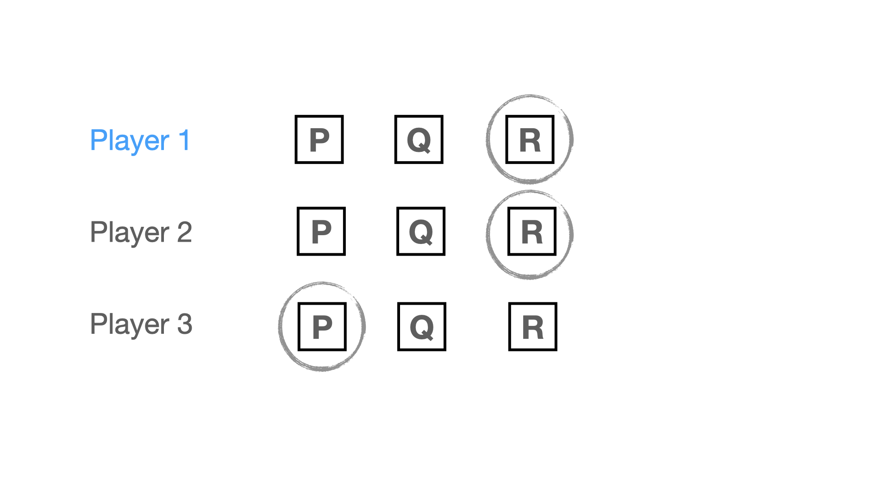{ width=60% }  |
|     consensus (3)     | { width=60% }  | { width=60% }  |

**Number of choice options**. Number of options has two levels: '3' '10'. 

We manipulate number of choice options between participants, i.e. each participant gets assigned to either the '3' or the '10' condition. All stimuli that participants see in their respective condition will involve the same number of choice options. 

As for the '10' options condition, participants will see one of two distinct set of stimuli (`stimuli_10_version`): one in which the range of the answers corresponds to the range of the '3' options condition (`stimuli_10_version == 10`), and another with increased range (`stimuli_10_version == 10_distant`; see Appendix). We add the increased range condition because we think that there is the possibility that participant might not consider all options as relevant when they only see scenarios in which all answers cluster. For the main analyses, we will simply merge these two stimuli sets and treat them as part of the same '10' options condition. However, we will investigate potential differences as a research question. 


Table: Example of a consensus stimulus for the two 'Number of option' conditions

|  Convergence  |                Number of options: 3                 |                Number of options: 10                 |
|:-------------:|:---------------------------------------------------:|:----------------------------------------------------:|
| consensus (3) | { width=60% } | { width=60% } |

As outcome variables, we will measure people's perceived accuracy and competence of player one.

**Accuracy**. We ask participants "What do you think is the probability of player 1 being correct?". Participants answer with a slider from 0 to 100.

**Competence**. We ask participants "How competent do you think player 1 is in games like these?" Participants answer on a 7-point Likert scale (from "not competent at all" to "extremely competent").

# IV. Hypotheses

Considering only `3` options condition of the experiment at hand, we expect the findings of experiment four to replicate, for it is the exact same experiment as experiment four in this case. 

### H1a: In the three options condition, participants perceive an estimate of an independent informant as more accurate the more it converges with the estimates of other informants.

To test this hypothesis, we only consider participants assigned to the `3` options condition.

We use a linear mixed effect model with random intercept and random slope per participant. Should this model yield convergence issues, we will use a model with random intercept only.

In all our models we treat `convergence` as a continuous variable. We will, however, include robustness checks where we treat convergence as a categorical variable, allowing to inspect difference between different levels.


```r
# models for accuracy

# random intercept and slope by participants
model_accuracy <- lmer(accuracy ~ convergence + (1 + convergence | id), 
                       data = data %>% filter(options == "3"))

# in case of non-convergence: random intercept by participants only
alt_model_accuracy <- lmer(accuracy ~ convergence + (1 | id), 
                           data = data %>% filter(options == "3"))
```

### H1b:  In the three options condition, participants perceive an independent informant as more competent the more their estimate converges with the estimates of other informants.

To test this hypothesis, we only consider participants assigned to the `3` options condition.

We will proceed in the same way for `competence` as we did for `accuracy` above.


```r
# models for competence

# random intercept and slope by participants
model_competence <- lmer(competence ~ convergence + 
                           (1 + convergence | id), 
                         data = data %>% filter(options == "3"))

# in case of non-convergence: random intercept by participants only
alt_model_competence <- lmer(competence ~ convergence + (1 | id), 
                             data = data %>% filter(options == "3"))
```

How about a context in which informants (i.e. the fictive players) could choose not among 3, but among 10 options? Following the results from our model, we predict that effects of convergence are more positive when there are more choice options: 

### H2a: The effect of convergence on accuracy (H1a) is more positive in a context when informants can choose among ten response options compared to when they can choose among only three. 

To test this hypothesis, we consider the full data.

The resulting estimate of the interaction term will provide the test for our hypothesis. 


```r
# models for accuracy

# random intercept and slope by participants
model_accuracy <- lmer(accuracy ~ convergence + options + 
                            options*convergence + (1 + convergence | id), 
                       data = data)

# in case of non-convergence: random intercept by participants only
alt_model_accuracy <- lmer(accuracy ~ convergence + options + 
                            options*convergence + (1 | id), 
                           data = data)
```


### H2b: The effect of convergence on competence (H1b) is more positive in a context when informants can choose among ten response options compared to when they can choose among only three. 

To test this hypothesis, we consider the full data.

The resulting estimate of the interaction term will provide the test for our hypothesis. 


```r
# models for competence

# random intercept and slope by participants
model_competence <- lmer(competence ~ convergence + options + 
                            options*convergence + (1 + convergence | id), 
                       data = data)

# in case of non-convergence: random intercept by participants only
alt_model_competence <- lmer(competence ~ convergence + options + 
                            options*convergence + (1 | id), 
                           data = data)
```

## Research question 

### RQ1: Within the 10 choice options condition, is the effect of convergence more positive for the set of stimuli with greater distance?


```r
# models for accuracy

# random intercept and slope by participants
model_accuracy <- lmer(accuracy ~ convergence + stimuli_10_version + 
                            stimuli_10_version*convergence + (1 + convergence | id), 
                       data = data)

# in case of non-convergence: random intercept by participants only
alt_model_accuracy <- lmer(accuracy ~ convergence + stimuli_10_version + 
                            stimuli_10_version*convergence + (1 | id), 
                           data = data)

# models for competence

# random intercept and slope by participants
model_competence <- lmer(competence ~ convergence + stimuli_10_version + 
                            stimuli_10_version*convergence + (1 + convergence | id), 
                       data = data)

# in case of non-convergence: random intercept by participants only
alt_model_competence <- lmer(competence ~ convergence + stimuli_10_version + 
                            stimuli_10_version*convergence + (1 | id), 
                           data = data)
```

Should we find the difference, we will re-run the analyses of the second set of hypotheses restraining the data to the subset of the more distant set of stimuli for the 10 options condition. 

Pick an example stimulus as earlier for illustrating choice options. See all stimuli in appendix.

# Robustness checks

## Convergence as categorical variable

In the models above, we treated convergence as a continuous variable. Based on the different levels, we will build a categorical variable, `convergence_categorical`.


```r
# make a categorical variable from `convergence`
data <- data %>% 
  mutate(convergence_categorical = recode_factor(convergence, 
                                                 `0` = "opposing majority", 
                                                 `1` = "divergence", 
                                                 `2` = "majority", 
                                                 `3` = "consensus",
                                                 .default = NA_character_)
         )

levels(data$convergence_categorical)
```

```
## [1] "opposing majority" "divergence"        "majority"         
## [4] "consensus"
```

We run the same models outlined in the hypotheses section, but replacing `convergence` with `convergence_categorical`. This also allows us to inspect heterogeneity in differences between levels (with respect to the baseline, i.e. "opposing majority").

# Exclusions

We will exclude participants failing (i.e. participants not answering the question or writing anything that does not at least resemble "I pay attention") the following attention check:

> *Imagine you are playing video games with a friend and at some point your friend says: "I don't want to play this game anymore! To make sure that you read the instructions, please write the three following words"I pay attention" in the box below. I really dislike this game, it's the most overrated game ever. Do you agree with your friend?*

# Power analysis

We ran a power simulation to inform our choice of sample size. All assumptions and details on the procedure can be found in the `power_Exp6.Rmd` document. We used previous experiments and estimates of our models to inform our choice of parameter values. 

We ran two different power analyses, one for each outcome variable. We set the power threshold for our experiment to 90%. 

The power simulation for `accuracy` suggested that for 140 participants we would cross the power threshold of 90% for the interaction effect (power = 0.928). The simulation for `competence` suggested that with 300 participants, we would detect an interaction with a power of 87% (power = 0.872). 

Due to budget constraints, we will consider a sample of 300 participants as good enough in terms of power. 

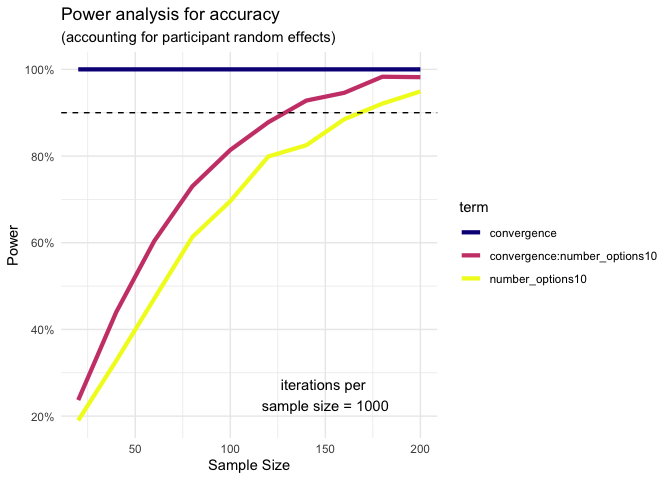

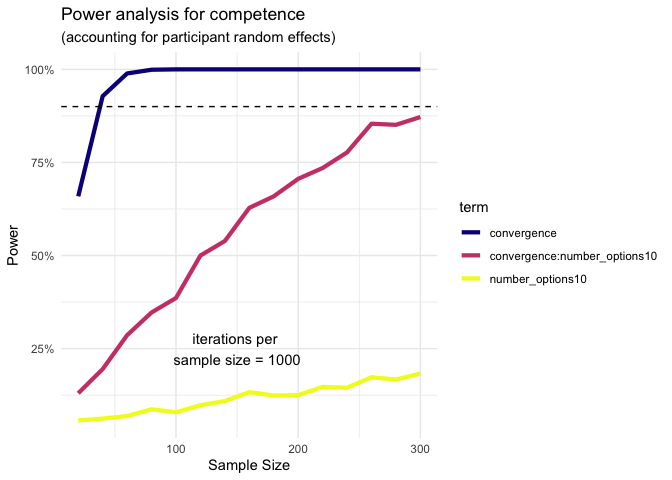

## Appendix


Table: Stimuli for 10 options condition by levels of convergence

|         Level         |                      Version a)                       |                      Version b)                       |
|:---------------------:|:-----------------------------------------------------:|:-----------------------------------------------------:|
| opposing majority (0) |  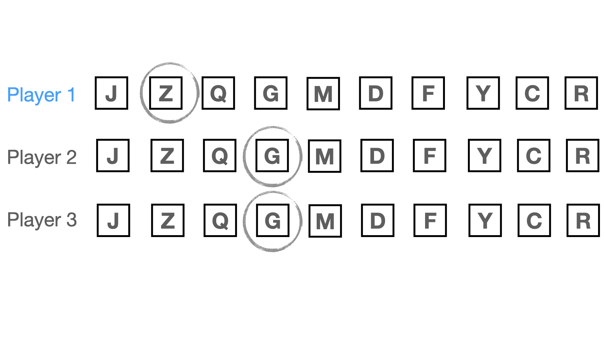{ width=60% }  |  { width=60% }  |
|     dissensus (1)     | { width=60% } | { width=60% } |
|     majority (2)      |  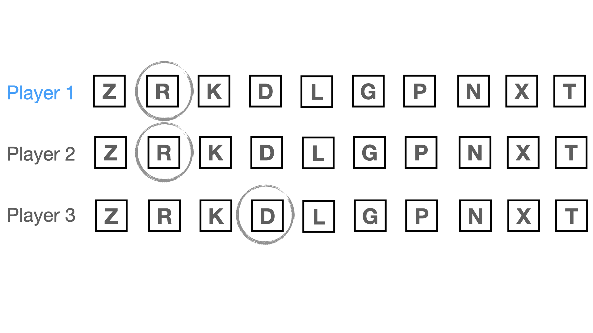{ width=60% }  |  { width=60% }  |
|    consensus (10)     | { width=60% }  | 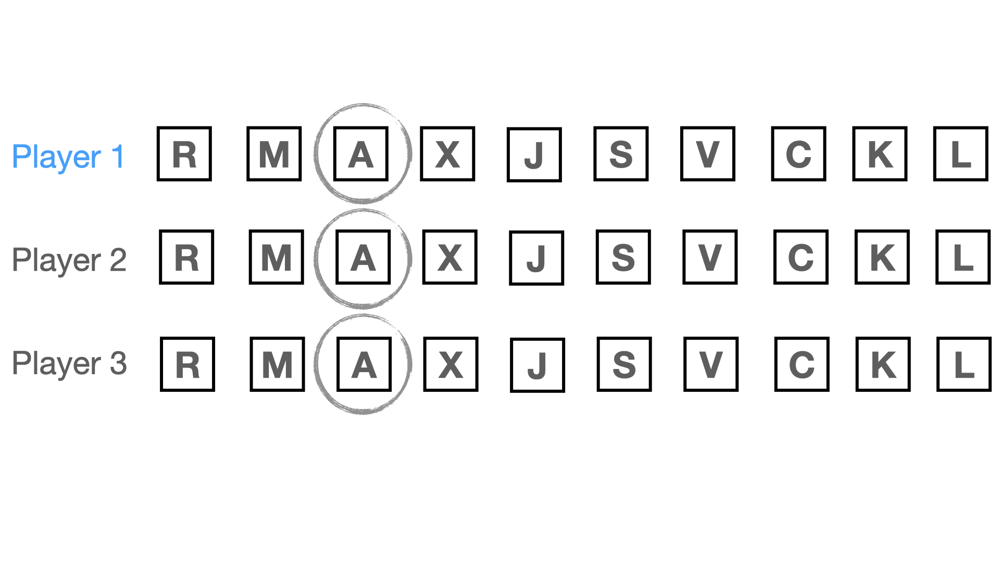{ width=60% }  |


Table: Alternative stimuli for 10 options condition by levels of convergence

|         Level         |                        Version a)                         |                        Version b)                         |
|:---------------------:|:---------------------------------------------------------:|:---------------------------------------------------------:|
| opposing majority (0) |  { width=60% }  |  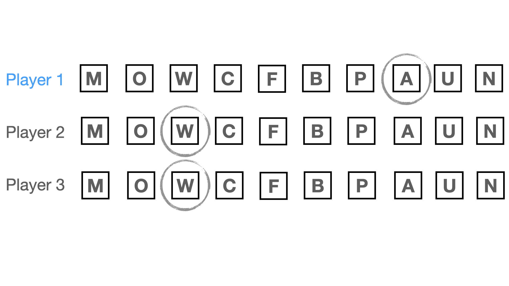{ width=60% }  |
|     dissensus (1)     | { width=60% } | 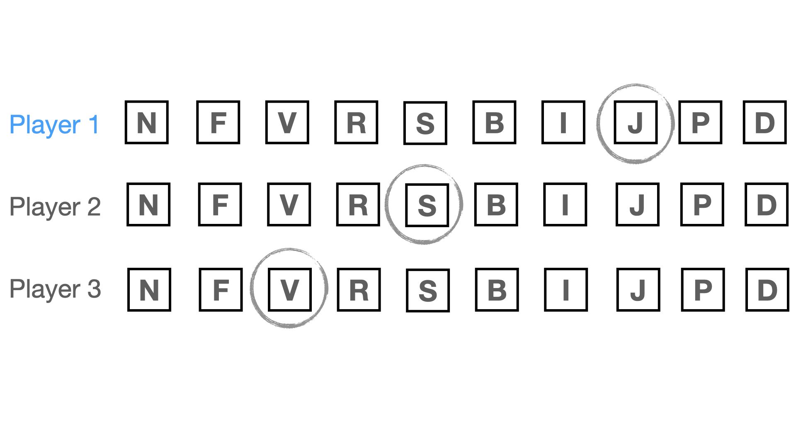{ width=60% } |
|     majority (2)      |  { width=60% }  |  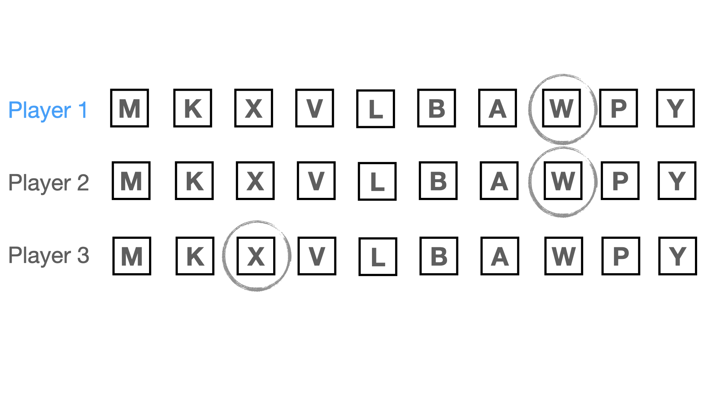{ width=60% }  |
|    consensus (10)     | 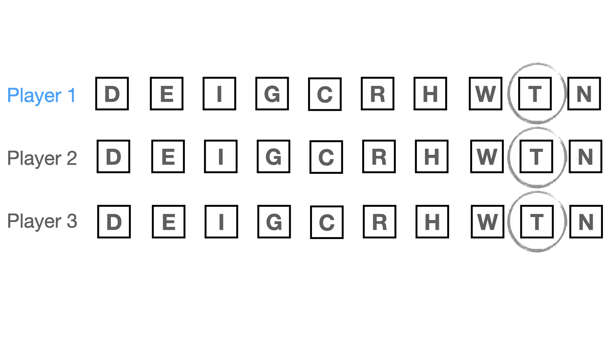{ width=60% }  | 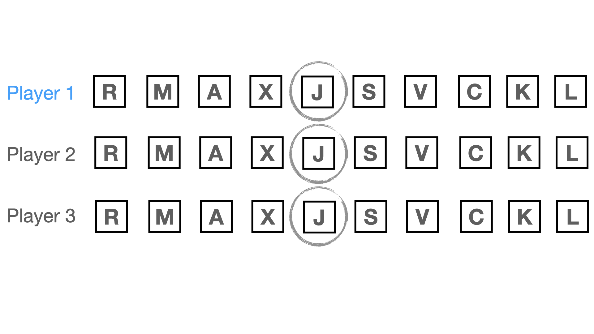{ width=60% }  |
