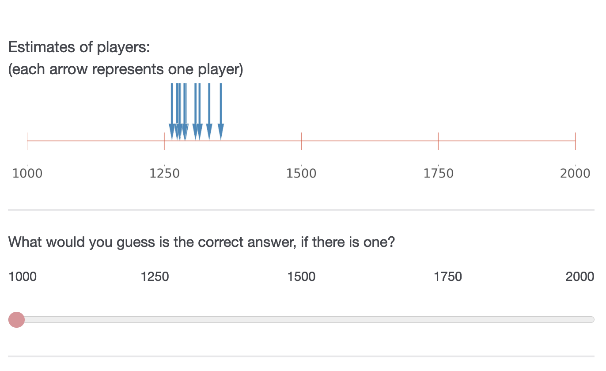
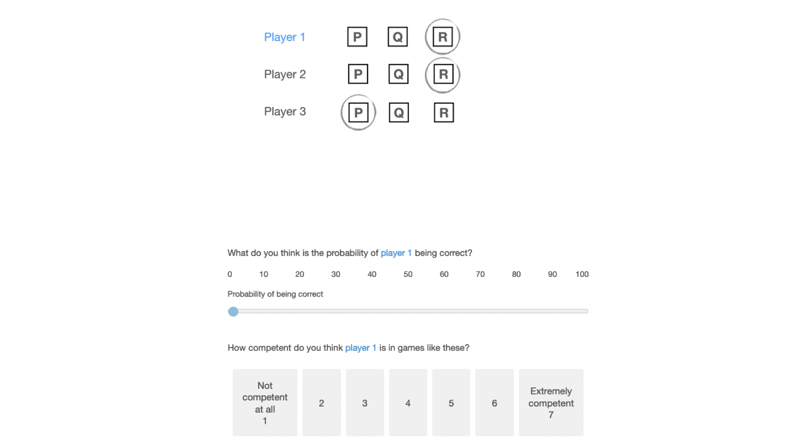

```{r setup, include=FALSE}
# Figure out output format
is_docx <- knitr::pandoc_to("docx") | knitr::pandoc_to("odt")
is_latex <- knitr::pandoc_to("latex")
is_html <- knitr::pandoc_to("html")

# Word-specific things
table_format <- ifelse(is_docx, "huxtable", "kableExtra")  # Huxtable tables
conditional_dpi <- ifelse(is_docx, 300, 300)  # Higher DPI
conditional_align <- ifelse(is_docx, "default", "center")  # Word doesn't support align

# Knitr options
knitr::opts_chunk$set(
  echo = FALSE, warning = FALSE, message = FALSE,
  # tidy.opts = list(width.cutoff = 120),  # Code width
  # fig.retina = 3, dpi = conditional_dpi,
  # fig.width = 7, fig.asp = 0.618,
  # fig.align = conditional_align, out.width = "100%",
  fig.path = "output/figures/",
  cache.path = "output/_cache/",
  fig.process = function(x) {  # Remove "-1" from figure names
    x2 = sub('-\\d+([.][a-z]+)$', '\\1', x)
    if (file.rename(x, x2)) x2 else x
  },
  options(scipen = 99999999)  # Prevent scientific notation
)

# R options
options(
  width = 90,  # Output width
  dplyr.summarise.inform = FALSE,  # Turn off dplyr's summarize() auto messages
  knitr.kable.NA = "",  # Make NAs blank in kables
  kableExtra.latex.load_packages = FALSE,  # Don't add LaTeX preamble stuff
  modelsummary_factory_default = table_format,  # Set modelsummary backend
  modelsummary_format_numeric_latex = "plain"  # Don't use siunitx
)
```

```{r packages, include=FALSE}
# load required packages
library("papaja")      # For APA style manuscript   
library("lme4")        # model specification / estimation
library("lmerTest")    # provides p-values in the output
library("tidyverse")   # data wrangling and visualisation
library("afex")        # anova and deriving p-values from lmer
library("broom")       # extracting data from model fits 
library("broom.mixed") # extracting data from mixed models
library("metafor")     # doing mata analysis
library("metaviz")     # vizualization of meta analysis
library("stringr")     # for dmetar p-curve function to work
library("poibin")      # for dmetar p-curve function to work
library("patchwork")   # put several plots together
library("ggridges")    # for plots
library("gghalves")    # for plots
library("ggbeeswarm")  # Special distribution-shaped point jittering
library("knitr")       # for tables
library("kableExtra")  # also for tables
library("sf")          # for maps
library("ggpubr")      # for combining plots with ggarrange() 
library("viridis")     # for generating color palette for map 
```

```{r functions}
# load plot theme
source("functions/plot_theme.R") 

# load other functions
source("functions/own_functions.R")
```

# Introduction

Imagine that you live in ancient Greece, and a fellow called Eratostenes claims the circumference of the earth is 252000 stades (approximately 40000 kilometers). You know nothing about this man, and you don't understand trigonometry. Moreover, you know little about the circumference of the Earth, and even less of how one could measure such a thing. As a result, you discard his opinion and take him for a pretentious loon. But what if other scholars had arrived at very similar measurements, independently of Eratosthenes? Or even if they had carefully checked his measurement, with a critical eye? Wouldn't that give you enough ground to believe not only that the estimates might be correct, but also that Eratosthenes and his fellow scholars must be quite bright, to be able to achieve such a feat?

In this article, we explore how, under some circumstances, we infer that a group of people who provided the same, or very similar answers to a question are likely to be correct, and to be competent in the relevant area, even if we had no prior about either what the correct answer was, or about their competence.

We first review experiments suggesting that people, including young children, appear to trust groups with more convergent opinions to be more accurate, although the evidence is more conclusive in numerical than in categorical choice contexts. We continue by explaining that two well-studied forms of the wisdom of crowds--averaging and the Condorcet Jury Theorem--do not provide normative grounds for this behavior. We then present the results of simulations, suggesting that under certain conditions, inferences from convergence to accuracy and to underlying competence are sound. Finally, we show that participants draw these inferences in a series of six experiments.

## Numerical choices

Informants can converge in numerical (e.g. how many calories are there in an apple?) and categorical (e.g. which option is correct - A or B?) choice contexts. In numerical contexts, convergence varies by the proximity of estimates; in categorical contexts, convergence varies by the ratio of people agreeing on a choice. We start by reviewing numerical choices.

For numerical choice contexts, evidence that people take convergence into account can be found in advice-taking experiments. In these experiments, participants are called judges, and they need to make numerical estimates--sometimes on factual knowledge, e.g. 'What year was the Suez Canal opened first?' [@yanivReceivingOtherPeople2004], sometimes on knowledge controlled by the experimenters, e.g. 'How many animals were on the screen you saw briefly?' [@mollemanStrategiesIntegratingDisparate2020]. To help answer these questions, participants are given estimates from others, the advisors--sometimes presented as fellow participants, sometimes as experts. The overarching question in those studies is how people integrate social information from the advisors when making estimates.

A substantial share of studies using this judge-advisor paradigm is irrelevant for studying inferences from convergence, because they present participants only with single estimates. In some studies, that single estimate is coming from one advisor [e.g. @bednarikEffectivenessImperfectWeighting2015a; @sollStrategiesRevisingJudgment2009; @yanivReceivingOtherPeople2004; @yanivAdviceTakingDecision2000; @harveyTakingAdviceAccepting1997]. In other studies, that estimate is presented as an average coming from a group of advisors [e.g. @jaylesHowSocialInformation2017a; @mannesAreWeWise2009], but no information about the distribution of initial estimates is given. By contrast, other advice-taking studies provide participants with a set of estimates. One subset of these studies manipulate the degree of convergence between groups of advisors, e.g. via variance of estimates [@mollemanStrategiesIntegratingDisparate2020; @yanivSpuriousConsensusOpinion2009], or their range [@budescuConfidenceAggregationExpert2000; @budescuEffectsAsymmetryAdvisors2003; @budescuAggregationOpinionsBased2007]. These studies find that participants are more confident about, or rely more on, estimates from groups of advisors who converge more. More indirect evidence comes from another subset of studies varied the degree of convergence within groups of advisors. They present participants with sets of estimates where some estimates are close to each other (or overlapping, in cases where estimates were intervals), while others were clearly outliers [@yanivWeightingTrimmingHeuristics1997, study 3 & 4; @harriesCombiningAdviceWeight2004]. These studies find that participants heavily discount outliers when aggregating estimates. These results are thus consistent with the idea that people rely more on convergent opinions, although testing extreme cases of singular dissident opinions. Another study varied convergence between estimates from single advisors [@yanivWeightingTrimmingHeuristics1997, study 1 & 2]. In this study, participants were shown ranges of estimates from two advisors - one with a small range, the other with a big range. Participants relied more on the precise, small range advice. These results can be interpreted as a case of inferring accuracy from (internal) convergence of single informants, perceived by participants perhaps as consistency or for example confidence. However, in this study, the small-range advisor (e.g. 3 to 5) was always within the range of the big-range adivsor (e.g. 1 to 10). If people relied more on the small-range advisor, then it was likely not only because of greater convergence, but also because of the overlap between the two advisors.

## Categorical choices

For categorical choice contexts, experimental evidence on people inferring accuracy from convergence is scarce. There is an extensive body of literature suggesting that people are susceptible to adopting majority behavior and opinions. But it is is difficult to tear apart whether they do so in a strive for normative conformity or for accuracy [@mercierMajorityRulesHow2019]. However, some aspects of the experimental paradigm should favor motivations for accuracy, for example private answers and individual rewards for accuracy. As for human adults, we are aware of only one article that assessing majority effects using such accuracy motivations: In a series of experiments using such accuracy motivations, @morganEvolutionaryBasisHuman2012 systematically varied the proportion of informants agreeing on a given answer, from 50 to 100%. They found that the larger the (relative) size of the majority, the more likely participants were to adopt the majority answer. As for children, relevant evidence comes from studies on social learning in the field of developmental psychology. Several such studies rely on a similar paradigm revolving around a naming tasks [@fusaroChildrenAssessInformant2008; @corriveauGoingFlowPreschoolers2009; @bernardChildrenWeighNumber2015a; @bernardFourSixYearOldChildren2015; @chenChildrenTrustConsensus2013]. In @corriveauGoingFlowPreschoolers2009, for example, children had to find out which of three unfamiliar objects corresponds to the made up name "modi". Three adult informants pointed to one object, but a fourth adult pointed to a different one. The children were then asked for their opinion. All these studies consistently find that children adopt the majority opinion. It is, however, not clear how the naming paradigm taps into intuitions for inferring accuracy - after all, assigning made-up names to objects has no objectively correct solution and, accordingly, these studies are often interpreted to reveal conformity in children [see e.g. @vanleeuwenConformityItsLookalikes2015]. Other experimental paradigms yield similar results. @morganDevelopmentAdaptiveConformity2015 had children (aged between 3 and 7) count which of two pictures displayed more dots. Among 10 adult informants, they varied the proportion of those agreeing on one picture. They find that children relied more on advice from larger (relative) majorities, although younger children (aged 3 to 4) were only affected in cases where the majority would stand against a single dissident. In @haunMajorityBiasedTransmissionChimpanzees2012, 2-year-olds tried to use an unfamiliar box to deliver a reward. The children were more likely to copy an action demonstrated by three informants rather than a different action demonstrated three times by the same informant. In @herrmannStickScriptEffect2013, children (aged 3 to 6) were required to copy a necklace-making demonstration from video. Children showed more fidelity to the demonstrations after watching two identical demonstrations by two different adults than after watching the same individual twice. In @vanleeuwenDevelopmentHumanSocial2018, children could use a choice box with three different pipes to insert a boll, to then receive a toy. Before using the box, they were shown a video of four other children using the box. Three of these children used one particular pipe, each throwing in one ball and receiving one toy per insertion, sequentially. One additional demonstrator used one of the two other pipes three times in a row, also receiving one toy per insertion. Children were then given one ball and had to chose which pipe to use. Children generally followed the majority choice.

Although the evidence is not conclusive, especially for categorical choice scenarios, the current literature suggests that people believe more convergent opinions to be more accurate. But is this inference sound?

## Standard wisdom of crowds approaches

Literature on the wisdom of crowds provides normative ground for inferring accuracy from others' aggregated opinions [@surowieckiWisdomCrowds2005]. What role does this literature assign to convergence? Here we look at two of the main phenomena that can generate wisdom of crowds effects: averaging, and the CJT.

### Averaging

In the beginning of the 20th century, Francis Galton famously demonstrated accuracy gains from averaging: in his “vox populi” experiment, he asked 787 participants to estimate the weight of an ox, and found the average estimate of an ox weight to be just one pound from reality [@galtonVoxPopuli1907]. Since then, it has been shown both theoretically and empirically that the mean or median answer of a group is typically closer to the truth than the mean individual is [see e.g. @yanivBenefitAdditionalOpinions2004; @mannesWisdomSelectCrowds2014]. For instance, when considering a range of numerical estimates that deviate more or less from a correct answer, the error of the mean answer will always be either lower than the mean error (if the correct answer is within the range of all the answers provided), or the same as the mean error (otherwise) [@larrickIntuitionsCombiningOpinions2006]. In fact, the error of the mean is often uncannily small compared to the mean error, a phenomenon which has allowed averaging to considerably improve performance on a variety of problems ranging from political predictions to medical diagnoses [@surowieckiWisdomCrowds2005].

Averaging works independently of the degree of convergence of a set of estimates. It is not clear how it leads to more accurate results, without making assumptions about the data generating process of these estimates.

[One might ask why talk about averaging at all - good question. I guess just because it happens in a numeric context and is used to justify aggregating opinions. But the link is not straightforward.]

### Condorcet Jury Theorem

In the late 18th Century, Condorcet established a formal argument in favor of large scale majority voting, which would later become known as the Condorcet Jury Theorem (CJT) [@decondorcetEssaiApplicationAnalyse2014]. He demonstrated that, for a binary decision (e.g. correct vs. false), the probability that the majority vote is correct is larger than the probability of each individual being correct. Moreover, as the number of votes increases, the probability that the majority is correct converges towards one. Crucially, the original CJT assumes that (i) each individual has the same probability p to select the correct answer, and (ii) that this probability is at least slightly better than chance (p \> 0.5) (there are also assumptions about the independence and lack of strategic motives, for reviews, see, e.g. @ladhaCondorcetJuryTheorem1992, @austen-smithInformationAggregationRationality1996, @dietrichEpistemicDemocracyDefensible2013).

At least in its basic version, the CJT glosses over variation in convergence, i.e. the relative size of the majority. It allows to make statements such as 'given an individual-level competence p, the probability that a (any) majority vote is correct is Y'. This latter probability comprises votes with 99% majorities as well 51% majorities. To justify inferences of accuracy and competence from convergence, CJT would need to allow making statements such as 'given a majority of X the probability that the majority vote is correct is Y, and the individual-level competence is Z.' In an extension of the CJT, @romeijnLearningJurorCompetence2011 provide normative grounds for making such statements. They show that with increasing relative majority, group members are more likely to be competent and the majority decision to be accurate (??). Their framework is limited, however, to binary decisions.

In sum, the wisdom of crowd literature provides at best insufficient normative grounds for inferring accuracy and competence from convergence. Its main purpose is to justify that aggregating across many opinions is a better strategy than picking any individual's opinion. The proposed aggregation strategies - whether averaging or following the majority - are about extracting wisdom from any crowd. But not all crowds are equally wise. Competence should play a crucial role in the confidence we have in any wisdom of crowd inferences. In the absence of more informative cues, our literature review shows that people place more trust in more convergent crowds. The wisdom of crowd literature does not provide generalizable justification for this behavior.

## Inferring competence from the convergence of opinions

As Eratosthenes’ example above illustrates, intuitively it seems there are cases in which we can infer that the members of a group are more likely to be correct, or, equivalently, more competent, when their answers converge. When are we justified to infer that people are right (and thus competent) when they converge?

To provide a normative answer, we built analytical and agent-based models (see \@ref(simulations)). We consider two scenarios in which opinions can converge: a numerical and categorical one. In a numerical setting, we measure convergences by the empirical variance. The closer the estimates, i.e. the smaller the empirical variance, the greater convergence. In the categorical setting, we measure convergence by the share of votes for an option. The larger the share of votes for one option, the greater convergence. 

### Numeric 

### Categorical

Agents answer a categorical question, with m+1 answers. We define the competence p of an individual as the probability to choose the right answer.  Each of the wrong answers has the same probability (1-p)/m to be chosen. We observe the answers of a population of n+1 agents, with diverse levels of competence drawn from a beta distribution – a flexible probability distribution that can be uniform, unimodal or bimodal, depending on the parameters. We assume that the shape parameters of the beta distribution ($\alpha$ and $\beta$) are known, but the right answer is not. We aim to infer the competence of an individual, based on the population answers.
In our analytical model, we use Bayes formula to compute the posterior competence distribution of competence for an individual, knowing that a number K of other participants agree with him. The posterior distribution is a mixture of two beta distributions, Beta($\alpha$+1, $\beta$) and Beta($\alpha$, $\alpha$+1), weighted respectively by the probabilities that K individuals would choose the right or the wrong answer. The model suggests that the more consensual an individual's vote is, the more that individual is estimated to be competent (Fig. \@ref(fig:figure-Benoit)). 

(ref:figure-Benoit) Average competence of an informant as a function of K, the number of individuals who agree. In this example, we assume that the number of informants - not counting the focal informant - in a sample is n=10, m=5, and that the population competence ($\alpha$ = $\beta$ = 1).

```{r figure-Benoit, echo=FALSE, fig.cap="(ref:figure-Benoit)", out.width= "50%", fig.align="left"}
knitr::include_graphics("figures/figure_Benoit.png")
```

That said, the average competence is bounded between  and $\frac{\alpha}{\alpha+\beta+1}$ and $\frac{\alpha+1}{\alpha+\beta+1}$. In other words, even if all other individuals agree with an informant, a case in which the informant very likely chose the correct answer (add an accuracy figure, maybe?), the competence we should assign to this informant, according to our model, is not higher than $\frac{\alpha+1}{\alpha+\beta+1}$ (or $2/3$ in our example in Fig. \@ref(fig:figure-Benoit)). This counter-intuitive result is due to our framework: we assume that a certain competence distribution as a given, and only observe one decision per individual. Intuitively, in a world where even some highly incompetent people sometimes pick the correct answer by chance, being right (with the majority) once is not a sufficient signal of highest competence.

## Overview experiments

We test whether people infer that the members of a group are correct, and thus likely competent, when their answers converge in two series of experiments. In all experiments, participants see the estimates or choices of different individuals, which we will call informants. Participants were were not given any information about the estimation tasks and the informants - they had no priors.

In the first series (experiment 1 to 3), the scenario is about numerical estimates. In the second series (experiment 4 to 6), the scenario is about categorical choices. 

In experiment 1 (numerical) and 4 (categorical), participants evaluated several groups of informants, with each informant providing an answer independently. We manipulated convergence, i.e how close estimates were (Exp. 1, numerical setting), or how consensual an answer was (Exp.4, categorical setting). We found that the more convergence, the more participants inferred accuracy and competence.

In experiments 3 (numerical) and 5 (categorical), we tested whether cues of informational dependency inferences hamper inferences from convergence. Besides convergence, we manipulated whether informants were independent (mimicking experiments 1 and 4) or shared a conflict of interest. We found that (i) participants inferred accuracy and competence from convergence even when informants were in a conflict of interest situation, but (ii) that these  inference are more enhanced when informants are independent. Using a slightly different experimental setting, we replicate our results from experiments 1 and 4.

In experiment 2, we tested a different form of informational dependency: informants were either independent informants or "had discussed at great length with each other" before making their estimate. We did not find a difference between the two conditions. This experiment was the only one in which we did not manipulate convergence - all informant groups were convergent.

In experiment 5, we tested whether more choice options (ten vs. three) enhance inferences from convergence. We reasoned that with more options, consensus is less likely to occur by chance, and thus people might find it more impressive. We did not find that the number of choice options altered effects of convergence.

All experiments were pre-registered. Pre-registration documents, data and code can be found on Open Science Framework (OSF, <https://osf.io/6abqy/>). All analyses were conducted in R (version 4.2.2) using R Studio.

# Numerical estimates: Experiments 1 to 3

## Experiment 1

```{r exp1}
# Analyze data of experiments and store results

# Experiment 1

# read data
exp1 <- read_csv("Experiment_1/data/cleaned.csv") %>% 
  # import experimental variables as factors and set levels
  mutate(
    across(c(convergence, number), ~as.factor(.x)),
    convergence = fct_relevel(convergence, "divergent", "convergent"), 
    number = fct_relevel(number, "small", "large"))

# run mixed model (random slope and intercept) with participants as random factor
exp1_model_accuracy = lmer(confidence ~ convergence + number + (1 + convergence | ID), data = exp1)
exp1_model_competence = lmer(confidence ~ convergence + number + (1 + convergence | ID), data = exp1)

# extract descriptives for inline reporting
exp1_descriptives <- list(
  # N subjects
  n_subj = n_distinct(exp1$ID),
  # Model results
  model_accuracy = text_ready(exp1_model_accuracy), 
  model_competence = text_ready(exp1_model_competence)
)
```

The first experiment was designed to test the effect of convergence on the (average) perceived accuracy of estimates (H1) and the perceived competence of a group of informants (H2). We decided to measure accuracy as confidence in one's estimate based on a group of informants estimates. Our two hypotheses therefore read:

***H1: When making a guess based on the estimates of (independent) informants, participants will be more confident about their guess when these estimates converge compared to when they diverge.***

***H2: Participants perceive (independent) informants whose estimates converge more as more competent than informants whose estimates diverge.***

### Participants

We recruited `r exp1_descriptives$n_subj` participants from the UK via Prolific. Not a single participant failed our attention check. The sample size was determined on the basis of a power analysis for a t-test to detect the difference between two dependent means ("matched pairs") run on G\*Power3. The analysis suggested that a combined sample of 199 would provide us with 80% power to detect a true effect size of Cohen's d $\geq$ 0.2 (alpha = .05, two-tailed).

### Procedure

After providing their consent to participate in the study and passing an attention check, participants read the following introduction: "Some people are playing games in which they have to estimate various quantities. Each game is different. You have no idea how competent the people are: they might be completely at chance, or be very good at the task. It's also possible that some are really good while others are really bad. Some tasks might be hard while others are easy. Across various games, we will give you the answers of several players, and ask you questions about how good they are. As it so happens, for all the games, the estimates have to be between 1000 and 2000, but all the games are completely different otherwise, and might require different skills, be of different difficulties, etc. Each player in the game makes their own estimate, completely independent of the others". They were then presented to the results of eight such games and had to answer questions (Fig.1).

(ref:stimulus-exp1) Results of one of eight games that participants have to rate. The stimulus corresponds to a divergent, 10 players condition

```{r stimulus-exp1, echo=FALSE, fig.cap="(ref:stimulus-exp1)", out.width= "50%", fig.align="center"}

```

#### Design

We manipulated two experimental factors: First, the convergence of the estimates (how close they were); second, the number of estimates (how many players there were). We did not make explicit hypotheses on the latter, but included some research questions (cf. pre-registration document). Each factor had two levels: convergent vs. divergent and low (three) vs. high (ten). We used a 2(convergence: divergent/convergent) x 2(number: low/high) within-participant design, with each participant seeing all of the conditions. Per condition, participants saw two sets of estimates (game results). Thus, each participant saw eight sets of estimates in total.

#### Stimuli

We generated sets of estimates with random draws from normal distributions. First, we varied the standard deviation of these distributions to simulate the degree of convergence (150 for divergence, 20 for convergence; estimate scale ranged from 1000 to 2000). Second, we varied the number of draws from these distributions per set (three for low number, 10 for high number). For each of the four possible resulting condition, we generated two random draws from the respective normal distribution.

The means of the normal distributions that we draw our estimates from were distinct between sets of estimates. Considering our within-participant design, we wanted to ensure that participants understood each set of estimates as being the result of a different, unrelated game. In order to assure that random draws from the distributions will (most likely) appear on the response scale (1000 to 2000), we constrained the means of all normal distributions to lie between the first and third quartile of the response scale (i.e. smallest possible mean was 1225 and largest 1775). We define a set of eight means--one for each set of estimates--that cover the range from first to third quartile of the predefined scale with an equal interval (1250, 1325, 1400, 1475, 1550, 1625, 1700, 1775). We randomly paired means with conditions when generating the stimuli. We then drew the set of estimates from the respective normal distributions given the assigned means and the condition constraints. We repeated this three times, resulting in three different series of eight sets of estimates. We randomly assign participants to one of these series. Additionally, for each participant, we randomize the order of appearance of the sets of estimates within the respective series. Images of all sets of estimates can be found on the OSF.

#### Dependent variables

For each set of estimates participants responded to several questions. We first asked participants to make a guess about the correct answer based on the estimates they see ("What would you guess is the correct answer, if there is one?"). Participants indicated their numeric guess using a slider on a line identical with the one they saw the estimates on. We did not analyze those guesses. They merely served as a basis for the next question, intended to measure perceived accuracy: "How confident are you that your answer is at least approximately correct?" on a 7-point Likert scale ("not confident at all" to "extremely confident")[^1]. Finally, participants were asked about the competence of the group of players whose estimates they saw: "On average, how good do you think these players are at the game?"), also on a 7-point Likert scale (from "not good at all" to "extremely good").

[^1]: We changed this measure in study 3. Participants did not make a guess and were asked "How accurate do you think...". The results are very similar.

### Results

To account from dependencies of observations due to our within-participant design, we ran mixed models, with random intercept and random slope for participants, using the `lme4` package and its `lmer()` function in R. In the models, we control for the number of estimates (our second experimental factor). Figure \@ref(fig:exp1-plot) visualizes the results and table \@ref(tab:exp1-table) contains descriptive results. We find a positive effect of convergence on accuracy: Participants were more confident about their estimate in convergent scenarios ($\Delta$ Accuracy = `r exp1_descriptives$model_accuracy$convergenceconvergent$estimate` `r exp1_descriptives$model_accuracy$convergenceconvergent$ci`, p = `r exp1_descriptives$model_accuracy$convergenceconvergent$p.value`) than in divergent ones (Accuracy = `r exp1_descriptives$model_accuracy$intercept$estimate` `r exp1_descriptives$model_accuracy$intercept$ci`, p = `r exp1_descriptives$model_accuracy$intercept$p.value`). We also find a positive effect of convergence on competence: participants rated players as more competent in convergent scenarios ($\Delta$ Competence = `r exp1_descriptives$model_competence$convergenceconvergent$estimate` `r exp1_descriptives$model_competence$convergenceconvergent$ci`, p = `r exp1_descriptives$model_competence$convergenceconvergent$p.value`) than in divergent ones (Competence = `r exp1_descriptives$model_competence$intercept$estimate` `r exp1_descriptives$model_competence$intercept$ci`, p = `r exp1_descriptives$model_competence$intercept$p.value`).

```{r exp1-table}
exp1 %>% 
  group_by(convergence) %>% 
  summarise(across(c(competence, confidence), list(mean = mean, sd = sd))) %>% 
  rounded_numbers() %>% 
  mutate(Accuracy = paste0(confidence_mean, " (sd = ", confidence_sd, ")"),
         Competence = paste0(competence_mean, " (sd = ", competence_sd, ")")
         ) %>% 
  rename(Convergence = convergence) %>% 
  select(Convergence, Accuracy, Competence) %>% 
  apa_table()
```

(ref:exp1-plot) Distributions of accuracy and competence by level of convergence.

```{r exp1-plot, fig.cap="(ref:exp1-plot)"}
# make mean data for plot
x_nudge <- 0.8

means <- exp1 %>%
  group_by(convergence) %>%
  summarize(confidence = mean(confidence), 
            competence = mean(competence)) %>% 
  pivot_longer(c(confidence, competence), 
               names_to = "outcome", 
               values_to = "value") %>% 
  mutate(x_position = ifelse(convergence == "convergent", value + x_nudge, 
                                value - x_nudge)) 

confidence_plot <- ggplot(data=exp1, aes(x=confidence, fill=convergence)) +
  # density plot
  geom_density(adjust=3, alpha=.6) +
  # mean lines
  geom_vline(data=means %>% 
               filter(outcome == "confidence"), 
             aes(xintercept = value, 
                 color = convergence),
             show.legend = FALSE,
             linetype="dashed") +
  geom_label(data = means %>% 
               filter(outcome == "confidence"), 
             aes(x = x_position, y = 0.3, 
                 label =  paste("mean", round(value, digits = 2),
                                sep = " = ")), 
             alpha = 0.6, show.legend = FALSE, size = 3
            ) +
  # scales
  scale_x_continuous(name = "Accuracy (confidence) ratings", breaks = seq(1, 7), 
                     limits=c(1, 7)) +
  scale_y_continuous(name = "Density", limits=c(0, 0.3)) +
  scale_fill_viridis_d(option = "plasma") +
  scale_color_viridis_d(option = "plasma") + 
  guides(fill = guide_legend(title = NULL)) +
  plot_theme 

competence_plot <- ggplot(data=exp1, aes(x=competence, fill=convergence)) +
  # density plot
  geom_density(adjust=3, alpha=.6) +
  # mean lines
  geom_vline(data=means %>% 
               filter(outcome == "competence"), 
             aes(xintercept = value, 
                 color = convergence),
             show.legend = FALSE,
             linetype="dashed") +
  geom_label(data = means %>% 
               filter(outcome == "competence"), 
             aes(x = x_position, y = 0.3, 
                 label =  paste("mean", round(value, digits = 2),
                                sep = " = ")), 
             alpha = 0.6, show.legend = FALSE, size = 3
            ) +
  # scales
  scale_x_continuous(name = "Competence ratings", breaks = seq(1, 7), 
                     limits=c(1, 7)) +
  scale_y_continuous(name = "Density", limits=c(0, 0.3)) +
  scale_fill_viridis_d(option = "plasma") +
  scale_color_viridis_d(option = "plasma") + 
  guides(fill = guide_legend(title = NULL)) +
  plot_theme 

figure <- ggarrange(confidence_plot, 
                    competence_plot + 
                      theme(axis.text.y = element_blank(),
                            axis.ticks.y = element_blank(),
                            axis.title.y = element_blank()), 
                    common.legend = T) +
  theme(legend.position="top") 
figure
```

## Experiment 2

```{r exp2}
# Analyze data of experiments and store results

# Experiment 2

# read data
exp2 <- read_csv("Experiment_2/data/cleaned.csv") %>% 
  # import experimental variable as factors and set levels
  mutate(
    independence = as.factor(independence),
    independence = fct_relevel(independence, "dependent", "independent")
  )

# run mixed model (random intercept) with participants as random factor
exp2_model_accuracy = lmer(confidence ~ independence + (1 |ID), data = exp2)
exp2_model_competence = lmer(competence ~ independence + (1 |ID), data = exp2)

# extract descriptives for inline reporting
exp2_descriptives <- list(
  # N subjects
  n_subj = n_distinct(exp2$ID),
  # Model results
  model_accuracy = text_ready(exp2_model_accuracy), 
  model_competence = text_ready(exp2_model_competence)
)
```

In experiment 1, informants were always independent. In experiment 2, we set out to test whether informational dependency alters inferences from convergence. We used the same setting as in experiment one, in which participants saw the fictional results of an estimation game. However, this time participants only saw convergent sets of estimates. We manipulated informational dependency: players were independent either independent or could "discuss at lenght" before making an estimate. Our hypotheses were:

***H1: When making a guess based on convergent estimates of informants, participants will be more confident about their guess when informants were independent compared to when they weren't (i.e. they could discuss before).***

***H2: Participants perceive informants whose estimates converge as more competent when they are independent, compared to when they weren't (i.e. they could discuss before).***

### Participants

We recruited `r exp2_descriptives$n_subj` participants from the UK via Prolific. Not a single participant failed our attention check. As for experiment 1, the sample size was determined on the basis of a power analysis for a t-test to detect the difference between two dependent means ("matched pairs") run on G\*Power3. The analysis suggested that a combined sample of 199 would provide us with 80% power to detect a true effect size of Cohen's d $\geq$ 0.2 (alpha = .05, two-tailed).

### Design

We manipulated informational dependency. According to the condition, players read a different introduction before seeing a set of estimates (see Table \@ref(tab:exp2-conditions)).

```{r exp2-conditions}
# The different introductions that participants read before seeing the sets of estimates, according to the conditions 
data.frame(
  Condition = c("Independence", "Discussion"),
  Description = c(
    "Players are asked to make completely independent decisions – they cannot see each other’s estimates, or talk with each other before giving their estimates.",
    "Players are asked to talk with each other about the game at length before giving their estimates."
  )
) #%>% 
  # apa_table(align = c("m{3cm}", "m{12cm}")) 
```

#### Stimuli

We a subset of the stimuli we had generated for experiment one, namely convergent ones with three estimates. By contrast to experiment one, participants saw only two stimuli in total (one set of estimates per condition). Otherwise, we proceeded just as in experiment one: we randomly assigned individual participants to one of the three series of stimuli, and for each participant, we randomized the order of appearance of conditions.

#### Dependent variables

We relied on the same set of questions as in experiment one.

### Results

To account for dependencies of observations due to our within-participant design, we ran mixed models, with a random intercept for participants, using the `lme4` package and its `lmer()` function in R. Figure \@ref(fig:exp2-plot) visualizes the results and table \@ref(tab:exp2-table) contains descriptive results. The data does not support our hypotheses. Participants were slightly less confident about their estimates when the converging informants were independent $\Delta$ Accuracy = `r exp2_descriptives$model_accuracy$independenceindependent$estimate` `r exp2_descriptives$model_accuracy$independenceindependent$ci`, p = `r exp2_descriptives$model_accuracy$independenceindependent$p.value`), compared to when they discussed (Accuracy = `r exp2_descriptives$model_accuracy$intercept$estimate` `r exp2_descriptives$model_accuracy$intercept$ci`, p = `r exp2_descriptives$model_accuracy$intercept$p.value`). The effect is small, but in the opposite direction of what we had predicted. We do not find an effect regarding competence.

```{r exp2-table}
exp2 %>% 
  group_by(independence) %>% 
  summarise(across(c(competence, confidence), list(mean = mean, sd = sd))) %>% 
  rounded_numbers() %>% 
  mutate(Accuracy = paste0(confidence_mean, " (sd = ", confidence_sd, ")"),
         Competence = paste0(competence_mean, " (sd = ", competence_sd, ")")
         ) %>% 
  rename(Independence = independence) %>% 
  select(Independence, Accuracy, Competence) %>% 
  apa_table()
```

(ref:exp2-plot) Distributions of accuracy and competence by level of informational dependency.

```{r exp2-plot, fig.cap="(ref:exp2-plot)"}
# make mean data for plot
x_nudge <- 0.8

means <- exp2 %>%
  group_by(independence) %>%
  summarize(confidence = mean(confidence), 
            competence = mean(competence)) %>% 
  pivot_longer(c(confidence, competence), 
               names_to = "outcome", 
               values_to = "value") %>% 
  mutate(x_position = ifelse(independence == "dependent", value + x_nudge, 
                                value - x_nudge)) 

confidence_plot <- ggplot(data=exp2, aes(x=confidence, fill=independence)) +
  # density plot
  geom_density(adjust=3, alpha=.6) +
 # mean lines
  geom_vline(data=means %>% 
               filter(outcome == "confidence"), 
             aes(xintercept = value, 
                 color = independence),
             show.legend = FALSE,
             linetype="dashed") +
  geom_label(data = means %>% 
               filter(outcome == "confidence"), 
             aes(x = x_position, y = 0.3, 
                 label =  paste("mean", round(value, digits = 2),
                                sep = " = ")), 
             alpha = 0.6, show.legend = FALSE, size = 3
            ) +
  # scales
  scale_x_continuous(name = "Accuracy (confidence) ratings", breaks = seq(1, 7), 
                     limits=c(1, 7)) +
  scale_y_continuous(name = "Density", limits=c(0, 0.4)) +
  scale_fill_brewer(palette = "Accent",
                    direction = 1) +
  scale_color_brewer(palette = "Accent",
                    direction = 1) +
  guides(fill = guide_legend(title = NULL)) +
  plot_theme 

competence_plot <- ggplot(data=exp2, aes(x=competence, fill=independence)) +
  # density plot
  geom_density(adjust=3, alpha=.6) +
 # mean lines
  geom_vline(data=means %>% 
               filter(outcome == "competence"), 
             aes(xintercept = value, 
                 color = independence),
             show.legend = FALSE,
             linetype="dashed") +
  geom_label(data = means %>% 
               filter(outcome == "competence"), 
             aes(x = x_position, y = 0.3, 
                 label =  paste("mean", round(value, digits = 2),
                                sep = " = ")), 
             alpha = 0.6, show.legend = FALSE, size = 3
            ) +
  # scales
  scale_x_continuous(name = "Competence ratings", breaks = seq(1, 7), 
                     limits=c(1, 7)) +
  scale_y_continuous(name = "Density", limits=c(0, 0.4)) +
  scale_fill_brewer(palette = "Accent",
                    direction = 1) +
  scale_color_brewer(palette = "Accent",
                    direction = 1) +
  guides(fill = guide_legend(title = NULL)) +
  plot_theme 

figure <- ggarrange(confidence_plot, 
                    competence_plot + 
                      theme(axis.text.y = element_blank(),
                            axis.ticks.y = element_blank(),
                            axis.title.y = element_blank()), 
                    common.legend = T) +
  theme(legend.position="top") 
figure
```

## Experiment 3

```{r exp3}
# Analyze data of experiments and store results

# Experiment 3

# read data
exp3 <- read_csv("Experiment_3/data/cleaned.csv") %>% 
  # import experimental variable as factors and set levels
  mutate(
    across(c(convergence, independence), ~as.factor(.x)),
    convergence = fct_relevel(convergence, "divergent", "convergent"),
    independence = fct_relevel(independence, "conflict", "independent")
  )

# H1
# run mixed model (random intercept and slope for convergence) with participants as random factor
# use only those participants assigned to the independence condition
exp3_model_h1_accuracy = lmer(accuracy ~ convergence + (1 + convergence |ID), 
                           data = exp3 %>% filter(independence == "independent"))
exp3_model_h1_competence = lmer(competence ~ convergence + (1 + convergence |ID), 
                             data = exp3 %>% filter(independence == "independent"))

# H2
# run mixed model (random intercept and slope for convergence) with participants as random factor
exp3_model_accuracy = lmer(accuracy ~ convergence + independence + 
                            convergence*independence + (1 + convergence | ID), 
                           data = exp3)

exp3_model_competence = lmer(competence~ convergence + independence + 
                            convergence*independence + (1 + convergence | ID), 
                           data = exp3)

# extract descriptives for inline reporting
exp3_descriptives <- list(
  # N subjects
  n_subj = n_distinct(exp3$ID),
  # Model results
  model_h1_accuracy = text_ready(exp3_model_h1_accuracy), 
  model_h1_competence = text_ready(exp3_model_h1_competence),
  model_accuracy = text_ready(exp3_model_accuracy), 
  model_competence = text_ready(exp3_model_competence)
)
```

The aim of experiment 3 was twofold: First, we wanted to replicate the results of experiment 1 in a slightly more ecological scenario. In experiment 3, participants were told they saw (fictional) predictions of experts for stock values. Since we expected the findings of experiment one to replicate, our first set of hypotheses was:

***H1a: Participants perceive predictions of independent informants as more accurate when they converge compared to when they diverge.***

***H1b: Participants perceive independent informants as more competent when their predictions converge compared to when they diverge.***

Second, as in experiment two, we wanted to test the independence assumption -- but this time, against a different case of informational dependency, namely when informants shared a conflict of interest. In this condition, experts were described to gain from estimating the value of a stock at a certain price -- and that price always happened to be the mean of the the expert's estimates. Our second set of hypotheses was:

***H2a: The effect of convergence on accuracy (H1a) is more positive in a context where informants are independent compared to when they are in a conflict of interest.***

***H2b: The effect of convergence on competence (H1b) is more positive in a context where informants are independent compared to when they are in a conflict of interest.***

### Participants

The interaction design of our third experiment made the power analysis more complex and less standard than for experiments one and two. Because we could build upon data from the first experiment, we ran a power analysis by simulation. The simulation code is available on OSF, and the procedure is described in the pre-registration document. The simulation suggested that 100 participants provide a significant interaction term between 95% and 97% (alpha for significance = 0.05) of the time. Due to uncertainty about the assumptions we made and because we had resources for a larger sample, we recruited `r exp3_descriptives$n_subj` participants for this study -- again, from the UK and via Prolific. Again, not a single participant failed our attention check.

### Procedure

After providing their consent to participate in the study and passing an attention check, participants read the following introduction: "You will see four scenarios in which several experts predict the future value of a stock. You have no idea how competent the experts are. It's also possible that some are really good while others are really bad. As it so happens, in all scenarios, the predictions for the value of the stock have to lie between 1000 and 2000. Other than that, the scenarios are completely unrelated: it is different experts predicting the values of different stocks every time." Participants then saw the four scenarios, each introduced by a text according to which condition the participant was assigned to (see Table \@ref(tab:conditions-exp3); for more detailed materials see pre-registration document on OSF).

```{r conditions-exp3}
# The different introductions that participants read before seeing the sets of estimates, according to the conditions 
data.frame(
  Condition = c("Independence", "Conflict of interest"),
  Description = c(
    "Experts are independent of each other, and have no conflict of interest in predicting the stock value - they do not personally profit in any way from any future valuation of the stock.",
    "All three experts have invested in the specific stock whose value they are predicting, and they benefit if other people believe that the stock will be valued at [mean of respective distribution] in the future."
  )
) #%>% 
  # apa_table(align = c("m{3cm}", "m{12cm}"))  
```

#### Design

We manipulated two factors: informational dependency (two levels, independence and conflict of interest, see Table \@ref(tab:conditions); between participants) and convergence (two levels, convergence and divergence; within participants).

#### Stimuli

Our design required that each participant sees four different sets of predictions--two convergent and two divergent ones. We generated new stimuli: As in experiment 1, estimates would appear on a scale from 1000 to 2000. By contrast with experiment 1, we generated the sets of estimates with random draws from uniform distributions (instead of normal distributions). We varied the range of these distributions according to convergence (60 for convergence, 600 for divergence). Switching from normal distributions to uniform distributions made 'unlucky' draws in which conditions are visually not distinguishable less likely.

Similar to the previous experiments, we also vary the value on the prediction scale (from 1000 to 2000) across which the range is centered. Considering our within-participant design, this, again, made it seem more likely that participants understand each set of predictions as being the result of a different stock, with a different true value. In order to assure all random draws from the distributions would appear on the response scale, we constrained the center of the uniform distributions to lie between 1300 and 1700. We define four center values -- one per set of predictions -- that divide this interval in (rounded) quartiles (1300, 1430, 1570, 1700). Given a center and a range, we then draw the predictions from uniform distributions. For example, in a draw for a divergent set of estimates with a center of 1700, each value within a range of 1400 and 2000 is equally likely to get selected. To avoid that single draws overlap too much within the same set, we defined a minimum space of 5 between the three predictions of a set.

To minimize confounding of convergence with a certain placement of the center value, we paired center values with conditions such that each condition appears once in each half of the scale and each condition gets one of the extreme values. For example, in one set the convergence condition would get assigned center values of 1300 and 1570, the divergent condition center values of 1430 and 1700). We generated four such series (all possible combinations) and randomly assigned participants to one of them. Additionally, for each participant, we randomize the order of appearance of the sets of predictions within the respective series.

For each set of predictions, we calculated the empirical mean based on the randomly drawn estimates. In the conflict of interest condition, this mean was inserted as the value that participants were be told experts would gain from. Consequently, the convergent predictions converge around what is said to be the incentivized value for the experts to choose.

#### Dependent variables

By contrast to the previous experiments, we operationalized accuracy as an actual question on accuracy this time. For each set of estimates participants responded to the following questions: First, "On average, how accurate do you think these three predictions are?" on a 7-point Likert scale ("not accurate at all" to "extremely accurate"); second, "On average, how good do you think these three experts are at predicting the value of stocks?", also assessed on a 7-point Likert scale (from "not good at all" to "extremely good").

### Results

To account for dependencies of observations due to our within-participant design, we ran mixed models, with a random intercept and a random slope for convergence for participants, using the `lme4` package and its `lmer()` function in R. Figure \@ref(fig:exp3-plot) visualizes the results and Table \@ref(tab:exp3-table) contains descriptive results.

We find evidence all four hypotheses. As for the first set of hypotheses, to match the setting of experiment one, we reduced the sample of experiment three to half of the participants, namely those who were assigned to the independence condition. On this reduced sample, we ran the exact same analyses as in experiment 1 and replicated the results (see left side of Fig. \@ref(fig:exp3-plot)). We find a positive effect of convergence on accuracy ($\Delta$ Accuracy = `r exp3_descriptives$model_h1_accuracy$convergenceconvergent$estimate` `r exp3_descriptives$model_h1_accuracy$convergenceconvergent$ci`, p = `r exp3_descriptives$model_h1_accuracy$convergenceconvergent$p.value`; baseline Accuracy divergent: `r exp3_descriptives$model_h1_accuracy$intercept$estimate` `r exp3_descriptives$model_h1_accuracy$intercept$ci`, p = `r exp3_descriptives$model_h1_accuracy$intercept$p.value`). We find very similar results for competence ($\Delta$ Competence = `r exp3_descriptives$model_h1_competence$convergenceconvergent$estimate` `r exp3_descriptives$model_h1_competence$convergenceconvergent$ci`, p = `r exp3_descriptives$model_h1_competence$convergenceconvergent$p.value`; baseline Competence divergent: `r exp3_descriptives$model_h1_competence$intercept$estimate` `r exp3_descriptives$model_h1_competence$intercept$ci`, p = `r exp3_descriptives$model_h1_competence$intercept$p.value`).

The second set of hypotheses targeted the interaction of informational dependency and convergence (for a visual representation of these interactions, see Fig. \@ref(fig:exp3-plot)). In the independence condition, the effect of convergence on accuracy was more positive ($\Delta$ Convergence = `r exp3_descriptives$model_accuracy$interaction$estimate` `r exp3_descriptives$model_accuracy$interaction$ci`, p = `r exp3_descriptives$model_accuracy$interaction$p.value`) than in the conflict of interest condition (Convergence = `r exp3_descriptives$model_accuracy$convergenceconvergent$estimate` `r exp3_descriptives$model_accuracy$convergenceconvergent$ci`, p = `r exp3_descriptives$model_accuracy$convergenceconvergent$p.value`). Likewise the effect of convergence on competence is more positive ($\Delta$ Convergence = `r exp3_descriptives$model_competence$interaction$estimate` `r exp3_descriptives$model_competence$interaction$ci`, p = `r exp3_descriptives$model_competence$interaction$p.value`) than in the conflict of interest condition (Convergence = `r exp3_descriptives$model_competence$convergenceconvergent$estimate` `r exp3_descriptives$model_competence$convergenceconvergent$ci`, p = `r exp3_descriptives$model_competence$convergenceconvergent$p.value`).

```{r exp3-table}
exp3_accuracy <- exp3 %>% 
  group_by(independence, convergence) %>% 
  summarise(across(accuracy, list(mean = mean, sd = sd))) %>% 
  rounded_numbers() %>% 
  mutate(Accuracy = paste0(accuracy_mean, " (sd = ", accuracy_sd, ") ")) %>% 
  select(independence, convergence, Accuracy) %>% 
    mutate(convergence = ifelse(convergence == "divergent", "Divergent", 
                "Convergent")) %>%  
  pivot_wider(names_from = convergence,
              values_from = Accuracy) %>% 
  mutate(independence = ifelse(independence == "conflict", "Conflict of interest", 
                "Independent") 
         ) %>% 
  rename(" " = independence) %>% 
  as.matrix()

exp3_competence <- exp3 %>% 
  group_by(independence, convergence) %>% 
  summarise(across(competence, list(mean = mean, sd = sd))) %>% 
  rounded_numbers() %>% 
  mutate(Competence = paste0(competence_mean, " (sd = ", competence_sd, ") ")) %>% 
  select(independence, convergence, Competence) %>% 
    mutate(convergence = ifelse(convergence == "divergent", "Divergent", 
                "Convergent")) %>%  
  pivot_wider(names_from = convergence,
              values_from = Competence) %>% 
  mutate(independence = ifelse(independence == "conflict", "Conflict of interest", 
                "Independent") 
         ) %>% 
  ungroup() %>% 
  select(-independence) %>% 
  as.matrix()

table <- cbind(exp3_accuracy, exp3_competence)

table %>%
  kable(booktabs = TRUE, 
        # need to add a (empty) caption for cross referencing to work
        caption = "") %>%
  kable_styling() %>% 
  add_header_above(c("", "Accuracy" = 2, "Competence" = 2)) 

```

(ref:exp3-plot) Distributions of accuracy and competence by convergence and informational dependency.

```{r exp3-plot, fig.cap="(ref:exp3-plot)"}
interaction_accuracy <- ggplot(exp3, aes(x=independence, y=accuracy, fill = convergence, 
                     shape = convergence,
                     group = convergence,
                     color = convergence)) +
  scale_x_discrete(limits = c("conflict", "independent"), 
                    labels = c("Conflict of interest", "Independent")) +
  geom_half_violin(data = exp3 %>% filter(independence=="conflict"), 
                   position = position_nudge(x = -.2), adjust=2, alpha = .4,
                   side = "l") +
  geom_half_violin(data = exp3 %>% filter(independence=="independent"), 
                   position = position_nudge(x = .2), adjust=2, alpha = .4,
                   side = "r") + 
  xlab("Condition") +
  ylab("Accuracy") +
  scale_y_continuous(breaks=c(1,2,3,4,5,6,7)) +
  stat_summary(fun = "mean", geom = "point", size = 3) +
  stat_summary(fun = "mean", geom = "line") +
  stat_summary(fun.data = "mean_se", geom = "errorbar", width = .2) +
  scale_fill_manual(name = NULL,
    labels = c("divergent", "convergent"),
    values = c("#E69F00", "#56B4E9")) +
  scale_color_manual(name = NULL,
    labels = c("divergent", "convergent"),
    values = c("#E69F00", "#56B4E9")) +
  guides(shape = "none",
         fill = guide_legend(title = NULL)) +
  plot_theme +
  # change font sizes
  theme(axis.text = element_text(size = 10)) +
  theme(axis.title = element_text(size = 15)) +
  theme(legend.text = element_text(size = 10))

interaction_competence <- ggplot(exp3, aes(x=independence, y=competence, 
                                        fill = convergence, 
                                        shape = convergence, 
                                        group = convergence, 
                                        color = convergence)) +
  scale_x_discrete(limits = c("conflict", "independent"), 
                    labels = c("Conflict of interest", "Independent")) +
  geom_half_violin(data = exp3 %>% filter(independence=="conflict"), 
                   position = position_nudge(x = -.2), adjust=2, alpha = .4,
                   side = "l") +
  geom_half_violin(data = exp3 %>% filter(independence=="independent"), 
                   position = position_nudge(x = .2), adjust=2, alpha = .4,
                   side = "r") + 
  xlab("Condition") +
  ylab("Competence")+
  scale_y_continuous(breaks=c(1,2,3,4,5,6,7)) +
  stat_summary(fun = "mean", geom = "point", size = 3) +
  stat_summary(fun = "mean", geom = "line") +
  stat_summary(fun.data = "mean_se", geom = "errorbar", width = .2) +
  scale_fill_manual(name = NULL,
    labels = c("divergent", "convergent"),
    values = c("#E69F00", "#56B4E9")) +
  scale_color_manual(name = NULL,
    labels = c("divergent", "convergent"),
    values = c("#E69F00", "#56B4E9")) +
  guides(shape = "none") +
  plot_theme +
  # change font sizes
  theme(axis.text = element_text(size = 10)) +
  theme(axis.title = element_text(size = 15)) +
  theme(legend.text = element_text(size = 10)) 


figure <- ggarrange(interaction_accuracy, interaction_competence, 
                    common.legend = T) +
  theme(legend.position="top") 
figure
```

# Categorical estimates: Experiments 4 to 6

In the first series of experiments (experiments 1-3) we tested inferences from convergence in a numerical choice setting: Participants saw (fictive) players' numeric estimates on a scale from 1000 to 2000. The degree of convergence varied by the distance between estimates.

In the second series of experiments (experiments 4-6), we test inferences from convergence in a categorical choice setting. In the categorical scenario, the fictive players make choices on a set of response options (i.e. categories). Convergence varies by the ratio of people agreeing on an option. Experiment four and five can be considered robustness checks as to whether the results of the first series hold in a categorical choice setting. Experiment six tests a new context factor: the number of choice options.

## Experiment 4

```{r exp4}
# Analyze data of experiments and store results

# Experiment 4

# read data
exp4 <- read_csv("Experiment_4/data/cleaned.csv") %>% 
  # import experimental variable as factor and set levels
  mutate(
    # set levels for `convergence`
    convergence_categorical = recode_factor(convergence, 
                                            `0` = "opposing majority", 
                                            `1` = "divergence", 
                                            `2` = "majority", 
                                            `3` = "consensus",
                                            .default = NA_character_))

# run mixed model (random slope and intercept) with participants as random factor
exp4_model_accuracy = lmer(accuracy ~ convergence + (1 + convergence | id), 
                                 data = exp4)
exp4_model_competence = lmer(competence ~ convergence + (1 + convergence | id), 
                                 data = exp4)

# extract descriptives for inline reporting
exp4_descriptives <- list(
  # N subjects
  n_subj = n_distinct(exp1$ID),
  # Model results
  model_accuracy = text_ready(exp4_model_accuracy), 
  model_competence = text_ready(exp4_model_competence)
)
```

In line with our findings in numerical choice settings, we predicted that:

***H1: Participants perceive an estimate of an independent informant as more accurate the more it converges with the estimates of other informants.***

***H2: Participants perceive an independent informant as more competent the more their estimate converges with the estimates of other informants.***

### Participants

We ran a power simulation to inform our choice of sample size. All assumptions and details on the procedure can be found in the `power_Exp4.Rmd` document. We ran two different power analyses, one for each outcome variable. We set the power threshold for our experiment to 90%. The power simulation for `accuracy` suggested that even for as few as 10 participants (the minimum sample size we simulated data for), we would have a power of close to 100%. The simulation for `competence` suggested that we achieve statistical power of at least 90% with a sample size of `30`. Due to uncertainty about our assumptions, we recruited `r exp4_descriptives$n_subj` participants.

### Procedure

After providing their consent to participate in the study and passing an attention check, participants read the following introduction: "To be able to understand the task, please read the following instructions carefully: Some people are playing games in which they have to select the correct answer among three answers. You will see the results of several of these games. Each game is different, with different solutions and involving different players. All players answer independently of each other. At first, you have no idea how competent each individual player is: they might be completely at chance, or be very good at the task. It's also possible that some players are really good while others are really bad. Some games might be difficult while others are easy. Your task will be to evaluate the performance of one of the players based on what everyone's answers are." They were then presented to the results of eight such games and had to answer questions (see Fig. \@ref(fig:stimulus-exp4)).

(ref:stimulus-exp4) An example of a stimulus for the majority condition

```{r stimulus-exp4, echo=FALSE, fig.cap="(ref:stimulus-exp4)"}

```

#### Design

We manipulated convergence by varying the ratio of players choosing the same response as a focal player (i.e. the one that participants evaluate). The levels of convergence are: (i) consensus, where all three players pick the same option [`coded value = 3`]; (ii) majority, where either the third or second player picks the same option as the first player [`coded value = 2`]; (iii) dissensus, where all three players pick different options [`coded value = 1`]; (iv) majority against the focal player's estimate, where the second and third player pick the same option, but one that is different from the first player's choice [`coded value = 0`]. In our analysis, we treat convergence as a continuous variable, assigning the values in squared parenthesis.

#### Stimuli

We manipulate convergence within participants. All participants see all four conditions, with two stimuli per condition. Each participant therefore sees eight stimuli in total (4 convergence levels x 2 stimuli).

#### Dependent variables

To assess accuracy, we asked: "What do you think is the probability of player 1 being correct?". Participants answered with a slider on a scale from 0 to 100. As for competence, we asked participants: "How competent do you think player 1 is in games like these?" Participants answered on a 7-point Likert scale (from (1)"not competent at all" to (2)"extremely competent").

### Results

To account from dependencies of observations due to our within-participant design, we ran mixed models, with random intercept and random slope for participants, using the `lme4` package and its `lmer()` function in R. Figure \@ref(fig:exp4-plot) visualizes the results and table \@ref(tab:exp4-table) contains descriptive results.

As in the numerical setting, we found a positive effect of convergence on both accuracy (Accuracy = `r exp4_descriptives$model_accuracy$convergence$estimate` `r exp4_descriptives$model_accuracy$convergence$ci`, p = `r exp4_descriptives$model_accuracy$convergence$p.value`) and competence (Competence = `r exp4_descriptives$model_competencey$convergence$estimate` `r exp4_descriptives$model_competence$convergence$ci`, p = `r exp4_descriptives$model_competence$convergence$p.value`).

```{r exp4-table}
exp4 %>% 
  group_by(convergence_categorical, convergence) %>% 
  summarise(across(c(competence, accuracy), list(mean = mean, sd = sd))) %>% 
  rounded_numbers() %>% 
  mutate(Accuracy = paste0(accuracy_mean, " (sd = ", accuracy_sd, ")"),
         Competence = paste0(competence_mean, " (sd = ", competence_sd, ")"),
         Convergence = paste0(convergence_categorical, " (", convergence, ")")
         ) %>% 
  ungroup() %>% 
  select(Convergence, Accuracy, Competence) %>% 
  apa_table()
```

(ref:exp4-plot) Distributions of accuracy and competence by level of convergence.

```{r exp4-plot, fig.cap="(ref:exp4-plot)"}
# plot for accuracy
plot_accuracy <- ggplot(exp4,
       aes(x = convergence_categorical, y = accuracy, fill = convergence_categorical)) +
  geom_half_violin(position = position_nudge(x = -.2),
                   adjust=2, alpha = .8,
                   side = "l") +
  stat_summary(fun = "mean", geom = "point", size = 1, shape = 21) +
  stat_summary(fun = "mean", geom = "line", size = 1, linetype = "dashed") +
  stat_summary(fun.data = "mean_se", geom = "errorbar", width = .2) +
  # Add nice labels
  labs(x = "Convergence", y = "Accuracy") +
  scale_fill_viridis_d(option = "plasma", begin = 0.1) +
  guides(fill = FALSE) +
  plot_theme + 
  theme(axis.text.x = element_text(angle = 20, hjust = 1))

# plot for competence
plot_competence <- ggplot(exp4,
       aes(x = convergence_categorical, y = competence, fill = convergence_categorical)) +
  geom_half_violin(position = position_nudge(x = -.2),
                   adjust=2, alpha = .8,
                   side = "l") +
  stat_summary(fun = "mean", geom = "point", size = 1, shape = 21) +
  stat_summary(fun = "mean", geom = "line", size = 1, linetype = "dashed") +
  stat_summary(fun.data = "mean_se", geom = "errorbar", width = .2) +
  # Add nice labels
  scale_y_continuous(limits = c(1,7), breaks = seq(1,7)) +
  labs(x = "Convergence", y = "Competence") +
  scale_fill_viridis_d(option = "plasma", begin = 0.1) +
  guides(fill = FALSE) +
  plot_theme + 
  theme(axis.text.x = element_text(angle = 20, hjust = 1))

plot_accuracy + plot_competence
```

## Experiment 5

```{r exp5}
# Analyze data of experiments and store results

# Experiment 5

# read data
exp5 <- read_csv("Experiment_5/data/cleaned.csv") %>% 
  # import experimental variable as factor and set levels
  mutate(
    # set levels for `convergence`
    convergence_categorical = recode_factor(convergence, 
                                            `0` = "opposing majority", 
                                            `1` = "divergence", 
                                            `2` = "majority", 
                                            `3` = "consensus",
                                            .default = NA_character_))

# H1
# run mixed model (random intercept and slope for convergence) with participants as random factor
# use only those participants assigned to the independence condition
exp5_model_h1_accuracy = lmer(accuracy ~ convergence + (1 + convergence | id), 
                              data = exp5 %>% filter(independence == "independent"))
exp5_model_h1_competence = lmer(competence ~ convergence + (1 + convergence | id), 
                              data = exp5 %>% filter(independence == "independent"))

# H2 
# run mixed model (random slope and intercept) with participants as random factor
exp5_model_accuracy = lmer(accuracy ~ convergence + independence + 
                            independence*convergence + (1 + convergence | id), 
                       data = exp5)
exp5_model_competence = lmer(competence ~ convergence + independence + 
                            independence*convergence + (1 + convergence | id), 
                       data = exp5)

# extract descriptives for inline reporting
exp5_descriptives <- list(
  # N subjects
  n_subj = n_distinct(exp1$ID),
  # Model results
  model_h1_accuracy = text_ready(exp5_model_h1_accuracy), 
  model_h1_competence = text_ready(exp5_model_h1_competence),
  model_accuracy = text_ready(exp5_model_accuracy), 
  model_competence = text_ready(exp5_model_competence)
)
```

In line with our findings in numerical choice settings, we predicted that:

***H1a: Participants perceive an estimate of an independent informant as more accurate the more it converges with the estimates of other informants.***

***H1b: Participants perceive an independent informant as more competent the more their estimate converges with the estimates of other informants.***

***H2a: The effect of convergence on accuracy (H1a) is more positive in a context where informants are independent compared to when they are biased (i.e. share a conflict of interest to pick a given answer).***

***H2b: The effect of convergence on competence (H1b) is more positive in a context where informants are independent compared to when they are biased (i.e. share a conflict of interest to pick a given answer).***

### Participants

We ran a power simulation to inform our choice of sample size. All assumptions and details on the procedure can be found in the `power_Exp5.Rmd` document. We ran two different power analyses, one for each outcome variable. We set the power threshold for our experiment to 90%.

The power simulation for `accuracy` suggested that for 80 participants, we would have a power of at least 90% for the interaction effect. The simulation for `competence` suggested that with already 40 participants, we would detect an interaction, but only with 60 participants we also detect an effect of convergence. Due to uncertainty about our assumptions and because resources were available for a larger sample, we recruited `r exp5_descriptives$n_subj` participants.

### Procedure

After providing their consent to participate in the study and passing an attention check, participants read the following introduction: "We will show you three financial advisors who are giving recommendations on investment decisions. They can choose between three investment options. Their task is to recommend one. You will see several such situations. They are completely unrelated: it is different advisors evaluating different investments every time. At first you have no idea how competent the advisors are: they might be completely at chance, or be very good at the task. It's also possible that some are really good while others are really bad. Some tasks might be difficult while others are easy. Your task will be to evaluate the performance of one of the advisors based on what everyone's answers are." They were then presented to the results of eight such games and had to answer questions (see Fig. \@ref(fig:stimulus-exp4)).

#### Design

We manipulated convergence within participants in the same way we did in experiment 4. In addition, between participants, we manipulated informational dependence, akin to experiment 3. In the biased condition, experts were described to gain personally from recommending a certain investment option - but without specifying what that option is. In the independent condition, there was no such conflict of interest and experts were described as independent.

```{r}
# Participants read only one of these introductions before seeing the sets of estimates, depending on which condition they had been assigned to
data.frame(
  Condition = c("Independence condition", "Conflict of interest condition"),
  Description = c(
    "The three advisors are independent of each other, and have no conflict of interest in making investment recommendations.",
    "The three advisors have already invested in one of the three options, the same option for all three. As a result, they have an incentive to push that option in their recommendations."
  )
) #%>% 
  # apa_table(align = c("m{3cm}", "m{12cm}")) 
```

#### Stimuli

Identical to experiment 4, all participants see all four conditions, with two stimuli (i.e. game results) per condition. Each participant therefore sees eight stimuli in total (4 convergence levels x 2 stimuli).

#### Dependent variables

To assess accuracy, we asked participants: "What do you think is the probability of advisor 1 making the best investment recommendation?". Participants answered with a slider on a scale from 0 to 100. As for competence, we asked participants: "How competent do you think advisor 1 is regarding such investment recommendations?" Participants answered on a 7-point Likert scale (from (1)"not competent at all" to (2)"extremely competent").

### Results

To account for dependencies of observations due to our within-participant design, we ran mixed models, with a random intercept and a random slope for convergence for participants, using the `lme4` package and its `lmer()` function in R. Figure \@ref(fig:exp5-plot) visualizes the results and table \@ref(tab:exp5-table) contains descriptive results.

Akin to the results of experiment 3 in the numerical setting, we find evidence for all four hypotheses. As for the first set of hypotheses, to match the setting of experiment one, we reduced the sample to half of the participants, namely those who were assigned to the independence condition. On this reduced sample, we ran the exact same analyses as in experiment 4 and replicated the results (see blue colored distributions in Fig. \@ref(fig:exp5-plot)). We find a positive effect of convergence on both accuracy (Convergence = `r exp5_descriptives$model_h1_accuracy$convergence$estimate` `r exp5_descriptives$model_h1_accuracy$convergence$ci`, p = `r exp5_descriptives$model_h1_accuracy$convergence$p.value`) and competence (Convergence = `r exp5_descriptives$model_h1_competence$convergence$estimate` `r exp5_descriptives$model_h1_competence$convergence$ci`, p = `r exp5_descriptives$model_h1_competence$convergence$p.value`). The second set of hypotheses targeted the interaction of informational dependency and convergence (for a visual representation of these interactions, see Fig. \@ref(fig:exp5-plot)). In the independence condition, the effect of convergence on accuracy was more positive ($\Delta$ Convergence = `r exp5_descriptives$model_accuracy$interaction$estimate` `r exp5_descriptives$model_accuracy$interaction$ci`, p = `r exp5_descriptives$model_accuracy$interaction$p.value`) than in the conflict of interest condition (Convergence = `r exp5_descriptives$model_accuracy$convergence$estimate` `r exp5_descriptives$model_accuracy$convergence$ci`, p = `r exp5_descriptives$model_accuracy$convergence$p.value`). Likewise, the effect of convergence on competence was more positive ($\Delta$ Convergence = `r exp5_descriptives$model_competence$interaction$estimate` `r exp5_descriptives$model_competence$interaction$ci`, p = `r exp5_descriptives$model_competence$interaction$p.value`) than in the conflict of interest condition (Convergence = `r exp5_descriptives$model_competence$convergence$estimate` `r exp5_descriptives$model_competence$convergence$ci`, p = `r exp5_descriptives$model_competence$convergence$p.value`).

```{r exp5-table}
exp5_accuracy <- exp5 %>% 
  mutate(Convergence = paste0(convergence_categorical, " (", convergence, ")")) %>% 
  group_by(independence, Convergence, convergence) %>% 
  summarise(across(accuracy, list(mean = mean, sd = sd))) %>% 
  rounded_numbers() %>% 
  mutate(Accuracy = paste0(accuracy_mean, " (sd = ", accuracy_sd, ") ")) %>% 
  select(independence, Accuracy, Convergence, convergence) %>% 
mutate(independence = ifelse(independence == "conflict of interest", "Conflict of interest", 
                "Independent") 
         ) %>% 
  pivot_wider(names_from = independence,
              values_from = Accuracy) %>% 
  arrange(convergence) %>% 
  ungroup() %>% 
  select(-convergence) %>% 
  rename(" " = Convergence) %>% 
  as.matrix()

exp5_competence <- exp5 %>% 
  mutate(Convergence = paste0(convergence_categorical, " (", convergence, ")")) %>% 
  group_by(independence, Convergence, convergence) %>% 
  summarise(across(competence, list(mean = mean, sd = sd))) %>% 
  rounded_numbers() %>% 
  mutate(Competence = paste0(competence_mean, " (sd = ", competence_sd, ") ")) %>% 
  select(independence, Competence, Convergence, convergence) %>% 
mutate(independence = ifelse(independence == "conflict of interest", "Conflict of interest", 
                "Independent") 
         ) %>% 
  pivot_wider(names_from = independence,
              values_from = Competence) %>% 
  ungroup() %>% 
  arrange(convergence) %>% 
  select(-c(convergence, Convergence)) %>% 
  as.matrix()

table <- cbind(exp5_accuracy, exp5_competence)

table %>%
  kable(booktabs = TRUE, 
        # need to add a (empty) caption for cross referencing to work
        caption = "") %>%
  kable_styling() %>% 
  add_header_above(c("", "Accuracy" = 2, "Competence" = 2)) %>%
  # make smaller to fit
  kable_styling(latex_options = "scale_down") 
```

(ref:exp5-plot) Interaction of convergence and informational dependency.

```{r exp5-plot, fig.cap="(ref:exp5-plot)"}
# plot for accuracy
plot_accuracy <- ggplot(exp5,
       aes(x = convergence_categorical, y = accuracy, fill = independence)) +
  geom_half_violin(position = position_nudge(x = -.2),
                   adjust=2, alpha = .4,
                   side = "l") +
  stat_summary(fun = "mean", geom = "point", size = 2, shape = 21) +
  stat_summary(fun = "mean", geom = "line", size = 1, linetype = "dashed") +
  stat_summary(fun.data = "mean_se", geom = "errorbar", width = .2) +
  # Add nice labels
  labs(x = "Convergence", y = "Accuracy", fill = NULL) +
  scale_fill_manual(values = c("#E69F00", "#56B4E9")) +
  plot_theme + 
  theme(axis.text.x = element_text(angle = 20, hjust = 1))

# plot for competence
plot_competence <- ggplot(exp5,
       aes(x = convergence_categorical, y = competence, fill = independence)) +
  geom_half_violin(position = position_nudge(x = -.2),
                   adjust=2, alpha = .4,
                   side = "l") +
  stat_summary(fun = "mean", geom = "point", size = 2, shape = 21) +
  stat_summary(fun = "mean", geom = "line", size = 1, linetype = "dashed") +
  stat_summary(fun.data = "mean_se", geom = "errorbar", width = .2) +
  # Add nice labels
  labs(x = "Convergence", y = "Competence", fill = NULL) +
  scale_fill_manual(values = c("#E69F00", "#56B4E9")) +
  plot_theme + 
  theme(axis.text.x = element_text(angle = 20, hjust = 1))

ggpubr::ggarrange(plot_accuracy, plot_competence, common.legend = TRUE)
```

## Experiment 6

```{r exp6}
# Analyze data of experiments and store results

# Experiment 6

# read data
exp6 <- read_csv("Experiment_6/data/cleaned.csv") %>% 
  # import experimental variable as factor and set levels
  mutate(
    # set levels for `convergence`
    convergence_categorical = recode_factor(convergence, 
                                            `0` = "opposing majority", 
                                            `1` = "divergence", 
                                            `2` = "majority", 
                                            `3` = "consensus",
                                            .default = NA_character_))

# H1
# run mixed model (random intercept and slope for convergence) with participants as random factor
# use only those participants assigned to the three options condition
exp6_model_h1_accuracy = lmer(accuracy ~ convergence + (1 + convergence | id), 
                              data = exp6 %>% filter(number_options == "three"))
exp6_model_h1_competence = lmer(competence ~ convergence + (1 + convergence | id), 
                              data = exp6 %>% filter(number_options == "three"))

# H2 
# run mixed model (random slope and intercept) with participants as random factor
exp6_model_accuracy = lmer(accuracy ~ convergence + number_options + 
                            number_options*convergence + (1 + convergence | id), 
                       data = exp6)
exp6_model_competence = lmer(competence ~ convergence + number_options + 
                            number_options*convergence + (1 + convergence | id), 
                       data = exp6)

# extract descriptives for inline reporting
exp6_descriptives <- list(
  # N subjects
  n_subj = n_distinct(exp1$ID),
  # Model results
  model_h1_accuracy = text_ready(exp6_model_h1_accuracy), 
  model_h1_competence = text_ready(exp6_model_h1_competence),
  model_accuracy = text_ready(exp6_model_accuracy), 
  model_competence = text_ready(exp6_model_competence)
)
```

Experiment four and five tested if the results from the first series of experiments hold in a categorical choice setting. In Experiment six we tested a new context factor: the number of choice options. In experiments four and five, scenarios always involved three choice options. Here, we varied between three and ten options. The design we use to manipulate convergence is otherwise identical to experiment 4 (players playing games).

First, considering only the three options condition, we ran a direct replication of experiment 4. Second, following the results from our model, we predict that

***H1: The effect of convergence on accuracy (H1a) is more positive in a context when informants can choose among ten response options compared to when they can choose among only three.***

***H2: The effect of convergence on competence (H1b) is more positive in a context when informants can choose among ten response options compared to when they can choose among only three.***

### Participants

We ran a power simulation to inform our choice of sample size. All assumptions and details on the procedure can be found in the `power_Exp6.Rmd` document. We used previous experiments and estimates of our models to inform our choice of parameter values. We ran two different power analyses, one for each outcome variable. We set the power threshold for our experiment to 90%. The power simulation for `accuracy` suggested that for 140 participants we would cross the power threshold of 90% for the interaction effect (power = 0.928). The simulation for `competence` suggested that with 300 participants, we would detect an interaction with a power of 87% (power = 0.872). Due to budget constraints, we considered a sample of 300 participants as good enough, although slightly below our threshold.

### Procedure

We used the same experimental setting as in experiment 4.

#### Design

We manipulated convergence within participants in the same way we did in experiment 4. In addition, between participants, we manipulated the number of choice options. Participants were randomly assigned to either to see stimuli with '3' options, or with '10' options. Participants assigned to the '10' options condition, participants were assigned to one of two distinct sub-conditions: one in which the range of the answers corresponds to the range of the '3' options condition, and another with increased range (see Appendix XX). We added the increased range condition because we anticipated the possibility that participants might not consider all options as relevant when they only see scenarios in which all answers cluster. We found no differences between the two sub-conditions and collapsed them into a single '10' options condition.

```{r stimuli-options, echo=FALSE}
# Create a matrix of image file paths as Markdown-formatted strings
image_paths <- data.frame(
  imgage_a = c("{ width=60% }"),
  imgage_b = c("{ width=60% }")
  )

# Use kable() to create the table and print it as Markdown
kableExtra::kable(image_paths, format = "markdown",
                  col.names = c("Number of options: 3", "Number of options: 10"), 
                  align = "l",
                  caption = "Example of a consensus stimulus for the two 'Number of option' conditions") %>%
  # make smaller to fit
  kable_styling(latex_options = "scale_down") 
```

#### Stimuli

Identical to experiment 4, all participants saw all four conditions, with two stimuli (i.e. game results) per condition. Each participant therefore saw eight stimuli in total (4 convergence levels x 2 stimuli).

#### Dependent variables

We used the same items as in experiment 4. To assess accuracy, we asked: "What do you think is the probability of player 1 being correct?". Participants answered with a slider on a scale from 0 to 100. As for competence, we asked participants: "How competent do you think player 1 is in games like these?" Participants answered on a 7-point Likert scale (from (1)"not competent at all" to (2)"extremely competent").

### Results

To account for dependencies of observations due to our within-participant design, we ran mixed models, with a random intercept and a random slope for convergence for participants, using the `lme4` package and its `lmer()` function in R. Figure \@ref(fig:exp5-plot) visualizes the results and table \@ref(tab:exp5-table) contains descriptive results.

We replicate the results of experiment 4, but do not find evidence for an interaction between convergence and the number of choice options. To match the setting of experiment one, we reduced the sample to half of the participants, namely those who were assigned to the three options condition. On this reduced sample, we ran the exact same analyses as in experiment 4 and replicated the results (see orange colored distributions in Fig. \@ref(fig:exp6-plot)). We find a positive effect of convergence on both accuracy (Convergence = `r exp6_descriptives$model_h1_accuracy$convergence$estimate` `r exp6_descriptives$model_h1_accuracy$convergence$ci`, p = `r exp6_descriptives$model_h1_accuracy$convergence$p.value`) and competence (Convergence = `r exp6_descriptives$model_h1_competence$convergence$estimate` `r exp6_descriptives$model_h1_competence$convergence$ci`, p = `r exp6_descriptives$model_h1_competence$convergence$p.value`). We do not find evidence that the number of choice options alters the effect of convergence on either accuracy or competence.

```{r exp6-table}
exp6_accuracy <- exp6 %>% 
  mutate(Convergence = paste0(convergence_categorical, " (", convergence, ")")) %>% 
  group_by(number_options, Convergence, convergence) %>% 
  summarise(across(accuracy, list(mean = mean, sd = sd))) %>% 
  rounded_numbers() %>% 
  mutate(Accuracy = paste0(accuracy_mean, " (sd = ", accuracy_sd, ") ")) %>% 
  select(number_options, Accuracy, Convergence, convergence) %>% 
mutate(number_options = ifelse(number_options == "three", "3 options", 
                "10 options") 
         ) %>% 
  pivot_wider(names_from = number_options,
              values_from = Accuracy) %>% 
  arrange(convergence) %>% 
  ungroup() %>% 
  select(-convergence) %>% 
  rename(" " = Convergence) %>% 
  as.matrix()

exp6_competence <- exp6 %>% 
  mutate(Convergence = paste0(convergence_categorical, " (", convergence, ")")) %>% 
  group_by(number_options, Convergence, convergence) %>% 
  summarise(across(competence, list(mean = mean, sd = sd))) %>% 
  rounded_numbers() %>% 
  mutate(Competence = paste0(competence_mean, " (sd = ", competence_sd, ") ")) %>% 
  select(number_options, Competence, Convergence, convergence) %>% 
mutate(number_options = ifelse(number_options == "three", "3 options", 
                "10 options") 
         ) %>% 
  pivot_wider(names_from = number_options,
              values_from = Competence) %>% 
  ungroup() %>% 
  arrange(convergence) %>% 
  select(-c(convergence, Convergence)) %>% 
  as.matrix()

table <- cbind(exp6_accuracy, exp6_competence)

table %>%
  kable(booktabs = TRUE, 
        # need to add a (empty) caption for cross referencing to work
        caption = "") %>%
  kable_styling() %>% 
  add_header_above(c("", "Accuracy" = 2, "Competence" = 2)) %>%
  # make smaller to fit
  kable_styling(latex_options = "scale_down") 
```

(ref:exp6-plot) Interaction of convergence and informational dependency.

```{r exp6-plot, fig.cap="(ref:exp6-plot)"}
# colors were identified with the wesanderson package (library(wesanderson)) as:
# wes_palette("Zissou1", 100, type = "continuous")[A number]

# plot for accuracy
plot_accuracy <- ggplot(exp6,
       aes(x = convergence_categorical, y = accuracy, fill = number_options)) +
  geom_half_violin(position = position_nudge(x = -.2),
                   adjust=2, alpha = .4,
                   side = "l") +
  stat_summary(fun = "mean", geom = "point", size = 2, shape = 21) +
  stat_summary(fun = "mean", geom = "line", size = 1, linetype = "dashed") +
  stat_summary(fun.data = "mean_se", geom = "errorbar", width = .2) +
  # Add nice labels
  labs(x = "Convergence", y = "Accuracy", fill = NULL) +
  scale_fill_manual(values = c("#EE3800", "#3D9BB2"), 
                    name = "Number of choice options: ") +
  plot_theme + 
  theme(axis.text.x = element_text(angle = 20, hjust = 1))

# plot for competence
plot_competence <- ggplot(exp6,
       aes(x = convergence_categorical, y = competence, fill = number_options)) +
  geom_half_violin(position = position_nudge(x = -.2),
                   adjust=2, alpha = .4,
                   side = "l") +
  stat_summary(fun = "mean", geom = "point", size = 2, shape = 21) +
  stat_summary(fun = "mean", geom = "line", size = 1, linetype = "dashed") +
  stat_summary(fun.data = "mean_se", geom = "errorbar", width = .2) +
  # Add nice labels
  labs(x = "Convergence", y = "Competence", fill = NULL) +
  scale_fill_manual(values = c("#EE3800", "#3D9BB2")) +
  plot_theme + 
  theme(axis.text.x = element_text(angle = 20, hjust = 1))

ggpubr::ggarrange(plot_accuracy, plot_competence, common.legend = TRUE)
```

# Discussion

This literature review shows that there is evidence for both adults and children to be susceptible to convergence. It is not always clear, however, whether people infer accuracy from. It also shows (although not really outlined above) that this is only true in boundary conditions - when no bettter information (e.g. strong priors) or information about the competence o informants is available.

When that is the case, peopl tend to favour their own estimates, a phenomenon known as egocentric discounting, or prefer in

Inferences of convergence is one mechanism that work inside a system of epistemic vigiliance.

In many cases, when better knowledge is available, this cognitive mechanism is outperformed by others.

-   egocentric discounting in adults
-   perceptual cues + performance hints in children
-   older children are more critical of consensus

there are, however, many real-world scenarios in which people have little priors on an estimation task, and little knowledge about the competence of the advisor. In these cases, people have been shown to be especially sensitive to consensus.

## Limitations

However, as the original CJT, they still require a minimum of individual-level competence for a majority decision to be accurate (also, non-strategizing and independence). Therefore, without any information about individual voters' competence, the CJT does not justify inferring accuracy from a majority vote.

### Data availability

The extracted data used to produce our results are available on the OSF project page (<https://osf.io/96zbp/?view_only=d2f3147f652e44e2a0414d7d6d9a6c29>).

### Code availability

The code used to create all results (including tables and figures) of this manuscript is also available on the OSF project page (<https://osf.io/96zbp/?view_only=d2f3147f652e44e2a0414d7d6d9a6c29>).

### Competing interest

The authors declare having no competing interests.

\FloatBarrier

# References

<div id="refs"></div>

\newpage

# Appendix A {simulations}

Are we justified in inferring competence and accuracy from convergence? To provide a normative answer, we ran simulations, intended to mirror our experimental setup. We find that - under certain conditions - more convergent groups indeed tend to be more competent and accurate. In this appendix, we describe these simulations in detail. 

## Numerical choice context


```{r read-simulation-data-numeric, message=FALSE}
# read data from simulations
simulation_numeric <- read_csv("Experiment_1/data/sim.csv")
```

When several people estimate a quantity (numeric scenario), their convergence can be measured for example by the empirical variance. The closer the estimates, i.e. the smaller the empirical variance, the greater convergence. This measure is at the group level.

To provide a normative answer, we ran simulations for a scenario in which individuals provide an estimate on a scale from 1000 to 2000. In our simulations, we suppose that an individual’s answer is drawn from a normal distribution. Each individual has their own normal distribution. All normal distributions are centered around the true answer - but they differ in their standard deviations. The value of that standard deviation is what we define as an individual’s competence. The lower the standard deviation, the higher the competence, i.e. the more likely a guess drawn from the normal distribution will be close to the true answer. We (arbitrarily) define a range of competence: we set the lowest competence equal to the range of possible values, i.e.the largest standard deviation (2000 - 1000) = 1000. We set the highest competence to 0.1% of the range of possible values, i.e.the smallest standard deviation (0.001 x 1000) = 1 (see Fig. \@ref(fig:example-competence-numeric)). 

(ref:example-competence-numeric) Range of possible data generating functions for individuals. 

```{r example-competence-numeric, fig.cap="(ref:example-competence-numeric)", out.width= "75%"}
# Define the x-axis values
x <- seq(1000, 2000, length.out = 1000)

# Define the PDFs for the two distributions
high_competence_pdf <- dnorm(x, mean = 1500, sd = 1)
low_competence_pdf <- dnorm(x, mean = 1500, sd = 1000)

# Create the plot
ggplot() +
  geom_line(aes(x, high_competence_pdf, color = "Highest Competence Individual \n (SD = 1, Mean = 1500)"), size = 1) +
  geom_line(aes(x, low_competence_pdf, color = "Lowest Competence Individual \n (SD = 1000, Mean = 1500)"), size = 1) +
  labs(x = "Competence Level", y = "Density", color = "Data generating function for") +
  ggtitle("Competence Level Distributions") +
  scale_color_manual(values = c("Highest Competence Individual \n (SD = 1, Mean = 1500)" = "blue", 
                                "Lowest Competence Individual \n (SD = 1000, Mean = 1500)" = "red")) +
  theme_minimal() +
  theme(plot.title = element_text(hjust = 0.5))
```

We suppose that individual competence levels are drawn from a competence distribution, which can be expressed by a beta distribution. This competence distribution can take vary different shapes, depending on the alpha and beta parameters that describe the distribution (see fig. \@ref(fig:competence-distributions)).

(ref:competence-distributions) The different population competence distributions we considered in our simulations.

```{r competence-distributions, fig.cap="(ref:competence-distributions)", out.width= "75%"}
plot_competence_distributions(simulation_numeric)
```

We draw an estimate for each individual based on their respective competence distribution. For each individual, we then measure accuracy as the (squared) distance between their estimate and the true answer. Having a competence and an accuracy value for each individual, we randomly assign individuals to groups of three. For each group, we calculate the average of the three individuals' competence and accuracy. We measure the convergence of a group by calculating the standard deviation of the estimates. We run this simulation on a sample size of roughly 100000 (varying slightly as a function of sample size). We repeat this simulation process for various sample sizes and competence distributions. The results are displayed in Fig. \@ref(fig:simulation-accuracy-numeric-1) to \@ref(fig:simulation-accuracy-numeric-6), for accuracy, and Fig. \@ref(fig:simulation-competence-numeric-1) to \@ref(fig:simulation-competence-numeric-6), for competence. Across all underlying competence distributions, we find a positive correlation between convergence and accuracy, which tends towards 1 as sample size increases (see Fig. \@ref(fig:simulation-numeric-correlations)). As for accuracy, we find a positive correlation between convergence and competence across all underlying competence distributions. However, this correlations are weaker than for accuracy, and do not increase with sample size (see Fig. \@ref(fig:simulation-numeric-correlations)).

(ref:simulation-numeric-correlations) Correlation between accuracy (left) or competence (right) and convergence, as a function of sample size, grouped by the data underlying competence distributions. 

```{r simulation-numeric-correlations, fig.cap="(ref:simulation-numeric-correlations)", out.width="75%"}
# calculate correlations
simulation_numeric <- simulation_numeric %>% 
  group_by(competence, sample) %>% 
  mutate(correlation_accuracy = cor(accuracy_mean, convergence), 
         correlation_competence = cor(competence_mean, convergence)) %>% 
  ungroup()

# accuracy plot
accuracy_plot <- ggplot(simulation_numeric, aes(x = sample, y = correlation_accuracy, color = competence)) +
  geom_point() + 
  geom_line(alpha = 0.5) + 
  labs(y = "Correlation: Accuracy/Convergence", 
       x = "Sample size", 
       color = "Competence distribution") +
  scale_y_continuous(limits = c(0, 1)) +
  scale_color_brewer(palette = "Set1") +
  plot_theme + 
  theme(
    legend.title = element_text(size = 10),
    legend.text = element_text(size = 8))

# competence plot
competence_plot <- ggplot(simulation_numeric, aes(x = sample, y = correlation_competence, color = competence)) +
  geom_point() + 
  geom_line(alpha = 0.5) + 
  labs(y = "Correlation: Competence/Convergence", 
       x = "Sample size", 
       color = "Competence distribution") +
  scale_y_continuous(limits = c(0, 1)) +
  scale_color_brewer(palette = "Set1") +
  plot_theme + 
  theme(
    legend.title = element_text(size = 10),
    legend.text = element_text(size = 8))

ggarrange(accuracy_plot, competence_plot, common.legend = TRUE)
```

## Categorical choice context

```{r read-simulation-data-categorical, message=FALSE}
# read data from simulations
simulation_sample_categorical <- read_csv("Experiment_4/data/sim_rel_majority_vary_competence_sample_3_options.csv")

simulation_options_categorical <- read_csv("Experiment_4/data/sim_rel_majority_vary_competence_options_3_sample.csv")
```

When people make a choice based on several categories, their answers cannot be ranked by their nature (i.e. they are nominal, not ordinal), and that there are fewer of them (e.g. one of three possible products to choose, instead of an estimate between one and two thousand). In this case, convergence can be measured by the share of people agreeing on an answer. The larger the share of informants agreeing on an answer, the greater convergence. This measure is at the response level, nested within the group level. 

As for the numeric scenario, we ran simulations to provide a normative answer as to whether it is justified to infer accuracy and competence from greater convergence. We, again, suppose that an individual's answer is drawn from an internal distribution - in this case, a multinomial distribution, that describes how likely the individual is to choose each available option. If there are m choice options, an individual has the probability p of picking the right one, and the probability of (1-p)/(m-1) to pick any other option. Each individual has their own multinomial distribution. We define competence as the probability of making the correct choice. The higher the competence, the greater the probability that an individual will choose the correct option. Competence values range from being at chance for selecting the correct option (p = 1/m) to certainly selecting the correct option (p = 1). As before in the numeric case, suppose that individual competence levels are drawn from a competence distribution, which can be expressed by a beta distribution (see fig. \@ref(fig:competence-distributions)). Based on their competence level, we draw an estimate for each individual. We measure an individual's accuracy as a binary outcome, namely whether they picked the correct option, or not. We then randomly assign individuals to groups of informants (we vary the sample size from one simulation to another). Within these groups, we calculate the share of individuals voting for an answer option. For example, in a scenario in which three individuals pick among three options (A, B and C), two individuals might vote C and one B. In this case we obtain an average accuracy and an average competence value for a share of 2/3 (option C) and for a share of 1/3 (option B). We simulate this on a population of 999000 individuals. We repeat this procedure varying the underlying population competence distributions, and additionally varying either (a) the sample size of informants, or (b) the number of choice options. If we vary the sample size, we hold the number of choice options constant at n = 3, and vice versa when varying the number of choice options. Fig. \@ref(fig:simulation-accuracy-sample-categorical) shows the average accuracy, and Fig. \@ref(fig:simulation-competence-sample-categorical) the average competence value for each share of votes, for different competence levels and varying the sample size. Fig. \@ref(fig:simulation-accuracy-options-categorical) and Fig. \@ref(fig:simulation-competence-options-categorical) display the same relationship, but varying the number of choice options instead. The figures dispaly that, across all sample sizes and competence levels, the larger the share of votes for an option, the more accurate the option is on average. That relationship appears to follow some sigmoid curve which switches from an average accuracy of 0 to an average accuracy of 1 before a share of 0.5 is attained, and which is steeper for larger sample sizes. For competence, we observe a similar sigmoid-like relationship, but of lesser amplitude and varying considerably as a function of the underlying population competence distributions. 

(ref:simulation-accuracy-sample-categorical) Accuracy as a function of vote share for an option, for different population competence distributions and sample sizes. Points represent averages across all simulations within the respective segment. The number of choice options is three.

```{r simulation-accuracy-sample-categorical, fig.cap="(ref:simulation-accuracy-sample-categorical)", out.width="75%"}
plot_competence_vary_relative_majority_categorical(simulation_sample_categorical,
                                       outcome = "Accuracy", variable = sample)
```

(ref:simulation-competence-sample-categorical) Competence as a function of vote share for an option, for different population competence distributions and sample sizes. Points represent averages across all simulations within the respective segment. The number of choice options is three.

```{r simulation-competence-sample-categorical, fig.cap="(ref:simulation-competence-sample-categorical)", out.width="75%"}
plot_competence_vary_relative_majority_categorical(simulation_sample_categorical,
                                       outcome = "Competence", variable = sample)
```

(ref:simulation-accuracy-options-categorical) Accuracy as a function of vote share for an option, for different population competence distributions and number of choice options. Points represent averages across all simulations within the respective segment. The sample size is three.

```{r simulation-accuracy-options-categorical, fig.cap="(ref:simulation-accuracy-options-categorical)", out.width="75%"}
plot_competence_vary_relative_majority_categorical(simulation_options_categorical,
                                       outcome = "Accuracy", variable = options)
```

(ref:simulation-competence-options-categorical) Competence as a function of vote share for an option, for different population competence distributions and number of choice options. Points represent averages across all simulations within the respective segment. The sample size is three.

```{r simulation-competence-options-categorical, fig.cap="(ref:simulation-competence-options-categorical)", out.width="75%"}
plot_competence_vary_relative_majority_categorical(simulation_options_categorical,
                                       outcome = "Competence", variable = options)
```

In sum, given the set of specific assumptions we made, our simulations suggest that people are indeed justified in inferring accuracy and competence from convergence in both numeric and categorical choice settings.

(ref:simulation-accuracy-numeric) Simulation results showing the relationship between convergence and accuracy for different population competence distributions. 

```{r simulation-accuracy-numeric-1, fig.cap="(ref:simulation-accuracy-numeric)", out.width="75%"}
# plot_list <- plot_competence_vary_numeric(data = simulation_numeric, outcome = "accuracy")
# ggarrange(plotlist = plot_list, common.legend = TRUE, ncol = 1)

plot_competence_vary_numeric(data = simulation_numeric, outcome = "accuracy")[[1]]
```

```{r simulation-accuracy-numeric-2, fig.cap="(ref:simulation-accuracy-numeric)", out.width="75%"}
plot_competence_vary_numeric(data = simulation_numeric, outcome = "accuracy")[[2]]
```

```{r simulation-accuracy-numeric-3, fig.cap="(ref:simulation-accuracy-numeric)", out.width="75%"}
plot_competence_vary_numeric(data = simulation_numeric, outcome = "accuracy")[[3]]
```

```{r simulation-accuracy-numeric-4, fig.cap="(ref:simulation-accuracy-numeric)", out.width="75%"}
plot_competence_vary_numeric(data = simulation_numeric, outcome = "accuracy")[[4]]
```

```{r simulation-accuracy-numeric-5, fig.cap="(ref:simulation-accuracy-numeric)", out.width="75%"}
plot_competence_vary_numeric(data = simulation_numeric, outcome = "accuracy")[[5]]
```

```{r simulation-accuracy-numeric-6, fig.cap="(ref:simulation-accuracy-numeric)", out.width="75%"}
plot_competence_vary_numeric(data = simulation_numeric, outcome = "accuracy")[[6]]
```

(ref:simulation-competence-numeric) Simulation results showing the relationship between convergence and competence for different population competence distributions. 

```{r simulation-competence-numeric-1, fig.cap="(ref:simulation-competence-numeric)", out.width="75%"}
# plot_list <- plot_competence_vary_numeric(data = simulation_numeric, outcome = "accuracy")
# ggarrange(plotlist = plot_list, common.legend = TRUE, ncol = 1)
plot_competence_vary_numeric(data = simulation_numeric, outcome = "competence")[[1]]
```

```{r simulation-competence-numeric-2, fig.cap="(ref:simulation-competence-numeric)", out.width="75%"}
plot_competence_vary_numeric(data = simulation_numeric, outcome = "competence")[[2]]
```

```{r simulation-competence-numeric-3, fig.cap="(ref:simulation-competence-numeric)", out.width="75%"}
plot_competence_vary_numeric(data = simulation_numeric, outcome = "competence")[[3]]
```

```{r simulation-competence-numeric-4, fig.cap="(ref:simulation-competence-numeric)", out.width="75%"}
plot_competence_vary_numeric(data = simulation_numeric, outcome = "competence")[[4]]
```

```{r simulation-competence-numeric-5, fig.cap="(ref:simulation-competence-numeric)", out.width="75%"}
plot_competence_vary_numeric(data = simulation_numeric, outcome = "competence")[[5]]
```

```{r simulation-competence-numeric-6, fig.cap="(ref:simulation-competence-numeric)", out.width="75%"}
plot_competence_vary_numeric(data = simulation_numeric, outcome = "competence")[[6]]
```
