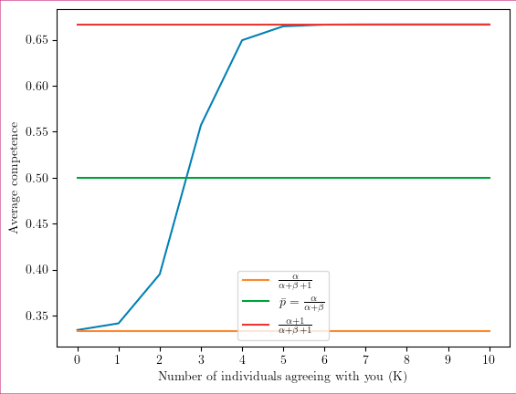

```{r setup, include=FALSE}
# Figure out output format
is_docx <- knitr::pandoc_to("docx") | knitr::pandoc_to("odt")
is_latex <- knitr::pandoc_to("latex")
is_html <- knitr::pandoc_to("html")

# Word-specific things
table_format <- ifelse(is_docx, "huxtable", "kableExtra")  # Huxtable tables
conditional_dpi <- ifelse(is_docx, 300, 300)  # Higher DPI
conditional_align <- ifelse(is_docx, "default", "center")  # Word doesn't support align

# Knitr options
knitr::opts_chunk$set(
  echo = FALSE, warning = FALSE, message = FALSE,
  # tidy.opts = list(width.cutoff = 120),  # Code width
  # fig.retina = 3, dpi = conditional_dpi,
  # fig.width = 7, fig.asp = 0.618,
  # fig.align = conditional_align, out.width = "100%",
  fig.path = "output/figures/",
  cache.path = "output/_cache/",
  fig.process = function(x) {  # Remove "-1" from figure names
    x2 = sub('-\\d+([.][a-z]+)$', '\\1', x)
    if (file.rename(x, x2)) x2 else x
  },
  options(scipen = 99999999)  # Prevent scientific notation
)

# R options
options(
  width = 90,  # Output width
  dplyr.summarise.inform = FALSE,  # Turn off dplyr's summarize() auto messages
  knitr.kable.NA = "",  # Make NAs blank in kables
  kableExtra.latex.load_packages = FALSE,  # Don't add LaTeX preamble stuff
  modelsummary_factory_default = table_format,  # Set modelsummary backend
  modelsummary_format_numeric_latex = "plain"  # Don't use siunitx
)
```

```{r packages, include=FALSE}
# load required packages
library("papaja")      # For APA style manuscript   
library("lme4")        # model specification / estimation
library("lmerTest")    # provides p-values in the output
library("tidyverse")   # data wrangling and visualisation
library("afex")        # anova and deriving p-values from lmer
library("broom")       # extracting data from model fits 
library("broom.mixed") # extracting data from mixed models
library("metafor")     # doing mata analysis
library("metaviz")     # vizualization of meta analysis
library("stringr")     # for dmetar p-curve function to work
library("poibin")      # for dmetar p-curve function to work
library("patchwork")   # put several plots together
library("ggridges")    # for plots
library("gghalves")    # for plots
library("ggbeeswarm")  # Special distribution-shaped point jittering
library("knitr")       # for tables
library("kableExtra")  # also for tables
library("sf")          # for maps
library("ggpubr")      # for combining plots with ggarrange() 
library("viridis")     # for generating color palette for map 
library("grid")        # for image plots   
library("gridExtra")   # for image plots
library("png")         # for image plots
```

```{r functions}
# load plot theme
source("functions/plot_theme.R") 

# load other functions
source("functions/own_functions.R")
```

# Introduction

Imagine that you live in ancient Greece, and a fellow called Eratostenes claims the circumference of the earth is 252000 stades (approximately 40000 kilometers). You know nothing about this man, the circumference of the Earth, or how one could measure such a thing. As a result, you discard Eratostenes' opinion and (mis)take him for a pretentious loon. But what if other scholars had arrived at very similar measurements, independently of Eratosthenes? Or even if they had carefully checked his measurement, with a critical eye? Wouldn't that give you enough ground to believe not only that the estimates might be correct, but also that Eratosthenes and his fellow scholars must be quite bright, to be able to achieve such a feat as measuring the Earth?

In this article, we explore how, under some circumstances, we should, and we do infer that a group of individuals whose answers converge are likely to be correct, and to be competent in the relevant area, even if we had no prior belief about either what the correct answer was, or about these individuals' competence.

We first review experiments testing whether people infer that individuals whose answers converge are more likely to be right, and to be competent. We then argue that little attention has been paid to the normative models that might explain when and why such an inference from convergence to competence is warranted. We develop such models, both analytically and with simulations. Finally, we present a series of experiments in which participants evaluate the competence of individuals in groups as a function of how much they converge on a given answer, in the absence of any priors about these individuals' competence, or what the correct answer is.

## Do people infer that individuals whose answers converge tend to be right, and to be competent?

There are two ways for answers to converge: when the answers are continuous, they can have a smaller range or a lower variance; when the answers are categorical (i.e. there are only a few, often two, options), more can agree on the same answer. These two cases have been studied with different paradigms.

In the continuous case, the most relevant evidence comes from the literature on \'advice-taking.\' In these experiments, participants are called \'judges,\' and they need to make numerical estimates--sometimes on factual knowledge, e.g. \'What year was the Suez Canal opened first? [@yanivReceivingOtherPeople2004], sometimes on knowledge controlled by the experimenters, e.g. 'How many animals were on the screen you saw briefly?' [@mollemanStrategiesIntegratingDisparate2020]. To help answer these questions, participants are given estimates from others, the advisors.

A substantial share of studies using this judge-advisor paradigm is irrelevant for studying inferences from convergence, because they present participants only with single estimates. In some studies, that single estimate is coming from one advisor [e.g. @bednarikEffectivenessImperfectWeighting2015a; @sollStrategiesRevisingJudgment2009; @yanivReceivingOtherPeople2004; @yanivAdviceTakingDecision2000; @harveyTakingAdviceAccepting1997]. In other studies, that estimate is presented as an average coming from a group of advisors [e.g. @jaylesHowSocialInformation2017a; @mannesAreWeWise2009], but no information about the distribution of initial estimates is given. By contrast, advice-taking studies relevant to our argument provide participants with a set of estimates. One subset of these studies manipulate the degree of convergence between groups of advisors, e.g. via the variance of estimates [@mollemanStrategiesIntegratingDisparate2020; @yanivSpuriousConsensusOpinion2009], or their range [@budescuConfidenceAggregationExpert2000; @budescuEffectsAsymmetryAdvisors2003; @budescuAggregationOpinionsBased2007]. These studies find that participants are more confident about, or rely more on, estimates from groups of advisors who converge more. More indirect evidence comes from another subset of studies on outlier opinions. In these studies, participants were presented with sets of estimates where all but one estimate--the outlier--were close to each other [@harriesCombiningAdviceWeight2004], or overlapping, when estimates were intervals [@yanivWeightingTrimmingHeuristics1997, study 3 & 4]. The outlier was defined, for example, as having "[...] a z-score greater than 2.0 and the remaining opinions had z-scores less than 2.0" [@harriesCombiningAdviceWeight2004]. These studies find that participants heavily discount outliers when aggregating estimates. These results are thus consistent with the idea that people rely more on convergent opinions, although testing extreme cases of singular dissident opinions. Yet more indirect evidence comes from experiments that varied convergence of estimates from single advisors [@yanivWeightingTrimmingHeuristics1997, study 1 & 2]. In this study, participants were shown ranges of estimates from two advisors - one with a small range (e.g. 3 to 5), the other with a big range (e.g. 1 to 10). Participants relied more on the precise, small range advice. These results can be interpreted as a case of inferring accuracy from (internal) convergence of single informants, perceived by participants perhaps as consistency or for example confidence. However, in this study, the small-range advisor was always within the range of the big-range adivsor. Consequently, if people relied more on the small-range advisor, then it was likely not only because of greater convergence, but also because of the overlap between the two advisors.

## Categorical choices

For categorical choice contexts, experimental evidence on people inferring accuracy from convergence is scarce. There is an extensive body of literature suggesting that people are susceptible to adopting majority behavior and opinions. But it is is difficult to tear apart whether they do so in a strive for normative conformity or for accuracy [@mercierMajorityRulesHow2019]. However, some aspects of the experimental paradigm should favor motivations for accuracy, for example private answers and individual rewards for accuracy. As for human adults, we are aware of only one article that assessing majority effects using such accuracy motivations: In a series of experiments using such accuracy motivations, @morganEvolutionaryBasisHuman2012 systematically varied the proportion of informants agreeing on a given answer, from 50 to 100%. They found that the larger the (relative) size of the majority, the more likely participants were to adopt the majority answer. As for children, relevant evidence comes from studies on social learning in the field of developmental psychology. Several such studies rely on a similar paradigm revolving around a naming tasks [@fusaroChildrenAssessInformant2008; @corriveauGoingFlowPreschoolers2009; @bernardChildrenWeighNumber2015a; @bernardFourSixYearOldChildren2015; @chenChildrenTrustConsensus2013]. In @corriveauGoingFlowPreschoolers2009, for example, children had to find out which of three unfamiliar objects corresponds to the made up name "modi". Three adult informants pointed to one object, but a fourth adult pointed to a different one. The children were then asked for their opinion. All these studies consistently find that children adopt the majority opinion. It is, however, not clear how the naming paradigm taps into intuitions for inferring accuracy - after all, assigning made-up names to objects has no objectively correct solution and, accordingly, these studies are often interpreted to reveal conformity in children [see e.g. @vanleeuwenConformityItsLookalikes2015]. Other experimental paradigms yield similar results. @morganDevelopmentAdaptiveConformity2015 had children (aged between 3 and 7) count which of two pictures displayed more dots. Among 10 adult informants, they varied the proportion of those agreeing on one picture. They find that children relied more on advice from larger (relative) majorities, although younger children (aged 3 to 4) were only affected in cases where the majority would stand against a single dissident. In @haunMajorityBiasedTransmissionChimpanzees2012, 2-year-olds tried to use an unfamiliar box to deliver a reward. The children were more likely to copy an action demonstrated by three informants rather than a different action demonstrated three times by the same informant. In @herrmannStickScriptEffect2013, children (aged 3 to 6) were required to copy a necklace-making demonstration from video. Children showed more fidelity to the demonstrations after watching two identical demonstrations by two different adults than after watching the same individual twice. In @vanleeuwenDevelopmentHumanSocial2018, children could use a choice box with three different pipes to insert a boll, to then receive a toy. Before using the box, they were shown a video of four other children using the box. Three of these children used one particular pipe, each throwing in one ball and receiving one toy per insertion, sequentially. One additional demonstrator used one of the two other pipes three times in a row, also receiving one toy per insertion. Children were then given one ball and had to chose which pipe to use. Children generally followed the majority choice.

Although the evidence is not conclusive, especially for categorical choice scenarios, the current literature suggests that people believe more convergent opinions to be more accurate. But is this inference sound?

## Standard wisdom of crowds approaches

Literature on the wisdom of crowds provides normative ground for inferring accuracy from others' aggregated opinions [@surowieckiWisdomCrowds2005]. What role does this literature assign to convergence? Here we look at two of the main phenomena that can generate wisdom of crowds effects: averaging, and the CJT.

### Averaging

In the beginning of the 20th century, Francis Galton famously demonstrated accuracy gains from averaging: in his "vox populi" experiment, he asked 787 participants to estimate the weight of an ox, and found the average estimate of an ox weight to be just one pound from reality [@galtonVoxPopuli1907]. Since then, it has been shown both theoretically and empirically that the mean or median answer of a group is typically closer to the truth than the mean individual is [see e.g. @yanivBenefitAdditionalOpinions2004; @mannesWisdomSelectCrowds2014]. For instance, when considering a range of numerical estimates that deviate more or less from a correct answer, the error of the mean answer will always be either lower than the mean error (if the correct answer is within the range of all the answers provided), or the same as the mean error (otherwise) [@larrickIntuitionsCombiningOpinions2006]. In fact, the error of the mean is often uncannily small compared to the mean error, a phenomenon which has allowed averaging to considerably improve performance on a variety of problems ranging from political predictions to medical diagnoses [@surowieckiWisdomCrowds2005].

Averaging works independently of the degree of convergence of a set of estimates. It is not clear how it leads to more accurate results, without making assumptions about the data generating process of these estimates.

[One might ask why talk about averaging at all - good question. I guess just because it happens in a numeric context and is used to justify aggregating opinions. But the link is not straightforward.]

### Condorcet Jury Theorem

In the late 18th Century, Condorcet established a formal argument in favor of large scale majority voting, which would later become known as the Condorcet Jury Theorem (CJT) [@decondorcetEssaiApplicationAnalyse2014]. He demonstrated that, for a binary decision (e.g. correct vs. false), the probability that the majority vote is correct is larger than the probability of each individual being correct. Moreover, as the number of votes increases, the probability that the majority is correct converges towards one. Crucially, the original CJT assumes that (i) each individual has the same probability p to select the correct answer, and (ii) that this probability is at least slightly better than chance (p \> 0.5) (there are also assumptions about the independence and lack of strategic motives, for reviews, see, e.g. @ladhaCondorcetJuryTheorem1992, @austen-smithInformationAggregationRationality1996, @dietrichEpistemicDemocracyDefensible2013).

At least in its basic version, the CJT glosses over variation in convergence, i.e. the relative size of the majority. It allows to make statements such as 'given an individual-level competence p, the probability that a (any) majority vote is correct is Y'. This latter probability comprises votes with 99% majorities as well 51% majorities. To justify inferences of accuracy and competence from convergence, CJT would need to allow making statements such as 'given a majority of X the probability that the majority vote is correct is Y, and the individual-level competence is Z.' In an extension of the CJT, @romeijnLearningJurorCompetence2011 provide normative grounds for making such statements. They show that with increasing relative majority, group members are more likely to be competent and the majority decision to be accurate (??). Their framework is limited, however, to binary decisions.

In sum, the wisdom of crowd literature provides at best insufficient normative grounds for inferring accuracy and competence from convergence. Its main purpose is to justify that aggregating across many opinions is a better strategy than picking any individual's opinion. The proposed aggregation strategies - whether averaging or following the majority - are about extracting wisdom from any crowd. But not all crowds are equally wise. Competence should play a crucial role in the confidence we have in any wisdom of crowd inferences. In the absence of more informative cues, our literature review shows that people place more trust in more convergent crowds. The wisdom of crowd literature does not provide generalizable justification for this behavior.

## Inferring competence from the convergence of opinions

As Eratosthenes' example above illustrates, intuitively it seems there are cases in which we can infer that the members of a group are more likely to be correct, or, equivalently, more competent, when their answers converge. When are we justified to infer that people are right (and thus competent) when they converge?

To provide a normative answer, we built analytical and agent-based models (see \@ref(simulations)). We consider two scenarios in which opinions can converge: a numerical and categorical one. In a numerical setting, we measure convergences by the empirical variance. The closer the estimates, i.e. the smaller the empirical variance, the greater convergence. In the categorical setting, we measure convergence by the share of votes for an option. The larger the share of votes for one option, the greater convergence.

### Numeric

### Categorical

Agents answer a categorical question, with m+1 answers. We define the competence p of an individual as the probability to choose the right answer. Each of the wrong answers has the same probability (1-p)/m to be chosen. We observe the answers of a population of n+1 agents, with diverse levels of competence drawn from a beta distribution -- a flexible probability distribution that can be uniform, unimodal or bimodal, depending on the parameters. We assume that the shape parameters of the beta distribution ($\alpha$ and $\beta$) are known, but the right answer is not. We aim to infer the competence of an individual, based on the population answers. In our analytical model, we use Bayes formula to compute the posterior competence distribution of competence for an individual, knowing that a number K of other participants agree with him. The posterior distribution is a mixture of two beta distributions, Beta($\alpha$+1, $\beta$) and Beta($\alpha$, $\alpha$+1), weighted respectively by the probabilities that K individuals would choose the right or the wrong answer. The model suggests that the more consensual an individual's vote is, the more that individual is estimated to be competent (Fig. \@ref(fig:figure-Benoit)).

(ref:figure-Benoit) Average competence of an informant as a function of K, the number of individuals who agree. In this example, we assume that the number of informants - not counting the focal informant - in a sample is n=10, m=5, and that the population competence ($\alpha$ = $\beta$ = 1).

```{r figure-Benoit, echo=FALSE, fig.cap="(ref:figure-Benoit)", out.width= "50%", fig.align="left"}

```

That said, the average competence is bounded between and $\frac{\alpha}{\alpha+\beta+1}$ and $\frac{\alpha+1}{\alpha+\beta+1}$. In other words, even if all other individuals agree with an informant, a case in which the informant very likely chose the correct answer (add an accuracy figure, maybe?), the competence we should assign to this informant, according to our model, is not higher than $\frac{\alpha+1}{\alpha+\beta+1}$ (or $2/3$ in our example in Fig. \@ref(fig:figure-Benoit)). This counter-intuitive result is due to our framework: we assume that a certain competence distribution as a given, and only observe one decision per individual. Intuitively, in a world where even some highly incompetent people sometimes pick the correct answer by chance, being right (with the majority) once is not a sufficient signal of highest competence.

## Overview experiments

We test whether people infer that the members of a group are correct, and thus likely competent, when their answers converge in two series of experiments. In all experiments, participants see the estimates or choices of different individuals, which we will call informants. Participants were were not given any information about the estimation tasks and the informants - they had no priors.

In the first series (experiment 1 to 3), the scenario is about numerical estimates. In the second series (experiment 4 to 6), the scenario is about categorical choices.

In experiment 1 (numerical) and 4 (categorical), participants evaluated several groups of informants, with each informant providing an answer independently. We manipulated convergence, i.e how close estimates were (Exp. 1, numerical setting), or how consensual an answer was (Exp.4, categorical setting). We found that the more convergence, the more participants inferred accuracy and competence.

In experiments 3 (numerical) and 5 (categorical), we tested whether cues of informational dependency inferences hamper inferences from convergence. Besides convergence, we manipulated whether informants were independent (mimicking experiments 1 and 4) or shared a conflict of interest. We found that (i) participants inferred accuracy and competence from convergence even when informants were in a conflict of interest situation, but (ii) that these inference are more enhanced when informants are independent. Using a slightly different experimental setting, we replicate our results from experiments 1 and 4.

In experiment 2, we tested a different form of informational dependency: informants were either independent informants or "had discussed at great length with each other" before making their estimate. We did not find a difference between the two conditions. This experiment was the only one in which we did not manipulate convergence - all informant groups were convergent.

In experiment 5, we tested whether more choice options (ten vs. three) enhance inferences from convergence. We reasoned that with more options, consensus is less likely to occur by chance, and thus people might find it more impressive. We did not find that the number of choice options altered effects of convergence.

All experiments were pre-registered. Pre-registration documents, data and code can be found on Open Science Framework (OSF, <https://osf.io/6abqy/>). All analyses were conducted in R (version 4.2.2) using R Studio.

## Experiment 1

```{r exp1}
# Analyze data of experiments and store results

# Experiment 1

# read data
exp1 <- read_csv("Experiment_1/data/cleaned.csv") %>% 
  # import experimental variables as factors and set levels
  mutate(
    across(c(convergence, number), ~as.factor(.x)),
    convergence = fct_relevel(convergence, "divergent", "convergent"), 
    number = fct_relevel(number, "small", "large"))

# Hypotheses

# run mixed model (random slope and intercept) with participants as random factor
exp1_model_accuracy = lmer(confidence ~ convergence + number + (1 + convergence | ID), data = exp1)
exp1_model_competence = lmer(competence ~ convergence + number + (1 + convergence | ID), data = exp1)

# extract descriptives for inline reporting
exp1_descriptives <- list(
  # N subjects
  n_subj = n_distinct(exp1$ID),
  # Model results
  model_accuracy = text_ready(exp1_model_accuracy), 
  model_competence = text_ready(exp1_model_competence)
)

# Research questions

# RQ2 (as separate t-test):
accuracy <- t.test(confidence ~ number, data = exp1, paired = TRUE)
competence <- t.test(competence ~ number, data = exp1, paired = TRUE) 

# RQ2 and RQ3 (as single mixed model):

# effect code variables
exp1 <- exp1 %>% 
  mutate(convergence_effect_code = recode(convergence, "divergent" = -0.5, "convergent" = +0.5),
         number_effect_code = recode(number, "small" = -0.5, "large" = +0.5))

model_interaction_competence = lmer(competence ~ convergence_effect_code + number_effect_code +
                                      convergence_effect_code*number_effect_code + 
                                      (1 + convergence_effect_code | ID), data = exp1)

model_interaction_accuracy = lmer(confidence ~ convergence_effect_code + number_effect_code +
                                    convergence_effect_code*number_effect_code + 
                                    (1 + convergence_effect_code | ID), data = exp1)

# Exploratory analysis: Is effect of convergence bigger on accuracy then on competence? 
exp1_explorative <- exp1 %>% 
  pivot_longer(
    c(confidence, competence),
    names_to = "outcome", 
    values_to = "score") %>% 
  # effect code variables
  mutate(outcome_effect_code = recode(outcome, "confidence" = -0.5, "competence" = +0.5)
         )

# run mixed model (random slope and intercept) with participants as random factor
exploratory_analysis <- lmer(score ~ convergence_effect_code + outcome + 
                               convergence_effect_code*outcome + 
                               (1 + convergence_effect_code + outcome | ID), 
                             data = exp1_explorative)

exp1_research_questions <- list(
  # speparate t-tests for RQ2
  means = exp1 %>% 
    group_by(number) %>% 
    summarise(across(c(confidence, competence), 
                     mean)) %>% 
    rounded_numbers() %>% 
    split(.$number), 
  accuracy = clean_t_test(accuracy), 
  competence = clean_t_test(competence),
  # RQ2 and RQ3 in a single mixed model
  model_interaction_competence = text_ready(model_interaction_competence), 
  model_interaction_accuracy = text_ready(model_interaction_accuracy),
  # Exploratory analysis
  exploratory_analysis = text_ready(exploratory_analysis)
)
```

## RQ3 - Interaction between number and convergence on competence

The first experiment was designed to test the effect of convergence on the (average) perceived accuracy of estimates (H1) and the perceived competence of a group of informants (H2). We decided to measure accuracy as confidence in one's estimate based on a group of informants estimates. Our two hypotheses therefore read:

***H1: When making a guess based on the estimates of (independent) informants, participants will be more confident about their guess when these estimates converge compared to when they diverge.***

***H2: Participants perceive (independent) informants whose estimates converge more as more competent than informants whose estimates diverge.***

We had three additional research questions about the number of informants:

***RQ1: Do H1 and H2 hold for both a small [3] and a large [10] number of estimates?***

***RQ2: When making a guess based on the opinions of (independent) informants, will participants be more confident about their guess when there is a larger number of estimates compared to when this number is smaller?***

***RQ3: Is there an interaction effect between the number of estimates and convergence on perceived competence of informants?***

### Participants

We recruited `r exp1_descriptives$n_subj` participants from the UK via Prolific. Not a single participant failed our attention check. The sample size was determined on the basis of a power analysis for a t-test to detect the difference between two dependent means ("matched pairs") run on G\*Power3. The analysis suggested that a combined sample of 199 would provide us with 80% power to detect a true effect size of Cohen's d $\geq$ 0.2 (alpha = .05, two-tailed).

### Procedure

After providing their consent to participate in the study and passing an attention check, participants read the following introduction: "Some people are playing games in which they have to estimate various quantities. Each game is different. You have no idea how competent the people are: they might be completely at chance, or be very good at the task. It's also possible that some are really good while others are really bad. Some tasks might be hard while others are easy. Across various games, we will give you the answers of several players, and ask you questions about how good they are. As it so happens, for all the games, the estimates have to be between 1000 and 2000, but all the games are completely different otherwise, and might require different skills, be of different difficulties, etc. Each player in the game makes their own estimate, completely independent of the others". They were then presented to the results of eight such games and had to answer questions (Fig.1).

(ref:stimulus-exp1) Results of one of eight games that participants have to rate. The stimulus corresponds to a convergent, 10 players condition

```{r stimulus-exp1, echo=FALSE, fig.cap="(ref:stimulus-exp1)", out.width= "50%", fig.align="center"}
knitr::include_graphics("figures/example_stimulus_exp1.png")
```

#### Design

We manipulated two experimental factors: First, the convergence of the estimates (how close they were); second, the number of estimates (how many players there were). We did not make explicit hypotheses on the latter, but included some research questions (cf. pre-registration document). Each factor had two levels: convergent vs. divergent and low (three) vs. high (ten). We used a 2(convergence: divergent/convergent) x 2(number: low/high) within-participant design, with each participant seeing all of the conditions. Per condition, participants saw two sets of estimates (game results). Thus, each participant saw eight sets of estimates in total.

#### Materials

We generated sets of estimates with random draws from normal distributions. First, we varied the standard deviation of these distributions to simulate the degree of convergence (150 for divergence, 20 for convergence; estimate scale ranged from 1000 to 2000). Second, we varied the number of draws (either three or 10) from these distributions. For each of the four possible resulting conditions, we generated two random draws from the respective normal distribution. More information on how the stimuli were created can be found in Appendix \@ref(exp1).

#### Dependent variables

For each set of estimates participants responded to several questions. We first asked participants to make a guess about the correct answer based on the estimates they see ("What would you guess is the correct answer, if there is one?"). Participants indicated their numeric guess using a slider on a line identical with the one they saw the estimates on. We did not analyze those guesses. They merely served as a basis for the next question, intended to measure perceived accuracy: "How confident are you that your answer is at least approximately correct?" on a 7-point Likert scale ("not confident at all" to "extremely confident")[^1]. Finally, participants were asked about the competence of the group of players whose estimates they saw: "On average, how good do you think these players are at the game?"), also on a 7-point Likert scale (from "not good at all" to "extremely good").

[^1]: We changed this measure in study 3. Participants did not make a guess and were asked "How accurate do you think...". The results are very similar.

### Results and discussion

To account from dependencies of observations due to our within-participant design, we ran mixed models, with random intercept and random slopes of convergence for participants, using the `lme4` package and its `lmer()` function in R. In the models for our hypotheses, we control for the number of estimates (our second experimental factor). Visualizations and descriptive statistics can be found in Appendix \@ref(exp1). We find a positive effect of convergence on accuracy: Participants were more confident about their estimate in convergent scenarios ($\Delta$ Accuracy = `r exp1_descriptives$model_accuracy$convergenceconvergent$estimate` `r exp1_descriptives$model_accuracy$convergenceconvergent$ci`, p = `r exp1_descriptives$model_accuracy$convergenceconvergent$p.value`) than in divergent ones (Accuracy = `r exp1_descriptives$model_accuracy$intercept$estimate` `r exp1_descriptives$model_accuracy$intercept$ci`, p = `r exp1_descriptives$model_accuracy$intercept$p.value`). We also find a positive effect of convergence on competence: participants rated players as more competent in convergent scenarios ($\Delta$ Competence = `r exp1_descriptives$model_competence$convergenceconvergent$estimate` `r exp1_descriptives$model_competence$convergenceconvergent$ci`, p = `r exp1_descriptives$model_competence$convergenceconvergent$p.value`) than in divergent ones (Competence = `r exp1_descriptives$model_competence$intercept$estimate` `r exp1_descriptives$model_competence$intercept$ci`, p = `r exp1_descriptives$model_competence$intercept$p.value`).

To test our research questions, we ran the same mixed-models but this time including an interaction between number of informants and convergence. We use effect-coded versions of our variables, allowing us to detect main effects for each factor. As for RQ2, pooling across convergent and divergent conditions, we find a main effect of number, such that participants had more confidence in their estimate when they relied on ten informants compared to three informants (beta = `r exp1_research_questions$model_interaction_accuracy$number_effect_code$estimate` `r exp1_research_questions$model_interaction_accuracy$number_effect_code$ci`, p = `r exp1_research_questions$model_interaction_accuracy$number_effect_code$p.value`). As for RQ3, we find an interaction between number and convergence regarding competence: participants perceived ten informants as slightly more competent than three informants in convergent scenarios, but not in divergent ones (beta = `r exp1_research_questions$model_interaction_competence$interaction$estimate` `r exp1_research_questions$model_interaction_competence$interaction$ci`, p = `r exp1_research_questions$model_interaction_competence$interaction$p.value`). There was no interaction regarding accuracy (beta = `r exp1_research_questions$model_interaction_accuracy$interaction$estimate` `r exp1_research_questions$model_interaction_accuracy$interaction$ci`, p = `r exp1_research_questions$model_interaction_accuracy$interaction$p.value`)

In an exploratory, not pre-registered analysis, we tested whether the effect of convergence is bigger on accuracy than on competence. To do so, we regressed the outcome score on convergence and it's interaction with a binary variable indicating which outcome was asked for (accuracy or competence). We find that pooled across divergent and convergent conditions, participants rated participants reported lower perceived accuracy than competence (beta = `r exp1_research_questions$exploratory_analysis$outcomeconfidence$estimate` `r exp1_research_questions$exploratory_analysis$outcomeconfidence$ci`, `r exp1_research_questions$exploratory_analysis$outcomeconfidence$p.value`). However, we do not find an interaction effect indicating a difference of this effect between convergent and divergent conditions (beta = `r exp1_research_questions$exploratory_analysis$interaction$estimate` `r exp1_research_questions$exploratory_analysis$interaction$ci`, `r exp1_research_questions$exploratory_analysis$interaction$p.value`).

In summary, as predicted, participants were more confident when the estimates were more convergent, which indicates they believed the estimates to have been more accurate, and they thought the individuals who had made more convergent estimates were more competent.

## Experiment 2

```{r exp2}
# Analyze data of experiments and store results

# Experiment 2

# read data
exp2 <- read_csv("Experiment_2/data/cleaned.csv") %>% 
  # import experimental variable as factors and set levels
  mutate(
    independence = as.factor(independence),
    independence = fct_relevel(independence, "dependent", "independent")
  )

# run mixed model (random intercept) with participants as random factor
exp2_model_accuracy = lmer(confidence ~ independence + (1 |ID), data = exp2)
exp2_model_competence = lmer(competence ~ independence + (1 |ID), data = exp2)

# extract descriptives for inline reporting
exp2_descriptives <- list(
  # N subjects
  n_subj = n_distinct(exp2$ID),
  # Model results
  model_accuracy = text_ready(exp2_model_accuracy), 
  model_competence = text_ready(exp2_model_competence)
)
```

It is rational to infer that convergent estimates are more likely to be accurate, and to have been made by competent individuals, only if the convergence is best explained by the accuracy of the estimates. However, convergence could also be the outcome of other factors. If the individuals do not make their estimates independently of each other, a single individual might exert a strong influence on the others, making their convergence a poor cue to their accuracy. Alternatively, all individuals might have an incentive to provide a similar, but not accurate answer. In Experiment 2, we investigate the first possibility, and the second in Experiment 3. In particular, for Experiment 2 we rely on past results showing that participants, under some circumstances, put less weight on opinions that have been formed through discussion, by contrast with more independent opinions [@harkinsInformationUtilityMultiple1987; see also @lopesSocialValidationEveryday2007; @hessPsychologicalAdaptationsAssessing2006; @einavThinkingThemselvesEffect2018]. We sought to replicate this finding in the context of convergent estimates, formulating the following hypotheses:

***H1: When making a guess based on convergent estimates of informants, participants will be more confident about their guess when informants were independent compared to when they weren't (i.e. they could discuss before).***

***H2: Participants perceive informants whose estimates converge as more competent when they are independent, compared to when they weren't (i.e. they could discuss before).***

### Participants

We recruited `r exp2_descriptives$n_subj` participants from the UK via Prolific. Not a single participant failed our attention check. As for experiment 1, the sample size was determined on the basis of a power analysis for a t-test to detect the difference between two dependent means ("matched pairs") run on G\*Power3. The analysis suggested that a combined sample of 199 would provide us with 80% power to detect a true effect size of Cohen's d $\geq$ 0.2 (alpha = .05, two-tailed).

### Design

In a within-participants design, participants saw both an independence condition, in which they were told "Players are asked to make completely independent decisions -- they cannot see each other's estimates, or talk with each other before giving their estimates," and a dependence condition, in which they were told "Players are asked to talk with each other about the game at length before giving their estimates."

#### Stimuli

We used the materials generated for the convergent condition of Experiment 1. By contrast to experiment one, participants saw only two stimuli in total (one set of estimates per condition). Otherwise, we proceeded just as in experiment one: we randomly assigned individual participants to one of the three series of stimuli, and for each participant, we randomized the order of appearance of conditions.

#### Dependent variables

We relied on the same set of questions as in experiment one.

### Results and discussion

To account for dependencies of observations due to our within-participant design, we ran mixed models, with a random intercept for participants, using the `lme4` package and its `lmer()` function in R. Visualizations and descriptive statistics can be found in Appendix \@ref(exp2). The data does not support our hypotheses. Participants were slightly less confident about their estimates when the converging informants were independent $\Delta$ Accuracy = `r exp2_descriptives$model_accuracy$independenceindependent$estimate` `r exp2_descriptives$model_accuracy$independenceindependent$ci`, p = `r exp2_descriptives$model_accuracy$independenceindependent$p.value`), compared to when they discussed (Accuracy = `r exp2_descriptives$model_accuracy$intercept$estimate` `r exp2_descriptives$model_accuracy$intercept$ci`, p = `r exp2_descriptives$model_accuracy$intercept$p.value`). The effect is small, but in the opposite direction of what we had predicted. We do not find an effect regarding competence.

Contrary to the hypotheses, participants did not deem convergent estimates made after a discussion, compared to independently, to be less accurate, or made by less competent individuals. This suggests that participants might not be sensitive to at least some forms of informational dependency between the individuals making the estimates. Although previous studies have found that participants sometimes discount the opinions of groups compared to those of independent individuals, the superior performance of groups over individuals for a range of tasks [for review, see, e.g., @mercierArgumentativeTheoryPredictions2016a], including numerical estimates [e.g. @mercierDoesDiscussionMake2022] suggests that this discounting might have been misguided. As a result, the participants in the current experiment might have been behaving rationally when they did not discount the estimates made after discussion.

## Experiment 3

```{r exp3}
# Analyze data of experiments and store results

# Experiment 3

# read data
exp3 <- read_csv("Experiment_3/data/cleaned.csv") %>% 
  # import experimental variable as factors and set levels
  mutate(
    across(c(convergence, independence), ~as.factor(.x)),
    convergence = fct_relevel(convergence, "divergent", "convergent"),
    independence = fct_relevel(independence, "conflict", "independent")
  )

# H1
# run mixed model (random intercept and slope for convergence) with participants as random factor
# use only those participants assigned to the independence condition
exp3_model_h1_accuracy = lmer(accuracy ~ convergence + (1 + convergence |ID), 
                           data = exp3 %>% filter(independence == "independent"))
exp3_model_h1_competence = lmer(competence ~ convergence + (1 + convergence |ID), 
                             data = exp3 %>% filter(independence == "independent"))

# H2
# run mixed model (random intercept and slope for convergence) with participants as random factor
exp3_model_accuracy = lmer(accuracy ~ convergence + independence + 
                            convergence*independence + (1 + convergence | ID), 
                           data = exp3)

exp3_model_competence = lmer(competence~ convergence + independence + 
                            convergence*independence + (1 + convergence | ID), 
                           data = exp3)

# extract descriptives for inline reporting
exp3_descriptives <- list(
  # N subjects
  n_subj = n_distinct(exp3$ID),
  # Model results
  model_h1_accuracy = text_ready(exp3_model_h1_accuracy), 
  model_h1_competence = text_ready(exp3_model_h1_competence),
  model_accuracy = text_ready(exp3_model_accuracy), 
  model_competence = text_ready(exp3_model_competence)
)
```

Experiment 3 tests whether participants are sensitive to another potential source of dependency between convergent estimates: when the individuals making the estimate share an incentive to bias their estimates in a given direction, independently of its accuracy. Even though it is formally similar to Experiment 1, the setting is different, as participants were told that they would be looking at (fictional) predictions of experts for stock values, instead of the answers of individuals in abstract games. In the conflict of interest condition, the experts had an incentive to value the stock in a given way, while they had no such conflict of interest in the independence condition. Given the nature of this manipulation, participants might have discounted the opinions of the conflicted experts, irrespective of the degree of convergence of their estimates. As a result, we could not directly compare the participants' answers across conditions. Instead, we must test whether the effect of greater convergence is reduced when the individuals making the estimates are systematically biased, compared to when they are not. On this basis, we formulate four hypotheses, two which are identical to those of Experiment 1, and only apply in the independent condition, and two that bear on the comparison between the conditions.

***H1a: Participants perceive predictions of independent informants as more accurate when they converge compared to when they diverge.***

***H1b: Participants perceive independent informants as more competent when their predictions converge compared to when they diverge.***

***H2a: The effect of convergence on accuracy (H1a) is more positive in a context where informants are independent compared to when they are in a conflict of interest.***

***H2b: The effect of convergence on competence (H1b) is more positive in a context where informants are independent compared to when they are in a conflict of interest.***

### Participants

The interaction design of our third experiment made the power analysis more complex and less standard than for experiments one and two. Because we could build upon data from the first experiment, we ran a power analysis by simulation. The simulation code is available on OSF, and the procedure is described in the pre-registration document. The simulation suggested that 100 participants provide a significant interaction term between 95% and 97% of the time, given an alpha threshold for significance of 0.05. Due to uncertainty about our effect size assumptions and because we had resources for a larger sample, we recruited `r exp3_descriptives$n_subj` participants for this study -- again, from the UK and via Prolific. Again, not a single participant failed our attention check.

### Procedure

After providing their consent to participate in the study and passing an attention check, participants read the following introduction: "You will see four scenarios in which several experts predict the future value of a stock. You have no idea how competent the experts are. It's also possible that some are really good while others are really bad. As it so happens, in all scenarios, the predictions for the value of the stock have to lie between 1000 and 2000. Other than that, the scenarios are completely unrelated: it is different experts predicting the values of different stocks every time." Participants then saw the four scenarios, each introduced by a text according to which condition the participant was assigned to. To remove any potential ambiguity about participants' inferences on the accuracy of the estimates, we replaced the question about confidence to one bearing directly on accuracy: "On average, how accurate do you think these three predictions are?" on a 7-point Likert scale ("not accurate at all" to "extremely accurate"). The question about competence read: "On average, how good do you think these three experts are at predicting the value of stocks?", also assessed on a 7-point Likert scale (from "not good at all" to "extremely good").

#### Design

We manipulated two factors: informational dependency (two levels, independence and conflict of interest; between participants) and convergence (two levels, convergence and divergence; within participants). In the independence condition, the participants read "Experts are independent of each other, and have no conflict of interest in predicting the stock value - they do not personally profit in any way from any future valuation of the stock." In the conflict of interest condition, the participants read "All three experts have invested in the specific stock whose value they are predicting, and they benefit if other people believe that the stock will be valued at [mean of respective distribution] in the future." The distributions presented were similar to those of Experiment 1, although generated in a slightly different manner (see Appendix \@ref(exp3)).

### Results and discussion

To account for dependencies of observations due to our within-participant design, we ran mixed models, with a random intercept and a random slope for convergence for participants, using the `lme4` package and its `lmer()` function in R. Figure \@ref(fig:exp3-plot) visualizes the results.

We find evidence all four hypotheses. As for the first set of hypotheses, to match the setting of experiment one, we reduced the sample of experiment three to half of the participants, namely those who were assigned to the independence condition. On this reduced sample, we ran the exact same analyses as in experiment 1 and replicated the results (see left side of Fig. \@ref(fig:exp3-plot)). We find a positive effect of convergence on accuracy ($\Delta$ Accuracy = `r exp3_descriptives$model_h1_accuracy$convergenceconvergent$estimate` `r exp3_descriptives$model_h1_accuracy$convergenceconvergent$ci`, p = `r exp3_descriptives$model_h1_accuracy$convergenceconvergent$p.value`; baseline Accuracy divergent: `r exp3_descriptives$model_h1_accuracy$intercept$estimate` `r exp3_descriptives$model_h1_accuracy$intercept$ci`, p = `r exp3_descriptives$model_h1_accuracy$intercept$p.value`). We find very similar results for competence ($\Delta$ Competence = `r exp3_descriptives$model_h1_competence$convergenceconvergent$estimate` `r exp3_descriptives$model_h1_competence$convergenceconvergent$ci`, p = `r exp3_descriptives$model_h1_competence$convergenceconvergent$p.value`; baseline Competence divergent: `r exp3_descriptives$model_h1_competence$intercept$estimate` `r exp3_descriptives$model_h1_competence$intercept$ci`, p = `r exp3_descriptives$model_h1_competence$intercept$p.value`).

The second set of hypotheses targeted the interaction of informational dependency and convergence (for a visual representation of these interactions, see Fig. \@ref(fig:exp3-plot)). In the independence condition, the effect of convergence on accuracy was more positive ($\Delta$ Convergence = `r exp3_descriptives$model_accuracy$interaction$estimate` `r exp3_descriptives$model_accuracy$interaction$ci`, p = `r exp3_descriptives$model_accuracy$interaction$p.value`) than in the conflict of interest condition (Convergence = `r exp3_descriptives$model_accuracy$convergenceconvergent$estimate` `r exp3_descriptives$model_accuracy$convergenceconvergent$ci`, p = `r exp3_descriptives$model_accuracy$convergenceconvergent$p.value`). Likewise the effect of convergence on competence is more positive ($\Delta$ Convergence = `r exp3_descriptives$model_competence$interaction$estimate` `r exp3_descriptives$model_competence$interaction$ci`, p = `r exp3_descriptives$model_competence$interaction$p.value`) than in the conflict of interest condition (Convergence = `r exp3_descriptives$model_competence$convergenceconvergent$estimate` `r exp3_descriptives$model_competence$convergenceconvergent$ci`, p = `r exp3_descriptives$model_competence$convergenceconvergent$p.value`).

(ref:exp3-plot) Distributions of accuracy and competence by convergence and informational dependency.

```{r exp3-plot, fig.cap="(ref:exp3-plot)"}
interaction_accuracy <- ggplot(exp3, aes(x=independence, y=accuracy, fill = convergence, 
                     shape = convergence,
                     group = convergence,
                     color = convergence)) +
  scale_x_discrete(limits = c("conflict", "independent"), 
                    labels = c("Conflict of interest", "Independent")) +
  geom_half_violin(data = exp3 %>% filter(independence=="conflict"), 
                   position = position_nudge(x = -.2), adjust=2, alpha = .4,
                   side = "l") +
  geom_half_violin(data = exp3 %>% filter(independence=="independent"), 
                   position = position_nudge(x = .2), adjust=2, alpha = .4,
                   side = "r") + 
  xlab("Condition") +
  ylab("Accuracy") +
  scale_y_continuous(breaks=c(1,2,3,4,5,6,7)) +
  stat_summary(fun = "mean", geom = "point", size = 3) +
  stat_summary(fun = "mean", geom = "line") +
  stat_summary(fun.data = "mean_se", geom = "errorbar", width = .2) +
  scale_fill_manual(name = NULL,
    labels = c("divergent", "convergent"),
    values = c("#E69F00", "#56B4E9")) +
  scale_color_manual(name = NULL,
    labels = c("divergent", "convergent"),
    values = c("#E69F00", "#56B4E9")) +
  guides(shape = "none",
         fill = guide_legend(title = NULL)) +
  plot_theme +
  # change font sizes
  theme(axis.text = element_text(size = 10)) +
  theme(axis.title = element_text(size = 15)) +
  theme(legend.text = element_text(size = 10))

interaction_competence <- ggplot(exp3, aes(x=independence, y=competence, 
                                        fill = convergence, 
                                        shape = convergence, 
                                        group = convergence, 
                                        color = convergence)) +
  scale_x_discrete(limits = c("conflict", "independent"), 
                    labels = c("Conflict of interest", "Independent")) +
  geom_half_violin(data = exp3 %>% filter(independence=="conflict"), 
                   position = position_nudge(x = -.2), adjust=2, alpha = .4,
                   side = "l") +
  geom_half_violin(data = exp3 %>% filter(independence=="independent"), 
                   position = position_nudge(x = .2), adjust=2, alpha = .4,
                   side = "r") + 
  xlab("Condition") +
  ylab("Competence")+
  scale_y_continuous(breaks=c(1,2,3,4,5,6,7)) +
  stat_summary(fun = "mean", geom = "point", size = 3) +
  stat_summary(fun = "mean", geom = "line") +
  stat_summary(fun.data = "mean_se", geom = "errorbar", width = .2) +
  scale_fill_manual(name = NULL,
    labels = c("divergent", "convergent"),
    values = c("#E69F00", "#56B4E9")) +
  scale_color_manual(name = NULL,
    labels = c("divergent", "convergent"),
    values = c("#E69F00", "#56B4E9")) +
  guides(shape = "none") +
  plot_theme +
  # change font sizes
  theme(axis.text = element_text(size = 10)) +
  theme(axis.title = element_text(size = 15)) +
  theme(legend.text = element_text(size = 10)) 


figure <- ggarrange(interaction_accuracy, interaction_competence, 
                    common.legend = T) +
  theme(legend.position="top") 
figure
```

Experiment 3 shows that, when the individuals making the estimates are systematically biased, then participants put less weight on the convergence of their estimates to infer that the estimates are accurate, and that the individuals making them are competent.

*Cut this transition out probably*: \_\_\_\_\_\_\_ \# Categorical estimates: Experiments 4 to 6

In the first series of experiments (experiments 1-3) we tested inferences from convergence in a numerical choice setting: Participants saw (fictive) players' numeric estimates on a scale from 1000 to 2000. The degree of convergence varied by the distance between estimates.

In the second series of experiments (experiments 4-6), we test inferences from convergence in a categorical choice setting. In the categorical scenario, the fictive players make choices on a set of response options (i.e. categories). Convergence varies by the ratio of people agreeing on an option. Experiment four and five can be considered robustness checks as to whether the results of the first series hold in a categorical choice setting. Experiment six tests a new context factor: the number of choice options. \_\_\_\_\_\_

## Experiment 4

```{r exp4}
# Analyze data of experiments and store results

# Experiment 4

# read data
exp4 <- read_csv("Experiment_4/data/cleaned.csv") %>% 
  # import experimental variable as factor and set levels
  mutate(
    # set levels for `convergence`
    convergence_categorical = recode_factor(convergence, 
                                            `0` = "opposing majority", 
                                            `1` = "divergence", 
                                            `2` = "majority", 
                                            `3` = "consensus",
                                            .default = NA_character_))

# run mixed model (random slope and intercept) with participants as random factor
exp4_model_accuracy = lmer(accuracy ~ convergence + (1 + convergence | id), 
                                 data = exp4)
exp4_model_competence = lmer(competence ~ convergence + (1 + convergence | id), 
                                 data = exp4)

# extract descriptives for inline reporting
exp4_descriptives <- list(
  # N subjects
  n_subj = n_distinct(exp1$ID),
  # Model results
  model_accuracy = text_ready(exp4_model_accuracy), 
  model_competence = text_ready(exp4_model_competence)
)
```

In a second series of experiments, we test similar predictions to those of the previous experiments, but in a categorical choice context. The set-up is similar to that of Experiment 1, except that the outcomes seen by the participants are not numerical estimates, but choices made between a few options. In Experiment 4 tests hypotheses that are analogous to those of Experiment 1:

***H1: Participants perceive an estimate of an independent informant as more accurate the more it converges with the estimates of other informants.***

***H2: Participants perceive an independent informant as more competent the more their estimate converges with the estimates of other informants.***

### Participants

We ran a power simulation to inform our choice of sample size. All assumptions and details on the procedure can be found on the OSF. We ran two different power analyses, one for each outcome variable. We set the power threshold for our experiment to 90%. The power simulation for `accuracy` suggested that even for as few as 10 participants (the minimum sample size we simulated data for), we would have a power of close to 100%. The simulation for `competence` suggested that we achieve statistical power of at least 90% with a sample size of `30`. Due to uncertainty about our assumptions and because it was within our budget, we recruited `r exp4_descriptives$n_subj` participants.

### Procedure

After providing their consent to participate in the study and passing an attention check, participants read the following introduction: "To be able to understand the task, please read the following instructions carefully: Some people are playing games in which they have to select the correct answer among three answers. You will see the results of several of these games. Each game is different, with different solutions and involving different players. All players answer independently of each other. At first, you have no idea how competent each individual player is: they might be completely at chance, or be very good at the task. It's also possible that some players are really good while others are really bad. Some games might be difficult while others are easy. Your task will be to evaluate the performance of one of the players based on what everyone's answers are." They were then presented to the results of eight such games and had to answer questions (see Fig. \@ref(fig:stimulus-exp4)). To assess perceived accuracy, we asked: "What do you think is the probability of player 1 being correct?". Participants answered with a slider on a scale from 0 to 100. To assess perceived competence, we asked participants: "How competent do you think player 1 is in games like these?" Participants answered on a 7-point Likert scale (from (1)"not competent at all" to (2)"extremely competent").

(ref:stimulus-exp4) One set of stimuli by level of convergence. In the study, we used as second set of stimuli where each constellation was mirrored. A full set of stimuli can be found in Appendix \@ref(exp4).

```{r stimulus-exp4, echo=FALSE, fig.cap="(ref:stimulus-exp4)"}
# Function to create a plot with image and title
create_image_plot <- function(image_path, title) {
  img <- rasterGrob(readPNG(image_path), interpolate = TRUE)
  title_grob <- textGrob(title, gp = gpar(fontsize = 8, fontface = "bold"))

  # Combine image and title in a single plot
  plot <- ggplot() +
    annotation_custom(img, xmin = 0, xmax = 1, ymin = 0, ymax = 1) +
    annotation_custom(title_grob, xmin = 0, xmax = 1, ymin = 1, ymax = 1) +
    theme_void()  # Set the panel background to be transparent

  return(plot)
}

# File paths to four images
image_paths <- c(
  "Experiment_4/figures/stimuli/opp_majority_a.png",
  "Experiment_4/figures/stimuli/divergence_a.png",
  "Experiment_4/figures/stimuli/majority_a.png",
  "Experiment_4/figures/stimuli/consensus_a.png"
)

# Titles for the images
image_titles <- c(
  "minority (0)", 
  "dissensus (1)", 
  "majority (2)", 
  "consensus (3)"
)

# Create a list of plots
plots <- lapply(seq_along(image_paths), function(i) {
  create_image_plot(image_paths[i], image_titles[i])
})

# Arrange the plots in a grid
grid.arrange(grobs = plots, ncol = 2)
```

#### Design

We manipulated convergence by varying the ratio of players choosing the same response as a focal player (i.e. the one that participants evaluate). The levels of convergence are: (i) consensus, where all three players pick the same option [`coded value = 3`]; (ii) majority, where either the third or second player picks the same option as the first player [`coded value = 2`]; (iii) dissensus, where all three players pick different options [`coded value = 1`]; (iv) majority against the focal player's estimate, where the second and third player pick the same option, but one that is different from the first player's choice [`coded value = 0`]. In our analysis, we treat convergence as a continuous variable, assigning the values in squared parenthesis.

Convergence was manipulated within participants. All participants saw all four conditions, with two stimuli per condition. Each participant therefore saw eight stimuli in total (4 convergence levels x 2 stimuli).

### Results and discussion

To account from dependencies of observations due to our within-participant design, we ran mixed models, with random intercept and random slope for participants, using the `lme4` package and its `lmer()` function in R. Figure \@ref(fig:exp4-plot) visualizes the results and table \@ref(tab:exp4-table) contains descriptive results.

As in the numerical setting, we found a positive effect of convergence on both accuracy (Accuracy = `r exp4_descriptives$model_accuracy$convergence$estimate` `r exp4_descriptives$model_accuracy$convergence$ci`, p = `r exp4_descriptives$model_accuracy$convergence$p.value`; on a scale from 0 to 100) and competence (Competence = `r exp4_descriptives$model_competence$convergence$estimate` `r exp4_descriptives$model_competence$convergence$ci`, p = `r exp4_descriptives$model_competence$convergence$p.value`; on a scale from 1 to 7).

(ref:exp4-plot) Distributions of accuracy and competence by level of convergence.

```{r exp4-plot, fig.cap="(ref:exp4-plot)"}
# plot for accuracy
plot_accuracy <- ggplot(exp4,
       aes(x = convergence_categorical, y = accuracy, fill = convergence_categorical)) +
  geom_half_violin(position = position_nudge(x = -.2),
                   adjust=2, alpha = .8,
                   side = "l") +
  stat_summary(fun = "mean", geom = "point", size = 1, shape = 21) +
  stat_summary(fun = "mean", geom = "line", size = 1, linetype = "dashed") +
  stat_summary(fun.data = "mean_se", geom = "errorbar", width = .2) +
  # Add nice labels
  labs(x = "Convergence", y = "Accuracy") +
  scale_fill_viridis_d(option = "plasma", begin = 0.1) +
  guides(fill = FALSE) +
  plot_theme + 
  theme(axis.text.x = element_text(angle = 20, hjust = 1))

# plot for competence
plot_competence <- ggplot(exp4,
       aes(x = convergence_categorical, y = competence, fill = convergence_categorical)) +
  geom_half_violin(position = position_nudge(x = -.2),
                   adjust=2, alpha = .8,
                   side = "l") +
  stat_summary(fun = "mean", geom = "point", size = 1, shape = 21) +
  stat_summary(fun = "mean", geom = "line", size = 1, linetype = "dashed") +
  stat_summary(fun.data = "mean_se", geom = "errorbar", width = .2) +
  # Add nice labels
  scale_y_continuous(limits = c(1,7), breaks = seq(1,7)) +
  labs(x = "Convergence", y = "Competence") +
  scale_fill_viridis_d(option = "plasma", begin = 0.1) +
  guides(fill = FALSE) +
  plot_theme + 
  theme(axis.text.x = element_text(angle = 20, hjust = 1))

plot_accuracy + plot_competence
```

## Experiment 5

```{r exp5}
# Analyze data of experiments and store results

# Experiment 5

# read data
exp5 <- read_csv("Experiment_5/data/cleaned.csv") %>% 
  # import experimental variable as factor and set levels
  mutate(
    # set levels for `convergence`
    convergence_categorical = recode_factor(convergence, 
                                            `0` = "opposing majority", 
                                            `1` = "divergence", 
                                            `2` = "majority", 
                                            `3` = "consensus",
                                            .default = NA_character_))

# H1
# run mixed model (random intercept and slope for convergence) with participants as random factor
# use only those participants assigned to the independence condition
exp5_model_h1_accuracy = lmer(accuracy ~ convergence + (1 + convergence | id), 
                              data = exp5 %>% filter(independence == "independent"))
exp5_model_h1_competence = lmer(competence ~ convergence + (1 + convergence | id), 
                              data = exp5 %>% filter(independence == "independent"))

# H2 
# run mixed model (random slope and intercept) with participants as random factor
exp5_model_accuracy = lmer(accuracy ~ convergence + independence + 
                            independence*convergence + (1 + convergence | id), 
                       data = exp5)
exp5_model_competence = lmer(competence ~ convergence + independence + 
                            independence*convergence + (1 + convergence | id), 
                       data = exp5)

# extract descriptives for inline reporting
exp5_descriptives <- list(
  # N subjects
  n_subj = n_distinct(exp1$ID),
  # Model results
  model_h1_accuracy = text_ready(exp5_model_h1_accuracy), 
  model_h1_competence = text_ready(exp5_model_h1_competence),
  model_accuracy = text_ready(exp5_model_accuracy), 
  model_competence = text_ready(exp5_model_competence)
)
```

Experiment 5 is a conceptual replication of Experiment 3 in the categorical instead of numerical case: are participants less likely to infer that more convergent estimates are more accurate, and the individuals who made them more competent, when the estimates are made by individuals with a conflict of interest pushing them to all provide a given answer, compared to when they are made by independent participants? The independence condition of Experiment 5 also serves as a replication of Experiment 4, leading to the following hypotheses:

***H1a: Participants perceive an estimate of an independent informant as more accurate the more it converges with the estimates of other informants.***

***H1b: Participants perceive an independent informant as more competent the more their estimate converges with the estimates of other informants.***

***H2a: The effect of convergence on accuracy (H1a) is more positive in a context where informants are independent compared to when they are biased (i.e. share a conflict of interest to pick a given answer).***

***H2b: The effect of convergence on competence (H1b) is more positive in a context where informants are independent compared to when they are biased (i.e. share a conflict of interest to pick a given answer).***

### Participants

We ran a power simulation to inform our choice of sample size. All assumptions and details on the procedure can be found on the OSF. We ran two different power analyses, one for each outcome variable. We set the power threshold for both to 90%.

The power simulation for `accuracy` suggested that for 80 participants, we would have a power of at least 90% for the interaction effect. The simulation for `competence` suggested that with already 40 participants, we would detect an interaction, but only with 60 participants we also detect an effect of convergence. Due to uncertainty about our assumptions and because resources were available for a larger sample, we recruited `r exp5_descriptives$n_subj` participants.

### Procedure

After providing their consent to participate in the study and passing an attention check, participants read the following introduction: "We will show you three financial advisors who are giving recommendations on investment decisions. They can choose between three investment options. Their task is to recommend one. You will see several such situations. They are completely unrelated: it is different advisors evaluating different investments every time. At first you have no idea how competent the advisors are: they might be completely at chance, or be very good at the task. It's also possible that some are really good while others are really bad. Some tasks might be difficult while others are easy. Your task will be to evaluate the performance of one of the advisors based on what everyone's answers are."

To assess perceptions of accuracy, we asked: "What do you think is the probability of advisor 1 making the best investment recommendation?". Participants answered with a slider on a scale from 0 to 100. To assess perceptions of accuracy, we asked: "How competent do you think advisor 1 is regarding such investment recommendations?" Participants answered on a 7-point Likert scale (from (1)"not competent at all" to (2)"extremely competent").

#### Design

We manipulated convergence within participants, and conflict of interest between participants. In the conflict of interest condition, experts were introduced this way: "The three advisors have already invested in one of the three options, the same option for all three. As a result, they have an incentive to push that option in their recommendations." For the independence condition: "The three advisors are independent of each other, and have no conflict of interest in making investment recommendations."

Participants saw all four convergence conditions (identical to those of Experiment 4), with two stimuli (i.e. game results) per condition. Each participant therefore saw eight stimuli in total (4 convergence levels x 2 stimuli).

### Results and discussion

To account for dependencies of observations due to our within-participant design, we ran mixed models, with a random intercept and a random slope for convergence for participants, using the `lme4` package and its `lmer()` function in R.

We find evidence for all four hypotheses (see Fig. \@ref(fig:exp5-plot)). To test H1a and H1b, we use the same analyses as in Experiment 4, replicating the results. We find a positive effect of convergence on both accuracy (Convergence = `r exp5_descriptives$model_h1_accuracy$convergence$estimate` `r exp5_descriptives$model_h1_accuracy$convergence$ci`, p = `r exp5_descriptives$model_h1_accuracy$convergence$p.value`) and competence (Convergence = `r exp5_descriptives$model_h1_competence$convergence$estimate` `r exp5_descriptives$model_h1_competence$convergence$ci`, p = `r exp5_descriptives$model_h1_competence$convergence$p.value`). The second set of hypotheses targeted the interaction of informational dependency and convergence (for a visual representation of these interactions, see Fig. \@ref(fig:exp5-plot)). In the independence condition, the effect of convergence on accuracy was more positive ($\Delta$ Convergence = `r exp5_descriptives$model_accuracy$interaction$estimate` `r exp5_descriptives$model_accuracy$interaction$ci`, p = `r exp5_descriptives$model_accuracy$interaction$p.value`) than in the conflict of interest condition (Convergence = `r exp5_descriptives$model_accuracy$convergence$estimate` `r exp5_descriptives$model_accuracy$convergence$ci`, p = `r exp5_descriptives$model_accuracy$convergence$p.value`). Likewise, the effect of convergence on competence was more positive ($\Delta$ Convergence = `r exp5_descriptives$model_competence$interaction$estimate` `r exp5_descriptives$model_competence$interaction$ci`, p = `r exp5_descriptives$model_competence$interaction$p.value`) than in the conflict of interest condition (Convergence = `r exp5_descriptives$model_competence$convergence$estimate` `r exp5_descriptives$model_competence$convergence$ci`, p = `r exp5_descriptives$model_competence$convergence$p.value`).

(ref:exp5-plot) Interaction of convergence and informational dependency.

```{r exp5-plot, fig.cap="(ref:exp5-plot)"}
# plot for accuracy
plot_accuracy <- ggplot(exp5,
       aes(x = convergence_categorical, y = accuracy, fill = independence)) +
  geom_half_violin(position = position_nudge(x = -.2),
                   adjust=2, alpha = .4,
                   side = "l") +
  stat_summary(fun = "mean", geom = "point", size = 2, shape = 21) +
  stat_summary(fun = "mean", geom = "line", size = 1, linetype = "dashed") +
  stat_summary(fun.data = "mean_se", geom = "errorbar", width = .2) +
  # Add nice labels
  labs(x = "Convergence", y = "Accuracy", fill = NULL) +
  scale_fill_manual(values = c("#E69F00", "#56B4E9")) +
  plot_theme + 
  theme(axis.text.x = element_text(angle = 20, hjust = 1))

# plot for competence
plot_competence <- ggplot(exp5,
       aes(x = convergence_categorical, y = competence, fill = independence)) +
  geom_half_violin(position = position_nudge(x = -.2),
                   adjust=2, alpha = .4,
                   side = "l") +
  stat_summary(fun = "mean", geom = "point", size = 2, shape = 21) +
  stat_summary(fun = "mean", geom = "line", size = 1, linetype = "dashed") +
  stat_summary(fun.data = "mean_se", geom = "errorbar", width = .2) +
  # Add nice labels
  labs(x = "Convergence", y = "Competence", fill = NULL) +
  scale_fill_manual(values = c("#E69F00", "#56B4E9")) +
  plot_theme + 
  theme(axis.text.x = element_text(angle = 20, hjust = 1))

ggpubr::ggarrange(plot_accuracy, plot_competence, common.legend = TRUE)
```

## Experiment 6

```{r exp6}
# Analyze data of experiments and store results

# Experiment 6

# read data
exp6 <- read_csv("Experiment_6/data/cleaned.csv") %>% 
  # import experimental variable as factor and set levels
  mutate(
    # set levels for `convergence`
    convergence_categorical = recode_factor(convergence, 
                                            `0` = "opposing majority", 
                                            `1` = "divergence", 
                                            `2` = "majority", 
                                            `3` = "consensus",
                                            .default = NA_character_))

# H1
# run mixed model (random intercept and slope for convergence) with participants as random factor
# use only those participants assigned to the three options condition
exp6_model_h1_accuracy = lmer(accuracy ~ convergence + (1 + convergence | id), 
                              data = exp6 %>% filter(number_options == "three"))
exp6_model_h1_competence = lmer(competence ~ convergence + (1 + convergence | id), 
                              data = exp6 %>% filter(number_options == "three"))

# H2 
# run mixed model (random slope and intercept) with participants as random factor

# For this model, we effect code `number_options`, so that we get a coefficient 
# for the main effect of convergence as well as for the interaction
exp6 <- exp6 %>% 
  mutate(number_options_effect_code = recode(number_options, "three" = -0.5, "ten" = +0.5))

exp6_model_accuracy = lmer(accuracy ~ convergence + number_options_effect_code + 
                            number_options_effect_code*convergence + (1 + convergence | id), 
                       data = exp6)
exp6_model_competence = lmer(competence ~ convergence + number_options_effect_code + 
                            number_options_effect_code*convergence + (1 + convergence | id), 
                       data = exp6)

# extract descriptives for inline reporting
exp6_descriptives <- list(
  # N subjects
  n_subj = n_distinct(exp1$ID),
  # Model results
  model_h1_accuracy = text_ready(exp6_model_h1_accuracy), 
  model_h1_competence = text_ready(exp6_model_h1_competence),
  model_accuracy = text_ready(exp6_model_accuracy), 
  model_competence = text_ready(exp6_model_competence)
)

summary(exp6_model_accuracy)
```

Experiment four and five tested if the results from the first series of experiments hold in a categorical choice setting. In Experiment six we tested a new context factor: the number of choice options. In experiments four and five, scenarios always involved three choice options. Here, we varied between three and ten options. The design we use to manipulate convergence is otherwise identical to experiment 4 (players playing games).

First, considering only the three options condition, we ran a direct replication of experiment 4. Second, following the results from our model, we predict that

***H1: The effect of convergence on accuracy (H1a) is more positive in a context when informants can choose among ten response options compared to when they can choose among only three.***

***H2: The effect of convergence on competence (H1b) is more positive in a context when informants can choose among ten response options compared to when they can choose among only three.***

### Participants

We ran a power simulation to inform our choice of sample size. All assumptions and details on the procedure can be found on the OSF. We used previous experiments and estimates of our models to inform our choice of parameter values. We ran two different power analyses, one for each outcome variable. We set the power threshold for our experiment to 90%. The power simulation for `accuracy` suggested that for 140 participants we would cross the power threshold of 90% for the interaction effect (power = 0.928). The simulation for `competence` suggested that with 300 participants, we would detect an interaction with a power of 87%. Due to budget constraints, we considered a sample of 300 participants as good enough, although slightly below our threshold.

### Procedure

We used the same procedure as in Experiment 4, with the addition of one condition described below.

#### Design

The number of choice options was manipulated between participants. Participants were randomly assigned to either to see stimuli with three options (as in Experiment 4), or with ten options. Participants assigned to the ten options condition were divided into one of two distinct sub-conditions: one in which the range of the answers corresponds to the range of the three options condition, and another with increased range (see Appendix \@ref(exp6)). We found no differences between the two sub-conditions and collapsed them into a single ten options condition.

### Results and discussion

To account for dependencies of observations due to our within-participant design, we ran mixed models, with a random intercept and a random slope for convergence for participants, using the `lme4` package and its `lmer()` function in R.

We replicate the results of experiment 4, but do not find evidence for an interaction between convergence and the number of choice options. To match the setting of experiment one, we reduced the sample to half of the participants, namely those who were assigned to the three options condition. On this reduced sample, we ran the exact same analyses as in experiment 4 and replicated the results (see orange colored distributions in Fig. \@ref(fig:exp6-plot)). We find a positive effect of convergence on both accuracy (Convergence = `r exp6_descriptives$model_h1_accuracy$convergence$estimate` `r exp6_descriptives$model_h1_accuracy$convergence$ci`, p = `r exp6_descriptives$model_h1_accuracy$convergence$p.value`) and competence (Convergence = `r exp6_descriptives$model_h1_competence$convergence$estimate` `r exp6_descriptives$model_h1_competence$convergence$ci`, p = `r exp6_descriptives$model_h1_competence$convergence$p.value`).

This finding also holds when looking at main effects of convergence across the entire sample ($beta_\text{Accuracy}$ = `r exp6_descriptives$model_accuracy$convergence$estimate` `r exp6_descriptives$model_accuracy$convergence$ci`, `r exp6_descriptives$model_accuracy$convergence$p.value`; $beta_\text{Competence}$ = `r exp6_descriptives$model_competence$convergence$estimate` `r exp6_descriptives$model_competence$convergence$ci`, `r exp6_descriptives$model_competence$convergence$p.value`). We do not find evidence of an interaction, i.e. evidence that the number of choice options alters the effect of convergence ($beta_\text{Accuracy}$ = `r exp6_descriptives$model_accuracy$interaction$estimate` `r exp6_descriptives$model_accuracy$interaction$ci`, `r exp6_descriptives$model_accuracy$interaction$p.value`; $beta_\text{Competence}$ = `r exp6_descriptives$model_competence$interaction$estimate` `r exp6_descriptives$model_competence$interaction$ci`, `r exp6_descriptives$model_competence$interaction$p.value`).

## General discussion

In two experiments (Experiment 1, and independence condition of Experiment 3), we find that participants presented with a set of more (rather than less) convergent numerical estimates find the estimates more accurate, and the individuals making the estimates more competent. Participants thus appear to draw normatively justified inferences. Experiment 2 suggests that participants do not think that a discussion between the individuals making the estimates could explain away the convergence of their estimates. By contrast, Experiment 3 reveals that, when the individuals making the estimates are systematically biased by a conflict of interest, then participants put less weight on the convergence of their estimates to infer that the estimates are accurate, or that the individuals making them are competent.

Similar results are obtained in a categorical choice context, in which participants see the answers of individuals made within a limited set of options. Experiments 4, 5, and 6 show that, the more the answers converge, the more they are thought to be accurate, and the more the individuals who made them are thought to be competent. Experiment 5 shows that these inferences are weakened when the convergence can be explained by a conflict of interest (as in Experiment 4). Experiment 6 fails to find an effect of the number of options.

## Conclusion

When people see that others agree with each other, they tend to believe that they are right. This inference has been evidenced in several experiments, both for numerical estimates (refs), and for categorical choices (refs). However, in these experiments, the participants arguably assumed a degree of competence among the individuals whose answers they saw. For instance, when children are confronted with several individuals who agree on how to name a novel object (e.g. ref), they can assume that these (adult) individuals tend to know what the name of objects is. If the competence of the individuals is assumed, then well-known results from the literature on judgment aggregation--the wisdom of crowds--show that the average opinion of a set of individuals is, in a wide range of circumstances, more likely to be accurate than that of a single individual (ref).

Here, we do not assume that the individuals answering are competent, asking the question: if we see a set of individuals, whose competence is unknown, converge on the same answer, is it rational to infer that this answer is more likely to be correct, and that the individuals are likely to be competent? We show that the answer is yes on both counts--assuming there is no systematic bias among the individuals answering. A series of XXX [math, simulations], reveal that, for both the numerical choice context and the categorical choice context, the more individuals agree on an answer, the more likely the answers are to be correct, the more likely the individuals are to be competent, with the former effect being stronger than the latter. Moreover, this is true for a wide range of distributions of competence. This means that, unless there are reasons to believe that the convergence of the answers is due to some external cause, such as a common bias among the individuals, people can safely infer that the more answers tend to converge, the more they are likely to be correct, and the more likely they are to have been made by competent individuals.

In a set of experiments, we show that participants (US) draw these inferences: when presented with more convergent answers, they tend to believe the answers are more likely to be correct, and that the individuals who made them are more likely to be competent. This is true for numerical estimates and for categorical answers. These beliefs are weakened when the individuals making the estimates are systematically biased by a common conflict of interest (Experiments 3 and 5), but not by a potential source of dependence between the individuals (discussion, Experiment 2). Finally, these beliefs are not strengthened when the number of individuals whose answers are converging increases, which might not be very surprising given that the effects of this number tend to plateau quite early in the simulations.

The results--both simulations and experiments--are a novel contribution to the wisdom of crowd literature. In this literature--in particular that relying on the Condorcet Jury Theorem--a degree of competence is assumed in the individuals providing some answers. From that competence, it can be inferred that the individuals will tend to agree, and that their answers will tend to be accurate. Here we show that the reverse inference--from agreement to competence--is also warranted. We also show that participants, by and large, are able to draw rational inferences, inferring accuracy and competence from an observation of convergence, and doing so more when there are no alternative explanations for the observed convergence.

People might draw this inference in a variety of contexts, but the most prominent one might be science. Science is, arguably, the institution in which individuals end up converging the most in their opinions. For instance, scientists within the relevant disciplines agree on things ranging from the distance between the solar system and the center of the galaxy to the atomic structure of DNA. This represents an incredible degree of convergence. When people hear that scientists have measured the distance between the solar system and the center of the galaxy, if they assume that there is a broad agreement within the relevant experts, this should lead them to infer that this measure is accurate, and that the scientists who made it are competent. Experiments have already shown that increasing the degree of perceived consensus among scientists tends to increase acceptance of the consensual belief [@vanstekelenburgScientificConsensusCommunicationContested2022; @deryuginaEffectInformationProvision2016; @dixonApplyingGatewayBelief2016; @kerrChangesPerceivedScientific2018; @lewandowskyPivotalRolePerceived2013; @vanderlindenHighlightingConsensusMedical2015a; @vanderlindenScientificConsensusClimate2015; @vanderlindenHowCommunicateScientific2014; but see @dixonImprovingClimateChange2017; @landrumExaminingImpactExpert2019], but it hasn't been shown that the degree of consensus also affects the perceived competence of scientists.

In the case of science, the relationship between convergence and accuracy is broadly justified. However, at some points of history, there has been broad agreement on misbeliefs, such as when Christian theologians had calculated that the Earth was approximately six thousand years old. To the extent that people were aware of this broad agreement, and believed the theologians to have reached it independently of each other, this might have not only fostered acceptance of this estimate of the age of the Earth, but also a perception of the theologians as competent.

The current study has a number of limitations. If the very abstract materials allow us to remove most of the priors the participants might have, they might also reduce the ecological validity of the experiments. Although the main results replicate well, and we can thus be reasonably certain of their robustness with the present samples, it's not clear how much they can be generalized. Experimental results with convenience samples can usually be generalized at least to the broader population the samples were drawn from (here, Americans) [@coppockGeneralizingSurveyExperiments2019]. However, we do not know whether they would generalize to other cultures.

Future studies could overcome these limitations by replicating the present results in different cultures, using more ecologically valid stimuli. For instance, it would be interesting to test whether the inference described here, from convergence to competence, might be partly responsible for the fact that people tend to believe scientists to be competent [REF MANY LABS PRE-PRINT].

# Stuff

This literature review shows that there is evidence for both adults and children to be susceptible to convergence. It is not always clear, however, whether people infer accuracy from. It also shows (although not really outlined above) that this is only true in boundary conditions - when no bettter information (e.g. strong priors) or information about the competence o informants is available.

When that is the case, peopl tend to favour their own estimates, a phenomenon known as egocentric discounting, or prefer in

Inferences of convergence is one mechanism that work inside a system of epistemic vigiliance.

In many cases, when better knowledge is available, this cognitive mechanism is outperformed by others.

-   egocentric discounting in adults
-   perceptual cues + performance hints in children
-   older children are more critical of consensus

there are, however, many real-world scenarios in which people have little priors on an estimation task, and little knowledge about the competence of the advisor. In these cases, people have been shown to be especially sensitive to consensus.

## Limitations

However, as the original CJT, they still require a minimum of individual-level competence for a majority decision to be accurate (also, non-strategizing and independence). Therefore, without any information about individual voters' competence, the CJT does not justify inferring accuracy from a majority vote.

### Data availability

The extracted data used to produce our results are available on the OSF project page (<https://osf.io/96zbp/?view_only=d2f3147f652e44e2a0414d7d6d9a6c29>).

### Code availability

The code used to create all results (including tables and figures) of this manuscript is also available on the OSF project page (<https://osf.io/96zbp/?view_only=d2f3147f652e44e2a0414d7d6d9a6c29>).

### Competing interest

The authors declare having no competing interests.

\FloatBarrier

# References

::: {#refs}
:::

\newpage

# (APPENDIX) Appendix {.unnumbered}

```{r child = "appendix_exp1.Rmd"}
```

\clearpage

```{r child = "appendix_exp2.Rmd"}
```

\clearpage

```{r child = "appendix_exp3.Rmd"}
```

\clearpage

```{r child = "appendix_exp4.Rmd"}
```

\clearpage

```{r child = "appendix_exp5.Rmd"}
```

\clearpage

```{r child = "appendix_exp6.Rmd"}
```

\clearpage

```{r child = "appendix_simulations.Rmd"}
```
