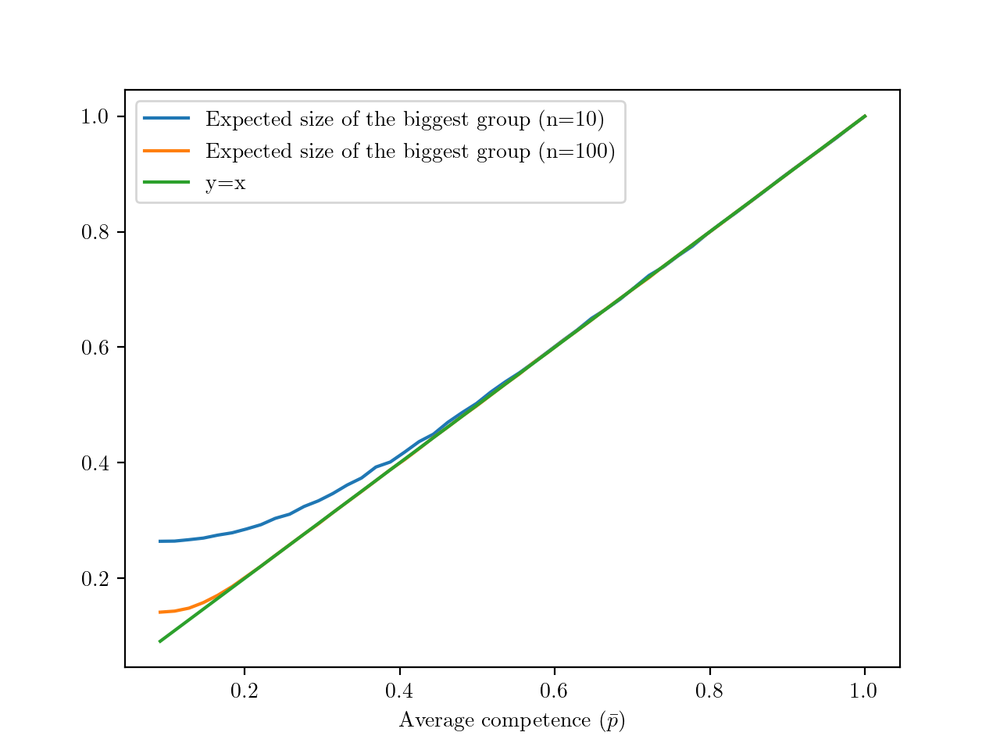
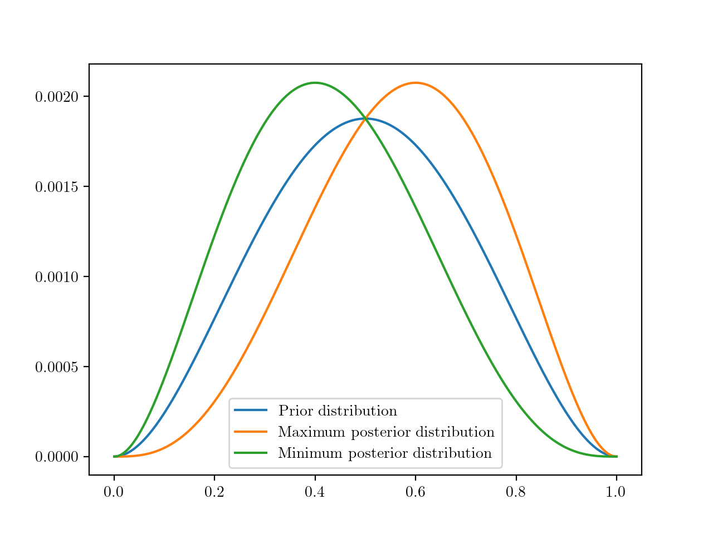
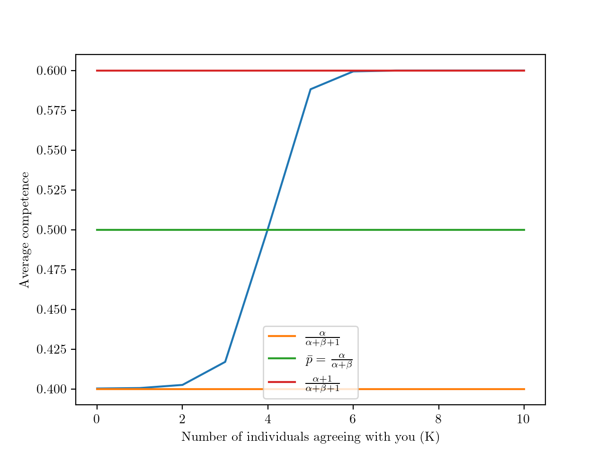
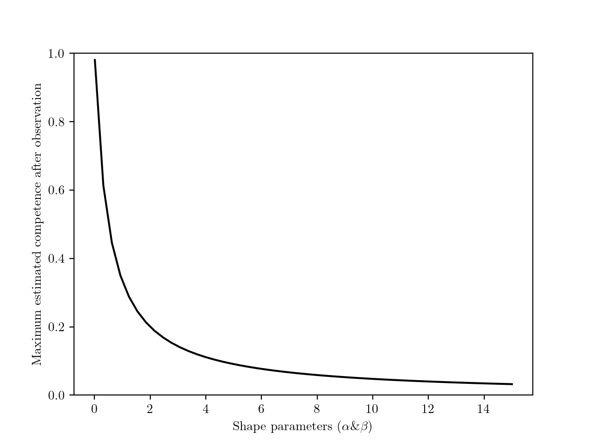
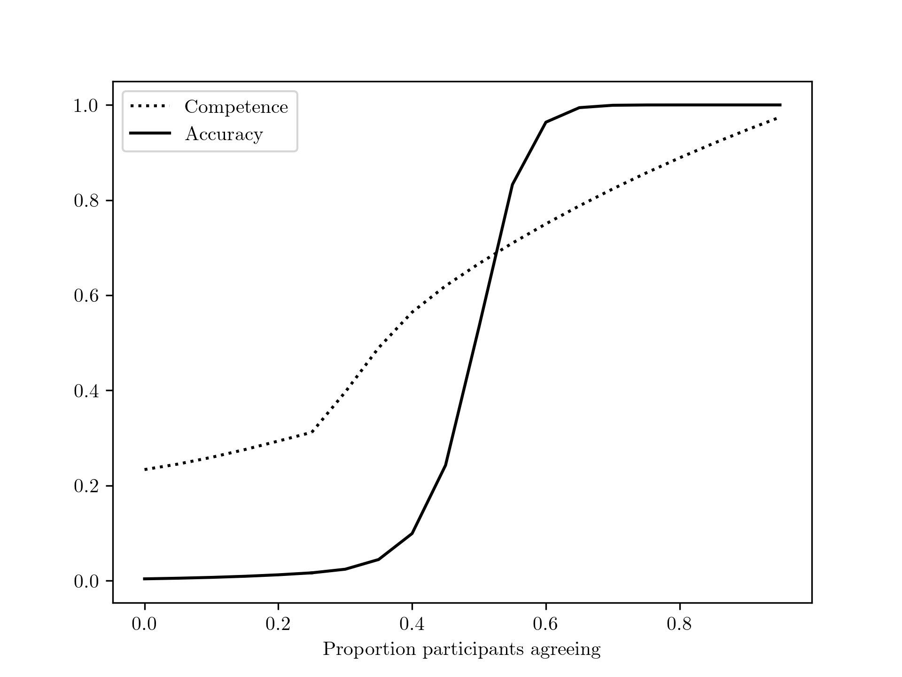

# Analytical argument {#analytical}

## Categorical choice

### Inferring population average competence 

There are $n+1$ individuals, who choose among $m+1$ answers. There is one good answer and $m$ wrong ones. We denote $\bar p$ the probability that a random individual is right. The probability to be wrong is $1-\bar p$, and the probability to choose a particular wrong answer is $\frac{1-\bar p}{m}$. We denote this last probability $\bar q$ (it is common in probabilities to use $q=1-p$, here note that it is not the case).

We assume that the population is quite large, so that it is very likely to be the biggest group of answers. We want to estimate the average competence $\bar p$ from the size of the majority $K$. To simplify, we concentrate on situations where either $\bar p$ is quite large compared to $\bar q$, or the population quite large. In this situation, it is almost certain that the biggest group is made of individuals who chose the right answer and a proportion $\bar p$ of the population should, on average, choose this answer. The size $\frac{K}{n+1}$ should thus be a good estimator of $\bar p$.

Figure \@ref(fig:biggestgroup) illustrates this logic. When the population is competent enough or large enough (e.g. when $n=100$), the average size of the biggest group closely aligns with the average competence. When $n=10$ and average competence is low, it is frequent that some individuals converge by chance on another answer, nd the size of the majority is is therefore on average larger than $\bar p$, hence an overestimate of its members competence.

(ref:biggestgroup) Expected size of the majority depending on average competence, with $n=10$ (blue) and $n=100$ (orange). 

```{r biggestgroup, echo=FALSE, fig.cap="(ref:biggestgroup)", out.width= "75%", fig.align="left"}

```

### Inferring within population competence

Here, we focus on one individual and we aim to infer his personal level of competence $p$. We observe the number $K$ of individuals who agree with him. Either the focus individual is right (which happens with probability $p$) and $K$ follows a binomial distribution of parameters $n$ and $\bar p$; or the individual is wrong (which happens with probability $1-p$) and then $K$ follows a binomial distribution of parameters $n$ and $\bar q$. Thus, $K$ follows a mixture distribution of different parameters, with weights $p$ and $1-p$.

Using the mixture distributions property, we can compute the mean of $K$:
$$
E(K) = n(p \bar p + (1-p)\bar q) = n(p (\bar p - \bar q) + \bar q)
$$

Clearly, $E(K)$ increases with $p$ if and only if $\bar p - \bar q > 0$. In other words, if the population is better than chance, then we expect that the more competent an individual is, the more people agree with him.

But now, what exactly can we infer from $p$ by observing $K$? To answer that, we need to assume a distribution of competence levels in the population, that we will also use as a prior. We assume that in the competence levels  are distributed as a beta distribution, of parameters $\alpha$ and $\beta$. Their density is $f(x) = x^\alpha(1-x)^\beta$. Then, $\bar p = \frac{\alpha}{\alpha+\beta}$, the mean of our beta distribution.

Using Bayes formula, we can write the posterior distribution of $p$:
$$
\Pi(x|K=k) \propto f(x)P(K=k|p=x) = f(x)(x\bar p^k(1-\bar p)^{n-k} + (1-x)\bar q^k (1-\bar q)^{n-k})
$$

$$
= x^{\alpha+1}(1-x)^\beta[\bar p^k(1-\bar p)^{n-k}] + x^{\alpha}(1-x)^{\beta+1} [\bar q^k (1-\bar q)^{n-k}]
$$
We recognise a mixture distribution between two beta distributions, with parameters $\alpha+1$ and $\beta$ for the first one, $\alpha$ and $\beta + 1$ for the second. The first one has a bigger mean than our original Beta($\alpha$,$\beta$) distribution, the second a lower one (see Fig. \@ref(fig:posterior)). In a way, the bayesian updating shifts the distribution to the right or to the left, depending on $K$.

(ref:posterior) Prior and boundary posterior distributions. These distributions are the limit distributions when the individual is either part of a consensus or a dissensus, and when $\bar p \gg \bar q$ or $n$ is large. Here, $\alpha=\beta=2$ and we do not need to define the other parameters. As we explain below, the prior distribution determines the range between the possible posterior distributions. 

```{r posterior, echo=FALSE, fig.cap="(ref:posterior)", out.width= "75%", fig.align="left"}

```

The weightings ($\bar p^k(1-\bar p)^{n-k}$ and $\bar q^k (1-\bar q)^{n-k}$ correspond to the probability that $k$ individuals choose the right answer, and a particular wrong answer, respectively (we took out the binomial coefficients, who are equal for both answer types). Since $\bar p > \bar q$, the former is much stronger for large $k$, and the latter much stronger for low $k$. For $k=n$ (i.e. when the focus individual is part of a consensus), the ratio of weighting if $(p/q)^n$, which is very large when $n$ is large or when $\bar p \gg \bar q$. In this case, for high $k$, the posterior distribution is well approximated by a Beta($\alpha+1$,$\beta$). Conversely, when $k$ is close to zero (and when the other conditions are present), the posterior distribution is well approximated by a Beta($\alpha$,$\beta+1$).

We can plot the mean of the posterior distribution, which can be interpreted as the average estimation we can make of the individual competence, depending on $K$ (Fig. \@ref(fig:competence-k)). For low $n$ and $m$ (the main experiment used $n=m=2$, the function is not too steep. For higher values, it gets sigmoidal, or even a jump function.

(ref:competence-k) Mean of the posterior competence distribution, depending on the number of individuals agreeing with the focus individual. Here, $n=m=10$. 

```{r competence-k, echo=FALSE, fig.cap="(ref:competence-k)", out.width= "75%", fig.align="left"}

```

How much we learn from the observation depends crucially on $\alpha$ and $\beta$, that is, on the prior distribution of competence in the population. The range of possible mean estimates is $\frac{1}{\alpha+\beta + 1}$, it is larger when $\alpha$ and $\beta$ are low.

For instance, let us set $\alpha=\beta$ (which implies $\bar p = \frac 12$). Now, we vary the two shape parameters from close to 0 (beta distributions need positive shape parameters) to a large number. This shifts the distribution from a bimodal one (with $\alpha=\beta \approx 0$, the distribution is perfectly bimodal, with half of the population always right and the other half always right) to a sharp unimodal distribution (when $\alpha$ and $\beta$ are large, the whole population has basically a competence of .5). The more bimodal the distribution, the larger the range of possible estimates (Fig. \@ref(fig:update)). In the limit, when $\alpha$ and $\beta$ are close to 0, we can infer that an individual is either perfectly competent or perfectly incompetent, depending on whether they are part of a consensus or alone in their opinion. On the contrary, when $\alpha$ and $\beta$ are large, we do not change our estimate at all as the distribution is concentrated around .5. Intuitively, this makes sense: If we assume everyone is equally (in)competent, with no exception, we wouldn't infer anything from observing a convergence. 

(ref:update) Range of possible estimates (difference between the minimum and the maximum estimate), depending on the shape of the distribution (here, we assume that $\alpha=\beta$). 

```{r update, echo=FALSE, fig.cap="(ref:update)", out.width= "75%", fig.align="left"}

```

### Inferring accuracy

Now, instead of inferring competence, we want to infer accuracy, i.e. the probability that an individual answer is correct. 

Again, using Bayes formula, we have:

$$
p(right|K=k) = \frac{p(K=k|right)p(right)}{p(K=k)} = \frac{\bar p (\bar p^{k-1} (1-\bar p)^{n-k})}{((\bar p^k (1-\bar p)^{n-k}) + (\bar q^k (1-\bar q)^{n-k}))} 
$$

$$
= \frac{1}{1 +  (\bar p/\bar q)^k \left( \frac{1-\bar q}{1-\bar p}\right)^{n-k} }
$$

Compared to competence, it is  clear (Figure \@ref(fig:accuracy)) that accuracy can be inferred much more strongly.

(ref:accuracy) Estimated competence and accuracy depending on the degree of consensus. Here, we assume that $\alpha=1$, $n=20$ and $m=4$. $\beta$ is inferred from $\alpha$ and the majority size.

```{r accuracy, echo=FALSE, fig.cap="(ref:accuracy)", out.width= "75%", fig.align="left"}

```

## Continuous choices

A group of $N$ individuals makes a prediction. The right answer is $\theta$, we assume their answers $x_i, i \in 1,…,N$ are normally distributed around $\theta$, with a variance $\sigma^2$ reflecting the group incompetence (so the lower $\sigma^2$, the more the group can be said to be competent).

We estimate the degree of divergence through the unbiased sample variance $\hat \sigma^2$, defined as the average squared distance to the sample mean $\bar x =\frac 1 n \sum_{i=1}^n x_i$:

$$\hat \sigma^2 = \frac 1 {n-1} \sum_{i=1}^n (x_i - \bar x)^2$$

It is well known that $\hat \sigma^2$ (when coupled with the sample mean) is a "sufficient" estimator of $\sigma^2$, that is, it contains all the available information about $\sigma^2$. It follows, from the Lehmann-Scheffé theorem, that it is also the minimum-variance unbiased estimator, that is, the most precise way to estimate $\sigma^2$ while staying unbiased. 


