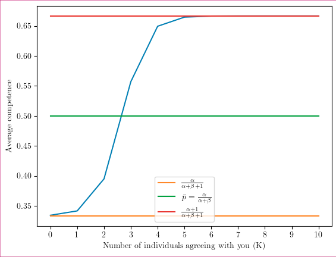

# Analytical argument {#analytical}

Agents answer a categorical question, with m+1 answers. We define the competence p of an individual as the probability to choose the right answer. Each of the wrong answers has the same probability (1-p)/m to be chosen. We observe the answers of a population of n+1 agents, with diverse levels of competence drawn from a beta distribution -- a flexible probability distribution that can be uniform, unimodal or bimodal, depending on the parameters. We assume that the shape parameters of the beta distribution ($\alpha$ and $\beta$) are known, but the right answer is not. We aim to infer the competence of an individual, based on the population answers. In our analytical model, we use Bayes formula to compute the posterior competence distribution of competence for an individual, knowing that a number K of other participants agree with him. The posterior distribution is a mixture of two beta distributions, Beta($\alpha$+1, $\beta$) and Beta($\alpha$, $\alpha$+1), weighted respectively by the probabilities that K individuals would choose the right or the wrong answer. The model suggests that the more consensual an individual's vote is, the more that individual is estimated to be competent (Fig. \@ref(fig:figure-Benoit)).

(ref:figure-Benoit) Average competence of an informant as a function of K, the number of individuals who agree. In this example, we assume that the number of informants - not counting the focal informant - in a sample is n=10, m=5, and that the population competence ($\alpha$ = $\beta$ = 1).

```{r figure-Benoit, echo=FALSE, fig.cap="(ref:figure-Benoit)", out.width= "50%", fig.align="left"}

```

That said, the average competence is bounded between and $\frac{\alpha}{\alpha+\beta+1}$ and $\frac{\alpha+1}{\alpha+\beta+1}$. In other words, even if all other individuals agree with an informant, a case in which the informant very likely chose the correct answer (add an accuracy figure, maybe?), the competence we should assign to this informant, according to our model, is not higher than $\frac{\alpha+1}{\alpha+\beta+1}$ (or $2/3$ in our example in Fig. \@ref(fig:figure-Benoit)). This counter-intuitive result is due to our framework: we assume that a certain competence distribution as a given, and only observe one decision per individual. Intuitively, in a world where even some highly incompetent people sometimes pick the correct answer by chance, being right (with the majority) once is not a sufficient signal of highest competence.


