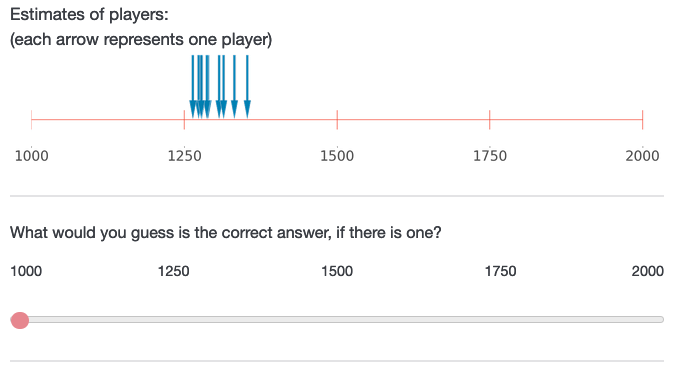
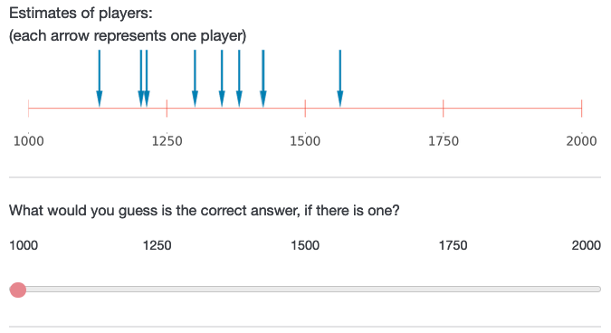

# Experiment 1 {#exp1}

## Stimuli

\FloatBarrier

The means of the normal distributions that we draw our estimates from were distinct between sets of estimates. Considering our within-participant design, we wanted to ensure that participants understood each set of estimates as being the result of a different, unrelated game. In order to assure that random draws from the distributions will (most likely) appear on the response scale (1000 to 2000), we constrained the means of all normal distributions to lie between the first and third quartile of the response scale (i.e. smallest possible mean was 1225 and largest 1775). We define a set of eight means--one for each set of estimates--that cover the range from first to third quartile of the predefined scale with an equal interval (1250, 1325, 1400, 1475, 1550, 1625, 1700, 1775). We randomly paired means with conditions when generating the stimuli. We then drew the set of estimates from the respective normal distributions given the assigned means and the condition constraints. We repeated this three times, resulting in three different series of eight sets of estimates. We randomly assign participants to one of these series. Additionally, for each participant, we randomize the order of appearance of the sets of estimates within the respective series. Images of all sets of estimates can be found on the OSF.

```{r simuli, include=FALSE, out.width= "40%", fig.align="center", fig.show="hold"}
# 
# 
```

## Attention check

Imagine you are playing video games with a friend and at some point your friend says: “I don’t want to play this game anymore! To make sure that you read the instructions, please write the three following words "I pay attention" in the box below. I really dislike this game, it's the most overrated game ever.”

Do you agree with your friend? (Yes/No)

## Results

Figure \@ref(fig:exp1-plot) visualizes the results and table \@ref(tab:exp1-table) contains descriptive results. Figure \@ref(fig:exp1-outcomes) visualizes score differences between the two outcomes, accuracy and competence. 

```{r exp1-table}
exp1 %>% 
  group_by(convergence, number) %>% 
  summarise(across(c(competence, confidence), list(mean = mean, sd = sd))) %>% 
  rounded_numbers() %>% 
  mutate(Accuracy = paste0(confidence_mean, " (sd = ", confidence_sd, ")"),
         Competence = paste0(competence_mean, " (sd = ", competence_sd, ")")
         ) %>% 
  rename(Convergence = convergence,
         Number = number) %>% 
  select(Convergence, Number, Accuracy, Competence) %>% 
  apa_table()
```

(ref:exp1-plot) Distributions of accuracy and competence by level of convergence.

```{r exp1-plot, fig.cap="(ref:exp1-plot)"}
# make mean data for plot
x_nudge <- 0.8

means <- exp1 %>%
  group_by(convergence) %>%
  summarize(confidence = mean(confidence), 
            competence = mean(competence)) %>% 
  pivot_longer(c(confidence, competence), 
               names_to = "outcome", 
               values_to = "value") %>% 
  mutate(x_position = ifelse(convergence == "convergent", value + x_nudge, 
                                value - x_nudge)) 

confidence_plot <- ggplot(data=exp1, aes(x=confidence, fill=convergence)) +
  # density plot
  geom_density(adjust=3, alpha=.6) +
  # mean lines
  geom_vline(data=means %>% 
               filter(outcome == "confidence"), 
             aes(xintercept = value, 
                 color = convergence),
             show.legend = FALSE,
             linetype="dashed") +
  geom_label(data = means %>% 
               filter(outcome == "confidence"), 
             aes(x = x_position, y = 0.3, 
                 label =  paste("mean", round(value, digits = 2),
                                sep = " = ")), 
             alpha = 0.6, show.legend = FALSE, size = 3
            ) +
  # scales
  scale_x_continuous(name = "Accuracy (confidence) ratings", breaks = seq(1, 7), 
                     limits=c(1, 7)) +
  scale_y_continuous(name = "Density", limits=c(0, 0.3)) +
  scale_fill_viridis_d(option = "plasma") +
  scale_color_viridis_d(option = "plasma") + 
  guides(fill = guide_legend(title = NULL)) +
  plot_theme 

competence_plot <- ggplot(data=exp1, aes(x=competence, fill=convergence)) +
  # density plot
  geom_density(adjust=3, alpha=.6) +
  # mean lines
  geom_vline(data=means %>% 
               filter(outcome == "competence"), 
             aes(xintercept = value, 
                 color = convergence),
             show.legend = FALSE,
             linetype="dashed") +
  geom_label(data = means %>% 
               filter(outcome == "competence"), 
             aes(x = x_position, y = 0.3, 
                 label =  paste("mean", round(value, digits = 2),
                                sep = " = ")), 
             alpha = 0.6, show.legend = FALSE, size = 3
            ) +
  # scales
  scale_x_continuous(name = "Competence ratings", breaks = seq(1, 7), 
                     limits=c(1, 7)) +
  scale_y_continuous(name = "Density", limits=c(0, 0.3)) +
  scale_fill_viridis_d(option = "plasma") +
  scale_color_viridis_d(option = "plasma") + 
  guides(fill = guide_legend(title = NULL)) +
  plot_theme 

figure <- ggarrange(confidence_plot, 
                    competence_plot + 
                      theme(axis.text.y = element_blank(),
                            axis.ticks.y = element_blank(),
                            axis.title.y = element_blank()), 
                    common.legend = T) +
  theme(legend.position="top") 
figure
```

## Research questions

We had three additional research questions regarding the number of informants:

***RQ1: Do H1 and H2 hold for both a small [3] and a large [10] number of estimates?***

***RQ2: When making a guess based on the opinions of (independent) informants, will participants be more confident about their guess when there is a larger number of estimates compared to when this number is smaller?***

***RQ3: Is there an interaction effect between the number of estimates and convergence on perceived competence of informants?***

Regarding RQ1, we ran the same mixed models as for the two hypotheses, but without number as a covariate. Instead, we ran separate models for the three and the ten informants conditions. We find that for both sub-samples, there is a positive effect of convergence on both accuracy ($\hat{b}_{\text{three informants}}$ = `r exp1_research_questions$model_small_accuracy$convergenceconvergent$estimate` `r exp1_research_questions$model_small_accuracy$convergenceconvergent$ci`, p = `r exp1_research_questions$model_small_accuracy$convergenceconvergent$p.value`; $\hat{b}_{\text{ten informants}}$ = `r exp1_research_questions$model_large_accuracy$convergenceconvergent$estimate` `r exp1_research_questions$model_large_accuracy$convergenceconvergent$ci`, p = `r exp1_research_questions$model_large_accuracy$convergenceconvergent$p.value`) and competence ($\hat{b}_{\text{three informants}}$ = `r exp1_research_questions$model_small_competence$convergenceconvergent$estimate` `r exp1_research_questions$model_small_competence$convergenceconvergent$ci`, p = `r exp1_research_questions$model_small_competence$convergenceconvergent$p.value`; $\hat{b}_{\text{ten informants}}$ = `r exp1_research_questions$model_large_competence$convergenceconvergent$estimate` `r exp1_research_questions$model_large_competence$convergenceconvergent$ci`, p = `r exp1_research_questions$model_large_competence$convergenceconvergent$p.value`). 

To test the other two research questions, we ran the same mixed-models as for the hypotheses, but this time including an interaction between number of informants and convergence. We use deviation-coded versions of our convergent variable (divergent = -0.5, convergent = 0.5), allowing us to have a coefficient measuring the main effect of the number of informants in our model. Regarding RQ2, pooling across convergent and divergent conditions, we find a main effect of number, such that participants had more confidence in their estimate when they relied on ten informants compared to three informants ($\hat{b}_{\text{Accuracy}}$ = `r exp1_research_questions$model_interaction_accuracy$number_effect_code$estimate` `r exp1_research_questions$model_interaction_accuracy$number_effect_code$ci`, p = `r exp1_research_questions$model_interaction_accuracy$number_effect_code$p.value`). Regarding RQ3, we find an interaction between number of informants and convergence on competence: the positive effect of convergence was stronger in scenarios involving ten informants compared to three informants ($\hat{b}_{\text{Competence}}$ = `r exp1_research_questions$model_interaction_competence$interaction$estimate` `r exp1_research_questions$model_interaction_competence$interaction$ci`, p = `r exp1_research_questions$model_interaction_competence$interaction$p.value`). We do not find a statistically significant interaction on accuracy ($\hat{b}_{\text{Accuracy}}$ = `r exp1_research_questions$model_interaction_accuracy$interaction$estimate` `r exp1_research_questions$model_interaction_accuracy$interaction$ci`, p = `r exp1_research_questions$model_interaction_accuracy$interaction$p.value`).

(ref:exp1-outcomes) Differences between accuracy and competence ratings, by level of convergence.

```{r exp1-outcomes, fig.cap="(ref:exp1-outcomes)"}
# Differences in outcome between accuracy and competence
exp1_long <- exp1 %>%
  pivot_longer(cols = c(confidence, competence), 
               names_to = "outcome", 
               values_to = "score")

interaction_plot <- ggplot(exp1_long, aes(x = outcome, y = score, 
                                         fill = convergence, 
                                         shape = convergence, 
                                         group = convergence, 
                                         color = convergence)) +
  scale_x_discrete(limits = c("confidence", "competence"), 
                   labels = c("Accuracy", "Competence")) +
  geom_half_violin(data = exp1_long %>% filter(outcome == "confidence"), 
                   position = position_nudge(x = -.2), adjust = 2, alpha = .4,
                   side = "l") +
  geom_half_violin(data = exp1_long %>% filter(outcome == "competence"),
                   position = position_nudge(x = .2), adjust = 2, alpha = .4,
                   side = "r") +
  xlab("Outcome") +
  ylab("Score") +
  scale_y_continuous(breaks = c(1, 2, 3, 4, 5, 6, 7)) +
  stat_summary(fun = "mean", geom = "point", size = 3) +
  stat_summary(fun = "mean", geom = "line") +
  stat_summary(fun.data = "mean_se", geom = "errorbar", width = .2) +
  scale_fill_manual(name = NULL,
                    labels = c("divergent", "convergent"),
                    values = c("#E69F00", "#56B4E9")) +
  scale_color_manual(name = NULL,
                     labels = c("divergent", "convergent"),
                     values = c("#E69F00", "#56B4E9")) +
  guides(shape = "none",
         fill = guide_legend(title = NULL)) +
  plot_theme +
  # change font sizes
  theme(axis.text = element_text(size = 10)) +
  theme(axis.title = element_text(size = 15)) +
  theme(legend.text = element_text(size = 10))

print(interaction_plot)
```

```{r, include = FALSE}
# manual version for points / confidence intervals for the above plot

# exp1_long <- exp1 %>%
#   pivot_longer(cols = c(confidence, competence), 
#                names_to = "outcome", 
#                values_to = "score")
# 
# # Calculate mean and standard error
# mean_se <- exp1_long %>%
#   group_by(outcome, convergence) %>%
#   summarize(mean_score = mean(score), 
#             se_score = sd(score) / sqrt(n())) %>% 
#   mutate(ci_low = mean_score - se_score, 
#          ci_high = mean_score + se_score)
# 
# interaction_plot <- ggplot(exp1_long, aes(x = outcome, y = score, 
#                                          fill = convergence, 
#                                          shape = convergence, 
#                                          group = convergence, 
#                                          color = convergence)) +
#   scale_x_discrete(limits = c("confidence", "competence"), 
#                    labels = c("Accuracy", "Competence")) +
#   geom_half_violin(data = exp1_long %>% filter(outcome == "confidence"), 
#                    position = position_nudge(x = -.2), adjust = 2, alpha = .4,
#                    side = "l") +
#   geom_half_violin(data = exp1_long %>% filter(outcome == "competence"),
#                    position = position_nudge(x = .2), adjust = 2, alpha = .4,
#                    side = "r") +
#   xlab("Outcome") +
#   ylab("Score") +
#   scale_y_continuous(breaks = c(1, 2, 3, 4, 5, 6, 7)) +
#   geom_point(data = mean_se, aes(x = outcome, y = mean_score), size = 3) +
#   geom_line(data = mean_se, aes(x = outcome, y = mean_score)) +
#   geom_errorbar(data = mean_se,
#                 aes(x = outcome,
#                     y = mean_score,
#                     ymin = mean_score - se_score,
#                     ymax = mean_score + se_score),
#                 width = 0.2) +
#   scale_fill_manual(name = NULL,
#                     labels = c("divergent", "convergent"),
#                     values = c("#E69F00", "#56B4E9")) +
#   scale_color_manual(name = NULL,
#                      labels = c("divergent", "convergent"),
#                      values = c("#E69F00", "#56B4E9")) +
#   guides(shape = "none",
#          fill = guide_legend(title = NULL)) +
#   plot_theme +
#   # change font sizes
#   theme(axis.text = element_text(size = 10)) +
#   theme(axis.title = element_text(size = 15)) +
#   theme(legend.text = element_text(size = 10))
# 
# print(interaction_plot)
```

## Minor deviation from preregistration

```{r}
# T-test
t_test_accuracy <- t.test(confidence ~ convergence, data = exp1, paired = TRUE) %>% clean_t_test()
t_test_competence <- t.test(competence ~ convergence, data = exp1, paired = TRUE) %>% clean_t_test()
```

In our preregistration, we stated we would run paired t-tests and only conduct mixed models as a robustness check. However, it became clear to us later that mixed models are more appropriate in light of our data structure. In the main article, we therefore only report the results of the mixed models. Note, however, that using paired t-tests, we confirm our results (Accuracy: `r t_test_accuracy$estimate`, t-statistic = `r t_test_accuracy$statistic`, p `r t_test_accuracy$p.value`; Competence: `r t_test_competence$estimate`, t-statistic = `r t_test_competence$statistic`, p `r t_test_competence$p.value`)

## Sensitivity simulation

We had based our power calculations on a paired t-test (using the widely used tool G*Power), which does not correspond to the mixed-models we eventually ran. To address this point, here, we seek to identify the minimum effect size that our analysis with mixed models could have detected, given a 90% power, an N of 200 participants, and other parameters derived from the estimates observed in the sample of Experiment 1 (see \@ref(tab:exp1-regression-table)). By contrast to a standard power simulation (which varies sample size), a sensitivity simulation varies the effect size, while holding the sample size and desired power constant.

```{r exp1-regression-table}
modelsummary::modelsummary(list("Accuracy" = exp1_model_accuracy, 
                                "Competence" = exp1_model_competence), 
                           title = "Model Results Experiment 1")
```

```{r}
# Sensitivity analysis Experiment 1

library(tidyverse)
library(purrr)
library(broom)
library(lmerTest)

set.seed(1000)

# Generate data
create_data <- function(n_subj, n_div, n_conv, beta_0, beta_1, 
                        tau_0, tau_1, rho, sigma) { 
  
  items <- data.frame(
    item_id = seq_len(n_div + n_conv),
    convergence = rep(c("div", "conv"), c(n_div, n_conv)),
    # make the same as a numeric variable to generate competence
    convergence_num = rep(c(-0.5, 0.5), c(n_div, n_conv)))
  
  # variance-covariance matrix
  cov_mx  <- matrix(
    c(tau_0^2,             rho * tau_0 * tau_1,
      rho * tau_0 * tau_1, tau_1^2            ),
    nrow = 2, byrow = TRUE)
  
  subjects <- data.frame(subj_id = seq_len(n_subj),
                         MASS::mvrnorm(n = n_subj,
                                       mu = c(T_0s = 0, T_1s = 0),
                                       Sigma = cov_mx))
  
  crossing(subjects, items)  %>%
    mutate(
           # turn convergence into factor variable
           # for later analysis. Make sure the levels correspond to the 
           # numeric variables we generate competence with
           convergence = as.factor(convergence),
           convergence = fct_relevel(convergence, "div", "conv"),
           # residual error
           e_si = rnorm(nrow(.), mean = 0, sd = sigma),
           # generate competence
           competence = beta_0 + T_0s + (beta_1 + T_1s) * convergence_num + e_si) %>%
    select(subj_id, item_id, convergence, competence, convergence_num)
}

# test
# data <- create_data(
#   n_subj = 100,
#   n_div  =  2,   # number of low convergence stimuli
#   n_conv =  2,   # number of high convergence stimuli
#   beta_0 = 4,
#   beta_1 = 0.5,  # effect of convergence
#   tau_0      = 0.7,   # by-subject random intercept sd
#   tau_1      =  0.9,   # by-subject random slope sd
#   rho        = 0.1,   # correlation between intercept and slope by-subject
#   sigma      = 0.99) # residual (standard deviation)


# Our estimation function
est_model <- function(n_subj, n_div, n_conv, beta_0, beta_1,
                      tau_0, tau_1, rho, sigma) {
  
  data_sim <- create_data(n_subj, n_div, n_conv, beta_0, beta_1,
                          tau_0, tau_1, rho, sigma)
  model_sim <- lmer(competence ~ convergence + (1 + convergence | subj_id),
                    data_sim)
  
  tidied <- broom.mixed::tidy(model_sim)
  sig <- tidied$p.value[2] < .05
  
  return(sig)
}

# test
# model_result <- est_model(
#   n_subj = 100,
#   n_div  =  2,   # number of low convergence stimuli
#   n_conv =  2,   # number of high convergence stimuli
#   beta_0 = 4,    # intercept (average of divergent condition)
#   beta_1 = 0.5,  # effect of convergence
#   tau_0      = 0.7,   # by-subject random intercept sd
#   tau_1      =  0.9,   # by-subject random slope sd
#   rho        = 0.1,   # correlation between intercept and slope by-subject
#   sigma      = 0.99) # residual (standard deviation)


# Iteration function
iterate <- function(n_subj, n_div, n_conv, beta_0, beta_1,
                    tau_0, tau_1, rho, sigma, iterations) 
{ # number of iterations
  
  results <-  1:iterations %>%
    map_dbl(function(x) {
      # To keep track of progress
      if (x %% 100 == 0) {print(paste("iteration number ", x))}
      
      # Run our model and return the result
      return(est_model(n_subj, n_div, n_conv, beta_0, beta_1,
                       tau_0, tau_1, rho, sigma))
    })
  
  # We want to know statistical power, 
  # i.e., the proportion of significant results
  return(mean(results))
}

# test
# power <- iterate(
#   n_subj = 100,
#   n_div  =  2,   # number of low convergence stimuli
#   n_conv =  2,   # number of high convergence stimuli
#   beta_0 = 4, 
#   beta_1 = 0.5,  
#   tau_0      = 0.7,   # by-subject random intercept sd
#   tau_1      =  1,   # by-subject random slope sd
#   rho        = 0.1,   # correlation between intercept and slope by-subject
#   sigma      = 1,  # residual (standard deviation)
#   iterations = 500)

sensitivity_analysis <- function(file_name, effect_sizes, ...) {
  
  # only run analysis if a file with that name does not yet exists
  if (!file.exists(paste0("Experiment_1/data/", file_name))) {
    
    # do the `iterate()` function for each effect size and store the results
    # in a common data frame
    power <- purrr::map_df(effect_sizes, 
              function(beta_1){
                # this is essentially a for loop - 
                # do the following for each 
                # element of effect_sizes
                
                # To keep track of progress
                print(paste("tested effect size = ", beta_1))
                
                # run power calculation
                power <- iterate(beta_1 = beta_1, ...) 
                                  
                
                # make data frame
                result <- tibble(effect_size = beta_1, 
                                 power = power)
                
                return(result)
                
              })
    
    # write out file
    write_csv(power, paste0("Experiment_1/data/", file_name))
  }
}

# test (note that this requires building the parameter lists below before)
# effect_sizes <- c(1, 1.2)
# test <- purrr::map_df(effect_sizes, 
#               function(beta_1){
#                 # this is essentially a for loop - 
#                 # do the following for each 
#                 # element of effect_sizes
#                 
#                 # To keep track of progress
#                 print(paste("tested effect size = ", beta_1))
#                 
#                 # run power calculation
#                 power <- do.call(iterate, c(parameters_accuracy, 
#                                              beta_1 = beta_1))
#                 
#                 # make data frame
#                 result <- tibble(effect_size = beta_1, 
#                                  power = power)
#                 
#                 return(result)
#                 
#               })
```

```{r}
# Define parameters

# Extract parameters from model estimates of Experiment 1
estimates_accuracy <- exp1_model_accuracy %>% 
  tidy() %>% 
  split(.$term)

estimates_competence <- exp1_model_competence %>% 
  tidy() %>% 
  split(.$term)

# Set parameter lists
parameters_accuracy <- list(
  n_subj = 200,
  n_div  =  2,   # number of low convergence stimuli
  n_conv =  2,   # number of high convergence stimuli
  beta_0 = estimates_accuracy$'(Intercept)'$estimate, # intercept (mean of divergent)
  #beta_1 = estimates_accuracy$convergenceconvergent$estimate, # mean difference convergence vs divergence
  tau_0      = estimates_accuracy$'sd__(Intercept)'$estimate,   # by-subject random intercept sd
  tau_1      =  estimates_accuracy$sd__convergenceconvergent$estimate,   # by-subject random slope sd
  rho        = estimates_accuracy$'cor__(Intercept).convergenceconvergent'$estimate,   # correlation between intercept and slope by-subject
  sigma      = estimates_accuracy$sd__Observation$estimate,  # residual (standard deviation)
  iterations = 1000)

# Set parameter lists
parameters_competence <- list(
  n_subj = 200,
  n_div  =  2,   # number of low convergence stimuli
  n_conv =  2,   # number of high convergence stimuli
  beta_0 = estimates_competence$'(Intercept)'$estimate, # intercept (mean of divergent)
  # beta_1 = estimates_competence$convergenceconvergent$estimate, # mean difference convergence vs divergence
  tau_0      = estimates_competence$'sd__(Intercept)'$estimate,   # by-subject random intercept sd
  tau_1      =  estimates_competence$sd__convergenceconvergent$estimate,   # by-subject random slope sd
  rho        = estimates_competence$'cor__(Intercept).convergenceconvergent'$estimate,   # correlation between intercept and slope by-subject
  sigma      = estimates_competence$sd__Observation$estimate,  # residual (standard deviation)
  iterations = 1000)
```

```{r}
# Run analysis

# Accuracy
do.call(sensitivity_analysis, c(parameters_accuracy, 
                                        list(file_name = "sensitivity_accuracy.csv", 
                                             effect_sizes = c(0.1, 0.2, 0.4, 0.6, 0.8, 1, estimates_accuracy$convergenceconvergent$estimate)
                                             )
                                        )
                )

sensitivity_accuracy <- read_csv("Experiment_1/data/sensitivity_accuracy.csv")

# Competence
do.call(sensitivity_analysis, c(parameters_competence, 
                                        list(file_name = "sensitivity_competence.csv", 
                                             effect_sizes = c(0.1, 0.2, 0.4, 0.6, 0.8, 1, estimates_competence$convergenceconvergent$estimate)
                                             )
                                        )
                )

sensitivity_competence <- read_csv("Experiment_1/data/sensitivity_competence.csv")

```
(ref:sensitivity) Results of the sensitivity analysis.

```{r sensitivity, fig.cap="(ref:sensitivity)"}
# Plot

# combine data
plot_data <- bind_rows(sensitivity_accuracy %>% 
                         mutate(outcome = "Accuracy"), 
                       sensitivity_competence %>% 
                         mutate(outcome = "Competence"))

# plot results
plot_power <- function(data) {
  
  ggplot(data, 
       aes(x = effect_size, y = power)) +
  geom_point(color = "red", size = 1) +
  geom_line(size = 1, alpha = 0.5) + 
  # add a horizontal line at 90%, our power_threshold
  geom_hline(aes(yintercept = .9), linetype = 'dashed') + 
  # display iterations
  annotate("text", x = 1, y = 0.25, label = "iterations per \n effect size = 1'000")+
  # Prettify!
  theme_minimal() + 
    scale_colour_viridis_d(option = "plasma") + 
  scale_y_continuous(labels = scales::percent, breaks = ) + 
  labs(x = 'Effect size', y = 'Power', 
       title = "Sensitivity Analysis",
       subtitle = "(Finding the minimum detectable effect)") +
    facet_wrap(~outcome)
}

plot_power(plot_data)
```

The results of this can be seen in Fig. \@ref(fig:sensitivity). In our sample, we found a statistically significant effect size of `r estimates_accuracy$convergenceconvergent$estimate` for accuracy and an effect size of `r estimates_competence$convergenceconvergent$estimate` for competence (both on their original scales from 1 to 7). The simulations show that, given our parameter assumptions (based on the observations in our sample) and a sample size of N = 200, we would have detected an effect as small as 0.4 with a power of at least 90% (in fact nearly 100%) for both accuracy and competence.

