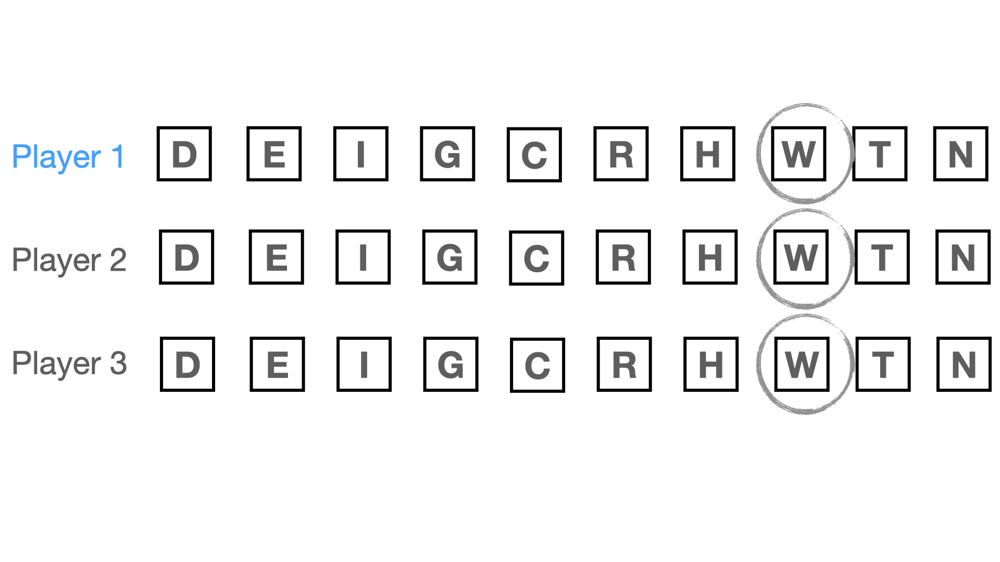

# Experiment 6 {#exp6}

## Design

\FloatBarrier

We manipulated convergence within participants in the same way we did in experiment 4. In addition, between participants, we manipulated the number of choice options. Participants were randomly assigned to either to see stimuli with '3' options, or with '10' options. Participants assigned to the '10' options condition, participants were assigned to one of two distinct sub-conditions: one in which the range of the answers corresponds to the range of the '3' options condition, and another with increased range (see Appendix XX). We added the increased range condition because we anticipated the possibility that participants might not consider all options as relevant when they only see scenarios in which all answers cluster. We found no differences between the two sub-conditions and collapsed them into a single '10' options condition.

```{r stimuli-options, echo=FALSE}
# Create a matrix of image file paths as Markdown-formatted strings
image_paths <- data.frame(
  imgage_a = c("{ width=60% }"),
  imgage_b = c("{ width=60% }")
  )

# Use kable() to create the table and print it as Markdown
kableExtra::kable(image_paths, format = "markdown",
                  col.names = c("Number of options: 3", "Number of options: 10"), 
                  align = "l",
                  caption = "Example of a consensus stimulus for the two 'Number of option' conditions") %>%
  # make smaller to fit
  kable_styling(latex_options = "scale_down") 
```

## Attention check

Imagine you are playing video games with a friend and at some point your friend says: “I don’t want to play this game anymore! To make sure that you read the instructions, please write the three following words "I pay attention" in the box below. I really dislike this game, it's the most overrated game ever.”

Do you agree with your friend? (Yes/No)

## Stimuli

```{r stimuli-10, echo=FALSE}
# Create a matrix of image file paths as Markdown-formatted strings
image_paths <- data.frame(
  condition = c("opposing majority (0)", "dissensus (1)", "majority (2)", "consensus (10)"),
  imgage_a = c(
    "{ width=60% }",
    "{ width=60% }",
    "{ width=60% }",
    "{ width=60% }"
  ),
  imgage_b = c(
    "{ width=60% }",
    "{ width=60% }",
    "{ width=60% }",
    "{ width=60% }"
  )
)

# Use kable() to create the table and print it as Markdown
kableExtra::kable(image_paths, format = "markdown",
                  col.names = c("Level", "Version a)", "Version b)"), 
                  align = "c",
                  caption = "Stimuli for 10 options condition by levels of convergence")

```

```{r stimuli-10-alt, echo=FALSE}
# Create a matrix of image file paths as Markdown-formatted strings
image_paths <- data.frame(
  condition = c("opposing majority (0)", "dissensus (1)", "majority (2)", "consensus (10)"),
  imgage_a = c(
    "{ width=60% }",
    "{ width=60% }",
    "{ width=60% }",
    "{ width=60% }"
  ),
  imgage_b = c(
    "{ width=60% }",
    "{ width=60% }",
    "{ width=60% }",
    "{ width=60% }"
  )
)

# Use kable() to create the table and print it as Markdown
kableExtra::kable(image_paths, format = "markdown",
                  col.names = c("Level", "Version a)", "Version b)"), 
                  align = "c",
                  caption = "Alternative stimuli for 10 options condition by levels of convergence")

```

## Results

Figure \@ref(fig:exp5-plot) visualizes the results and table \@ref(tab:exp5-table) contains descriptive results.

```{r exp6-table}
exp6_accuracy <- exp6 %>% 
  mutate(Convergence = paste0(convergence_categorical, " (", convergence, ")")) %>% 
  group_by(number_options, Convergence, convergence) %>% 
  summarise(across(accuracy, list(mean = mean, sd = sd))) %>% 
  rounded_numbers() %>% 
  mutate(Accuracy = paste0(accuracy_mean, " (sd = ", accuracy_sd, ") ")) %>% 
  select(number_options, Accuracy, Convergence, convergence) %>% 
mutate(number_options = ifelse(number_options == "three", "3 options", 
                "10 options") 
         ) %>% 
  pivot_wider(names_from = number_options,
              values_from = Accuracy) %>% 
  arrange(convergence) %>% 
  ungroup() %>% 
  select(-convergence) %>% 
  rename(" " = Convergence) %>% 
  as.matrix()

exp6_competence <- exp6 %>% 
  mutate(Convergence = paste0(convergence_categorical, " (", convergence, ")")) %>% 
  group_by(number_options, Convergence, convergence) %>% 
  summarise(across(competence, list(mean = mean, sd = sd))) %>% 
  rounded_numbers() %>% 
  mutate(Competence = paste0(competence_mean, " (sd = ", competence_sd, ") ")) %>% 
  select(number_options, Competence, Convergence, convergence) %>% 
mutate(number_options = ifelse(number_options == "three", "3 options", 
                "10 options") 
         ) %>% 
  pivot_wider(names_from = number_options,
              values_from = Competence) %>% 
  ungroup() %>% 
  arrange(convergence) %>% 
  select(-c(convergence, Convergence)) %>% 
  as.matrix()

table <- cbind(exp6_accuracy, exp6_competence)

table %>%
  kable(booktabs = TRUE, 
        # need to add a (empty) caption for cross referencing to work
        caption = "") %>%
  kable_styling() %>% 
  add_header_above(c("", "Accuracy" = 2, "Competence" = 2)) %>%
  # make smaller to fit
  kable_styling(latex_options = "scale_down") 
```

(ref:exp6-plot) Interaction of convergence and informational dependency.

```{r exp6-plot, fig.cap="(ref:exp6-plot)"}
# colors were identified with the wesanderson package (library(wesanderson)) as:
# wes_palette("Zissou1", 100, type = "continuous")[A number]

# plot for accuracy
plot_accuracy <- ggplot(exp6,
       aes(x = convergence_categorical, y = accuracy, fill = number_options)) +
  geom_half_violin(position = position_nudge(x = -.2),
                   adjust=2, alpha = .4,
                   side = "l") +
  stat_summary(fun = "mean", geom = "point", size = 2, shape = 21) +
  stat_summary(fun = "mean", geom = "line", size = 1, linetype = "dashed") +
  stat_summary(fun.data = "mean_se", geom = "errorbar", width = .2) +
  # Add nice labels
  labs(x = "Convergence", y = "Accuracy", fill = NULL) +
  scale_fill_manual(values = c("#EE3800", "#3D9BB2"), 
                    name = "Number of choice options: ") +
  plot_theme + 
  theme(axis.text.x = element_text(angle = 20, hjust = 1))

# plot for competence
plot_competence <- ggplot(exp6,
       aes(x = convergence_categorical, y = competence, fill = number_options)) +
  geom_half_violin(position = position_nudge(x = -.2),
                   adjust=2, alpha = .4,
                   side = "l") +
  stat_summary(fun = "mean", geom = "point", size = 2, shape = 21) +
  stat_summary(fun = "mean", geom = "line", size = 1, linetype = "dashed") +
  stat_summary(fun.data = "mean_se", geom = "errorbar", width = .2) +
  # Add nice labels
  labs(x = "Convergence", y = "Competence", fill = NULL) +
  scale_fill_manual(values = c("#EE3800", "#3D9BB2")) +
  plot_theme + 
  theme(axis.text.x = element_text(angle = 20, hjust = 1))

ggpubr::ggarrange(plot_accuracy, plot_competence, common.legend = TRUE)
```


