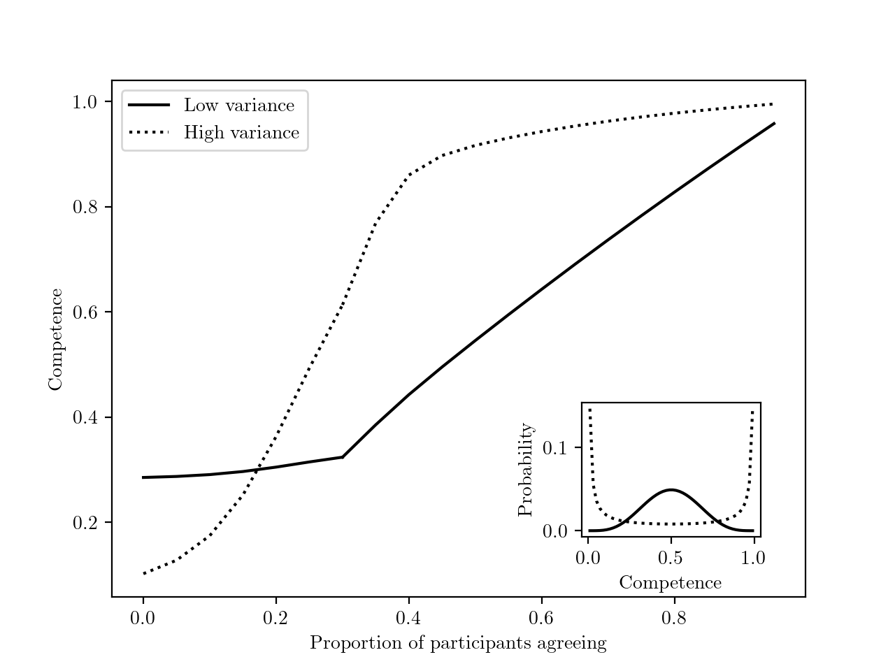

```{r setup, include=FALSE}
# Figure out output format
is_docx <- knitr::pandoc_to("docx") | knitr::pandoc_to("odt")
is_latex <- knitr::pandoc_to("latex")
is_html <- knitr::pandoc_to("html")

# Word-specific things
table_format <- ifelse(is_docx, "huxtable", "kableExtra")  # Huxtable tables
conditional_dpi <- ifelse(is_docx, 300, 300)  # Higher DPI
conditional_align <- ifelse(is_docx, "default", "center")  # Word doesn't support align

# Knitr options
knitr::opts_chunk$set(
  echo = FALSE, warning = FALSE, message = FALSE,
  # tidy.opts = list(width.cutoff = 120),  # Code width
  # fig.retina = 3, dpi = conditional_dpi,
  # fig.width = 7, fig.asp = 0.618,
  # fig.align = conditional_align, out.width = "100%",
  fig.path = "output/figures/",
  cache.path = "output/_cache/",
  fig.process = function(x) {  # Remove "-1" from figure names
    x2 = sub('-\\d+([.][a-z]+)$', '\\1', x)
    if (file.rename(x, x2)) x2 else x
  },
  options(scipen = 99999999)  # Prevent scientific notation
)

# R options
options(
  width = 90,  # Output width
  dplyr.summarise.inform = FALSE,  # Turn off dplyr's summarize() auto messages
  knitr.kable.NA = "",  # Make NAs blank in kables
  kableExtra.latex.load_packages = FALSE,  # Don't add LaTeX preamble stuff
  modelsummary_factory_default = table_format,  # Set modelsummary backend
  modelsummary_format_numeric_latex = "plain"  # Don't use siunitx
)
```

```{r packages, include=FALSE}
# load required packages
library("papaja")      # For APA style manuscript   
library("lme4")        # model specification / estimation
library("lmerTest")    # provides p-values in the output
library("tidyverse")   # data wrangling and visualisation
library("afex")        # anova and deriving p-values from lmer
library("broom")       # extracting data from model fits 
library("broom.mixed") # extracting data from mixed models
library("metafor")     # doing mata analysis
library("patchwork")   # put several plots together
library("ggridges")    # for plots
library("gghalves")    # for plots
library("ggbeeswarm")  # Special distribution-shaped point jittering
library("knitr")       # for tables
library("kableExtra")  # also for tables
library("ggpubr")      # for combining plots with ggarrange() 
library("grid")        # for image plots   
library("gridExtra")   # for image plots
library("png")         # for image plots
```

```{r functions}
# load plot theme
source("functions/plot_theme.R") 

# load other functions
source("functions/own_functions.R")
```

# Introduction

Imagine that you live in ancient Greece, and a fellow called Eratostenes claims the circumference of the earth is 252000 stades (approximately 40000 kilometers). You know nothing about this man, the circumference of the Earth, or how one could measure such a thing. As a result, you discard Eratostenes' opinion and (mis)take him for a pretentious loon. But what if other scholars had arrived at very similar measurements, independently of Eratosthenes? Or even if they had carefully checked his measurement, with a critical eye? Wouldn't that give you enough ground to believe not only that the estimates might be correct, but also that Eratosthenes and his fellow scholars must be quite bright, to be able to achieve such a feat as measuring the Earth?

In this article, we explore how, under some circumstances, we should, and we do infer that a group of individuals whose answers converge are likely to be correct, and to be competent in the relevant area, even if we had no prior belief about either what the correct answer was, or about these individuals' competence.

We begin by reviewing existing studies showing that people infer that competent informants who converge in their opinions are likely to be accurate. The wisdom of crowds literature provides normative grounds for this inference. We then argue that both the experimental and theoretical literature have paid little attention to extending this inference to cases in which there is no information about the informants’ competence, and to inferences about the competence of the informants. We first develop normative models, both analytically and with simulations, to show that inferences from convergence to accuracy and to competence are warranted under a wide range of parameters. Second, we present a series of experiments in which participants evaluate both the accuracy and competence of informants as a function of how much their answers converge on a given problem, in the absence of any priors about these individuals' competence, or what the correct answer is.

# Do people infer that individuals whose answers converge tend to be right, and to be competent?

The literature on the wisdom of crowds has treated separately situations with continuous answers, such as the weight of an ox in Galton’s famous observation [@galtonVoxPopuli1907], and with categorical answers, as when voters have to choose between two options, in the standard Condorcet Jury Theorem [@decondorcetEssaiApplicationAnalyse2014]. The continuous and the categorical case are typically modeled with different tools, and they have usually been studied in different empirical literatures (see below). Given that they both represent common ways for answers to converge more or less (e.g. when people give numerical estimates vs. vote on one of a limited number of options), we treat them both here, with different simulations and experiments.

In the continuous case, the most relevant evidence comes from the literature on 'advice-taking' [for review, see, @kammerSystematicReviewEmpirical2023]. In these experiments, participants are called 'judges' who need to make numerical estimates--sometimes on factual knowledge, e.g. 'What year was the Suez Canal opened first?' [@yanivReceivingOtherPeople2004], sometimes on knowledge controlled by the experimenters, e.g. 'How many animals were on the screen you saw briefly?' [@mollemanStrategiesIntegratingDisparate2020]. To help answer these questions, participants are given estimates from others, the 'advisors'.

Most of this literature is irrelevant to the point at hand since participants are presented with single estimates, either from a single advisor [e.g. @bednarikEffectivenessImperfectWeighting2015a; @sollStrategiesRevisingJudgment2009; @yanivReceivingOtherPeople2004; @yanivAdviceTakingDecision2000; @harveyTakingAdviceAccepting1997], or as an average coming from a group of advisors [e.g. @jaylesHowSocialInformation2017a; @mannesAreWeWise2009], but without any information about the distribution of initial estimates, so that we cannot tell whether participants put more weight on more convergent answers.

Some advice-taking studies provide participants with a set of individual estimates. One subset of these studies manipulates the degree of convergence between groups of advisors, through the variance of estimates [@mollemanStrategiesIntegratingDisparate2020; @yanivSpuriousConsensusOpinion2009], or their range [@budescuConfidenceAggregationExpert2000; @budescuEffectsAsymmetryAdvisors2003; @budescuAggregationOpinionsBased2007]. These studies find that participants are more confident about, or rely more on, estimates from groups of advisors that converge more.

Other studies manipulated the degree of convergence within a group of advisors. These studies present participants with a set of estimates, some of which are close to each other, while others are outliers [@harriesCombiningAdviceWeight2004; @yanivWeightingTrimmingHeuristics1997, study 3 & 4]. These studies find that participants discount outliers when aggregating estimates.

Studies on advice taking thus suggest participants believe that more convergent opinions are more likely to be correct. None of these studies investigated whether participants also believe that those whose opinions converge are also more likely to possess greater underlying competence.

In categorical choice contexts, there is ample and long-standing [e.g. @crutchfieldConformityCharacter1955] evidence from experimental psychology that participants are more likely to be influenced by majority opinions, and that this influence is stronger when the majority is larger, both in absolute and in relative terms [e.g., @morganEvolutionaryBasisHuman2012; for review, see @mercierMajorityRulesHow2019]. This is true even if normative conformity (when people follow the majority because of social pressure rather than a belief that the majority is correct) is unlikely to play an important role [e.g. because the answers are private, see @aschStudiesIndependenceConformity1956]. Similar results have been obtained with young children [e.g. @fusaroChildrenAssessInformant2008; @corriveauGoingFlowPreschoolers2009; @bernardChildrenWeighNumber2015a; @bernardFourSixYearOldChildren2015; @chenChildrenTrustConsensus2013; @herrmannStickScriptEffect2013; @morganDevelopmentAdaptiveConformity2015].

If many studies have demonstrated that participants tend to infer that more convergent answers are more likely to be correct, few have examined whether participants thought that this convergence was indicative of the informants' competence. One potential exception is a study with preschoolers in which the children were more likely to believe the opinion of an informant who had previously been the member of a majority over that of an informant who had dissented from the majority [@corriveauGoingFlowPreschoolers2009]. However, it is not clear whether the children thought the members of the majority were particularly competent, since their task--naming an object--was one in which children should already expect a high degree of competence from (adult) informants. This result might thus indicate simply that children infer that someone who disagrees with several others on how to call something is likely wrong, and thus likely less competent at least in that domain.

# What inferences from convergence should we expect people to draw?

Should we expect that people be able to infer that more convergent answers likely indicate not only more accurate answers, but also that those who gave the answers were competent? In order to make the best of communicated information, humans have to be able to evaluate it, so as to discard inaccurate or harmful information, while accepting accurate and beneficial information [@smithAnimalSignals2003]. It has been argued that a suite of cognitive mechanisms–mechanisms of epistemic vigilance–evolved to serve this function [@sperberEpistemicVigilance2010; @mercierNotBornYesterday2020]. Since the opinion of more than one individual is often available to us, there should be mechanisms of epistemic vigilance dedicated to processing such situations. It would be these mechanisms that lead us to put more weight on an opinion that is shared by a larger majority (in relative or absolute terms), and, in some cases at least, to discount majority opinion when the opinions haven’t been formed independently of each other [@mercierUtilizingSimpleCues2019]. Evidence suggests that these mechanisms rely on heuristics which become more refined with age [@morganDevelopmentAdaptiveConformity2015], and which are far from perfect [in particular, they ignore many cases of informational dependencies, see, e.g. @yousifIllusionConsensusFailure2019; @mercierUtilizingSimpleCues2019]. As mentioned above, in the experiments evaluating how people process convergent information, the participants had grounds to believe that the information came from competent informants. However, the same mechanisms could lead people to perform the same inference when they do not have such information (especially since, as is shown presently, such an inference is warranted).

Regarding the inference from convergence to competence, other cognitive mechanisms allow us to infer how competent people are, based on a variety of cues, from visual access [@pillowEarlyUnderstandingPerception1989], to the time it takes to answer a question [@richardsonThinkingTakesTime2022]. One of the most basic of these mechanisms infers from the fact that someone was right, that they possess some underlying competence [e.g. @koenigTrustTestimonyChildren2004]. As a result, if participants infer that convergent opinions are more likely to be accurate, they should also infer that the informants who provided the opinions are competent. Before testing whether participants infer accuracy and competence from convergence, we show that these inferences are normatively warranted, both in the categorical and in the continuous case.

## Analytical argument

Regarding the analytical answer, the question can be broken down into two questions. First, can we infer that a population of informants whose answers converge more is, on average, more competent? Second, can we infer that, within this population, individuals who are closer to the consensus or to the average answer are more competent?

In the continuous case, let us imagine a population of informants. Individual opinions are drawn from a normal distribution, centered on the correct answer [i.e., informants have no systematic bias, as for instance in Galton’s classic demonstration, @galtonVoxPopuli1907]. The variance of this distribution represents the individuals’ competence: the larger the variance, the lower the competence.  We observe the individual answers. In this setting, it is well known in statistics (see also Electronic Supplementary Materials, ESM) that the sample mean (i.e. the mean of the answers of all the informants) is the best estimator of the correct answer, and the sample variance (i.e. the mean squared distance between the answers and the sample mean) is the best estimator of the population’s average competence (best understood here as the least volatile estimator). This means that a population of informants whose answers converge more (lower sample variance) is, on average, more competent (informants tend to answer with a lower variance).

We can extend this argument from populations to individuals: Consider that competence varies within a population, such that each informant's answer is drawn from their own distribution -- always centered on the correct answer, but with different variances. In this case, the distance between each informant's answer and the sample mean provides the best estimate of that informant's competence (i.e. individuals whose answers are further away from the sample mean tend to be less competent).

In the categorical case, we define the competence of an informant as the probability of choosing the correct answer. The law of large numbers implies that the relative size of the majority – the share of informants who choose the most chosen answer – is, when the population is large enough, a good approximation of the average competence of the population (e.g. if the average competence is .66, and there are enough informants, then approximately 66% of informants will select the right answer). For smaller populations, the relationship holds, with some degree of noise. In other words, the more the answers converge, the more the population can be inferred to be competent (and the larger the population, the more reliable the inference).

Now, can we infer that informants belonging to the majority are more competent? To do so, we must assume some distribution of competence in the population. Using Bayes theorem, we can then show (see ESM, section \@ref(analytical)) that the more informants agree with a focal informant, the more the focal informant can be inferred to be competent (Fig. \@ref(fig:figure-Benoit-2)). We also find that, the more competence varies in the population, the more the degree of convergence is indicative of an informant’s competence. For example, if competence is roughly uniform in the population, then being part of a minority likely reflects bad luck, rather than incompetence. More generally, the fact that the focal individual is right (their ‘accuracy’) can be inferred more strongly than their competence, as there is noise in the answer choice (an incompetent individual can always pick the correct answer by chance and vice versa). Figure \@ref(fig:figure-Benoit-2) provides an example with a specific categorical choice scenario, under two different population distributions of competence.

(ref:figure-Benoit-2) Results of the analytic argument. The figure shows the average estimated competence and accuracy for a focal individual, depending on the proportion of individuals agreeing with them, in a categorical choice scenario. Here, we assume that 20 individuals answer a 5-choice question. For values higher than four, we assume that the focal individual is part of the majority. Below four, we assume that the focal individual is part of a minority, and that the majority size is four. Two situations are represented: one in which there is low variance in the distribution of competence in the population (orange line in the insert), and one in which there is high variance in this distribution (blue line in the insert).

```{r figure-Benoit-2, echo=FALSE, fig.cap="(ref:figure-Benoit-2)", out.width= "75%", fig.align="left"}

```

## Simulations

In order to better understand the influence of different parameters (e.g. degree of convergence, number of individuals) on the relationship between convergence, accuracy, and competence of informants, we conducted simulations. In all simulations, we assume agents to be unbiased and independent in their answers, but varying in their competence. All code and data regarding the simulations can be found on Open Science Framework [project page](https://osf.io/6abqy/?view_only=42632bccea604fd7928dbe58e087d23b) (<https://osf.io/6abqy/?view_only=42632bccea604fd7928dbe58e087d23b>).

### Continuous case

```{r read-simulation-data-numeric, message=FALSE}
# read data from simulations
simulation_numeric <- read_csv("Experiment_1/data/sim.csv") %>% 
  # remove alpha and beta values from competence variable strings
  mutate(competence = sub("\n.*", "", competence))
```

Groups of agents, with each agents' competence varying, provide numerical answers. We measure how accurate these answers are, and how much they converge (i.e. how low their variance is). We then look at the relationship between convergence and both the accuracy of the answers and the competence of the agents.

More specifically, agents provide an estimate on a scale from 1000 to 2000 (chosen to match the experiments below). Each agent is characterized by a normal distribution of possible answers. All of the agents’ distributions are centered around the correct answer, but their standard deviation varies, representing varying degrees of competence. The agents’ standard deviation varies from 1 (highest competence) to 1000 (lowest competence). Each agent’s competence is drawn from a population competence distribution, expressed by a beta distribution, which can take different shapes. We conducted simulations with a variety of beta distributions which cover a wide range of possible competence populations (see Fig. \@ref(fig:simulations) A).

A population of around 990000 agents (varying slightly as a function of group sizes) with different competence levels is generated. An answer is drawn for each agent, based on their respective competence distribution. The accuracy of this answer is defined as the squared distance to the true answer. Having a competence and an accuracy value for each agent, we randomly assign agents to groups of, e.g., three. For each group, we calculate the average of the agents' competence and accuracy. We measure the convergence of a group’s answers by calculating the standard deviation of the agents' answers. We repeat this process for different sample sizes for the groups, and different competence distributions. Fig. \@ref(fig:simulations) C displays the resulting relation of convergence with accuracy (left), and competence (right) for different underlying competence distributions and group sizes. We draw broad conclusions from these results after reporting the outcome of the simulations with categorical answers.

### Categorical case

```{r read-simulation-data-categorical, message=FALSE}
# read data from simulations
simulation_sample_categorical <- read_csv("Experiment_4/data/sim_rel_majority_vary_competence_sample_3_options.csv")  %>% 
  # remove alpha and beta values from competence variable strings
  mutate(competence = sub("\n.*", "", competence))

simulation_options_categorical <- read_csv("Experiment_4/data/sim_rel_majority_vary_competence_options_3_sample.csv")  %>% 
  # remove alpha and beta values from competence variable strings
  mutate(competence = sub("\n.*", "", competence))
```

In the case of categorical answers, convergence can be measured as the relative size of informants picking the same option. The Condorcet jury theorem [@decondorcetEssaiApplicationAnalyse2014; for a recent treatment, see @dietrichEpistemicDemocracyDefensible2013] and its extensions to situations with more than two options [e.g., @hastieRobustBeautyMajority2005] already shows that the answer defended by the majority/plurality is more likely to be correct. Regarding competence, @romeijnLearningJurorCompetence2011 have shown that when individuals are more competent, the share of the majority vote tends to increase. However, they have only studied a case with a uniform distribution of competence. By contrast, here, we investigate a wide range of distributions of competence, and we do not assume that all individuals are equally competent, meaning that, from an observed set of answers, we can attribute an average competence to individuals whose answers form a majority/plurality vs. individuals whose answers form a minority.

We simulate agents whose competence varies and who have to decide between a number of options, one of which is correct. Competence is defined as a value p which corresponds to the probability of selecting the right answer (the agents then have a probability (1-p)/(m-1), with m being the number of options, of selecting any other option). Competence values range from chance level (p = 1/m) to always selecting the correct option (p = 1). Individual competence levels are drawn from the same population competence beta distributions as in the numerical case (see Fig. \@ref(fig:simulations) A). Based on their competence level, we draw an answer for each agent. We measure an agent's accuracy as a binary outcome, namely whether they selected the correct option or not. In each simulation around 99900 agents (varying slightly as a function of the group size) are generated, and then randomly assigned to groups (of varying size in different simulations). Within these groups, we first calculate the share of individuals voting for each answer, allowing us to measure convergence. For example, in a scenario with three choice options and three individuals, two might vote for option A, and one for option C, resulting in two levels of convergence, $2/3$ for A and $1/3$ for C. For each level of convergence occurring within a group, we then compute (i) the accuracy (either 1 if the correct option or 0 else),, (ii) the average competence of agents. Across all groups, we then compute the averages of these values, for each level of convergence.

We repeat this procedure varying population competence distributions and the size of informant groups, holding the number of choice options constant at n = 3 (for simulations with varying choice options, see ESM section \@ref(simulations)). Fig. \@ref(fig:simulations) B shows the average accuracy (left), and the average competence (right) value as a function of convergence, across different underlying competence distributions and group sizes.

The simulations for the numerical and categorical case demonstrate a similar pattern, which can be summarized as follows:

1.  Irrespective of group size (and number of choice options) and of the competence distribution, there is a very strong relation between convergence and accuracy: more convergent answers tend to be more accurate.
2.  For any group size and any competence distribution, there is a relation between convergence and the competence of the agents: more convergent answers tend to stem from more competent agents. The strength of this relation is not much affected by the number of agents whose answers are converging, but, although it is always positive, it ranges from very weak to very strong depending on the population's competence distribution.
3.  The relation between convergence and accuracy is always much stronger than the relation between convergence and competence of the agents.

(ref:simulations) Results of the simulations. **A** Shows the different population competence distributions we considered in our simulations. In the continuous simulations, competence values of 0 correspond to a very large standard deviation (1000, with a mean of 1500, on a scale from 1000 to 2000), thereby practically taking the form of a uniform distribution, while competence of 1 corresponds to a very small standard deviation (1, on the same scale). In the categorical simulations, a competence value of 0 corresponds to chance (e.g. in a 3-choice-options scenario, an individual picking the correct answer with a probability of $1/3$), while a competence value of 1 corresponds to definitely picking the correct answer. **B** Shows the results of simulations in a categorical setting with three choice options. Points represent average accuracy (left)/competence (right) values by degree of convergence (measured by the share of votes for an option), for different population competence distributions (panels) and sample sizes (colors). **C** Shows the results in a continuous setting. Regression lines represent the correlation between accuracy (left; measured by squared distance to true mean and reversed such that greater accuracy corresponds to being further up on the y-axis) or competence (right), respectively, and convergence (reversed such that greater convergence corresponds to being more right on the x-axis).

```{r simulations, fig.cap="(ref:simulations)", fig.height= 10, fig.width=10}
# Plot continuous choice scenario
plot_continuous_accuracy <- plot_continuous_cogsci(simulation_numeric, outcome = "accuracy") + 
  rremove("xlab") +
  guides(color = "none") +
  labs(caption = NULL) 
  #theme(axis.text.x = element_text(angle = 45, hjust = 1))  # Rotate x-axis labels

plot_continuous_competence <- plot_continuous_cogsci(simulation_numeric, outcome = "competence") + 
  rremove("xlab") +
  guides(color = "none") +
  labs(caption = NULL) 
  #theme(axis.text.x = element_text(angle = 45, hjust = 1))  # Rotate x-axis labels

plots_continuous <- ggarrange(plot_continuous_accuracy, plot_continuous_competence) %>% 
  annotate_figure(bottom = textGrob("Convergence (SDs of samples)", gp = gpar(cex = 1, fontface = "bold")))

# Plot categorical choice scenario
plot_categorical_accuracy <- plot_competence_vary_relative_majority_categorical(simulation_sample_categorical,
                                       outcome = "Accuracy", variable = sample) + 
  rremove("xlab") +
  labs(caption = NULL) 
  # theme(axis.text.x = element_text(angle = 45, hjust = 1))  # Rotate x-axis labels

plot_categorical_competence <- plot_competence_vary_relative_majority_categorical(simulation_sample_categorical,
                                       outcome = "Competence", variable = sample) + 
  rremove("xlab") +
  labs(caption = NULL) 
  # theme(axis.text.x = element_text(angle = 45, hjust = 1))  # Rotate x-axis labels

plots_categorical <- ggarrange(plot_categorical_accuracy, plot_categorical_competence, common.legend = TRUE) %>% 
  annotate_figure(bottom = textGrob("Convergence (share of votes for an option)", gp = gpar(cex = 1, fontface = "bold")))

# common plot
patchwork <- (plot_competence_distributions(simulation_numeric) + plot_spacer()) / 
  plots_categorical /
  plots_continuous 
  


patchwork + 
  plot_annotation(tag_levels = 'A')  

```

# Overview of the experiments

Our models indicate that groups of informants are more likely to have given accurate answers, and to be competent, when their answers converge. In a series of experiments, we test whether people draw these inferences both in numerical tasks (Experiments 1, 2, 3), and in categorical tasks (Experiments 4, 5, 6). By contrast with previous studies, participants were not given any information about the tasks--how difficult they were--and the informants--how competent they might be. There has recently been much interest in investigating whether participants are able to take informational dependencies into account when evaluating convergent information [@yousifIllusionConsensusFailure2019; @mercierUtilizingSimpleCues2019; @desaiGettingSourceIllusion2022; @xieSensitivityEvidentialDependencies2022; @yinSmartlyFollowingOthers2024]. To test whether participants took into account dependencies between the informants in the present context, this factor was manipulated in two different ways (in Experiment 2, some informants had discussed with each other; in Experiments 3 and 5, some informants had an incentive to provide the same answer). We predicted that dependencies between the informants’ answers should reduce participants' reliance on the convergence of the answer as a cue to accuracy and to competence.

All experiments were preregistered. All documents, data and code can be found on Open Science Framework [project page](https://osf.io/6abqy/?view_only=42632bccea604fd7928dbe58e087d23b) (<https://osf.io/6abqy/?view_only=42632bccea604fd7928dbe58e087d23b>). All analyses were conducted in R (version 4.2.2) using R Studio. For most statistical models, we relied on the `lme4` package and its `lmer()` function. Unless mentioned otherwise, we report unstandardized model coefficients that can be interpreted in units of the scales we use for our dependent variables.

# Experiment 1

```{r exp1}
# Analyze data of experiments and store results

# Experiment 1

# read data
exp1 <- read_csv("Experiment_1/data/cleaned.csv") %>% 
  # import experimental variables as factors and set levels
  mutate(
    across(c(convergence, number), ~as.factor(.x)),
    convergence = fct_relevel(convergence, "divergent", "convergent"), 
    number = fct_relevel(number, "small", "large"))

# Hypotheses

# run mixed model (random slope and intercept) with participants as random factor
exp1_model_accuracy = lmer(confidence ~ convergence + number + (1 + convergence | ID), data = exp1)
exp1_model_competence = lmer(competence ~ convergence + number + (1 + convergence | ID), data = exp1)

# extract descriptives for inline reporting
exp1_descriptives <- list(
  # N subjects
  n_subj = n_distinct(exp1$ID),
  gender = exp1 %>% group_by(gender) %>% summarize(n = n_distinct(ID)) %>% split(.$gender),
  age = exp1 %>% summarize(across(age,list(mean = mean, median = median, sd = sd), 
                                  .names = "{.fn}")) %>% rounded_numbers(),
  # Model results
  model_accuracy = text_ready(exp1_model_accuracy), 
  model_competence = text_ready(exp1_model_competence),
  # Means
  means = exp1 %>% 
    group_by(convergence) %>% 
    summarise(across(c(competence, confidence), list(mean = mean, sd = sd))) %>% 
    rounded_numbers() %>% 
    split(.$convergence)
)

# Research questions

# RQ1
# run mixed model from main hypotheses, but without number as covariate and separately for 10 or 3 informant conditions
model_small_accuracy = lmer(confidence ~ convergence + (1 + convergence | ID), 
                                  data = exp1 %>% filter(number =="small"))
model_large_accuracy = lmer(confidence ~ convergence + (1 + convergence | ID), 
                                  data = exp1 %>% filter(number =="large"))
model_small_competence = lmer(competence ~ convergence + (1 + convergence | ID), 
                                  data = exp1 %>% filter(number =="small"))
model_large_competence = lmer(competence ~ convergence + (1 + convergence | ID), 
                                  data = exp1 %>% filter(number =="large"))

# RQ2 (as separate t-test):
accuracy <- t.test(confidence ~ number, data = exp1, paired = TRUE)
competence <- t.test(competence ~ number, data = exp1, paired = TRUE)

# RQ2 and RQ3 (as single mixed model):

# effect code variables
exp1 <- exp1 %>% 
  mutate(convergence_effect_code = recode(convergence, "divergent" = -0.5, "convergent" = +0.5),
         number_effect_code = recode(number, "small" = -0.5, "large" = +0.5))

model_interaction_competence = lmer(competence ~ convergence_effect_code + number_effect_code +
                                      convergence_effect_code*number_effect_code + 
                                      (1 + convergence_effect_code | ID), data = exp1)

model_interaction_accuracy = lmer(confidence ~ convergence_effect_code + number_effect_code +
                                    convergence_effect_code*number_effect_code + 
                                    (1 + convergence_effect_code | ID), data = exp1)

# Exploratory analysis: Is effect of convergence bigger on accuracy then on competence? 
exp1_explorative <- exp1 %>% 
  pivot_longer(
    c(confidence, competence),
    names_to = "outcome", 
    values_to = "score")

# run mixed model (random slope and intercept) with participants as random factor
exploratory_analysis <- lmer(score ~ convergence_effect_code + outcome + 
                               convergence_effect_code*outcome + number +
                               (1 + convergence_effect_code + outcome | ID), 
                             data = exp1_explorative)

exp1_research_questions <- list(
  # RQ1
  model_small_accuracy = text_ready(model_small_accuracy),
  model_large_accuracy = text_ready(model_large_accuracy),
  model_small_competence = text_ready(model_small_competence),
  model_large_competence = text_ready(model_large_competence),
  # speparate t-tests for RQ2
  means = exp1 %>% 
    group_by(number) %>% 
    summarise(across(c(confidence, competence), 
                     mean)) %>% 
    rounded_numbers() %>% 
    split(.$number), 
  accuracy = clean_t_test(accuracy), 
  competence = clean_t_test(competence),
  # RQ2 and RQ3 in a single mixed model
  model_interaction_competence = text_ready(model_interaction_competence), 
  model_interaction_accuracy = text_ready(model_interaction_accuracy),
  # Exploratory analysis
  exploratory_analysis = text_ready(exploratory_analysis)
)
```

In Experiment 1, participants were provided with a set of numerical estimates which were more or less convergent, and asked whether they thought the estimates were accurate, and whether the informants making the estimates were competent. Perceptions of accuracy were measured as the confidence in what the participants thought the correct answer was, on the basis of the numerical estimates provided: the more participants think they can confidently infer the correct answer, the more they must think the estimates accurate, on average (the results replicate with a more direct measure of accuracy, see Experiment 3). Our hypotheses were:

***H1: When making a guess based on the estimates of (independent) informants, participants will be more confident about their guess when these estimates converge compared to when they diverge.***

***H2: Participants perceive (independent) informants whose estimates converge more as more competent than informants whose estimates diverge.***

We had three research questions regarding the number of informants which report in the ESM (section \@ref(exp1)).

## Methods

### Participants

We recruited `r exp1_descriptives$n_subj` participants from the UK via Prolific (`r exp1_descriptives$gender$female$n` female, `r exp1_descriptives$gender$male$n` male; $age_\text{mean}$: `r exp1_descriptives$age$mean`, $age_\text{sd}$: `r exp1_descriptives$age$sd`, $age_\text{median}$: `r exp1_descriptives$age$median`). Not a single participant failed our attention check. The sample size was determined on the basis of a power analysis for a t-test to detect the difference between two dependent means ("matched pairs") run on G\*Power3. The analysis suggested that a combined sample of 199 would provide us with 80% power to detect a true effect size of Cohen's d $\geq$ 0.2 (alpha = .05, two-tailed).

### Procedure

After providing their consent to participate in the study and passing an attention check, participants read the following introduction: "Some people are playing games in which they have to estimate various quantities. Each game is different. You have no idea how competent the people are: they might be completely at chance, or be very good at the task. It's also possible that some are really good while others are really bad. Some tasks might be hard while others are easy. Across various games, we will give you the answers of several players, and ask you questions about how good they are. As it so happens, for all the games, the estimates have to be between 1000 and 2000, but all the games are completely different otherwise, and might require different skills, be of different difficulties, etc. Each player in the game makes their own estimate, completely independent of the others". After being presented with the results of a game (Fig. \@ref(fig:stimulus-exp1)), participants had to (i) make a guess about the correct answer based on the estimates they see, "What would you guess is the correct answer, if there is one?", (ii) estimate their confidence in this guess, "How confident are you that your answer is at least approximately correct?" on a 7-point Likert scale ("not confident at all" to "extremely confident"), (iii) estimate the competence of the group of players whose estimates they saw, "On average, how good do you think these players are at the game?", also on a 7-point Likert scale (from "not good at all" to "extremely good").

(ref:stimulus-exp1) Example of two stimuli from Experiment 1, both in the 10 players condition, **A** corresponding to the convergent, **B** to the divergent condition. Similar stimuli are used in Experiments 2 and 3.

```{r stimulus-exp1, echo=FALSE, out.width= "100%", fig.align="left", fig.show="hold", fig.cap="(ref:stimulus-exp1)"}
# Function to create a plot with image and title
create_image_plot <- function(image_path, title) {
  img <- rasterGrob(readPNG(image_path), interpolate = TRUE)
  title_grob <- textGrob(title, gp = gpar(fontsize = 8, fontface = "bold"), just = "left")

  # Combine image and title in a single plot
  plot <- ggplot() +
    annotation_custom(img, xmin = 0, xmax = 1, ymin = 0, ymax = 1) +
    annotation_custom(title_grob, xmin = 0, xmax = 0.2, ymin = 1, ymax = 1) +
    theme_void()  # Set the panel background to be transparent +
    theme(plot.margin = margin(0, 0, 0, 0, "cm"))  # Set margins to zero

  return(plot)
}

# File paths to four images
image_paths <- c(
  "figures/example_stimulus_exp1_convergent.png",
  "figures/example_stimulus_exp1_divergent.png"
)

# Titles for the images
image_titles <- c(
  "A", 
  "B"
)

# Create a list of plots
plots <- lapply(seq_along(image_paths), function(i) {
  create_image_plot(image_paths[i], image_titles[i])
})

# Arrange the plots in a grid
grid.arrange(grobs = plots, ncol = 1)
```

### Design

We manipulated two experimental factors, with two levels each: the convergence of the estimates (how close they were to each other; levels: divergent/convergent), and the number of estimates (how many players there were; levels: three/ten). This latter factor was chiefly included to make our results more robust, and was not attached to specific hypotheses. We used a 2 (convergence: divergent/convergent) x 2 (number: three/ten) within-participant design, with each participant seeing all the conditions. Participants saw two different sets of estimates per condition, for a total of eight sets of estimates per participant.

### Materials

We generated sets of estimates with random draws from normal distributions. First, we varied the standard deviation of these distributions to simulate the degree of convergence (150 for divergence, 20 for convergence; estimate scale ranged from 1000 to 2000). Second, we varied the number of draws (either three or ten) from these distributions. For each of the four possible resulting conditions, we generated two random draws. We repeated this process for three different sets of estimates, and participants were randomly assigned to one of these sets. More information on how the stimuli were created can be found in the ESM, section \@ref(exp1).

## Results and discussion

To account for dependencies of observations due to our within-participant design, we ran mixed models, with a random intercept and a random slopes of convergence for participants. In the models for our hypotheses, we control for the number of estimates provided to the participants (three or ten). Visualizations and descriptive statistics can be found in ESM, section \@ref(exp1). We find a positive effect of convergence on accuracy: Participants were more confident about their estimate in convergent scenarios (mean = `r exp1_descriptives$means$convergent$confidence_mean`, sd = `r exp1_descriptives$means$convergent$confidence_sd`) than in divergent ones (mean = `r exp1_descriptives$means$divergent$confidence_mean`, sd = `r exp1_descriptives$means$divergent$confidence_sd`; $\hat{b}_{\text{Accuracy}}$ = `r exp1_descriptives$model_accuracy$convergenceconvergent$estimate` `r exp1_descriptives$model_accuracy$convergenceconvergent$ci`, p = `r exp1_descriptives$model_accuracy$convergenceconvergent$p.value`). We also find a positive effect of convergence on competence: participants rated players as more competent in convergent scenarios (mean = `r exp1_descriptives$means$convergent$competence_mean`, sd = `r exp1_descriptives$means$convergent$competence_sd`) than in divergent ones (mean = `r exp1_descriptives$means$divergent$competence_mean`, sd = `r exp1_descriptives$means$divergent$competence_sd`; $\hat{b}_{\text{Competence}}$ = `r exp1_descriptives$model_competence$convergenceconvergent$estimate` `r exp1_descriptives$model_competence$convergenceconvergent$ci`, p = `r exp1_descriptives$model_competence$convergenceconvergent$p.value`).

In an exploratory, non-preregistered analysis, we tested whether the effect of convergence is larger on accuracy than on competence. To this end, we regressed the outcome score on convergence and its interaction with a binary variable indicating which outcome was asked for (accuracy or competence), while controlling for the number of informants. We do not find a statistically significant interaction that would indicate a difference of the effect of convergence ($\hat{b}$ = `r exp1_research_questions$exploratory_analysis$interaction$estimate` `r exp1_research_questions$exploratory_analysis$interaction$ci`, `r exp1_research_questions$exploratory_analysis$interaction$p.value`). Pooled across divergent and convergent conditions, we find that participants reported lower perceived accuracy than competence ($\hat{b}$ = `r exp1_research_questions$exploratory_analysis$outcomeconfidence$estimate` `r exp1_research_questions$exploratory_analysis$outcomeconfidence$ci`, `r exp1_research_questions$exploratory_analysis$outcomeconfidence$p.value`)

In summary, as predicted, when the informants' answers were more convergent, participants were more confident that their answers were correct, and they believed the informants to be more competent. This was true both when there were three informants and when there were ten informants.

# Experiment 2

```{r exp2}
# Analyze data of experiments and store results

# Experiment 2

# read data
exp2 <- read_csv("Experiment_2/data/cleaned.csv") %>% 
  # import experimental variable as factors and set levels
  mutate(
    independence = as.factor(independence),
    independence = fct_relevel(independence, "dependent", "independent")
  )

# run mixed model (random intercept) with participants as random factor
exp2_model_accuracy = lmer(confidence ~ independence + (1 |ID), data = exp2)
exp2_model_competence = lmer(competence ~ independence + (1 |ID), data = exp2)

# extract descriptives for inline reporting
exp2_descriptives <- list(
  # N subjects
  n_subj = n_distinct(exp2$ID),
  gender = exp2 %>% group_by(gender) %>% summarize(n = n_distinct(ID)) %>% split(.$gender),
  age = exp2 %>% summarize(across(age,list(mean = mean, median = median, sd = sd), 
                                  .names = "{.fn}")) %>% rounded_numbers(),
  # Model results
  model_accuracy = text_ready(exp2_model_accuracy), 
  model_competence = text_ready(exp2_model_competence),
  # Means
  means = exp2 %>% 
    group_by(independence) %>% 
    summarise(across(c(competence, confidence), list(mean = mean, sd = sd))) %>% 
    rounded_numbers() %>% 
    split(.$independence)
)
```

We have shown that it is rational to infer that convergent estimates are more likely to be accurate, and to have been made by competent individuals, only if these individuals were independent and unbiased. However, convergence could come about differently. If the individuals do not make their estimates independently of each other, a single individual might exert a strong influence on the others, making their convergence a poor cue to their accuracy. Alternatively, all individuals might have an incentive to provide a similar, but not accurate answer. In Experiment 2, we investigate the first possibility, and the second in Experiment 3. In particular, for Experiment 2 we rely on past results showing that participants, under some circumstances, put less weight on opinions that have been formed through discussion, by contrast with more independent opinions [@harkinsInformationUtilityMultiple1987; see also @lopesSocialValidationEveryday2007; @hessPsychologicalAdaptationsAssessing2006; @einavThinkingThemselvesEffect2018]. We sought to replicate this finding in the context of convergent estimates, formulating the following hypotheses:

***H1: When making a guess based on convergent estimates of informants, participants will be more confident about their guess when informants were independent compared to when they weren't (i.e. they could discuss before).***

***H2: Participants perceive informants whose estimates converge as more competent when they are independent, compared to when they weren't (i.e. they could discuss before).***

Note that these predictions only stem from past empirical results, and are not necessarily normatively justified [modeling the effects of discussion would be beyond the scope of this paper, but see @dietrichDeliberationWisdomCrowds2024].

## Methods

### Participants

We recruited `r exp2_descriptives$n_subj` participants from the UK via Prolific (`r exp2_descriptives$gender$female$n` female, `r exp2_descriptives$gender$male$n` male, 1 not-identified; $age_\text{mean}$: `r exp2_descriptives$age$mean`, $age_\text{sd}$: `r exp2_descriptives$age$sd`, $age_\text{median}$: `r exp2_descriptives$age$median`). Not a single participant failed our attention check. As for experiment 1, the sample size was determined on the basis of a power analysis for a t-test to detect the difference between two dependent means ("matched pairs") run on G\*Power3. The analysis suggested that a combined sample of 199 would provide us with 80% power to detect a true effect size of Cohen's d $\geq$ 0.2 (alpha = .05, two-tailed).

### Design

In a within-participants design, participants saw both an independence condition, in which they were told "Players are asked to make completely independent decisions -- they cannot see each other's estimates, or talk with each other before giving their estimates," and a dependence condition, in which they were told "Players are asked to talk with each other about the game at length before giving their estimates."

### Materials

We used the materials generated for the convergent condition of Experiment 1. By contrast to Experiment 1, participants saw only two stimuli in total (one set of estimates per condition), and we only used stimuli involving groups of three informants. Otherwise, we proceeded just as in Experiment 1: we randomly assigned individual participants to one of the three series of stimuli, and for each participant, we randomized the order of appearance of conditions.

## Results and discussion

To account for dependencies of observations due to our within-participant design, we ran mixed models, with a random intercept for participants. Visualizations and descriptive statistics can be found in ESM, section \@ref(exp2). The data does not support our hypotheses. Participants were slightly less confident about their estimates when the converging informants were independent (mean = `r exp2_descriptives$means$independent$confidence_mean`, sd = `r exp2_descriptives$means$independent$confidence_sd`), compared to when they discussed (mean = `r exp2_descriptives$means$dependent$confidence_mean`, sd = `r exp2_descriptives$means$dependent$confidence_sd`; $\hat{b}_{\text{Accuracy}}$ = `r exp2_descriptives$model_accuracy$independenceindependent$estimate` `r exp2_descriptives$model_accuracy$independenceindependent$ci`, p = `r exp2_descriptives$model_accuracy$independenceindependent$p.value`). The effect is small, but in the opposite direction of what we had predicted. We do not find an effect regarding competence ($\hat{b}_{\text{Competence}}$ = `r exp2_descriptives$model_competence$independenceindependent$estimate` `r exp2_descriptives$model_competence$independenceindependent$ci`, p = `r exp2_descriptives$model_competence$independenceindependent$p.value`).

Contrary to the hypotheses, participants did not deem convergent estimates made after a discussion, compared to independently made estimates, to be less accurate, or produced by less competent individuals. This might stem from the fact that participants, in various situations, neglect informational dependencies [@yousifIllusionConsensusFailure2019], or from the fact that discussing groups actually perform better than non-discussing groups in a range of tasks [for review, see, e.g., @mercierArgumentativeTheoryPredictions2016a], including numerical estimates [e.g. @mercierDoesDiscussionMake2022]. As a result, the participants in the current experiment might have been behaving rationally when they did not discount the estimates made after discussion.

# Experiment 3

```{r exp3}
# Analyze data of experiments and store results

# Experiment 3

# read data
exp3 <- read_csv("Experiment_3/data/cleaned.csv") %>% 
  # import experimental variable as factors and set levels
  mutate(
    across(c(convergence, independence), ~as.factor(.x)),
    convergence = fct_relevel(convergence, "divergent", "convergent"),
    independence = fct_relevel(independence, "conflict", "independent")
  )

# H1
# run mixed model (random intercept and slope for convergence) with participants as random factor
# use only those participants assigned to the independence condition
exp3_model_h1_accuracy = lmer(accuracy ~ convergence + (1 + convergence |ID), 
                           data = exp3 %>% filter(independence == "independent"))
exp3_model_h1_competence = lmer(competence ~ convergence + (1 + convergence |ID), 
                             data = exp3 %>% filter(independence == "independent"))

# H2
# run mixed model (random intercept and slope for convergence) with participants as random factor
exp3_model_accuracy = lmer(accuracy ~ convergence + independence + 
                            convergence*independence + (1 + convergence | ID), 
                           data = exp3)

exp3_model_competence = lmer(competence~ convergence + independence + 
                            convergence*independence + (1 + convergence | ID), 
                           data = exp3)

# extract descriptives for inline reporting
exp3_descriptives <- list(
  # N subjects
  n_subj = n_distinct(exp3$ID),
  gender = exp3 %>% group_by(gender) %>% summarize(n = n_distinct(ID)) %>% split(.$gender),
  age = exp3 %>% summarize(across(age,list(mean = mean, median = median, sd = sd), 
                                  .names = "{.fn}")) %>% rounded_numbers(),
  # Model results
  model_h1_accuracy = text_ready(exp3_model_h1_accuracy), 
  model_h1_competence = text_ready(exp3_model_h1_competence),
  model_accuracy = text_ready(exp3_model_accuracy), 
  model_competence = text_ready(exp3_model_competence),
  # Means
  means_H1 = exp3 %>% 
    filter(independence == "independent") %>% 
    group_by(convergence) %>% 
    summarise(across(c(accuracy, competence), list(mean = mean, sd = sd))) %>% 
    rounded_numbers() %>% 
    split(.$convergence), 
  means_H2 = exp3 %>% 
    group_by(convergence, independence) %>% 
    summarise(across(c(accuracy, competence), list(mean = mean, sd = sd))) %>% 
    rounded_numbers() %>% 
    super_split(convergence, independence)
)

# Exploratory analysis: Is effect of convergence bigger on accuracy then on competence? (in the independence condition)
exp3_explorative <- exp3 %>% 
  pivot_longer(
    c(accuracy, competence),
    names_to = "outcome", 
    values_to = "score") %>% 
  # effect code variables
  mutate(convergence_effect_code = recode(convergence, "divergent" = -0.5, 
                                          "convergent" = 0.5))

# run mixed model (random slope and intercept) with participants as random factor
exp3_exploratory_analysis <- lmer(score ~ convergence_effect_code + outcome + 
                               convergence_effect_code*outcome + independence +
                               (1 + convergence_effect_code + outcome | ID), 
                             data = exp3_explorative) %>% 
  text_ready()
```

Experiment 3 tests whether participants are sensitive to another potential source of dependency between convergent estimates: when the individuals making the estimate share an incentive to bias their estimates and disregard accuracy. Even though Experiment 3 is formally similar to Experiment 1, the setting is different, as participants were told that they would be looking at (fictional) predictions of experts for stock values, instead of the answers of individuals in abstract games. In the conflict of interest condition, the experts had an incentive to value the stock in a given way, while they had no such conflict of interest in the independence condition. We tested for an interaction, namely whether the positive effect of convergence is reduced when informants are systematically biased, compared to when they are not. On this basis, we formulate four hypotheses, two of which are identical to those of Experiment 1, and only apply in the independent condition, and two that bear on the interaction:

***H1a: Participants perceive predictions of independent informants as more accurate when they converge compared to when they diverge.***

***H1b: Participants perceive independent informants as more competent when their predictions converge compared to when they diverge.***

***H2a: The effect of convergence on accuracy (H1a) is more positive in a context where informants are independent compared to when they are in a conflict of interest.***

***H2b: The effect of convergence on competence (H1b) is more positive in a context where informants are independent compared to when they are in a conflict of interest.***

We have not conducted simulations to validate these predictions. However, given the operationalization chosen, in which convergence should provide little evidence of either accuracy or competence, we believe the predictions regarding the superiority of the independent informants stem naturally from the model of independent informants presented above.

## Methods

### Participants

The interaction design of our third experiment made the power analysis more complex and less standard than for experiments one and two. Because we could build upon data from the first experiment, we ran a power analysis by simulation. The simulation code is available on the OSF, and the procedure is described in the preregistration document. The simulation suggested that 100 participants provide a significant interaction term between 95% and 97% of the time, given an alpha threshold for significance of 0.05. Due to uncertainty about our effect size assumptions and because we had resources for a larger sample, we recruited `r exp3_descriptives$n_subj` participants for this study -- again, from the UK and via Prolific (`r exp3_descriptives$gender$female$n` female, `r exp3_descriptives$gender$male$n` male; $age_\text{mean}$: `r exp3_descriptives$age$mean`, $age_\text{sd}$: `r exp3_descriptives$age$sd`, $age_\text{median}$: `r exp3_descriptives$age$median`).

### Procedure

After providing their consent to participate in the study and passing an attention check, participants read the following introduction: "You will see four scenarios in which several experts predict the future value of a stock. You have no idea how competent the experts are. It's also possible that some are really good while others are really bad. As it so happens, in all scenarios, the predictions for the value of the stock have to lie between 1000 and 2000. Other than that, the scenarios are completely unrelated: it is different experts predicting the values of different stocks every time." Participants then saw the four scenarios, each introduced by a text according to the condition the participant was assigned to. To remove any potential ambiguity about participants' inferences on the accuracy of the estimates, we replaced the question about confidence to one bearing directly on accuracy: "On average, how accurate do you think these three predictions are?" on a 7-point Likert scale ("not accurate at all" to "extremely accurate"). The question about competence read: "On average, how good do you think these three experts are at predicting the value of stocks?", also assessed on a 7-point Likert scale (from "not good at all" to "extremely good").

### Design

We manipulated two factors: informational dependency (two levels, independence and conflict of interest; between participants) and convergence (two levels, convergence and divergence; within participants). In the independence condition, the participants read "Experts are independent of each other, and have no conflict of interest in predicting the stock value - they do not personally profit in any way from any future valuation of the stock." In the conflict of interest condition, the participants read "All three experts have invested in the specific stock whose value they are predicting, and they benefit if other people believe that the stock will be valued at [mean of respective distribution] in the future."

### Materials

The distributions presented were similar to those of Experiment 1, although generated in a slightly different manner (see ESM, section \@ref(exp3)). Each participant rated four scenarios, two for each level of convergence. By contrast to experiment one, all scenarios only involved groups of three informants.

## Results and discussion

To account for dependencies of observations due to our within-participant design, we ran mixed models, with a random intercept and a random slope for convergence for participants. We find evidence for all four hypotheses. As for the first set of hypotheses, to match the setting of experiment one, we reduced the sample of Experiment 3 to half of the participants, namely those who were assigned to the independence condition. On this reduced sample, we ran the exact same analyses as in Experiment 1 and replicated the results. As for accuracy, participants rated informants in convergent scenarios (mean = `r exp3_descriptives$means_H1$convergent$accuracy_mean`, sd = `r exp3_descriptives$means_H1$convergent$accuracy_sd`) as more accurate than in divergent ones (mean = `r exp3_descriptives$means_H1$divergent$accuracy_mean`, sd = `r exp3_descriptives$means_H1$divergent$accuracy_sd`; $\hat{b}_{\text{Accuracy}}$ = `r exp3_descriptives$model_h1_accuracy$convergenceconvergent$estimate` `r exp3_descriptives$model_h1_accuracy$convergenceconvergent$ci`, p = `r exp3_descriptives$model_h1_accuracy$convergenceconvergent$p.value`). As for competence, participants rated informants in convergent scenarios (mean = `r exp3_descriptives$means_H1$convergent$competence_mean`, sd = `r exp3_descriptives$means_H1$convergent$competence_sd`) as more competent than in divergent ones (mean = `r exp3_descriptives$means_H1$divergent$competence_mean`, sd = `r exp3_descriptives$means_H1$divergent$competence_sd`; $\hat{b}_{\text{Competence}}$ = `r exp3_descriptives$model_h1_competence$convergenceconvergent$estimate` `r exp3_descriptives$model_h1_competence$convergenceconvergent$ci`, p = `r exp3_descriptives$model_h1_competence$convergenceconvergent$p.value`).

The second set of hypotheses targeted the interaction of informational dependency and convergence (Fig. \@ref(fig:exp3-plot)). In the independence condition, the effect of convergence on accuracy was more positive ($\hat{b}_{\text{interaction, Accuracy}}$ = `r exp3_descriptives$model_accuracy$interaction$estimate` `r exp3_descriptives$model_accuracy$interaction$ci`, p = `r exp3_descriptives$model_accuracy$interaction$p.value`) than in the conflict of interest condition ($\hat{b}_{\text{baseline}}$ = `r exp3_descriptives$model_accuracy$convergenceconvergent$estimate` `r exp3_descriptives$model_accuracy$convergenceconvergent$ci`, p = `r exp3_descriptives$model_accuracy$convergenceconvergent$p.value`). Likewise the effect of convergence on competence is more positive ($\hat{b}_{\text{interaction, Competence}}$ = `r exp3_descriptives$model_competence$interaction$estimate` `r exp3_descriptives$model_competence$interaction$ci`, p = `r exp3_descriptives$model_competence$interaction$p.value`) than in the conflict of interest condition ($\hat{b}_{\text{baseline}}$ = `r exp3_descriptives$model_competence$convergenceconvergent$estimate` `r exp3_descriptives$model_competence$convergenceconvergent$ci`, p = `r exp3_descriptives$model_competence$convergenceconvergent$p.value`).

(ref:exp3-plot) Results of Experiment 3, showing the distributions of accuracy and competence ratings by convergence and informational dependency.

```{r exp3-plot, fig.cap="(ref:exp3-plot)"}
interaction_accuracy <- ggplot(exp3, aes(x=independence, y=accuracy, fill = convergence, 
                     shape = convergence,
                     group = convergence,
                     color = convergence)) +
  scale_x_discrete(limits = c("conflict", "independent"), 
                    labels = c("Conflict of interest", "Independent")) +
  geom_half_violin(data = exp3 %>% filter(independence=="conflict"), 
                   position = position_nudge(x = -.2), adjust=2, alpha = .4,
                   side = "l") +
  geom_half_violin(data = exp3 %>% filter(independence=="independent"), 
                   position = position_nudge(x = .2), adjust=2, alpha = .4,
                   side = "r") + 
  xlab("Condition") +
  ylab("Accuracy") +
  scale_y_continuous(breaks=c(1,2,3,4,5,6,7)) +
  stat_summary(fun = "mean", geom = "point", size = 3) +
  stat_summary(fun = "mean", geom = "line") +
  stat_summary(fun.data = "mean_se", geom = "errorbar", width = .2) +
  scale_fill_manual(name = NULL,
    labels = c("divergent", "convergent"),
    values = c("#E69F00", "#56B4E9")) +
  scale_color_manual(name = NULL,
    labels = c("divergent", "convergent"),
    values = c("#E69F00", "#56B4E9")) +
  guides(shape = "none",
         fill = guide_legend(title = NULL)) +
  plot_theme +
  # change font sizes
  theme(axis.text = element_text(size = 10)) +
  theme(axis.title = element_text(size = 15)) +
  theme(legend.text = element_text(size = 10))

interaction_competence <- ggplot(exp3, aes(x=independence, y=competence, 
                                        fill = convergence, 
                                        shape = convergence, 
                                        group = convergence, 
                                        color = convergence)) +
  scale_x_discrete(limits = c("conflict", "independent"), 
                    labels = c("Conflict of interest", "Independent")) +
  geom_half_violin(data = exp3 %>% filter(independence=="conflict"), 
                   position = position_nudge(x = -.2), adjust=2, alpha = .4,
                   side = "l") +
  geom_half_violin(data = exp3 %>% filter(independence=="independent"), 
                   position = position_nudge(x = .2), adjust=2, alpha = .4,
                   side = "r") + 
  xlab("Condition") +
  ylab("Competence")+
  scale_y_continuous(breaks=c(1,2,3,4,5,6,7)) +
  stat_summary(fun = "mean", geom = "point", size = 3) +
  stat_summary(fun = "mean", geom = "line") +
  stat_summary(fun.data = "mean_se", geom = "errorbar", width = .2) +
  scale_fill_manual(name = NULL,
    labels = c("divergent", "convergent"),
    values = c("#E69F00", "#56B4E9")) +
  scale_color_manual(name = NULL,
    labels = c("divergent", "convergent"),
    values = c("#E69F00", "#56B4E9")) +
  guides(shape = "none") +
  plot_theme +
  # change font sizes
  theme(axis.text = element_text(size = 10)) +
  theme(axis.title = element_text(size = 15)) +
  theme(legend.text = element_text(size = 10)) 


figure <- ggarrange(interaction_accuracy, interaction_competence, 
                    common.legend = T) +
  theme(legend.position="top") 
figure
```

In an exploratory, non-preregistered analysis, we tested whether the effect of convergence is larger on accuracy than on competence. To this end, we regressed the outcome score on convergence and its interaction with a binary variable indicating which outcome was asked for (accuracy or competence), while controlling for informational dependency. We find a negative interaction effect, indicating that pooled across independent and conflict of interest conditions, the effect of convergence had as smaller effect on competence than on accuracy ($\hat{b}$ = `r exp3_exploratory_analysis$interaction$estimate` `r exp3_exploratory_analysis$interaction$ci`, `r exp3_exploratory_analysis$interaction$p.value`). Pooled across all conditions, participants reported higher perceived competence than accuracy ($\hat{b}$ = `r exp3_exploratory_analysis$outcomecompetence$estimate` `r exp3_exploratory_analysis$outcomecompetence$ci`, `r exp3_exploratory_analysis$outcomecompetence$p.value`).

Experiment 3 shows that, when the individuals making the estimates are systematically biased, participants put less weight on the convergence of their estimates to infer that the estimates are accurate, and that the individuals making them are competent.

# Experiment 4

```{r exp4}
# Analyze data of experiments and store results

# Experiment 4

# read data
exp4 <- read_csv("Experiment_4/data/cleaned.csv") %>% 
  # import experimental variable as factor and set levels
  mutate(
    # set levels for `convergence`
    convergence_categorical = recode_factor(convergence, 
                                            `0` = "minority", 
                                            `1` = "divergence", 
                                            `2` = "majority", 
                                            `3` = "consensus",
                                            .default = NA_character_))

# run mixed model (random slope and intercept) with participants as random factor
exp4_model_accuracy = lmer(accuracy ~ convergence + (1 + convergence | id), 
                                 data = exp4)
exp4_model_competence = lmer(competence ~ convergence + (1 + convergence | id), 
                                 data = exp4)

# extract descriptives for inline reporting
exp4_descriptives <- list(
  # N subjects
  n_subj = n_distinct(exp4$id),
  gender = exp4 %>% group_by(gender) %>% summarize(n = n_distinct(id)) %>% split(.$gender),
  age = exp4 %>% summarize(across(age,list(mean = mean, median = median, sd = sd), 
                                  .names = "{.fn}")) %>% rounded_numbers(),
  # Model results
  model_accuracy = text_ready(exp4_model_accuracy), 
  model_competence = text_ready(exp4_model_competence)
)

# Exploratory analysis: Is effect of convergence bigger on accuracy then on competence? 
exp4_explorative <- exp4 %>% 
  mutate(accuracy_scaled = scale(accuracy), 
         competence_scaled = scale(competence)) %>% 
  pivot_longer(
    c(accuracy_scaled, competence_scaled),
    names_to = "outcome", 
    values_to = "score")

# run mixed model (random slope and intercept) with participants as random factor
exp4_exploratory_analysis <- lmer(score ~ convergence + outcome + 
                               convergence*outcome + 
                               (1 + convergence | id), 
                             data = exp4_explorative) %>% 
  text_ready()
```

In a second series of experiments, we test similar predictions to those of the previous experiments, but in a categorical choice context. The set-up is similar to that of Experiment 1, except that the outcomes seen by the participants are not numerical estimates, but choices made between a few options. An additional difference is that participants rate a focal informant, and not a group of informants. There were two reasons for this choice: First, accuracy is not on a continuum as in the first three experiments (an option was either correct or not), so forming an average across informants who chose different options was less sensible. Second, rating a focal individual allowed us to have a minority condition, which would not have been possible when providing an average rating for a group. Experiment 4 tests hypotheses that are analogous to those of Experiment 1:

***H1: Participants perceive an estimate of an independent informant as more accurate the more it converges with the estimates of other informants.***

***H2: Participants perceive an independent informant as more competent the more their estimate converges with the estimates of other informants.***

## Methods

### Participants

We ran a power simulation to inform our choice of sample size. All assumptions and details on the procedure can be found on the OSF. We ran two different power analyses, one for each outcome variable. We set the power threshold for our experiment to 90%. The power simulation for accuracy suggested that even for as few as 10 participants (the minimum sample size we simulated data for), we would have a power of close to 100%. The simulation for competence suggested that we achieve statistical power of at least 90% with a sample size of 30. Due to uncertainty about our assumptions and because it was within our budget, we recruited `r exp4_descriptives$n_subj` participants, from the UK and via Prolific (`r exp4_descriptives$gender$female$n` female, `r exp4_descriptives$gender$male$n`; $age_\text{mean}$: `r exp4_descriptives$age$mean`, $age_\text{sd}$: `r exp4_descriptives$age$sd`, $age_\text{median}$: `r exp4_descriptives$age$median`).

### Procedure

After providing their consent to participate in the study and passing an attention check, participants read the following introduction: "To be able to understand the task, please read the following instructions carefully: Some people are playing games in which they have to select the correct answer among three answers. You will see the results of several of these games. Each game is different, with different solutions and involving different players. All players answer independently of each other. At first, you have no idea how competent each individual player is: they might be completely at chance, or be very good at the task. It's also possible that some players are really good while others are really bad. Some games might be difficult while others are easy. Your task will be to evaluate the performance of one of the players based on what everyone's answers are." They were then presented to the results of eight such games (Fig. \@ref(fig:stimulus-exp4)). To assess perceived accuracy, we asked: "What do you think is the probability of player 1 being correct?". Participants answered with a slider on a scale from 0 to 100. To assess perceived competence, we asked participants: "How competent do you think player 1 is in games like these?" Participants answered on a 7-point Likert scale (from (1)"not competent at all" to (2)"extremely competent").

(ref:stimulus-exp4) One set of stimuli by level of convergence, in Experiment 4 (similar stimuli are used in Experiments 5 and 6). A full set of stimuli can be found in the ESM, section \@ref(exp4).

```{r stimulus-exp4, echo=FALSE, fig.cap="(ref:stimulus-exp4)"}
# Function to create a plot with image and title
create_image_plot <- function(image_path, title) {
  img <- rasterGrob(readPNG(image_path), interpolate = TRUE)
  title_grob <- textGrob(title, gp = gpar(fontsize = 8, fontface = "bold"))

  # Combine image and title in a single plot
  plot <- ggplot() +
    annotation_custom(img, xmin = 0, xmax = 1, ymin = 0, ymax = 1) +
    annotation_custom(title_grob, xmin = 0, xmax = 1, ymin = 1, ymax = 1) +
    theme_void()  # Set the panel background to be transparent

  return(plot)
}

# File paths to four images
image_paths <- c(
  "Experiment_4/figures/stimuli/large_opp_majority_a.png",
  "Experiment_4/figures/stimuli/large_divergence_a.png",
  "Experiment_4/figures/stimuli/large_majority_a.png",
  "Experiment_4/figures/stimuli/large_consensus_a.png"
)

# Titles for the images
image_titles <- c(
  "minority (0)", 
  "dissensus (1)", 
  "majority (2)", 
  "consensus (3)"
)

# Create a list of plots
plots <- lapply(seq_along(image_paths), function(i) {
  create_image_plot(image_paths[i], image_titles[i])
})

# Arrange the plots in a grid
grid.arrange(grobs = plots, ncol = 2)
```

### Design

We manipulated convergence within participants, by varying the ratio of players choosing the same response as a focal player (i.e. the one that participants evaluate). The levels of convergence are: (i) consensus, where all three players pick the same option [coded value = 3]; (ii) majority, where either the third or second player picks the same option as the first player [coded value = 2]; (iii) dissensus, where all three players pick different options [coded value = 1]; (iv) minority, where the second and third player pick the same option, but one that is different from the first player's choice [coded value = 0]. In our analysis, we treat convergence as a continuous variable, assigning the coded values in squared parenthesis here.

### Materials

All participants saw all four conditions, with two stimuli per condition. Each participant therefore saw eight stimuli in total (4 convergence levels x 2 stimuli).

## Results and discussion

To account for dependencies of observations due to our within-participant design, we ran mixed models, with a random intercept and a random slope for participants.

As in the numerical setting, we found a positive effect of convergence on both accuracy ($\hat{b}_{\text{Accuracy}}$ = `r exp4_descriptives$model_accuracy$convergence$estimate` `r exp4_descriptives$model_accuracy$convergence$ci`, p = `r exp4_descriptives$model_accuracy$convergence$p.value`; on a scale from 0 to 100) and competence ($\hat{b}_{\text{Competence}}$ = `r exp4_descriptives$model_competence$convergence$estimate` `r exp4_descriptives$model_competence$convergence$ci`, p = `r exp4_descriptives$model_competence$convergence$p.value`; on a scale from 1 to 7).

In the ESM (section \@ref(exp4)), we show that compared to what the normative models would predict, participants underestimate the effect of convergence on both accuracy and competence, but especially on accuracy.

In an exploratory, non-preregistered analysis, we tested whether the effect of convergence is larger on accuracy than on competence. To do so, we first standardized both outcome scores to account for the different scales. We then regressed the outcome score on convergence and its interaction with a binary variable indicating which outcome was asked for (accuracy or competence). We find a negative interaction, indicating that convergence had a smaller effect on competence than on accuracy ($\hat{b}$ = `r exp4_exploratory_analysis$interaction$estimate` `r exp4_exploratory_analysis$interaction$ci`, `r exp4_exploratory_analysis$interaction$p.value`; units in standard deviations).

# Experiment 5

```{r exp5}
# Analyze data of experiments and store results

# Experiment 5

# read data
exp5 <- read_csv("Experiment_5/data/cleaned.csv") %>% 
  # import experimental variable as factor and set levels
  mutate(
    # set levels for `convergence`
    convergence_categorical = recode_factor(convergence, 
                                            `0` = "minority", 
                                            `1` = "divergence", 
                                            `2` = "majority", 
                                            `3` = "consensus",
                                            .default = NA_character_))

# H1
# run mixed model (random intercept and slope for convergence) with participants as random factor
# use only those participants assigned to the independence condition
exp5_model_h1_accuracy = lmer(accuracy ~ convergence + (1 + convergence | id), 
                              data = exp5 %>% filter(independence == "independent"))
exp5_model_h1_competence = lmer(competence ~ convergence + (1 + convergence | id), 
                              data = exp5 %>% filter(independence == "independent"))

# H2 
# run mixed model (random slope and intercept) with participants as random factor
exp5_model_accuracy = lmer(accuracy ~ convergence + independence + 
                            independence*convergence + (1 + convergence | id), 
                       data = exp5)
exp5_model_competence = lmer(competence ~ convergence + independence + 
                            independence*convergence + (1 + convergence | id), 
                       data = exp5)

# extract descriptives for inline reporting
exp5_descriptives <- list(
  # N subjects
  n_subj = n_distinct(exp5$id),
  gender = exp5 %>% group_by(gender) %>% summarize(n = n_distinct(id)) %>% split(.$gender),
  age = exp5 %>% summarize(across(age,list(mean = mean, median = median, sd = sd), 
                                  .names = "{.fn}")) %>% rounded_numbers(),
  # Model results
  model_h1_accuracy = text_ready(exp5_model_h1_accuracy), 
  model_h1_competence = text_ready(exp5_model_h1_competence),
  model_accuracy = text_ready(exp5_model_accuracy), 
  model_competence = text_ready(exp5_model_competence)
)

# Exploratory analysis: Is effect of convergence bigger on accuracy then on competence? 
exp5_explorative <- exp5 %>% 
  mutate(accuracy_scaled = scale(accuracy), 
         competence_scaled = scale(competence)) %>% 
  pivot_longer(
    c(accuracy_scaled, competence_scaled),
    names_to = "outcome", 
    values_to = "score")

# run mixed model (random slope and intercept) with participants as random factor
exp5_exploratory_analysis <- lmer(score ~ convergence + outcome + 
                               convergence*outcome + independence +
                               (1 + convergence | id), 
                             data = exp5_explorative) %>% 
  text_ready()
```

Experiment 5 is a conceptual replication of Experiment 3 in a categorical instead of a numerical case: are participants less likely to infer that more convergent estimates are more accurate, and the individuals who made them more competent, when the estimates are made by individuals with a conflict of interest pushing them to all provide a given answer, compared to when they are made by independent individuals? The independence condition of Experiment 5 also serves as a replication of Experiment 4, leading to the following hypotheses:

***H1a: Participants perceive an estimate of an independent informant as more accurate the more it converges with the estimates of other informants.***

***H1b: Participants perceive an independent informant as more competent the more their estimate converges with the estimates of other informants.***

***H2a: The effect of convergence on accuracy (H1a) is more positive in a context where informants are independent compared to when they are biased (i.e. share a conflict of interest to pick a given answer).***

***H2b: The effect of convergence on competence (H1b) is more positive in a context where informants are independent compared to when they are biased (i.e. share a conflict of interest to pick a given answer).***

## Methods

### Participants

We ran a power simulation to inform our choice of sample size. All assumptions and details on the procedure can be found on the OSF. We ran two different power analyses, one for each outcome variable. We set the power threshold for both to 90%.

The power simulation for accuracy suggested that for 80 participants, we would have a power of at least 90% for the interaction effect. The simulation for competence suggested that with already 40 participants, we would detect an interaction, but only with 60 participants would we also detect an effect of convergence. Due to uncertainty about our assumptions and because resources were available for a larger sample, we recruited `r exp5_descriptives$n_subj` participants, in the UK and via Prolific (`r exp5_descriptives$gender$female$n` female, `r exp5_descriptives$gender$male$n`, 1 non-identified; $age_\text{mean}$: `r exp5_descriptives$age$mean`, $age_\text{sd}$: `r exp5_descriptives$age$sd`, $age_\text{median}$: `r exp5_descriptives$age$median`).

### Procedure

After providing their consent to participate in the study and passing an attention check, participants read the following introduction: "We will show you three financial advisors who are giving recommendations on investment decisions. They can choose between three investment options. Their task is to recommend one. You will see several such situations. They are completely unrelated: it is different advisors evaluating different investments every time. At first you have no idea how competent the advisors are: they might be completely at chance, or be very good at the task. It's also possible that some are really good while others are really bad. Some tasks might be difficult while others are easy. Your task will be to evaluate the performance of one of the advisors based on what everyone's answers are." To assess perceptions of accuracy, we asked: "What do you think is the probability of advisor 1 making the best investment recommendation?". Participants answered with a slider on a scale from 0 to 100. To assess perceptions of competence, we asked: "How competent do you think advisor 1 is regarding such investment recommendations?" Participants answered on a 7-point Likert scale (from (1)"not competent at all" to (7)"extremely competent").

### Design

We manipulated convergence within participants, and conflict of interest between participants. In the conflict of interest condition, experts were introduced this way: "The three advisors have already invested in one of the three options, the same option for all three. As a result, they have an incentive to push that option in their recommendations." Participants assigned to the independence condition read: "The three advisors are independent of each other, and have no conflict of interest in making investment recommendations."

### Materials

We used the same stimuli as in Experiment 4. Identical to Experiment 4, participants saw all four convergence conditions, with two stimuli (i.e. expert predictions) per condition. Each participant therefore saw eight stimuli in total (4 convergence levels x 2 stimuli).

## Results and discussion

To account for dependencies of observations due to our within-participant design, we ran mixed models, with a random intercept and a random slope for convergence for participants.

We find evidence for all four hypotheses (see Fig. \@ref(fig:exp5-plot)). To test H1a and H1b, we use the same analyses as in Experiment 4, restricted on the independence condition, and replicate the results. We find a positive effect of convergence on both accuracy ($\hat{b}_{\text{Accuracy}}$ = `r exp5_descriptives$model_h1_accuracy$convergence$estimate` `r exp5_descriptives$model_h1_accuracy$convergence$ci`, p = `r exp5_descriptives$model_h1_accuracy$convergence$p.value`) and competence ($\hat{b}_{\text{Competence}}$ = `r exp5_descriptives$model_h1_competence$convergence$estimate` `r exp5_descriptives$model_h1_competence$convergence$ci`, p = `r exp5_descriptives$model_h1_competence$convergence$p.value`).

The second set of hypotheses targeted the interaction of informational dependency and convergence (Fig. \@ref(fig:exp5-plot)). In the independence condition, the effect of convergence on accuracy was more positive ($\hat{b}_{\text{interaction, Accuracy}}$ = `r exp5_descriptives$model_accuracy$interaction$estimate` `r exp5_descriptives$model_accuracy$interaction$ci`, p = `r exp5_descriptives$model_accuracy$interaction$p.value`) than in the conflict of interest condition ($\hat{b}_{\text{baseline}}$ `r exp5_descriptives$model_accuracy$convergence$estimate` `r exp5_descriptives$model_accuracy$convergence$ci`, p = `r exp5_descriptives$model_accuracy$convergence$p.value`). Likewise, the effect of convergence on competence was more positive ($\hat{b}_{\text{interaction, Competence}}$ = `r exp5_descriptives$model_competence$interaction$estimate` `r exp5_descriptives$model_competence$interaction$ci`, p = `r exp5_descriptives$model_competence$interaction$p.value`) than in the conflict of interest condition ($\hat{b}_{\text{baseline}}$ = `r exp5_descriptives$model_competence$convergence$estimate` `r exp5_descriptives$model_competence$convergence$ci`, p = `r exp5_descriptives$model_competence$convergence$p.value`).

(ref:exp5-plot) Interaction of convergence and informational dependency.

```{r exp5-plot, fig.cap="(ref:exp5-plot)"}
# plot for accuracy
plot_accuracy <- ggplot(exp5,
       aes(x = convergence_categorical, y = accuracy, fill = independence)) +
  geom_half_violin(position = position_nudge(x = -.2),
                   adjust=2, alpha = .4,
                   side = "l") +
  stat_summary(fun = "mean", geom = "point", size = 2, shape = 21) +
  stat_summary(fun = "mean", geom = "line", size = 1, linetype = "dashed") +
  stat_summary(fun.data = "mean_se", geom = "errorbar", width = .2) +
  # Add nice labels
  labs(x = "Convergence", y = "Accuracy", fill = NULL) +
  scale_fill_manual(values = c("#E69F00", "#56B4E9")) +
  plot_theme + 
  theme(axis.text.x = element_text(angle = 20, hjust = 1))

# plot for competence
plot_competence <- ggplot(exp5,
       aes(x = convergence_categorical, y = competence, fill = independence)) +
  geom_half_violin(position = position_nudge(x = -.2),
                   adjust=2, alpha = .4,
                   side = "l") +
  stat_summary(fun = "mean", geom = "point", size = 2, shape = 21) +
  stat_summary(fun = "mean", geom = "line", size = 1, linetype = "dashed") +
  stat_summary(fun.data = "mean_se", geom = "errorbar", width = .2) +
  # Add nice labels
  labs(x = "Convergence", y = "Competence", fill = NULL) +
  scale_fill_manual(values = c("#E69F00", "#56B4E9")) +
  plot_theme + 
  theme(axis.text.x = element_text(angle = 20, hjust = 1))

ggpubr::ggarrange(plot_accuracy, plot_competence, common.legend = TRUE)
```

In an exploratory, non-preregistered analysis, we tested whether the effect of convergence is larger on accuracy than on competence. To do so, we first standardized both outcome scores to account for the different scales. We then regressed the outcome score on convergence and its interaction with a binary variable indicating which outcome was asked for (accuracy or competence), while controlling for informational dependency. We find a negative interaction, indicating that convergence had a smaller effect on competence than on accuracy ($\hat{b}$ = `r exp5_exploratory_analysis$interaction$estimate` `r exp5_exploratory_analysis$interaction$ci`, `r exp5_exploratory_analysis$interaction$p.value`; units in standard deviations).

# Experiment 6

```{r exp6}
# Analyze data of experiments and store results

# Experiment 6

# read data
exp6 <- read_csv("Experiment_6/data/cleaned.csv") %>% 
  # import experimental variable as factor and set levels
  mutate(
    # set levels for `convergence`
    convergence_categorical = recode_factor(convergence, 
                                            `0` = "minority", 
                                            `1` = "divergence", 
                                            `2` = "majority", 
                                            `3` = "consensus",
                                            .default = NA_character_))

# H1
# run mixed model (random intercept and slope for convergence) with participants as random factor
# use only those participants assigned to the three options condition
exp6_model_h1_accuracy = lmer(accuracy ~ convergence + (1 + convergence | id), 
                              data = exp6 %>% filter(number_options == "three"))
exp6_model_h1_competence = lmer(competence ~ convergence + (1 + convergence | id), 
                              data = exp6 %>% filter(number_options == "three"))

# H2 
# run mixed model (random slope and intercept) with participants as random factor

# For this model, we effect code `number_options`, so that we get a coefficient 
# for the main effect of convergence as well as for the interaction
exp6 <- exp6 %>% 
  mutate(number_options_effect_code = recode(number_options, "three" = -0.5, "ten" = +0.5))

exp6_model_accuracy = lmer(accuracy ~ convergence + number_options_effect_code + 
                            number_options_effect_code*convergence + (1 + convergence | id), 
                       data = exp6)
exp6_model_competence = lmer(competence ~ convergence + number_options_effect_code + 
                            number_options_effect_code*convergence + (1 + convergence | id), 
                       data = exp6)

# extract descriptives for inline reporting
exp6_descriptives <- list(
  # N subjects
  n_subj = n_distinct(exp6$id),
  gender = exp6 %>% group_by(gender) %>% summarize(n = n_distinct(id)) %>% split(.$gender),
  age = exp6 %>% summarize(across(age,list(mean = mean, median = median, sd = sd), 
                                  .names = "{.fn}")) %>% rounded_numbers(),
  # Model results
  model_h1_accuracy = text_ready(exp6_model_h1_accuracy), 
  model_h1_competence = text_ready(exp6_model_h1_competence),
  model_accuracy = text_ready(exp6_model_accuracy), 
  model_competence = text_ready(exp6_model_competence)
)

# Exploratory analysis: Is effect of convergence bigger on accuracy then on competence? 
exp6_explorative <- exp6 %>% 
  mutate(accuracy_scaled = scale(accuracy), 
         competence_scaled = scale(competence)) %>% 
  pivot_longer(
    c(accuracy_scaled, competence_scaled),
    names_to = "outcome", 
    values_to = "score")

# run mixed model (random slope and intercept) with participants as random factor
exp6_exploratory_analysis <- lmer(score ~ convergence + outcome + 
                               convergence*outcome + number_options +
                               (1 + convergence | id), 
                             data = exp6_explorative) %>% 
  text_ready()
```

Experiment 6 is a replication and extension of Experiment 4 in which we test the effect of the number of choice options (three and ten, instead of only three). Our simulations suggested that, at least for some underlying population competence distributions, consensus should be more indicative of competence when there are more choice options, compared to fewer (see ESM, section \@ref(simulations) and \@ref(exp6)).

First, considering only the three options condition, we ran a direct replication of experiment 4. Second, following the results from our model, we predict that

***H1: The effect of convergence on accuracy (H1a) is more positive in a context when informants can choose among ten response options compared to when they can choose among only three.***

***H2: The effect of convergence on competence (H1b) is more positive in a context when informants can choose among ten response options compared to when they can choose among only three.***

## Methods

### Participants

We ran a power simulation to inform our choice of sample size. All assumptions and details on the procedure can be found on the OSF. We used previous experiments and estimates of our models to inform our choice of parameter values. We ran two different power analyses, one for each outcome variable. We set the power threshold for our experiment to 90%. The power simulation for accuracy suggested that for 140 participants we would cross the power threshold of 90% for the interaction effect (power = 0.928). The simulation for competence suggested that with 300 participants, we would detect an interaction with a power of 87%. Due to budget constraints, we considered aiming for a sample of 300 participants as good enough, although slightly below our threshold. Due to two failed attention checks, our final sample consisted of `r exp6_descriptives$n_subj` subjects, recruited, as in all experiments, in the UK and via Prolific (`r exp6_descriptives$gender$female$n` female, `r exp6_descriptives$gender$male$n`, 1 non-identified; $age_\text{mean}$: `r exp6_descriptives$age$mean`, $age_\text{sd}$: `r exp6_descriptives$age$sd`, $age_\text{median}$: `r exp6_descriptives$age$median`).

### Procedure

We used the same procedure as in Experiment 4, with the addition of one condition described below.

### Design

The number of choice options was manipulated between participants. Participants were randomly assigned to either see stimuli with three options (as in Experiment 4), or stimuli with ten options. Participants assigned to the ten options condition were divided into one of two distinct sub-conditions: one in which the range of the answers corresponds to the range of the three options condition, and another with increased range (see ESM, section \@ref(exp6)). We found no differences between the two sub-conditions and collapsed them into a single ten options condition.

### Materials

For the three options condition, we used the same stimuli as in Experiments 4 and 5. For the ten options condition, we created new sets of stimuli (see ESM, section \@ref(exp6)). Identical to Experiments 4 and 5, participants saw all four convergence conditions, with two stimuli per condition. Each participant therefore saw eight stimuli in total.

## Results and discussion

To account for dependencies of observations due to our within-participant design, we ran mixed models, with a random intercept and a random slope for convergence for participants.

We replicate the results of experiment 4, but do not find evidence for an interaction between convergence and the number of choice options. To match the setting of experiment one, we reduced the sample to half of the participants, namely those who were assigned to the three options condition. On this reduced sample, we ran the exact same analyses as in experiment 4 and replicated the results. We find a positive effect of convergence on both accuracy ($\hat{b}_{\text{Accuracy}}$ = `r exp6_descriptives$model_h1_accuracy$convergence$estimate` `r exp6_descriptives$model_h1_accuracy$convergence$ci`, p = `r exp6_descriptives$model_h1_accuracy$convergence$p.value`) and competence ($\hat{b}_{\text{Competence}}$ = `r exp6_descriptives$model_h1_competence$convergence$estimate` `r exp6_descriptives$model_h1_competence$convergence$ci`, p = `r exp6_descriptives$model_h1_competence$convergence$p.value`). This finding also holds across the entire sample, pooling three and ten choice option observations ($\hat{b}_{\text{Accuracy}}$ = `r exp6_descriptives$model_accuracy$convergence$estimate` `r exp6_descriptives$model_accuracy$convergence$ci`, `r exp6_descriptives$model_accuracy$convergence$p.value`; $\hat{b}_{\text{Competence}}$ = `r exp6_descriptives$model_competence$convergence$estimate` `r exp6_descriptives$model_competence$convergence$ci`, `r exp6_descriptives$model_competence$convergence$p.value`).

We do not find evidence of an interaction, i.e. evidence that the number of choice options changes the effect of convergence ($\hat{b}_{\text{interaction, Accuracy}}$ = `r exp6_descriptives$model_accuracy$interaction$estimate` `r exp6_descriptives$model_accuracy$interaction$ci`, `r exp6_descriptives$model_accuracy$interaction$p.value`; $\hat{b}_{\text{interaction, Competence}}$ = `r exp6_descriptives$model_competence$interaction$estimate` `r exp6_descriptives$model_competence$interaction$ci`, `r exp6_descriptives$model_competence$interaction$p.value`).

We tested whether the effect of convergence is larger on accuracy than on competence in an exploratory, non-preregistered analysis. To this end, we first standardized both outcome scores to account for the different scales. We then regressed the outcome score on convergence and its interaction with a binary variable indicating which outcome was asked for (accuracy or competence), while controlling for the number of choice options. In line with all previous experiments, we find a negative interaction, indicating that convergence had a smaller effect on competence than on accuracy ($\hat{b}$ = `r exp6_exploratory_analysis$interaction$estimate` `r exp6_exploratory_analysis$interaction$ci`, `r exp6_exploratory_analysis$interaction$p.value`).

Experiment 6 replicates Experiments 3 and 4 (independence condition), but suggests that the number of options the informants choose from does not powerfully affect participants’ estimates of the informants’ accuracy or competence. In the ESM, section \@ref(exp6), we show that, compared to our model, participants underestimate the effect of the number of choice options.

# General discussion

```{r}
# Calculate total number of participants

# Define a list of datasets
datasets <- list(exp1, exp2, exp3, exp4, exp5, exp6)

# Initialize a variable to store the total sum
total_sum <- 0

# Loop through each dataset
for (i in seq_along(datasets)) {
  # Check if the dataset contains "ID" column, if not, check for "id"
  if ("ID" %in% colnames(datasets[[i]])) {
    id_col <- "ID"
  } else if ("id" %in% colnames(datasets[[i]])) {
    id_col <- "id"
  } else {
    stop("Dataset doesn't contain 'ID' or 'id' column.")
  }
  
  # Calculate the sum of IDs for the current dataset
  sum_of_ids <- n_distinct(datasets[[i]][[id_col]])
  
  # Add the sum to the total sum
  total_sum <- total_sum + sum_of_ids
}

# Print the total sum
#total_sum
```

Using both analytical arguments and simulations, we have shown that, under a wide range of parameters, more convergent answers tend to be more accurate, and to have been made by more competent informants.

In two experiments (Experiment 1, and independence condition of Experiment 3), we find that participants presented with a set of more (rather than less) convergent numerical estimates find the estimates more accurate, and the individuals making the estimates more competent, thus drawing normatively justified inferences. Experiment 2 suggests that participants do not think that a discussion between the individuals makes their convergence less indicative of accuracy or their competence. By contrast, Experiment 3 reveals that, when the individuals making the estimates are systematically biased by a conflict of interest, participants put less weight on the convergence of their estimates.

Similar results are obtained in a categorical choice context, in which participants see the answers of individuals made within a limited set of options. Experiments 4, 5 (independence condition), and 6 show that, the more the answers converge, the more participants believe them to be accurate and the individuals who made to be competent, again drawing normatively justified inferences. Experiment 5 shows that these inferences are weakened when the convergence can be explained by a conflict of interest (as in Experiment 3). Experiment 6 fails to find an effect of the number of options.

We also observe that, in line with our simulations, participants draw stronger inferences from convergence to accuracy than to competence in five of the six experiments.

On the whole, participants thus appear to draw normatively justified inferences: 1. They infer that more convergent answers are more accurate; 2. They infer that more convergent answers are coming from more competent informants; 3. The inference on accuracy tends to be stronger than the inference on competence ; 4. Both the inference on accuracy and on the inference on competence are weaker when the informants have a conflict of interest, but not when they are merely discussing with each other. The only exception appears to be that participants do not take into account the number of options in categorical choices scenarios.

# Conclusion

When people see that others agree with each other, they tend to believe that they are right. This inference has been evidenced in several experiments, both for numerical estimates [e.g. @mollemanStrategiesIntegratingDisparate2020; @yanivSpuriousConsensusOpinion2009; @budescuConfidenceAggregationExpert2000; @budescuEffectsAsymmetryAdvisors2003; @budescuAggregationOpinionsBased2007], and for categorical choices [e.g., @morganEvolutionaryBasisHuman2012; for review, see @mercierMajorityRulesHow2019]. However, these experiments do not test whether this inference of accuracy of the information extends to an inference of competence of the informants. Moreover, by their design, participants arguably assumed a degree of competence among the informants. For instance, when children are confronted with several individuals who agree on how to name a novel object [e.g. @corriveauGoingFlowPreschoolers2009], they can assume that these (adult) individuals tend to know what the names of objects are. If a certain competence of the informants is assumed, then well-known results from the literature on judgment aggregation--the wisdom of crowds--show that the average opinion of a set of individuals is, in a wide range of circumstances, more likely to be accurate than that of a single individual [e.g. @larrickIntuitionsCombiningOpinions2006].

Here, we assumed no prior knowledge of individual competence, asking the question: if we see informants, whose competence is unknown, converge on an answer, is it rational to infer that this answer is more likely to be correct, and that the informants are likely to be competent? We have shown that the answer is yes on both counts--assuming there is no systematic bias among the informants. An analytical argument and a series of simulations revealed that, for both the numerical choice context and the categorical choice context, the more individuals agree on an answer, the more likely the answer is correct, and the more likely the individuals are competent, with the former effect being stronger than the latter. Moreover, this is true for a wide range of assumed population distributions of competence. In a series of experiments, we have shown that participants (UK) draw these inferences, but that they do so less when there is reason to assume a bias among informants.

The results--both simulations and experiments--are a novel contribution to the wisdom of crowds literature. In this literature--in particular that relying on the Condorcet Jury Theorem--a degree of competence is assumed in the individuals providing some answers. From that competence, it can be inferred that the individuals will tend to agree, and that their answers will tend to be accurate. Here, we have shown that the reverse inference--from agreement to competence--is also warranted, and that it is warranted under a wide range of circumstances: If one does not suspect any systematic bias, convergence alone can be a valid cue when determining who tends to be an expert. This finding qualifies work suggesting that people need a certain degree of expertise themselves, in order to figure out who is an expert [@nguyenCognitiveIslandsRunaway2020; @hahnHowGoodYour2018].

The present experiments show that people draw inferences from convergence to accuracy and to competence, but then do not precisely show how they do it. As suggested in the introduction, it is plausible that participants use the combination of two heuristics: one leading them from convergence to accuracy, and one from accuracy to competence. This two step process is coherent with the observation that the inference from convergence to accuracy (one step) is stronger than that from convergence to competence (two steps). However, our results are also compatible with participants performing two inferences from convergence, one to accuracy and one to competence, the latter being weaker because the inferences roughly follow the normative model. Our results are coherent with work on other mechanisms of epistemic vigilance that process the combination of several informants’ opinions, showing that these mechanisms rely on sensible cues, but also systematically fail to take some subtle cues into account [@mercierMajorityRulesHow2019].

A most prominent context in which the inferences uncovered here might play a role is that of science. Much of science is counterintuitive, and most people do not have the background knowledge to evaluate most scientific evidence. However, science is, arguably, the institution in which individuals end up converging the most in their opinions [on consensus being the defining trait of science by contrast with other intellectual enterprises, see @collinsSociologyPhilosophiesGlobal2002]. For instance, scientists within many disciplines agree on things ranging from the distance between the solar system and the center of the galaxy to the atomic structure of DNA. This represents an incredible degree of convergence. When people hear that scientists have measured the distance between the solar system and the center of the galaxy, if they assume that there is a broad agreement within the relevant experts, this should lead them to infer that this measure is accurate, and that the scientists who made it are competent. Experiments have already shown that increasing the degree of perceived consensus among scientists tends to increase acceptance of the consensual belief [@vanstekelenburgScientificConsensusCommunicationContested2022], but it hasn't been shown yet that the degree of consensus also affects the perceived competence of scientists.

```{r}
# additional refs
# [@vanstekelenburgScientificConsensusCommunicationContested2022; @deryuginaEffectInformationProvision2016; @dixonApplyingGatewayBelief2016; @kerrChangesPerceivedScientific2018; @lewandowskyPivotalRolePerceived2013; @vanderlindenHighlightingConsensusMedical2015a; @vanderlindenScientificConsensusClimate2015; @vanderlindenHowCommunicateScientific2014; but see @dixonImprovingClimateChange2017; @landrumExaminingImpactExpert2019]
```

In the case of science, the relationship between convergence and accuracy is broadly justified. However, at some points of history, there has been broad agreement on misbeliefs, such as when Christian theologians had calculated that the Earth was approximately six thousand years old. To the extent that people were aware of this broad agreement, and believed the theologians to have reached it independently of each other, this might have not only fostered acceptance of this estimate of the age of the Earth, but also a perception of the theologians as competent.

The current study has a number of limitations. In our simulations, we assume agents to be independent and unbiased. Following previous work generalizing the Condorcet Jury Theorem to cases of informational dependency [@ladhaCondorcetJuryTheorem1992], more robust simulations would show that–while still assuming no systematic bias–our results hold even when agents influence each others' answers. Regarding our experiments, if the very abstract materials allow us to remove most of the priors that participants might have, they might also reduce the ecological validity of the results. Although the main results replicate well across our experiments, and we can thus be reasonably certain of their robustness, it's not clear how much they can be generalized. Experimental results with convenience samples can usually be generalized at least to the broader population the samples were drawn from–here, UK citizens [@coppockGeneralizingSurveyExperiments2019]. However, we do not know whether they would generalize to other cultures.

These limitations could be overcome by replicating the present results in different cultures, using more ecologically valid stimuli. For instance, it would be interesting to test whether the inference described here, from convergence to competence, might be partly responsible for the fact that people tend to believe scientists to be competent [@colognaTrustScientistsTheir2024]. Finally, future studies could also attempt to systematically model cases of informational dependencies more subtle than those used in Experiments 3 and 5, to derive and test normative predictions.

### Data availability

Data for all experiments and the simulations is available on the OSF project page (<https://osf.io/6abqy/?view_only=42632bccea604fd7928dbe58e087d23b>).

### Code availability

The code used to create all results (including tables and figures) of this manuscript is also available on the OSF project page (<https://osf.io/6abqy/?view_only=42632bccea604fd7928dbe58e087d23b>).

### Competing interest

The authors declare having no competing interests.

\FloatBarrier

# References

::: {#refs}
:::

\newpage

# (APPENDIX) ESM, section {.unnumbered}

```{r child = "appendix_analytical.Rmd"}
```

```{=tex}
\clearpage
\newpage
```
```{r child = "appendix_simulations.Rmd"}
```

\clearpage

```{r child = "appendix_exp1.Rmd"}
```

\clearpage

```{r child = "appendix_exp2.Rmd"}
```

\clearpage

```{r child = "appendix_exp3.Rmd"}
```

\clearpage

```{r child = "appendix_exp4.Rmd"}
```

\clearpage

```{r child = "appendix_exp5.Rmd"}
```

\clearpage

```{r child = "appendix_exp6.Rmd"}
```
